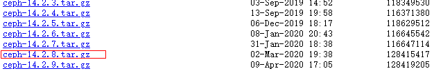
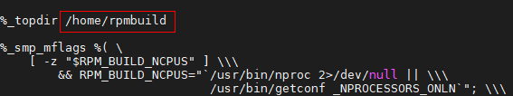
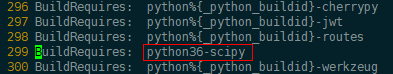
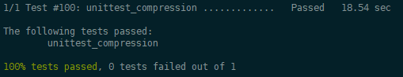
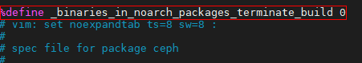
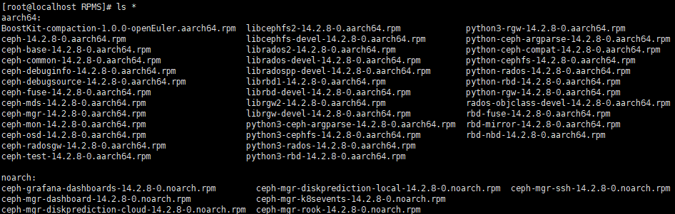

# Data Compaction Feature Guide<a name="EN-US_TOPIC_0000002521549334"></a>

## Introduction<a name="EN-US_TOPIC_0000002521000682"></a>

The data compaction algorithm is deployed on an open-source Ceph cluster to eliminate data waste caused by zero padding. In addition, combined with functions including data encapsulation, space allocation based on block counting, granularity-based traffic division, batch submission, and batch callback, the data compaction algorithm improves the data reduction ratio and overall system IOPS, which reduces costs and improves performance.

This document describes how to enable the data compaction algorithm on Ceph. The data compaction algorithm consists of an open-source patch and a closed-source RPM package. After integrating the data compaction software into Ceph source code, compile and deploy Ceph. The data compaction function takes effect in the Ceph cluster.

**Release Description<a name="section1493132715294"></a>**

This feature is released with Kunpeng BoostKit 21.0.0.

**Security Hardening Statement<a name="section1867017506565"></a>**

Pay attention to the vulnerabilities reported on the Ceph official website and Ceph GitHub, and fix the vulnerabilities as required.

## Environment Requirements<a name="EN-US_TOPIC_0000002551960673"></a>

> **Note:**
>The data compaction algorithm can be used only on the Kunpeng platform.

**Hardware Requirements<a name="section175763583914"></a>**

|Item|Description|
|--|--|
|CPU model|Kunpeng 920|

**Software Requirements<a name="section11547175216395"></a>**

|Item|Description|
|--|--|
|OS|CentOS Linux release 7.6.1810|
|OS|openEuler 20.03 LTS SP1|
|GCC|GCC 7.3.0|
|Ceph|Ceph 14.2.8|

## Integrating the Data Compaction Function into Ceph<a name="EN-US_TOPIC_0000002551960671"></a>

1. Click [here](https://download.ceph.com/tarballs/) to obtain the Ceph 14.2.8 source code.

    

2. Save the source package to the `/home` directory on the server and decompress it.

    ```sh
    cd /home
    tar zxvf ceph-14.2.8.tar.gz
    ```

3. Apply the data compaction plugin.
    1. Download [ceph-14.2.8-compaction.patch](https://gitcode.com/boostkit/ceph/releases/download/datacompaction/ceph-14.2.8-compaction.patch) and save it to the `/home/ceph-14.2.8` directory.

    2. Apply the patch.

        ```sh
        cd /home/ceph-14.2.8
        patch -p2 < ceph-14.2.8-compaction.patch
        ```

4. Download the data compaction installation package to the `/home/ceph-14.2.8` directory.

    Kunpeng community: [BoostKit-compaction\_1.0.0.zip](https://kunpeng-repo.obs.cn-north-4.myhuaweicloud.com/Kunpeng%20BoostKit/Kunpeng%20BoostKit%2021.0.0/BoostKit-compaction_1.0.0.zip)

5. Decompress the installation package.

    ```sh
    cd /home/ceph-14.2.8/
    unzip BoostKit-compaction_1.0.0.zip
    ```

    The `boostkit-compaction-1.0.0-1.aarch64.rpm` package is extracted.

6. Install the RPM package.

    ```sh
    rpm -ivh boostkit-compaction-1.0.0-1.aarch64.rpm 
    ```

## Compiling and Deploying Ceph<a name="EN-US_TOPIC_0000002520840702"></a>

### Environment Preparation<a name="EN-US_TOPIC_0000002552040685"></a>

> **Note:**
>
>The operations vary according to the OS. Unless otherwise specified, the operations are the same on the two OSs.

**CentOS 7.6<a name="section4224553104811"></a>**

1. Install the EPEL repository.

    ```sh
    yum install epel-release -y
    ```

2. Install the software collection (SCL).

    ```sh
    yum -y install centos-release-scl
    ```

3. Modify the SCL repository.

    ```sh
    vi /etc/yum.repos.d/CentOS-SCLo-scl.repo
    ```

    Add the following content:

    ```sh
    baseurl=http://mirror.centos.org/altarch/7/sclo/$basearch/rh/
    ```

    Change `http` in the scl-rh repository file to `https`.

    ```sh
    vi /etc/yum.repos.d/CentOS-SCLo-scl-rh.repo
    ```

    

4. Configure the Yum certificate verification.

    ```sh
    vi /etc/yum.conf
    ```

    ```ini
    sslverify=false
    deltarpm=0
    ```

5. Update Yum.

    ```sh
    yum clean all && yum makecache
    ```

6. (Optional) Simulate and verify the GCC 7 compilation environment.

    The compilation requires GCC 7 or later. If the GCC version meets the requirement, skip this step. If not, run the following commands to simulate the GCC 7 environment.

    ```sh
    yum -y install devtoolset-7
    scl enable devtoolset-7 bash
    gcc --version
    ```

    If the GCC version is 7.0 in the command output, the environment is successfully simulated.

**openEuler 20.03<a name="section12464454497"></a>**

1. Configure the local liboath repository.
    1. Download the liboath source code and patch.

        ```sh
        yum install git -y
        git config --global http.sslVerify false
        git clone https://gitee.com/src-openeuler/oath-toolkit.git
        ```

    2. Use Yum to install the dependencies required for the RPM package.

        ```sh
        yum install wget rpmdevtools gtk-doc pam-devel xmlsec1-devel libtool libtool-ltdl-devel createrepo cmake -y
        ```

    3. Create an `rpmbuild` directory. Move the patch file and source package to the `/root/rpmbuild/SOURCES` directory.

        ```sh
        rpmdev-setuptree
        cd oath-toolkit
        mv 0001-oath-toolkit-2.6.5-lockfile.patch /root/rpmbuild/SOURCES
        mv oath-toolkit-2.6.5.tar.gz /root/rpmbuild/SOURCES
        cp oath-toolkit.spec /root/rpmbuild/SPECS/
        ```

    4. Compile the RPM package.

        ```sh
        rpmbuild -bb /root/rpmbuild/SPECS/oath-toolkit.spec
        ```

    5. Use the compiled RPM package as the local Yum repository.

        ```sh
        mkdir -p /home/oath
        cp -r /root/rpmbuild/RPMS/*  /home/oath/
        cd  /home/oath && createrepo .
        ```

    6. Configure the repository file.

        ```sh
        vi /etc/yum.repos.d/local.repo
        ```

        Add the following content to the file:

        ```ini
        [local-oath]
        name=local-oath
        baseurl=file:///home/oath
        enabled=1
        gpgcheck=0
        priority=1
        ```

2. Edit the `yum.conf` file and set the Yum certificate verification status to `false` (no verification).

    ```sh
    vi /etc/yum.conf
    ```

    Add the following content to the end of the file:

    ```ini
    sslverify=false
    deltarpm=0
    ```

3. Configure the Huawei proxy to accelerate the download.

    ```sh
    mkdir -p ~/.pip
    vi ~/.pip/pip.conf
    ```

    Add the following content:

    ```ini
    [global]
    timeout = 120
    index-url =https://repo.huaweicloud.com/repository/pypi/simple
    trusted-host = repo.huaweicloud.com
    ```

4. Download the openEuler repository.

    ```sh
    wget -O /etc/yum.repos.d/openEulerOS.repo https://repo.huaweicloud.com/repository/conf/openeuler_aarch64.repo
    ```

5. Install the dependencies required for compiling Ceph source code on the server.

    ```sh
    yum install java-devel sharutils checkpolicy selinux-policy-devel gperf cryptsetup fuse-devel gperftools-devel libaio-devel libblkid-devel libcurl-devel libudev-devel libxml2-devel libuuid-devel ncurses-devel python-devel valgrind-devel xfsprogs-devel xmlstarlet yasm nss-devel libibverbs-devel openldap-devel CUnit-devel python2-Cython python3-setuptools python-prettytable lttng-ust-devel expat-devel junit boost-random keyutils-libs-devel openssl-devel libcap-ng-devel python-sphinx python2-sphinx python3-sphinx leveldb leveldb-devel snappy snappy-devel lz4 lz4-devel liboath liboath-devel libbabeltrace-devel librabbitmq librabbitmq-devel librdkafka librdkafka-devel libnl3 libnl3-devel rdma-core-devel numactl numactl-devel numactl-libs createrepo openldap-devel rdma-core-devel lz4-devel expat-devel lttng-ust-devel libbabeltrace-devel python3-Cython python2-Cython gperftools-devel bc dnf-plugins-core librabbitmq-devel rpm-build java-1.8.0-openjdk-devel -y
    ```

6. Regenerate an `rpmbuild` directory in `/home`.
    1. Run the `rpmbuild` installation command.

        ```sh
        rpmdev-setuptree
        ```

    2. Modify the `.rpmmacros` file.

        ```sh
        vi /root/.rpmmacros
        ```

        Change `%_topdir` to `/home/rpmbuild`.

        

    3. Run the `rpmbuild` installation command again.

        ```sh
        rpmdev-setuptree
        ```

### Compiling and Verifying Ceph<a name="EN-US_TOPIC_0000002521000684"></a>

**CentOS 7.6<a name="section116341113564"></a>**

1. Modify the `ceph.spec` file.

    ```sh
    cd /home/ceph-14.2.8/
    vi ceph.spec.in
    ```

    Change the SciPy version to `python36-scipy`.

    

2. Modify `dashboard/requirements.txt`.

    ```sh
    vi /home/ceph-14.2.8/src/pybind/mgr/dashboard/requirements.txt
    ```

    Comment out `pyopenssl`.

    .png)

3. Install the dependencies.

    ```sh
    yum -y install epel-release
    yum -y install python36-scipy.aarch64
    cd /home/ceph-14.2.8/
    sh install-deps.sh
    ```

4. Start the compilation.

    ```sh
    sh do_cmake.sh
    cd build
    make -j 48
    ```

5. Perform a unit test.

    ```sh
    ctest3 -V -R unittest_compression
    ```

    

6. Delete the `build` directory.

    ```sh
    cd /home/ceph-14.2.8/
    rm -rf build
    ```

**openEuler 20.03<a name="section194721116145614"></a>**

1. Use EPEL to install the missing dependencies in openEuler.
    1. Configure the EPEL repository.

        ```sh
        vi /etc/yum.repos.d/epel.repo
        ```

        Add the following content:

        ```ini
        [epel]
        name=epel
        baseurl=https://repo.huaweicloud.com/epel/7/aarch64/
        enabled=1
        gpgcheck=0
        priority=1
        ```

    2. Use the EPEL repository to install dependencies.

        ```sh
        yum install python-routes python-tox -y
        ```

    3. Delete the EPEL repository.

        ```sh
        rm -rf /etc/yum.repos.d/epel.repo
        ```

        > **Note:**
        >
        >The EPEL repository must be deleted. Otherwise, an RPM package that conflicts with openEuler will be downloaded from the EPEL repository in subsequent steps.

2. Modify the Ceph-related code to make it compatible with openEuler.

    ```sh
    cd /home/ceph-14.2.8/
    ```

    1. Add `openEuler` to the `install-deps.sh` file.

        ```sh
        vim install-deps.sh
        ```

        

    2. Modify the `ceph.spec.in` file.

        ```sh
        sed -i 's#%if 0%{?fedora} || 0%{?rhel}#%if 0%{?fedora} || 0%{?rhel} || 0%{?openEuler}#' ceph.spec.in
        ```

    3. Modify the `ceph.spec` file.

        ```sh
        vim ceph.spec
        ```

        1. Add the following content to the beginning of the file:

            ```spec
            %define _binaries_in_noarch_packages_terminate_build 0
            ```

        2. Configure `CEPH_MFLAGS_JOBS="-j48"` to accelerate the compilation of the openEuler version.

            

3. Install and compile the dependency.
    1. Install the dependency.

        ```sh
        cd /home/ceph-14.2.8/
        sh install-deps.sh
        ```

    2. Start the compilation.

        ```sh
        sh do_cmake.sh
        cd build
        make -j 48
        ```

    3. Perform a unit test.

        ```sh
        ctest3 -V -R unittest_compression
        ```

        

### Generating the RPM Package of the Data Compaction Algorithm<a name="EN-US_TOPIC_0000002552040687"></a>

**CentOS 7.6<a name="section1791519327575"></a>**

1. Change the default build mode in `do_cmake.sh` to the high-performance mode.

    ```sh
    vi do_cmake.sh
    ```

    

2. Compress the `ceph-14.2.8` directory into a `tar.bz2` package.

    ```sh
    cd /home
    tar -cjvf ceph-14.2.8.tar.bz2 ceph-14.2.8
    ```

3. Copy the `ceph.spec` file to the `SPECS` directory.

    ```sh
    cp ceph-14.2.8/ceph.spec /home/rpmbuild/SPECS/
    ```

4. Save the package to the `SOURCES` directory.

    ```sh
    cp ceph-14.2.8.tar.bz2 /home/rpmbuild/SOURCES/
    ```

5. Add fields to the beginning of the `ceph.spec` file.

    ```sh
    vi /home/rpmbuild/SPECS/ceph.spec
    ```

    Add the following fields:

    ```txt
    %define _binaries_in_noarch_packages_terminate_build 0
    ```

    

6. Build RPM packages.

    ```sh
    rpmbuild -bb /home/rpmbuild/SPECS/ceph.spec
    ```

    

    The build task takes 20 to 30 minutes. After the build is complete, the `aarch64` and `noarch` directories are generated in the `/home/rpmbuild/RPMS` directory, which contain Ceph-related RPM packages.

    

**openEuler 20.03<a name="section966654717572"></a>**

1. Delete the `build` directory.

    ```sh
    cd /home/ceph-14.2.8/
    rm -rf build
    ```

2. Change the default build mode in `do_cmake.sh` to the high-performance mode.

    ```sh
    vi do_cmake.sh
    ```

    

3. Go back to the parent directory and compress the `ceph-14.2.8` directory into a `tar.bz2` package.

    ```sh
    cd /home
    tar -cjvf ceph-14.2.8.tar.bz2 ceph-14.2.8
    ```

4. Copy the `ceph.spec` file to the `SPECS` directory.

    ```sh
    cp ceph-14.2.8/ceph.spec /home/rpmbuild/SPECS/
    ```

5. Save the package to the `SOURCES` directory.

    ```sh
    cp ceph-14.2.8.tar.bz2 /home/rpmbuild/SOURCES/
    ```

6. Build RPM packages.
    1. Remove and back up `/etc/profile.d/performance.sh` to accelerate the compilation.

        ```sh
        mv /etc/profile.d/performance.sh /home/
        ```

    2. Start a new terminal and run the `rpmbuild` command.

        ```sh
        unset GOMP_CPU_AFFINITY
        rpmbuild -bb /home/rpmbuild/SPECS/ceph.spec
        ```

        

        The build task takes 20 to 30 minutes. After the build is complete, the `aarch64` and `noarch` directories are generated in the `/home/rpmbuild/RPMS` directory, which contain Ceph-related RPM packages.

        

### Deploying a Ceph Cluster<a name="EN-US_TOPIC_0000002520840704"></a>

1. Create a local repository.

    ```sh
    yum -y install createrepo
    mkdir /home/ceph-compaction
    cd /home/ceph-compaction
    cp /home/rpmbuild/RPMS/aarch64/*rpm ./
    createrepo ./
    cd /etc/yum.repos.d/
    vi ceph-local.repo
    ```

    ```ini
    [local]
    name=local
    baseurl=file:///home/ceph-compaction
    enable=1
    gpgcheck=0
    [Ceph-noarch]
    name = Ceph noarch packages
    baseurl = http://download.ceph.com/rpm-nautilus/el7/noarch
    enabled = 1
    gpgcheck = 1
    type = rpm-md
    gpgkey = https://download.ceph.com/keys/release.asc
    priority = 1
    ```

2. Deploy MON and MGR nodes.

    For details, see the corresponding Ceph deployment guide.

    - For block storage, see [Installing the Ceph Software](https://www.hikunpeng.com/document/detail/en/kunpengsdss/ecosystemEnable/Ceph/kunpengcephblock_04_0005.html), [Deploying MON Nodes](https://www.hikunpeng.com/document/detail/en/kunpengsdss/ecosystemEnable/Ceph/kunpengcephblock_04_0006.html), and [Deploying MGR Nodes](https://www.hikunpeng.com/document/detail/en/kunpengsdss/ecosystemEnable/Ceph/kunpengcephblock_04_0007.html) in the *Ceph Block Storage Deployment Guide*.
    - For object storage, see [Installing the Ceph Software](https://www.hikunpeng.com/document/detail/en/kunpengsdss/ecosystemEnable/Ceph/topic_0000002085746853.html), [Deploying MON Nodes](https://www.hikunpeng.com/document/detail/en/kunpengsdss/ecosystemEnable/Ceph/topic_0000002085705429.html), and [Deploying MGR Nodes](https://www.hikunpeng.com/document/detail/en/kunpengsdss/ecosystemEnable/Ceph/topic_0000002049507988.html) in the *Ceph Object Storage Deployment Guide*.
    - For file storage, see [Installing the Ceph Software](https://www.hikunpeng.com/document/detail/en/kunpengsdss/ecosystemEnable/Ceph/topic_0000002049869318.html), [Deploying MON Nodes](https://www.hikunpeng.com/document/detail/en/kunpengsdss/ecosystemEnable/Ceph/topic_0000002085868453.html), and [Deploying MGR Nodes](https://www.hikunpeng.com/document/detail/en/kunpengsdss/ecosystemEnable/Ceph/topic_0000002085789877.html) in the *Ceph File Storage Deployment Guide*.

    > **Note:**
    >In the deployment guides, the configured Ceph repository is an official Ceph repository, which is an RPM package that does not contain the data compaction algorithm plugin. Therefore, you need to configure Ceph using the local repository. The data compaction algorithm supports only Ceph 14.2.8 and needs to be dynamically adjusted during deployment.

3. Modify the Ceph configuration file `ceph.conf`.

    The product of `osd_op_num_shards_hdd` and `osd_op_num_threads_per_shard_hdd` is the number of threads for the OSD process to process I/O requests. The default value is **5\*1**. You can change the value to **12\*2** to deliver the maximum performance of the data compaction algorithm.

    > **Note:**
    >- The configuration items provided in this step are applicable only to HDD scenarios.
    >- The modification can be dynamically adjusted after OSD nodes are deployed.

    ```sh
    vi /etc/ceph/ceph.conf
    ```

    Change the default number of OSD threads.

    ```ini
    osd_op_num_shards_hdd = 12
    osd_op_num_threads_per_shard_hdd = 2
    ```

    

4. Deploy OSD nodes.

    For details, see [Deploying OSD Nodes](https://www.hikunpeng.com/document/detail/en/kunpengsdss/ecosystemEnable/Ceph/kunpengcephblock_04_0008.html) in the *Ceph Block Storage Deployment Guide (CentOS 7.6 & openEuler 20.03)*.
