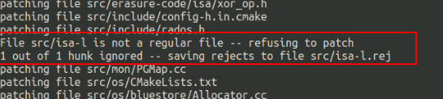
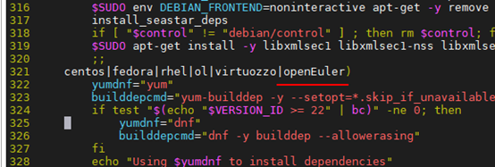
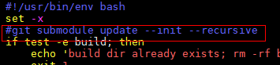
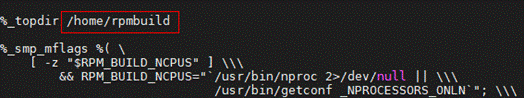
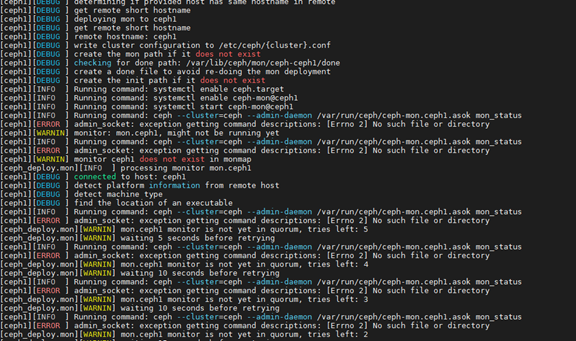
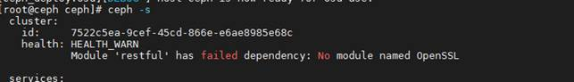
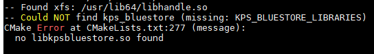

# EC Turbo Feature Guide<a name="EN-US_TOPIC_0000002521372544"></a>

## Introduction<a name="EN-US_TOPIC_0000002520752324"></a>

EC Turbo is a Huawei-developed feature library for optimizing the performance of Ceph erasure-coded storage pools. EC Turbo improves the I/O read and write performance for data whose length is within a stripe. This document describes how to enable EC Turbo on Ceph.

**Release Description<a name="section1493132715294"></a>**

This feature is released with Kunpeng BoostKit 21.0.0.

**Security Hardening Statement<a name="section1867017506565"></a>**

Pay attention to the vulnerabilities reported on the Ceph official website and Ceph GitHub, and fix the vulnerabilities as required.

## Environment Requirements<a name="EN-US_TOPIC_0000002551792313"></a>

**Hardware Compatibility<a name="section195mcpsimp"></a>**

|Item|Specifications|
|--|--|
|CPU model|Kunpeng 916|
|CPU model|Kunpeng 920|

> **Note:**
>EC Turbo is available only for Kunpeng processors.

**Software Compatibility<a name="section224mcpsimp"></a>**

|Software|Version|
|--|--|
|OS|openEuler 20.03 LTS SP1|
|Ceph|Ceph 14.2.8|

> **Note:**
>Currently, EC Turbo adapts only to Ceph 14.2.8. If this feature needs to be used in other versions, you can modify the corresponding version based on open-source patches and APIs of this feature.

## Application Scenarios<a name="EN-US_TOPIC_0000002551872301"></a>

EC Turbo can be used to optimize the performance of erasure-coded data storage pools.

Ceph data storage pools are classified into two types: replicated and erasure-coded. EC is a data protection method. The original data is divided into K data blocks (data chunks) that form a stripe, and M redundant blocks (coding chunks) are generated after the data chunks are encoded. You can restore the original data by using any K chunks in the K+M chunks. You can store data chunks and coding chunks in different locations.

## Environment Preparations<a name="EN-US_TOPIC_0000002520752322" id="0001"></a>

### Obtaining the EC Turbo Installation Package<a name="EN-US_TOPIC_0000002551792319"></a>

1. <a id="li19635349165712"></a>Run the `gcc --version` command to check the GCC version.

    ```sh
    gcc --version
    ```

2. <a id="li194271803560"></a>Download the software package.

    Download the software package based on the GCC version.

    - If the GCC version is earlier than 4.8.1, download [BoostKit-ec_1.2.2_abi-cxx-03.zip](https://kunpeng-repo.obs.cn-north-4.myhuaweicloud.com/Kunpeng%20BoostKit/Kunpeng%20BoostKit%2024.0.0/BoostKit-ec_1.2.2_abi-cxx-03.zip).
    - If the version is 4.8.1 or later, download [BoostKit-ec\_1.2.2\_abi-cxx-11.zip](https://kunpeng-repo.obs.cn-north-4.myhuaweicloud.com/Kunpeng%20BoostKit/Kunpeng%20BoostKit%2024.0.0/BoostKit-ec_1.2.2_abi-cxx-11.zip).

    The names of the extracted installation packages are `boostkit-ec-1.2.2-1.openeuler.aarch64.rpm` and `boostkit-sdslog-1.2.2-1.openeuler.aarch64.rpm`. The `boostkit-sdslog` installation package is a dependency of the `boostkit-ec` installation package. Save the RPM packages to the `/home/ec_turbo` directory.

3. <a id="li121781035183520"></a>Install the RPM packages downloaded in [step 2](#li194271803560).

    ```sh
    cd /home/ec_turbo   
    yum install boostkit-ec-1.2.2-1.openeuler.aarch64.rpm boostkit-sdslog-1.2.2-1.openeuler.aarch64.rpm  
    ```

    The following table lists the new files and their locations.

    |File|Directory|
    |--|--|
    |libkps_ec, libkps_bluestore, libsdslog|/usr/lib64|
    |hi_coreutil.h, kps_bluestore.h, sdslog.h, sdslog_param.h|/usr/include|
    |logrotate_sdslog.conf|/etc|
    |cron_sdslog|/etc/cron.d|

### Obtaining the Ceph Source Code<a name="EN-US_TOPIC_0000002520752320"></a>

1. Obtain [Ceph 14.2.8 source code](https://download.ceph.com/tarballs/).
2. Save the source package to the `/home` directory on the server and decompress the package.

    ```sh
    cd /home 
    tar -zxvf ceph-14.2.8.tar.gz
    ```

### Applying the Ceph EC Patch<a name="EN-US_TOPIC_0000002520752318"></a>

> **Note:**
>If other SDS features need to be added, install patches by referring to the feature guides.

1. <a id="p270mcpsimp"></a>Obtain [ceph-14.2.8-ec_turbo-release.patch](https://gitcode.com/boostkit/ceph/releases/download/14.2.8/ceph-14.2.8-ec_turbo-release.patch) and save it to `/home/ceph-14.2.8`.

2. Back up the original `ceph.spec` file. A new `ceph.spec` file will be generated when you apply the patch in the next step.

    ```sh
    cd /home/ceph-14.2.8 
    cp ceph.spec ceph.spec.bak
    ```

3. Apply the patch downloaded in [step 1](#p270mcpsimp).

    ```sh
    git apply --check ceph-14.2.8-ec_turbo-release.patch    
    patch -p1 < ceph-14.2.8-ec_turbo-release.patch  
    ```

    When applying the patch, src/isa-l-related information in the following figure is displayed. You can ignore the information. This problem can be solved by upgrading isa-l. For details, see the next section.

    

### Building the liboath-devel Package<a name="EN-US_TOPIC_0000002520912320"></a>

The openEuler software repository does not include the `liboath-devel` package. You need to build one.

1. Download related code and patches.

    ```sh
    cd /home/oath  
    wget --no-check-certificate https://gitee.com/src-openeuler/oath-toolkit/repository/archive/openEuler-21.03-20210330.zip  
    unzip openEuler-21.03-20210330.zip    
    cd oath-toolkit   
    ```

2. Install dependencies.

    ```sh
    yum install gtk-doc pam-devel rpmdevtools  
    rpmdev-setuptree  
    ```

3. Save related files to the `/root/rpmbuild/SOURCES` directory.

    ```sh
    mv /home/oath-toolkit/0001-oath-toolkit-2.6.5-lockfile.patch oath-toolkit-2.6.5.tar.gz /root/rpmbuild/SOURCES/
    ```

4. Build an RPM package.

    ```sh
    cd /root/oath-toolkit
    rpmbuild -bb oath-toolkit.spec
    ```

5. Use the RPM package as the local Yum repository.

    ```sh
    mkdir -p /home/rpm/oath
    cp -r /root/rpmbuild/RPMS/*  /home/rpm/oath/
    yum install -y createrepo
    cd  /home/rpm/oath
    createrepo ./
    ```

6. Configure the repository file.
    1. Open the `local.repo` file.

        ```sh
        vi /etc/yum.repos.d/local.repo
        ```

    2. Press **i** to enter the insert mode and add the following content to the file:

        ```sh
        [local-oath]
        name=local-oath
        baseurl=file:///home/rpm/oath
        enabled=1
        gpgcheck=0
        priority=1
        ```

    3. Press **Esc** to exit the insert mode. Type **:wq!** and press **Enter** to save the file and exit.

7. Install liboath dependencies.

    ```sh
    yum install liboath liboath-devel -y
    ```

## Compiling and Deploying Ceph<a name="EN-US_TOPIC_0000002551872299"></a>

### Preparing the Compilation Environment<a name="EN-US_TOPIC_0000002551872305"></a>

Currently, Ceph cannot be directly compiled on openEuler. You need to perform the following steps for adaptation.

1. Return to the `ceph-14.2.8` directory.

    ```sh
    cd /home/ceph-14.2.8  
    ```

2. Open the `install-deps.sh` file.

    ```sh
    vim install-deps.sh
    ```

3. Add `openEuler` to the file.

    

4. Create `libkps_bluestore.so` and `libkps_ec.so`.

    ```sh
    cd /usr/lib64/ 
    ln -snf libkps_bluestore.so.1.0.0 libkps_bluestore.so 
    ```

### Compiling and Verifying Ceph<a name="EN-US_TOPIC_0000002520912308"></a>

**Preparing the Compilation Environment<a id="section27715311341"></a>**

1. Open the `yum.conf` file.

    ```sh
    vim /etc/yum.conf
    ```

2. Press **i** to enter the insert mode and add `sslverify=false` and `deltarpm=0`.

    

3. Press **Esc** to exit the insert mode. Type **:wq!** and press **Enter** to save the file and exit.

**Compiling Software<a name="section577773120346"></a>**

1. Upgrade isa-l.

    The version of isa-l contained in the Ceph 14.2.8 source code is early. Upgrade isa-l.

    1. Go to the `src` directory.

        ```sh
        cd /home/ceph-14.2.8/src
        ```

    2. Back up the original isa-l and obtain the latest isa-l 2.29 source code.

        ```sh
        mv isa-l isa-l.bak
        wget https://github.com/intel/isa-l/archive/refs/tags/v2.29.0.tar.gz --no-check-certificate
        tar -xzvf v2.29.0.tar.gz
        mv isa-l-2.29.0 isa-l
        ```

    3. Modify some isa-l source code to adapt to AArch64.

        For details about the modification, visit [GitHub](https://github.com/intel/isa-l/pull/172/files#diff-bc8cf88ff358e79a71c59968b5909fab53becf65dc8d644d02ee672907deabfd).

        > **Note:**
        >In the file, the red lines are to be deleted, and the green lines are to be added and modified.

        After the upgrade is complete, the `aarch64` directory exists in `isa-l/erasure_code/`.

        

2. Install dependencies.

    ```sh
    cd /home/ceph-14.2.8/ 
    sh install-deps.sh
    ```

3. Modify the `do_cmake.sh` file.
    1. Open the file.

        ```sh
        vim do_cmake.sh
        ```

    2. Press **i** to enter the insert mode and modify the file as follows:

        ```sh
        ${CMAKE} -DCMAKE_BUILD_TYPE=RelWithDebInfo $ARGS "$@" .. || exit 1
        ```

        

        Comment out `git submodule update --init --recursive` to prevent isa-l from being rolled back to the old version when building an RPM package.

        

    3. Press **Esc** to exit the insert mode. Type **:wq!** and press **Enter** to save the file and exit.

4. Execute `do_cmake.sh`.

    ```sh
    sh do_cmake.sh    
    ```

5. Start the compilation.

    The compilation requires GCC 7 or later. Make the compilation environment ready. `{number}` in the following commands indicates the number of jobs during compilation. Generally, a larger value indicates a faster compilation speed. However, the value cannot exceed the number of CPU cores.

    ```sh
    cd /home/ceph-14.2.8/build 
    make -j{number}
    ```

6. Perform a unit test.

    ```sh
    ctest3 -V -R unittest_erasure_code
    ```

    

7. Delete the `build` directory.

    ```sh
    cd /home/ceph-14.2.8/ 
    rm -rf build
    ```

### Creating a Ceph RPM Package<a name="EN-US_TOPIC_0000002551792315"></a>

1. Install rpmbuild.

    ```sh
    yum install rpmdevtools -y  
    rpmdev-setuptree   
    ```

    If you perform the compilation as the `root` user, an `rpmbuild` directory is generated in the `/root` directory. The compilation occupies 20 GB to 30 GB of space. If the `/root` directory has a smaller space, relocate `rpmbuild` to another directory, for example, `/home`.

2. Modify the `.rpmmacros` file.
    1. Open the file.

        ```sh
        vim /root/.rpmmacros   
        ```

    2. Press **i** to enter the insert mode and set `%_topdir` to `/home/rpmbuild`.

        

    3. Press **Esc** to exit the insert mode. Type **:wq!** and press **Enter** to save the file and exit.

3. Run the `rpmbuild` installation command again.

    ```sh
    rpmdev-setuptree
    ```

4. Copy the `ceph.spec` file.

    ```sh
    cp ceph.spec /home/rpmbuild/SPECS/
    ```

5. Copy the source package.

    ```sh
    cd /home/
    tar -cjvf ceph-14.2.8.tar.bz2 ceph-14.2.8
    cp ceph-14.2.8.tar.bz2 /home/rpmbuild/SOURCES/
    ```

6. Build RPM packages.

    1. Move `performance.sh` to the `/home` directory.

        ```sh
        mv /etc/profile.d/performance.sh /home/
        source /etc/profile
        ```

    2. Build RPM packages.

        ```sh
        rpmbuild -bb /home/rpmbuild/SPECS/ceph.spec   
        ```

    3. Restore `performance.sh`.

        ```sh
        mv /home/performance.sh /etc/profile.d/   
        source /etc/profile
        ```

### Deploying a Ceph Cluster<a name="EN-US_TOPIC_0000002520912318"></a>

1. Create a local repository.
    1. Create a `/home/ecturbo_rpm` directory and copy the created RPM packages to the directory.

        ```sh
        mkdir /home/ecturbo_rpm 
        cp /home/rpmbuild/RPMS/aarch64/* /home/ecturbo_rpm   
        cp /home/rpmbuild/RPMS/noarch/* /home/ecturbo_rpm
        ```

    2. Go to `/home/ecturbo_rpm` and generate `repodata`.

        ```sh
        cd /home/ecturbo_rpm
        createrepo ./
        ```

    3. Go to `/etc/yum.repos.d` and create a `my_ceph_local.repo` file.

        ```sh
        cd /etc/yum.repos.d
        vim my_ceph_local.repo
        ```

    4. Press **i** to enter the insert mode and edit the `my_ceph_local.repo` file. Add the information of Ceph and oath.

        ```ini
        [myceph]
        name=myceph
        baseurl=file:///home/ecturbo_rpm
        enabled=1
        gpgcheck=0
            
        [local-oath]
        name=local-oath
        baseurl=file:///home/rpm/oath
        enabled=1
        gpgcheck=0
        ```

    5. Press **Esc** to exit the insert mode. Type **:wq!** and press **Enter** to save the file and exit.

    6. Update the Yum cache.

        ```sh
        yum clean all
        yum makecache
        ```

2. Install Ceph.

    For details, see [Installing the Ceph Software](https://www.hikunpeng.com/document/detail/en/kunpengsdss/ecosystemEnable/Ceph/kunpengcephblock_04_0004.html) in the *Ceph Block Storage Deployment Guide* (CentOS 7.6 & openEuler 20.03).

    > **Note:**
    >- In the deployment guide, the configured Ceph repository is an official Ceph repository, which is an RPM package that does not contain the EC Turbo feature. Therefore, you need to configure Ceph using the local repository.
    >- Before installing Ceph, run the `yum list | grep ceph` command to ensure that Ceph is installed from the local repository. In the command, `myceph` is the name of the repository from which Ceph components are installed.
    >- When installing Ceph, you may need to install other third-party software. Ensure that the network connection is normal.

## Usage Guide<a name="EN-US_TOPIC_0000002551872295"></a>

### Enabling the EC Turbo Feature<a name="EN-US_TOPIC_0000002520912314"></a>

1. Enable the EC Turbo feature.

    For details about how to create an EC storage pool, see [Creating a Storage Pool](https://www.hikunpeng.com/document/detail/en/kunpengsdss/ecosystemEnable/Ceph/kunpengcephobject_04_0011.html) in the *Ceph Object Storage Deployment Guide (CentOS 7.6 & openEuler 20.03)*.

    > **Note:**
    >- The `stripe_unit` value of the EC data pool is 256 KB. When `k=4` and `m=2`, the stripe size (`stripe_width`) is 1 MB. EC Turbo optimizes I/Os smaller than 1 MB.
    >- EC Turbo uses the isa-l erasure code library. When creating an EC profile, enable the isa-l plugin, that is, add the `plugin=isa` parameter. In addition, specify `stripe_unit=256KB`. The command for creating an EC profile cannot be the command in the reference document. The correct command for creating an EC profile is:
    >
    >    ```sh
    >    ceph osd erasure-code-profile set myprofile k=4 m=2 crush-failure-domain=osd crush-device-class=hdd plugin=isa stripe_unit=256K  
    >    ```
    >
    >    If the number of nodes in the cluster is greater than or equal to 6 (`k` + `m`), you can set `crush-failure-domain` to `host`.

    Add the following items to `[global]` in the `ceph.conf` file. These parameters can be modified before or after the pool is created.

    ```ini
    osd_ec_partial_read = true
    osd_ec_partial_write = true
    osd_ec_partial_update = true
    osd_ec_zero_opt = true
    bluestore_kpsallocator_enable = true
    ```

    > **Note:**
    >- The partial read option conflicts with the fast read option. To enable `osd_ec_partial_read`, check that `osd_pool_default_ec_fast_read` is disabled (disabled by default). Otherwise, partial read does not take effect.
    >- The default values of the preceding five parameters are `true`. If you do not add these parameters to `ceph.conf`, the system uses the default values. To disable the EC Turbo feature, change the values of these parameters in `ceph.conf` to `false`.
    >- Run the `ceph daemon osd.<OSD_number> config show | grep -E 'osd_ec_partial_read|osd_ec_partial_write|osd_ec_partial_update|osd_ec_zero_opt|bluestore_kpsallocator_enable'` command to check whether the parameters take effect.

2. Configure EC Turbo log parameters `kpsec_log_fullpath`, `kpsec_log_level`, and `kpsec_log_memlogsize`.

    These parameters can be defined in the `[global]` section of `ceph.conf`. If you do not define these parameters, the system uses the default values.

    The following lists the default values of these parameters.

    ```ini
    [global]
    ......
    kpsec_log_fullpath = /var/log/ceph/
    kpsec_log_level = CRITICAL/DEBUG
    kpsec_log_memlogsize = 100
    ......
    ```

    > **Note:**
    >- The main services of EC Turbo are encapsulated in the `libkps_ec` dynamic library. This dynamic library does not use the Ceph log system. Therefore, configure logging for it.
    >- Generally, Ceph logs are stored in `/var/log/ceph`. If another directory is specified, ensure that the Ceph user can read and write the directory.
    >- Log levels are classified into the file log level and memory log level, which must be defined separately. Generally, the content recorded in memory logs is more detailed than that recorded in file logs. The log level must be selected from \[`CRITICAL=0`, `ERROR=1`, `WARNING=2`, `INFORMATION=3`, `DEBUG=4`\]. The value of `mem_log_size` ranges from 100 to 1000.
    >- If you modify kpsec log parameters when the OSD process is running, restart the OSD process for the modification to take effect.
    >- If it is inconvenient to restart the OSD process, run the `ceph tell osd.<OSD_number> injectargs --<parameter_name>=<parameter_value>` command to modify the parameter online, and then run the `ceph tell osd.<OSD_number> reload_kps_conf` command to reload kpsec log parameters.

3. Push `ceph.conf` to each node.

    ```sh
    ceph-deploy --overwrite-conf admin {node1} {node2}
    ```

    > **Note:**
    >`{nodeX}` is the name of a Ceph node. You can run the command to push `ceph.conf` to multiple nodes in the cluster at the same time. After the push is complete, restart the cluster.

4. Verify that EC Turbo takes effect.
    1. Change the log level of ceph-osd to `20/20`. For example, change the log level of OSD 3:

        ```sh
        ceph daemon osd.3 config set debug_osd 20/20
        ```

    2. Perform data read and write in the EC pool. Then view the ceph-osd log numbered 3. If the log contains `partial_write=1 partial_update=1`, EC Turbo has taken effect.

        

    3. Change the log level of ceph-osd to the default value.

        ```sh
        ceph daemon osd.3 config set debug_osd 0/1
        ```

### Managing Logs<a name="EN-US_TOPIC_0000002520912316"></a>

Use logrotate and crontab to manage logs.

logrotate is a common log management program on Linux, and crontab is a time-based task management system.

`/etc/logrotate_sdslog.conf` consists log file management parameters of EC Turbo. This file is installed in a specified directory when EC Turbo is installed. The file content is as follows:

```txt
/var/log/ceph/kpsec*.log {
    rotate 30
    daily
    compress
    dateext
    dateformat.%Y%m%d.%s
    size=100M
    missingok
    su ceph ceph
    lastaction
        /usr/bin/chmod 440 /var/log/ceph/kpsec*.gz
        /usr/bin/chmod 440 /var/log/ceph/kpsec*.log-*
        /usr/bin/chmod 440 /var/log/ceph/kpsec*.log.*
    endscript
}

/var/log/sdslog*.log {
    rotate 30
    daily
    compress 
    dateext
    dateformat.%Y%m%d.%s
    size=100M
    missingok
    su ceph ceph
    lastaction
        /usr/bin/chmod 440 /var/log/sdslog*.gz
        /usr/bin/chmod 440 /var/log/sdslog*.log-*
        /usr/bin/chmod 440 /var/log/sdslog*.log.*
    endscript
}

```

crontab can run a specified task at a fixed time, on a fixed date, or at a fixed interval. Add a task to crontab for logrotate to be executed every minute.

1. Add the `cron_sdslog` file to the `/etc/cron.d/` directory. The file content is as follows:

    ```txt
    */1 * * * * root /usr/sbin/logrotate /etc/logrotate_sdslog.conf
    ```

2. Change the permission on `cron_sdslog` to `600`.

## Troubleshooting<a name="EN-US_TOPIC_0000002551872303"></a>

### Dependencies Missing During Ceph Compilation<a name="EN-US_TOPIC_0000002551792311"></a>

**Symptom<a name="en-us_topic_0000001640989793_section3941254"></a>**

During Ceph compilation for enabling the EC Turbo feature, the message `Could NOT find LTTngUST (missing: LTTNGUST_LIBRARIES LTTNGUST_INCLUDE_DIRS)` is displayed.

**Key Process and Cause Analysis<a name="en-us_topic_0000001640989793_section35471290"></a>**

The open-source third-party dependency packages are missing in the environment.

**Conclusion and Solution<a name="en-us_topic_0000001640989793_section50806158"></a>**

Install the required dependencies based on the error message.

```sh
yum install -y lttng-ust-devel keyutils-libs-devel openldap-devel leveldb-devel snappy-devel lz4-devel curl-devel expat-devel openssl-devel libbabeltrace-devel librabbitmq-devel rdma-core-devel python2-Cython python3-Cython
```

### ceph-deploy mon create-initial Initialization Failure<a name="EN-US_TOPIC_0000002551792317"></a>

**Symptom<a name="en-us_topic_0000001590949856_section3941254"></a>**

`ceph-deploy mon create-initial` initialization fails.



**Key Process and Cause Analysis<a name="en-us_topic_0000001590949856_section35471290"></a>**

None

**Conclusion and Solution<a name="en-us_topic_0000001590949856_section50806158"></a>**

1. Add a Ceph user group.

    ```sh
    groupadd ceph
    ```

2. Add a user.

    ```sh
    useradd ceph -g ceph
    ```

3. Reinstall Ceph.

### `no module named werkzeug.serving` Reported After Ceph Status Is Queried<a name="EN-US_TOPIC_0000002551872297"></a>

**Symptom<a name="en-us_topic_0000001640870397_section3941254"></a>**

`no module named werkzeug.serving` is reported after the Ceph status is queried.


**Key Process and Cause Analysis<a name="en-us_topic_0000001640870397_section35471290"></a>**

None

**Conclusion and Solution<a name="en-us_topic_0000001640870397_section50806158"></a>**

Install werkzeug.

```sh
pip install werkzeug
```

### `No module named OpenSSL` Reported When Ceph Status Is Queried<a name="EN-US_TOPIC_0000002520912310"></a>

**Symptom<a name="en-us_topic_0000001640750997_section3941254"></a>**

`No module named OpenSSL` is reported when the Ceph status is queried.



**Key Process and Cause Analysis<a name="en-us_topic_0000001640750997_section35471290"></a>**

None

**Conclusion and Solution<a name="en-us_topic_0000001640750997_section50806158"></a>**

Install OpenSSL.

```sh
yum install python2-pyOpenSSL.noarch  
yum install python3-pyOpenSSL.noarch  
```

### Failed to Find Dynamic Libraries During do_cmake.sh Execution and Compilation<a name="EN-US_TOPIC_0000002520752326"></a>

**Symptom<a name="en-us_topic_0000001640750989_section3941254"></a>**

The symptom is similar to the following:

- `kps_bluestore` cannot be found.

    ```txt
    Could Not find kps_bluestore (missing: KPS_BLUESTORE_LIBRARIES)
    CMake Error at CMakeLists.txt:277 (message):
    no libkpsbluestore.so found
    ```

    

- `lkps_ec` cannot be found.

    ```txt
    cannot find -lkps_ec
    collect2: error: ld returned 1 exit status
    ```

    

**Key Process and Cause Analysis<a name="en-us_topic_0000001640750989_section35471290"></a>**

None

**Conclusion and Solution<a name="en-us_topic_0000001640750989_section50806158"></a>**

1. Create soft links.

    ```sh
    ln -snf /usr/lib64/libkps_bluestore.so.1.0.0 /usr/lib64/libkps_bluestore.so
    ln -snf /usr/lib64/libkps_ec.so.1.2.1 /usr/lib64/libkps_ec.so  
    ```

2. Run the compile command again.

    ```sh
    rm -rf build/ && sh do_cmake.sh
    ```
