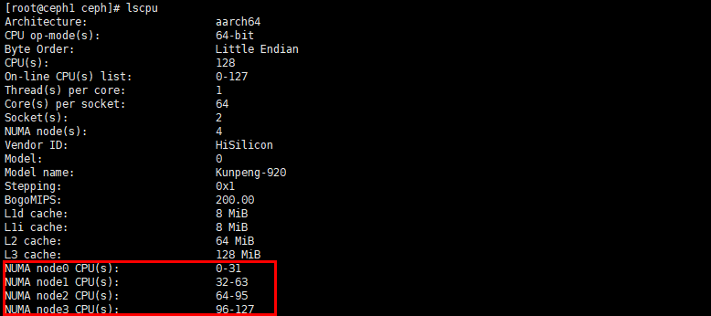
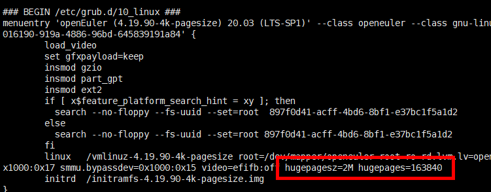
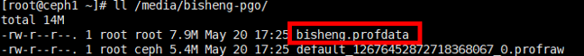
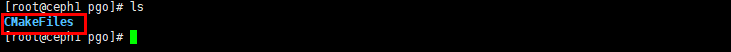
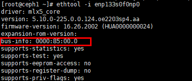

# EC Turbo Tuning Guide

## Tuning Overview<a name="EN-US_TOPIC_0000002551873135"></a>

### Introduction to EC<a name="EN-US_TOPIC_0000002520913146"></a>

Ceph storage pools are classified into replicated pools and erasure-coded pools. This document describes how to optimize the read/write performance of a 4 KB block cluster in EC mode with the EC Turbo feature.

Erasure coding (EC) adopts parity code to correct data loss. For example, in EC 4+2 mode, two pieces of parity data **x** and **y** are calculated based on four pieces of data **a**, **b**, **c**, and **d** according to a formula, and the six pieces of data are stored together. If one or two pieces of data among **a**, **b**, **c**, and **d** are lost, parity data **x** and **y** can be used to calculate the lost data through the formula. The EC mode involves data block encoding and decoding. Therefore, the read/write performance of this mode is inferior to that of the replication mode, especially in small-block write scenarios.

### Environment Requirements<a name="EN-US_TOPIC_0000002551873133"></a>

**Hardware Requirements<a name="en-us_topic_0000001217080138_section10273165810425"></a>**

**Table 1** Hardware requirements<a id="hardware-requirements"></a>

| Item    | Specifications                                     |
|-------|------------------------------------------------------|
| CPU  | Kunpeng 920                                           |
| Memory | 12 x 32 GB                                          |
| NIC | IN200 NIC (4 x 25GE)                                   |
| Drive | System drive: 960 GB SATA HDD<br>Data drive: 8 x ES3000 V5 3.2 TB NVMe SSD |

**Software Requirements<a name="section1240364411598"></a>**

**Table 2** Software requirements<a id="software-requirements"></a>

|Item|Version|
|--|--|
|OS|openEuler 20.03|
|Ceph|14.2.10|

**Cluster Environment Planning<a name="section7471129153117"></a>**

The cluster consists of Ceph clients and Ceph servers. The following figure shows the networking.


The following table lists the server IP addresses in the Ceph cluster.

**Table 3** Server networking example

|Node Name|Public Network|Cluster Network|
|--|--|--|
|ceph1|192.168.3.166|192.168.4.166|
|ceph2|192.168.3.167|192.168.4.167|
|ceph3|192.168.3.168|192.168.4.168|

The following table lists the client IP addresses in the Ceph cluster.

**Table 4** Client deployment example

|Node Name|Public Network|
|--|--|
|client1|192.168.3.160|
|client2|192.168.3.161|
|client3|192.168.3.162|

> **NOTE**
>
>- Cluster network IP address: IP address used for data synchronization between server nodes in the cluster. Select any 25GE network port.
>- Public network IP address: IP address of a server node for client nodes to access. Select any 25GE network port.
>- When clients are used as presses, ensure that the service port IP addresses of clients and the public network IP addresses of the cluster are in the same network segment. The 25GE network port is recommended.

### Tuning Principles<a name="EN-US_TOPIC_0000002551793149"></a>

Comply with the following principles when tuning performance:

- During performance analysis, analyze the system resource bottlenecks from multiple aspects to identify the root causes. For example, high CPU usage may be caused by insufficient memory capacity. The CPU resources are exhausted by memory scheduling.
- Adjust only one performance metric at a time, and ensure that the adjustment does not affect the performance of other modules.
- The analysis tool may consume system resources and aggravate certain system resource bottlenecks. Therefore, avoid or minimize the impact on applications.
- After tuning configurations or code, ensure that the program runs properly and its original functions are not affected.

## System Tuning<a name="EN-US_TOPIC_0000002520913148"></a>

This document describes six tuning methods. You are advised to perform tuning in sequence. System tuning involves BIOS tuning and OS tuning. BIOS tuning aims to maximize CPU performance, and OS tuning aims to best utilize other hardware features.

- For details about BIOS tuning, see [BIOS Tuning](https://www.hikunpeng.com/document/detail/en/kunpengsdss/ecosystemEnable/Ceph/kunpengcephblock_05_0015.html) in the *Ceph Block Storage Tuning Guide*.
- For details about OS tuning, see [System Tuning](https://www.hikunpeng.com/document/detail/en/kunpengsdss/ecosystemEnable/Ceph/kunpengcephblock_05_0007.html) in the *Ceph Block Storage Tuning Guide*.

This document describes six tuning methods. You are advised to perform tuning in sequence. System tuning involves BIOS tuning and OS tuning. BIOS tuning aims to maximize CPU performance, and OS tuning aims to best utilize other hardware features.

## Ceph Code Optimization<a name="EN-US_TOPIC_0000002551793147"></a>

Code optimizations include EC Turbo and some common basic optimizations in Ceph, such as Crush algorithm acceleration and RocksDB CRC algorithm optimization.

After EC Turbo and the basic optimizations are used, the read/write performance is significantly improved. You can experience both EC Turbo and these optimizations by applying a single patch. The following describes the compilation and deployment procedure.

1. Obtain the installation package. For details, see "Obtaining the EC Turbo Installation Package" in [EC Turbo Feature Guide](ec_turbo_feature_guide.md).

2. Obtain Ceph source code.
    1. Download the [ceph-14.2.10.tar.gz](https://download.ceph.com/tarballs/ceph-14.2.10.tar.gz) source package.

    2. Save the source package in the `/home` directory and decompress it.

        ```sh
        cd /home
        tar -zxvf ceph-14.2.10.tar.gz
        ```

3. Apply the Ceph EC optimization patch.
    1. Download [ceph-ecturbo-optimization.patch](https://gitcode.com/boostkit/ceph_BK/releases/download/ec_turbo_optimization/ceph-ecturbo-optimization.patch) and save it to `/home/ceph-14.2.10`.

    2. Back up the original `ceph.spec` file.

        ```sh
        cd /home/ceph-14.2.10
        mv ceph.spec ceph.spec.bak
        ```

    3. Apply the patch. After the patch is applied, a new `ceph.spec` file is generated.

        ```sh
        patch -p1 < ceph-ecturbo-optimization.patch
        ```

4. Build the liboath-devel package. For details, see [Building the liboath-devel Package](https://www.hikunpeng.com/document/detail/en/kunpengsdss/appAccelFeatures/ecturbo/kunpengecturbo_20_0017.html) in the *EC Turbo Feature Guide*.

5. Prepare the Ceph compilation environment. For details, see [Preparing the Compilation Environment](https://www.hikunpeng.com/document/detail/en/kunpengsdss/appAccelFeatures/ecturbo/kunpengecturbo_20_0018.html) in the *EC Turbo Feature Guide*.

    > **NOTE**
    >
    >The optimizations require the hugepage feature. After running the `install-deps.sh` script (which does not install the hugepage dependency), you need to run the following command to install the dependency:
    >
    >```sh
    >yum install libhugetlbfs
    >```

6. Compile and verify Ceph. For details, see [Compiling and Verifying Ceph](https://www.hikunpeng.com/document/detail/en/kunpengsdss/appAccelFeatures/ecturbo/kunpengecturbo_20_0009.html).

7. Create a Ceph RPM package. For details, see [Creating a Ceph RPM Package](https://www.hikunpeng.com/document/detail/en/kunpengsdss/appAccelFeatures/ecturbo/kunpengecturbo_20_0010.html).

8. Deploy a Ceph cluster. For details, see [Deploying a Ceph Cluster](https://www.hikunpeng.com/document/detail/en/kunpengsdss/appAccelFeatures/ecturbo/kunpengecturbo_20_0011.html).

    > **NOTE**
    >
    >In this environment, all data drives are NVMe drives. Therefore, you do not need to create OSD partitions when deploying OSD nodes. You can directly use NVMe drives as OSD data drives. To maximize hardware performance, the optimal number of OSD nodes deployed on each server is 24. You are advised to divide each NVMe drive into three partitions and then deploy OSD nodes.

Code optimizations include EC Turbo and some common basic optimizations in Ceph, such as Crush algorithm acceleration and RocksDB CRC algorithm optimization.

## Ceph Configuration Tuning<a name="EN-US_TOPIC_0000002520753160"></a>

Modify the Ceph configuration to maximize system resource utilization.

You can edit the `/etc/ceph/ceph.conf` file to modify all Ceph configuration parameters. The configuration procedure is as follows:

1. Go to the `/etc/ceph/` directory on `ceph1` and edit the `ceph.conf` file.

    ```sh
    cd /etc/ceph
    vi ceph.conf 
    ```

2. Add the following configurations to the file. For details about the parameters in the configuration file, see [Hardware requirements](#hardware-requirements).

    ```ini
    [global]
    
    public_network = 192.168.3.0/24   # Adjust the address based on the actual network segment.
    cluster_network = 192.168.4.0/24  # Adjust the address based on the actual network segment.
    mon_max_pg_per_osd = 3000
    mon_max_pool_pg_num = 300000
    ms_bind_before_connect = true
    ms_dispatch_throttle_bytes = 2097152000
    osd_pool_default_min_size = 0
    osd_pool_default_pg_num = 1024
    osd_pool_default_pgp_num = 1024
    osd_pool_default_size = 3
    throttler_perf_counter = false
    bluefs_buffered_io=false
    
    osd_max_write_size = 256
    osd_enable_op_tracker = false
    
    rbd_cache = false
    
    [mon]
    mon_allow_pool_delete = true
    
    [osd]
    rocksdb_cache_index_and_filter_blocks = false
    rocksdb_cache_size = 2G
    osd_memory_cache_min = 3G
    osd_memory_base = 3G
    
    bluestore_rocksdb_options = use_direct_reads=true,use_direct_io_for_flush_and_compaction=true,compression=kNoCompression,min_write_buffer_number_to_merge=32,recycle_log_file_num=64,compaction_style=kCompactionStyleLevel,write_buffer_size=64M,target_file_size_base=64M,compaction_threads=32,max_bytes_for_level_multiplier=8,flusher_threads=8,level0_file_num_compaction_trigger=16,level0_slowdown_writes_trigger=36,level0_stop_writes_trigger=48,compaction_readahead_size=524288,max_bytes_for_level_base=536870912,enable_pipelined_write=false,max_background_jobs=16,max_background_flushes=8,max_background_compactions=16,max_write_buffer_number=8,soft_pending_compaction_bytes_limit=137438953472,hard_pending_compaction_bytes_limit=274877906944,delayed_write_rate=33554432
    osd_pg_object_context_cache_count = 256
    
    mon_osd_full_ratio = 0.97
    mon_osd_nearfull_ratio = 0.95
    osd_min_pg_log_entries = 10
    osd_max_pg_log_entries = 10
    
    bluestore_cache_meta_ratio = 0.49
    bluestore_cache_kv_ratio = 0.49
    bluestore_cache_size_ssd = 6G
    osd_memory_target = 10G
    bluestore_clone_cow = false
    
    [osd.0]
    osd_numa_node=0
    [osd.1]
    osd_numa_node=0
    [osd.2]
    osd_numa_node=0
    [osd.3]
    osd_numa_node=0
    [osd.4]
    osd_numa_node=0
    [osd.5]
    osd_numa_node=0
    [osd.6]
    osd_numa_node=1
    [osd.7]
    osd_numa_node=1
    [osd.8]
    osd_numa_node=1
    [osd.9]
    osd_numa_node=1
    [osd.10]
    osd_numa_node=1
    [osd.11]
    osd_numa_node=1
    [osd.12]
    osd_numa_node=2
    [osd.13]
    osd_numa_node=2
    [osd.14]
    osd_numa_node=2
    [osd.15]
    osd_numa_node=2
    [osd.16]
    osd_numa_node=2
    [osd.17]
    osd_numa_node=2
    [osd.18]
    osd_numa_node=3
    [osd.19]
    osd_numa_node=3
    [osd.20]
    osd_numa_node=3
    [osd.21]
    osd_numa_node=3
    [osd.22]
    osd_numa_node=3
    [osd.23]
    osd_numa_node=3
    [osd.24]
    osd_numa_node=0
    [osd.25]
    osd_numa_node=0
    [osd.26]
    osd_numa_node=0
    [osd.27]
    osd_numa_node=0
    [osd.28]
    osd_numa_node=0
    [osd.29]
    osd_numa_node=0
    [osd.30]
    osd_numa_node=1
    [osd.31]
    osd_numa_node=1
    [osd.32]
    osd_numa_node=1
    [osd.33]
    osd_numa_node=1
    [osd.34]
    osd_numa_node=1
    [osd.35]
    osd_numa_node=1
    [osd.36]
    osd_numa_node=2
    [osd.37]
    osd_numa_node=2
    [osd.38]
    osd_numa_node=2
    [osd.39]
    osd_numa_node=2
    [osd.40]
    osd_numa_node=2
    [osd.41]
    osd_numa_node=2
    [osd.42]
    osd_numa_node=3
    [osd.43]
    osd_numa_node=3
    [osd.44]
    osd_numa_node=3
    [osd.45]
    osd_numa_node=3
    [osd.46]
    osd_numa_node=3
    [osd.47]
    osd_numa_node=3
    
    [osd.48]
    osd_numa_node=0
    [osd.49]
    osd_numa_node=0
    [osd.50]
    osd_numa_node=0
    [osd.51]
    osd_numa_node=0
    [osd.52]
    osd_numa_node=0
    [osd.53]
    osd_numa_node=0
    [osd.54]
    osd_numa_node=1
    [osd.55]
    osd_numa_node=1
    [osd.56]
    osd_numa_node=1
    [osd.57]
    osd_numa_node=1
    [osd.58]
    osd_numa_node=1
    [osd.59]
    osd_numa_node=1
    [osd.60]
    osd_numa_node=2
    [osd.61]
    osd_numa_node=2
    [osd.62]
    osd_numa_node=2
    [osd.63]
    osd_numa_node=2
    [osd.64]
    osd_numa_node=2
    [osd.65]
    osd_numa_node=2
    [osd.66]
    osd_numa_node=3
    [osd.67]
    osd_numa_node=3
    [osd.68]
    osd_numa_node=3
    [osd.69]
    osd_numa_node=3
    [osd.70]
    osd_numa_node=3
    [osd.71]
    osd_numa_node=3
    ```

    > **NOTE**
    >
    >In the configuration file, `osd_numa_node=0` indicates that the `osd0` process is bound to NUMA0. This document uses the Kunpeng 920 7260 processor as an example. This model has four NUMA nodes, and 24 OSDs are deployed on each node. To better utilize hardware performance, you need to evenly bind OSD processes to CPU cores. In this case, every 6 consecutive OSDs are bound to a NUMA node. If the CPU in use has only two NUMA nodes, bind every 12 consecutive OSDs to a NUMA node. Other cases may be processed by analogy. You can run the `lscpu` command to check the number of CPU NUMA nodes.
    >
    >

3. Synchronize the configurations to other nodes.

    ```sh
    ceph-deploy --overwrite-conf admin ceph1 ceph2 ceph3
    ```

4. Restart OSD processes on all server nodes to validate the configurations.

    ```sh
    systemctl restart ceph-osd.target
    ```

**Table 1** Parameter description<a id="parameter-description"></a>

|Parameter|Description|Optimal Configuration|
|--|--|--|
|ms_bind_before_connect|Controls the timing of the binding behavior.|true|
|throttler_perf_counter|Collects statistics on the performance of the throttler used during OSD request processing.|false|
|bluefs_buffered_io|Configures buffered I/Os.|false|
|osd_max_write_size|Specifies the maximum data block size for OSD write operations.|256|
|osd_enable_op_tracker|Configures OSD monitoring and performance analysis enhancement.|false|
|rbd_cache|Configures the RBD cache.|false|
|rocksdb_cache_index_and_filter_blocks|Specifies whether to cache indexes and filters in blocks.|false|
|rocksdb_cache_size|Specifies the size of the RocksDB internal cache.|2GB|
|osd_memory_cache_min|Specifies the minimum memory capacity used for caching when TCMalloc and automatic cache tuning are enabled.|3GB|
|osd_memory_base|Specifies the estimated minimum memory required by OSDs when TCMalloc and automatic cache tuning are enabled.|3GB|
|bluestore_rocksdb_options|Configures RocksDB options.|use_direct_reads=true,<br>use_direct_io_for_flush_and_compaction=true,<br>compression=kNoCompression,<br>min_write_buffer_number_to_merge=32,<br>recycle_log_file_num=64,<br>compaction_style=kCompactionStyleLevel,<br>write_buffer_size=64M,<br>target_file_size_base=64M,<br>compaction_threads=32,<br>max_bytes_for_level_multiplier=8,<br>flusher_threads=8,<br>level0_file_num_compaction_trigger=16,<br>level0_slowdown_writes_trigger=36,<br>level0_stop_writes_trigger=48,<br>compaction_readahead_size=524288,<br>max_bytes_for_level_base=536870912,<br>enable_pipelined_write=false,<br>max_background_jobs=16,<br>max_background_flushes=8,<br>max_background_compactions=16,<br>max_write_buffer_number=8,<br>soft_pending_compaction_bytes_limit=137438953472,<br>hard_pending_compaction_bytes_limit=274877906944,<br>delayed_write_rate=33554432|
|osd_pg_object_context_cache_count|Specifies the number of cache entries of OSD object contexts.|256|
|mon_osd_full_ratio|Specifies the OSD full ratio. When the used cluster capacity reaches the specified ratio, the cluster stops data writing (but allows data reading), and enters the `HEALTH_ERR` state.|0.97|
|mon_osd_nearfull_ratio|Specifies the OSD nearfull ratio. When the used cluster capacity reaches the specified ratio, the cluster enters the `HEALTH_WARN` state.|0.95|
|osd_min_pg_log_entries|Specifies the minimum number of entries maintained in a PG log.|10|
|osd_max_pg_log_entries|Specifies the maximum number of entries maintained in a PG log.|10|
|bluestore_cache_meta_ratio|Specifies the ratio of cache allocated to metadata.|0.49|
|bluestore_cache_kv_ratio|Specifies the ratio of cache allocated to RocksDB's key-value store.|0.49|
|bluestore_cache_size_ssd|Specifies the BlueStore cache capacity.|6GB|
|osd_memory_target|Specifies the maximum memory usage of an OSD.|10GB|
|bluestore_clone_cow|Controls the behavior of copy-on-write (CoW) cloning. In CoW mode, the write performance is poor. The redirect-on-write (RoW) mode is recommended.|false|

You can modify the Ceph configuration to maximize system resource utilization.

## Hugepage Configuration Tuning<a name="EN-US_TOPIC_0000002551873137"></a>

### Configuring Huge Pages for the Data Segment<a name="EN-US_TOPIC_0000002520753158"></a>

Configuring huge pages for the data segment can reduce the probability of translation lookaside buffer (TLB) miss and CPU scheduling caused by insufficient pages, thereby improving write performance. Perform the following steps on all server nodes.

1. Configure system huge pages.

    ```sh
    echo 163840 > /proc/sys/vm/nr_hugepages 
    ```

    > **NOTE**
    >
    > - On openEuler 20.03, the 64 KB kernel page has a bug. You need to recompile the kernel to change the memory page size to 4 KB. Run the following command to check the kernel page size:
    >
    >    ```sh
    >    getconf PAGESIZE
    >    ```
    >
    >    
    >
    >    If the command output is `4096`, the kernel page size is 4 KB. If not, perform compilation and installation by following instructions in [Compiling the Kernel](https://www.hikunpeng.com/document/detail/en/kunpengsdss/basicAccelFeatures/cacheAccel/kunpengbcache_06_0003.html) in the *Bcache User Guide*.
    > - The memory capacity occupied by system huge pages must be greater than or equal to the memory required by OSDs on the current node (`osd_memory_target` \* Number of OSDs). For example, if each node is deployed with 24 OSDs and `osd_memory_target` is set to 10 GB, the hugepage memory must be at least 240 GB. In the 4 KB kernel page environment, the size of a huge page is 2 MB. Therefore, the number of huge pages must be at least 120,000.
    > - If the system has been running for a long time, the memory may be too fragmented to allocate a certain number of huge pages. In this case, you can add the hugepage allocation options to the configurations of the corresponding kernel (run the `uname -r` command to query) and reboot the server to validate the modification.
    >   1. Open the `grub.cfg` file and add `hugepagesz=2M` and `hugepages=163840` to the file.
    >
    >        ```sh
    >        vim /boot/efi/EFI/openEuler/grub.cfg
    >        ```
    >
    >        
    >   2. Reboot the node and query hugepage usage to check whether the hugepage configuration has taken effect.
    >
    >        ```sh
    >        reboot
    >        cat /proc/meminfo | grep Huge
    >        ```
    >
    >        

2. Enable automatic mounting of the hugepage memory.
    1. Create a directory for mounting huge pages.

        ```sh
        mkdir /mnt/huge
        ```

    2. Add the hugepage configuration to the `fstab` file.

        ```sh
        vim /etc/fstab
        ```

        Add the following content to the file:

        ```txt
        nodev           /mnt/huge       hugetlbfs       defaults,pagesize=2M   0 0
        ```

        

3. Modify the Ceph service and enable the TCMalloc hugepage configuration.

    ```sh
    vim /usr/lib/systemd/system/ceph-osd@.service
    ```

    Add the following environment variable.

    ```ini
    TCMALLOC_MEMFS_MALLOC_PATH=/mnt/huge/osd%i
    ```

    

4. Reload configurations.

    ```sh
    systemctl daemon-reload
    ```

5. Restart the OSD process.

    ```sh
    systemctl restart ceph-osd.target
    ```

Configuring huge pages for the data segment can reduce the probability of translation lookaside buffer (TLB) miss and CPU scheduling caused by insufficient pages, thereby improving write performance.

### Configuring Huge Pages for the Code Segment<a name="EN-US_TOPIC_0000002520913144"></a>

Configuring huge pages for the code segment of `ceph-osd` can reduce the number of misses in the instruction translation lookaside buffer (iTLB) and further improve performance.

>  **NOTE**
>
> Perform the following steps on all server nodes.

1. Mount the `tmpfs` huge page to the `/media` directory.

    ```sh
    mount -t tmpfs -o huge=always tmpfs /media/
    ```

2. Copy the `ceph-osd` binary file to `tmpfs` and add a symbolic link to the original path.

    ```sh
    cp /usr/bin/ceph-osd /media/
    ln -sf /media/ceph-osd /usr/bin/ceph-osd
    ```

3. Escalate the privilege of `ceph-osd` to enable it to access huge pages.

    ```sh
    setcap 'CAP_DAC_OVERRIDE+eip CAP_SYS_ADMIN+eip' /media/ceph-osd
    ```

4. Enable the transparent hugepage option.

    ```sh
    echo always > /sys/kernel/mm/transparent_hugepage/enabled
    ```

5. Restart OSD processes on all server nodes.

    ```sh
    systemctl restart ceph-osd.target
    ```

Configuring huge pages for the code segment of `ceph-osd` can reduce the number of misses in the instruction translation lookaside buffer (iTLB) and further improve performance.

## Profile-guided Optimization<a name="EN-US_TOPIC_0000002520753162"></a>

The profile-guided optimization (PGO) technology collects program runtime information (profile) through instrumentation. The compiler uses the profile to guide branch prediction, inline optimization, and function reordering to make more accurate optimization decisions when generating the target program.

The BiSheng Compiler and GCC for openEuler are available. The BiSheng Compiler has been optimized for the openEuler OS, and thus the PGO effect brought by the BiSheng Compiler is slightly better than that of GCC for openEuler. You can select a compiler as required. The following describes the PGO procedure for the two compilers.

**PGO for the BiSheng Compiler<a name="section1119255593415"></a>**

1. Go to the Ceph source code directory.

    ```sh
    cd /home/ceph-14.2.10
    ```

2. Apply a patch for adaptation.
    1. Download [pgo.patch](https://gitee.com/kunpengcompute/ceph/releases/download/ec_turbo_optimization/pgo.patch) and save it to `/home/ceph-14.2.10`.

    2. Apply the patch.

        ```sh
        patch -p1 < pgo.patch 
        ```

3. Download the BiSheng Compiler and set environment variables.
    1. Download the [BiSheng Compiler](https://kunpeng-repo.obs.cn-north-4.myhuaweicloud.com/BiSheng%20Enterprise/BiSheng%20Enterprise%20203.1.0/BiShengCompiler-4.2.0-aarch64-linux.tar.gz).
    2. Save the package in the `/home` directory and decompress it.

        ```sh
        cd /home 
        tar -zxvf BiShengCompiler-4.2.0-aarch64-linux.tar.gz
        ```

    3. Set environment variables.

        ```sh
        export PATH=/home/BiShengCompiler-4.2.0-aarch64-linux/bin:$PATH
        export LD_LIBRARY_PATH=/home/BiShengCompiler-4.2.0-aarch64-linux/lib:$LD_LIBRARY_PATH
        ```

4. <a id="li7451356153615"></a>Obtain `ceph-osd` after instrumentation compilation.
    1. Go to the `ceph-14.2.10` source code directory and create a `do_cmake_release_pgo_gen.sh` script.

        ```sh
        cd /home/ceph-14.2.10
        vim do_cmake_release_pgo_gen.sh
        ```

    2. Enter the following content in the script:

        ```sh
        #!/bin/bash
        set -x
        export PATH=/home/BiShengCompiler-4.2.0-aarch64-linux/bin:$PATH
        rm -rf build
        
        OPT_FLAGS="-O3 -flto=thin -fuse-ld=lld -Wno-unused-command-line-argument -fprofile-generate=/media/bisheng-pgo -mllvm -inline-threshold=1000 -Wl,-mllvm,-inline-threshold=1000 -Wl,-zmax-page-size=2097152 -mno-outline-atomics"
        
        ./do_cmake.sh -DCMAKE_BUILD_TYPE=Release -DCMAKE_INSTALL_PREFIX=/usr -DCMAKE_INSTALL_LIBDIR=/usr/lib64 -DCMAKE_INSTALL_LIBEXECDIR=/usr/lib -DCMAKE_INSTALL_LOCALSTATEDIR=/var -DCMAKE_INSTALL_SYSCONFDIR=/etc -DCMAKE_INSTALL_MANDIR=/usr/share/man -DCMAKE_INSTALL_DOCDIR=/usr/share/doc/ceph -DCMAKE_INSTALL_INCLUDEDIR=/usr/include -DCMAKE_INSTALL_SYSTEMD_SERVICEDIR=/usr/lib/systemd/system -DWITH_MANPAGE=ON -DWITH_PYTHON3=3.7 -DWITH_MGR_DASHBOARD_FRONTEND=OFF -DWITH_PYTHON2=ON -DCMAKE_C_COMPILER=clang -DCMAKE_CXX_COMPILER=clang++ -DCMAKE_C_FLAGS_RELEASE="-O3 -DNDEBUG -Wno-unused-command-line-argument" -DCMAKE_CXX_FLAGS_RELEASE="-O3 -DNDEBUG -Wno-unused-command-line-argument" -DCMAKE_AR="`which llvm-ar`" -DCMAKE_RANLIB="`which llvm-ranlib`" -DWITH_TESTS=OFF -DWITH_CEPHFS_JAVA=ON -DWITH_SELINUX=ON -DWITH_LTTNG=ON -DWITH_BABELTRACE=ON -DWITH_OCF=ON -DWITH_BOOST_CONTEXT=ON -DWITH_LIBRADOSSTRIPER=ON -DWITH_RADOSGW_AMQP_ENDPOINT=ON -DWITH_RADOSGW_KAFKA_ENDPOINT=ON -DBOOST_J=64 -DWITH_GRAFANA=ON -DCMAKE_C_FLAGS="$OPT_FLAGS" -DCMAKE_CXX_FLAGS="$OPT_FLAGS" -DWITH_REENTRANT_STRSIGNAL=ON
        ```

    3. After the script is executed, go to the `build` directory.

        ```sh
        sh do_cmake_release_pgo_gen.sh
        cd build
        ```

    4. Perform compilation.

        ```sh
        make -j
        ```

5. Replace the original `ceph-osd` with the instrumented one and execute the test case.
    1. Stop the OSD process.

        ```sh
        systemctl stop ceph-osd.target
        ```

    2. Copy `ceph-osd` obtained in [step 4](#li7451356153615) to the `/media` directory and perform privilege escalation.

        ```sh
        cp /home/ceph-14.2.10/build/bin/ceph-osd /media
        setcap 'CAP_DAC_OVERRIDE+eip CAP_SYS_ADMIN+eip' /media/ceph-osd
        ```

    3. Restart the OSD process.

        ```sh
        systemctl restart ceph-osd.target
        ```

    4. Execute the 4 KB block read/write test case. For details, see [Test Procedure](#test-procedure).

6. Collect test case feedback information.
    1. Select an OSD process, for example, `osd0`, to generate a sampling file.

        ```sh
        gdb attach -p $( ps -ef | grep ceph-osd | grep "\-\-id 0" | awk -F" " '{print $2}') 
        set height 0
        handle SIG36 SIGUSR2 noprint nostop
        call (int)exit(0)
        ```

    2. After the preceding commands are executed, the `default_*_profraw` file is generated in `/media/bisheng-pgo/`.

        

    3. Preprocess the `default_*_profraw` file to generate a `profraw` file.

        ```sh
        cd /media/bisheng-pgo
        /home/BiShengCompiler-4.1.0-aarch64-linux/bin/llvm-profdata merge -output=bisheng.profdata ./*
        ```

        

7. <a id="li048145653616"></a>Recompile `ceph-osd` based on the feedback information to obtain an optimized `ceph-osd`.
    1. Go to the `ceph-14.2.10` source code directory and create a `do_cmake_release_pgo_use.sh` script.

        ```sh
        cd /home/ceph-14.2.10
        vim do_cmake_release_pgo_use.sh
        ```

    2. Enter the following content in the script:

        ```sh
        #!/bin/bash
        set -x
        export PATH=/home/BiShengCompiler-4.1.0-aarch64-linux/bin:$PATH
        rm -rf build
        
        OPT_FLAGS="-O3 -flto=thin -fuse-ld=lld -Wno-unused-command-line-argument -fprofile-use=/media/bisheng-pgo/bisheng.profdata -mllvm -inline-threshold=1000 -Wl,-mllvm,-inline-threshold=1000 -Wl,-q -Wl,-zmax-page-size=2097152 -mno-outline-atomics"
        
        ./do_cmake.sh -DCMAKE_BUILD_TYPE=Release -DCMAKE_INSTALL_PREFIX=/usr -DCMAKE_INSTALL_LIBDIR=/usr/lib64 -DCMAKE_INSTALL_LIBEXECDIR=/usr/lib -DCMAKE_INSTALL_LOCALSTATEDIR=/var -DCMAKE_INSTALL_SYSCONFDIR=/etc -DCMAKE_INSTALL_MANDIR=/usr/share/man -DCMAKE_INSTALL_DOCDIR=/usr/share/doc/ceph -DCMAKE_INSTALL_INCLUDEDIR=/usr/include -DCMAKE_INSTALL_SYSTEMD_SERVICEDIR=/usr/lib/systemd/system -DWITH_MANPAGE=ON -DWITH_PYTHON3=3.7 -DWITH_MGR_DASHBOARD_FRONTEND=OFF -DWITH_PYTHON2=ON -DCMAKE_C_COMPILER=clang -DCMAKE_CXX_COMPILER=clang++ -DCMAKE_C_FLAGS_RELEASE="-O3 -DNDEBUG -Wno-unused-command-line-argument" -DCMAKE_CXX_FLAGS_RELEASE="-O3 -DNDEBUG -Wno-unused-command-line-argument" -DCMAKE_AR="`which llvm-ar`" -DCMAKE_RANLIB="`which llvm-ranlib`" -DWITH_TESTS=OFF -DWITH_CEPHFS_JAVA=ON -DWITH_SELINUX=ON -DWITH_LTTNG=ON -DWITH_BABELTRACE=ON -DWITH_OCF=ON -DWITH_BOOST_CONTEXT=ON -DWITH_LIBRADOSSTRIPER=ON -DWITH_RADOSGW_AMQP_ENDPOINT=ON -DWITH_RADOSGW_KAFKA_ENDPOINT=ON -DBOOST_J=64 -DWITH_GRAFANA=ON -DCMAKE_C_FLAGS="$OPT_FLAGS" -DCMAKE_CXX_FLAGS="$OPT_FLAGS" -DWITH_REENTRANT_STRSIGNAL=ON
        ```

    3. After the script is executed, go to the `build` directory.

        ```sh
        sh do_cmake_release_pgo_use.sh
        cd build
        ```

    4. Perform compilation.

        ```sh
        make -j
        ```

8. Replace `ceph-osd` with the optimized one and perform privilege escalation.
    1. Stop the OSD process.

        ```sh
        systemctl stop ceph-osd.target
        ```

    2. Copy `ceph-osd` obtained in [step 7](#li048145653616) to the `/media` directory and perform privilege escalation.

        ```sh
        cp /home/ceph-14.2.10/build/bin/ceph-osd /media
        setcap 'CAP_DAC_OVERRIDE+eip CAP_SYS_ADMIN+eip' /media/ceph-osd
        ```

9. Restart the OSD process in Ceph.

    ```sh
    systemctl restart ceph-osd.target
    ```

**PGO for GCC for openEuler<a name="section098202213515"></a>**

1. <a id="li15495622103715"></a>Go to the Ceph source code directory.

    ```sh
    cd /home/ceph-14.2.10
    ```

2. Apply a patch for adaptation.
    1. Download the [patch](https://gitee.com/kunpengcompute/ceph/releases/download/ec_turbo_optimization/pgo.patch) and save it to `/home/ceph-14.2.10`.
    2. Apply the patch.

        ```sh
        patch -p1 < pgo.patch 
        ```

3. <a id="li17496182263717"></a>Obtain `ceph-osd` after instrumentation compilation.
    1. Go to the `ceph-14.2.10` source code directory and create a `do_cmake_release_pgo_gen.sh` script.

        ```sh
        cd /home/ceph-14.2.10
        vim do_cmake_release_pgo_gen.sh
        ```

    2. Enter the following content in the script:

        ```sh
        #!/bin/bash
        set -x
        rm -rf build
        OPT_FLAGS="-O3 -fprofile-generate=/media/pgo -Wl,-zmax-page-size=2097152"
        
        ./do_cmake.sh -DCMAKE_BUILD_TYPE=Release -DCMAKE_INSTALL_PREFIX=/usr -DCMAKE_INSTALL_LIBDIR=/usr/lib64 -DCMAKE_INSTALL_LIBEXECDIR=/usr/lib -DCMAKE_INSTALL_LOCALSTATEDIR=/var -DCMAKE_INSTALL_SYSCONFDIR=/etc -DCMAKE_INSTALL_MANDIR=/usr/share/man -DCMAKE_INSTALL_DOCDIR=/usr/share/doc/ceph -DCMAKE_INSTALL_INCLUDEDIR=/usr/include -DCMAKE_INSTALL_SYSTEMD_SERVICEDIR=/usr/lib/systemd/system -DWITH_MANPAGE=ON -DWITH_PYTHON3=3.7 -DWITH_MGR_DASHBOARD_FRONTEND=OFF -DWITH_PYTHON2=ON -DCMAKE_C_COMPILER=gcc -DCMAKE_CXX_COMPILER=g++ -DWITH_TESTS=OFF -DWITH_CEPHFS_JAVA=ON -DWITH_SELINUX=ON -DWITH_LTTNG=ON -DWITH_BABELTRACE=ON -DWITH_OCF=ON -DWITH_BOOST_CONTEXT=ON -DWITH_LIBRADOSSTRIPER=ON -DWITH_RADOSGW_AMQP_ENDPOINT=ON -DWITH_RADOSGW_KAFKA_ENDPOINT=ON -DBOOST_J=64 -DWITH_GRAFANA=ON -DCMAKE_C_FLAGS="$OPT_FLAGS" -DCMAKE_CXX_FLAGS="$OPT_FLAGS" -DWITH_REENTRANT_STRSIGNAL=ON
        ```

    3. After the script is executed, go to the `build` directory.

        ```sh
        sh do_cmake_release_pgo_gen.sh
        cd build
        ```

    4. Perform compilation.

        ```sh
        make -j
        ```

4. Replace the original `ceph-osd` with the instrumented one and execute the test case.
    1. Stop the OSD process.

        ```sh
        systemctl stop ceph-osd.target
        ```

    2. Copy `ceph-osd` obtained in [step 3](#li17496182263717) to the `/media` directory and perform privilege escalation.

        ```sh
        cp /home/ceph-14.2.10/build/bin/ceph-osd /media
        setcap 'CAP_DAC_OVERRIDE+eip CAP_SYS_ADMIN+eip' /media/ceph-osd
        ```

    3. Restart the OSD process.

        ```sh
        systemctl restart ceph-osd.target
        ```

    4. Execute the 4 KB block read/write test case. For details, see [Test Procedure](#test-procedure).

5. Collect test case feedback information.

    1. Select an OSD process, for example, `osd0`, to generate a sampling file.

        ```sh
        gdb attach -p $(ps -ef | grep ceph-osd | grep "\-\-id 0" | awk -F" " '{print $2}')
        call (void) __gcov_exit()
        ```

    2. After the preceding commands are executed, `CMakeFiles` is generated in `/media/pgo/`.

        

6. <a id="li6498182219375"></a>Recompile `ceph-osd` based on the feedback information to obtain an optimized `ceph-osd`.
    1. Go to the `ceph-14.2.10` source code directory and create a `do_cmake_release_pgo_use.sh` script.

        ```sh
        cd /home/ceph-14.2.10
        vim do_cmake_release_pgo_use.sh
        ```

    2. Enter the following content in the script:

        ```shell
        #!/bin/bash
        set -x
        rm -rf build
        OPT_FLAGS="-O3 -fprofile-use=/media/pgo -fprofile-correction -Wno-error=coverage-mismatch -Wl,-zmax-page-size=2097152"
        
        ./do_cmake.sh -DCMAKE_BUILD_TYPE=Release -DCMAKE_INSTALL_PREFIX=/usr -DCMAKE_INSTALL_LIBDIR=/usr/lib64 -DCMAKE_INSTALL_LIBEXECDIR=/usr/lib -DCMAKE_INSTALL_LOCALSTATEDIR=/var -DCMAKE_INSTALL_SYSCONFDIR=/etc -DCMAKE_INSTALL_MANDIR=/usr/share/man -DCMAKE_INSTALL_DOCDIR=/usr/share/doc/ceph -DCMAKE_INSTALL_INCLUDEDIR=/usr/include -DCMAKE_INSTALL_SYSTEMD_SERVICEDIR=/usr/lib/systemd/system -DWITH_MANPAGE=ON -DWITH_PYTHON3=3.7 -DWITH_MGR_DASHBOARD_FRONTEND=OFF -DWITH_PYTHON2=ON -DCMAKE_C_COMPILER=gcc -DCMAKE_CXX_COMPILER=g++ -DWITH_TESTS=OFF -DWITH_CEPHFS_JAVA=ON -DWITH_SELINUX=ON -DWITH_LTTNG=ON -DWITH_BABELTRACE=ON -DWITH_OCF=ON -DWITH_BOOST_CONTEXT=ON -DWITH_LIBRADOSSTRIPER=ON -DWITH_RADOSGW_AMQP_ENDPOINT=ON -DWITH_RADOSGW_KAFKA_ENDPOINT=ON -DBOOST_J=64 -DWITH_GRAFANA=ON -DCMAKE_C_FLAGS="$OPT_FLAGS" -DCMAKE_CXX_FLAGS="$OPT_FLAGS" -DWITH_REENTRANT_STRSIGNAL=ON
        ```

    3. After the script is executed, go to the `build` directory.

        ```sh
        sh do_cmake_release_pgo_use.sh
        cd build
        ```

    4. Perform compilation.

        ```sh
        make -j
        ```

7. Replace `ceph-osd` with the optimized one and perform privilege escalation.
    1. Stop the OSD process.

        ```sh
        systemctl stop ceph-osd.target
        ```

    2. Copy `ceph-osd` obtained in [step 6](#li6498182219375) to the `/media` directory and perform privilege escalation.

        ```sh
        cp /home/ceph-14.2.10/build/bin/ceph-osd /media
        setcap 'CAP_DAC_OVERRIDE+eip CAP_SYS_ADMIN+eip' /media/ceph-osd
        ```

8. Restart Ceph OSD processes.

    ```sh
    systemctl restart ceph-osd.target
    ```

The profile-guided optimization (PGO) technology collects program runtime information (profile) through instrumentation. The compiler uses the profile to guide branch prediction, inline optimization, and function reordering to make more accurate optimization decisions when generating the target program.

## NIC Interrupts Binding to CPU Cores<a name="EN-US_TOPIC_0000002551793151"></a>

Binding NIC interrupts to several fixed CPU cores can reduce performance loss caused by frequent CPU scheduling and save time for processing services. The following core binding strategy has been tested for multiple times. It greatly improves small-block read/write performance in EC mode, without affecting large-block read/write.

1. Disable irqbalance.

    ```sh
    systemctl stop irqbalance.service 
    systemctl disable irqbalance.service
    systemctl status irqbalance.service
    ```

2. Create a directory for storing the core binding script.

    ```sh
    mkdir /home/bind_net
    ```

3. Check the NIC names of the public network and cluster network.

    ```sh
    ip a
    ```

    > **NOTE**
    >
    >In this example, the NIC name corresponding to the public network (192.168.3.166) is `enp1330f1`, and that corresponding to the cluster network (192.168.4.166) is `enp1330f2`.
    >
    > 

4. <a id="li26801437175213"></a>Query the interrupts of the NICs corresponding to the public network and cluster network.

    ```sh
    cat /proc/interrupts |grep enp133s0f1 | awk '{print $1}' | awk -F ':' '{print $1}'
    cat /proc/interrupts |grep enp133s0f2 | awk '{print $1}' | awk -F ':' '{print $1}'
    ```

    >  **NOTE**
    >
    > - In the preceding commands, `enp133s0f1` and `enp133s0f2` correspond to the NIC names of the public network and cluster network, respectively. If no information is displayed after the commands are run, the interrupts cannot be obtained by NIC name. In this case, you need to query the interrupts by NIC bus information.
    > - Run the `ethtool -i <NIC_name>` command to obtain the bus information of the NIC.
    >
    > 
    >
    > As shown in the preceding figure, the bus information of `enp133s0f0np0` is `0000:85:00.0`. Use the bus information instead of the NIC name to query interrupts.
    >
    > ```sh
    >    cat /proc/interrupts |grep 0000:85:00.0 | awk '{print $1}' | awk -F ':' '{print $1}'
    > ```

5. Create a core binding script.
    1. Create `bind_net_intterrupt.sh`.

        ```sh
        vim bind_net_intterrupt.sh
        ```

    2. Enter the following content:

        ```shell
        arr=(0 1 2 3 32 33 34 35 64 65 66 67 96 97 98 99)
        idx=0;for i in `cat /proc/interrupts |grep enp133s0f1 | awk '{print $1}' | awk -F ':' '{print $1}'`;do echo ${arr[$idx]} > /proc/irq/${i}/smp_affinity_list;((idx=(idx+1)%16));echo $idx;done
        
        arr=(0 1 2 3 32 33 34 35 64 65 66 67 96 97 98 99)
        idx=0;for i in `cat /proc/interrupts | grep enp133s0f2 | awk '{print $1}' | awk -F ':' '{print $1}'`;do echo ${arr[$idx]} > /proc/irq/${i}/smp_affinity_list;((idx=(idx+1)%16));echo $idx;done
        ```

        >  **NOTE**
        >
        > - Replace `enp133s0f1` and `enp133s0f2` in this script based on the results in [4](#li26801437175213). If the interrupts can be obtained by NIC name, no modification is required. Otherwise, replace the NIC names with the corresponding NIC bus information.
        > - The `arr` array lists the first four CPU cores of each NUMA node. Bind all NIC interrupts to the listed CPU cores.

6. Run the core binding script.

    ```sh
    sh bind_net_intterrupt.sh
    ```

7. Execute the 4 KB block write test case. For details, see [Test Procedure](#test-procedure).

    

    >  **NOTE**
    >
    > The network tasks preferentially run on the first four CPU cores of each NUMA node.

Binding NIC interrupts to several fixed CPU cores can reduce performance loss caused by frequent CPU scheduling and save time for processing services. The core binding strategy has been tested for multiple times. It greatly improves small-block read/write performance in EC mode, without affecting large-block read/write.

## Test Procedure<a name="EN-US_TOPIC_0000002520753164" id="test-procedure"></a>

This section describes how to create EC storage pools, embed data, and perform read/write tests on 4 KB blocks.

>  **NOTE**
>
> Perform the following steps only on `client1`.

1. Create a `perf_test` directory under `/home` to store test scripts.

    ```sh
    mkdir /home/perf_test
    ```

2. Create storage pools.
    1. Create a `create_pool.sh` script.

        ```sh
        vim create_pool.sh
        ```

    2. Enter the following content:

        ```sh
        ec_data_pool=ec_data
        ec_metadata_pool=ec_metadata
        image_pre=image
        size=20G
        ceph osd pool rm $ec_metadata_pool $ec_metadata_pool true
        ceph osd pool rm $ec_data_pool $ec_data_pool true
        ceph osd erasure-code-profile rm EC4_2
        ceph osd erasure-code-profile set EC4_2 k=4 m=2 crush-failure-domain=osd plugin=isa stripe_unit=4096
        ceph osd pool create $ec_data_pool 2048 2048 erasure EC4_2
        ceph osd pool application enable $ec_data_pool rbd
        ceph osd pool create $ec_metadata_pool 64 64
        ceph osd pool application enable $ec_metadata_pool rbd
        ceph osd pool set $ec_data_pool allow_ec_overwrites true
        sleep 10
        for i in {1..60}
        do
                echo create $ec_metadata_pool/$image_pre$i  size:$size
                rbd create --size $size --data-pool $ec_data_pool $ec_metadata_pool/$image_pre$i
        done
        ```

    3. Run the script to create storage pools.

        ```sh
        sh create_pool.sh
        ```

3. Embed data.
    1. Create a `common.sh` script, which is the dependency of [create\_data.sh](#li1338015023116) and [cluster\_fio](#li19112194911579).

        ```sh
        vim common.sh
        ```

    2. Enter the following content:

        ```sh
        #!/bin/bash
        # fio parameter
        image_num=60
        pool_name="rbd"
        size="20G"
        blocksize="4k"
        numjobs=1
        iodepth=128
        ramp_time=10
        runtime=180
        rw="randread"
        image_name_prefix="foo"
        log_avg_msec=1000
        fio_log=result.log
        # node parameter
        client_list=("client1" "client2" "client3")
        server_list=("ceph1" "ceph2" "ceph3")
        function start_fio() {
            ssh $1 pkill -9 fio
            numa_node=$(ssh ceph1 ssh $1 lscpu | grep "NUMA node(s)" | awk -F" " '{print $NF}')
            for ((i = 0; i <= numa_node - 1; ++i)); do
                echo "ssh ceph1 ssh $1 numactl -m $i -C $(ssh $1 lscpu | grep "NUMA node$i" | awk -F" " '{print $NF}') fio --server=$1,400$((i + 1))"
                ssh $1 numactl -m $i -C $(ssh ceph1 ssh $1 lscpu | grep "NUMA node$i" | awk -F" " '{print $NF}') fio --server=$1,400$((i + 1)) &
            done
        }
        function end_fio() {
            ssh $1 pkill -9 fio
        }
        function fio_gen() {
            rm -rf *.fio
            for image in $(seq 1 ${image_num}); do
                filename=$1_${blocksize}_${rw}_${pool_name}_${image_name_prefix}${image}_${iodepth}.fio
                echo "[global]" >$filename
                echo "ioengine=rbd" >>$filename
                echo "clientname=admin" >>$filename
                echo "pool=${pool_name}" >>$filename
                echo "size=$size" >>$filename
                echo "direct=1" >>$filename
                echo "bs=${blocksize}" >>$filename
                echo "numjobs=${numjobs}" >>$filename
                echo "iodepth=${iodepth}" >>$filename
                if [ "$1" != "prepare" ]; then
                    echo "ramp_time=${ramp_time}" >>$filename
                    echo "runtime=${runtime}" >>$filename
                    echo "time_based" >>$filename
                fi
                echo "thread" >>$filename
                echo "stonewall" >>$filename
                echo "rw=${rw}" >>$filename
                if [ "${rw}" == "rw" ] || [ "${rw}" == "randrw" ]; then
                    echo "rwmixread=70" >>$filename
                fi
                echo "[$1_${blocksize}-${rw}]" >>$filename
                echo "rbdname=${image_name_prefix}${image}" >>$filename
            done
            client_size=${#client_list[@]}
            fio_script="launch_$1.sh"
            echo "" >${fio_script}
            echo -e "\n\nscirpt for ${blocksize}"
            script="fio"
            for image in $(seq 1 ${image_num}); do
                filename=$1_${blocksize}_${rw}_${pool_name}_${image_name_prefix}${image}_${iodepth}.fio
                client_index=$(((image - 1) % client_size))
                numa_num=2
                port_index=$(echo "400$(((image - 1) / client_size % $numa_num + 1))")
                fio_client="${client_list[client_index]},$port_index"
                script=${script}" --client=${fio_client} ${filename} "
            done
            script=${script}" > ./${fio_log}"
            echo -e "$script\n" >>${fio_script}
            echo "sleep 10" >>${fio_script}
            cat ${fio_script}
        }
        ```

    3. <a id="li1338015023116"></a>Create a `create_data.sh` script to embed data.

        ```sh
        vim create_data.sh
        ```

    4. Enter the following content:

        ```sh
        #!/bin/bash
        source ./common.sh
        # fio parameter
        image_num=60
        pool_name="ec_metadata"
        size="20G"
        blocksize="1024k"
        numjobs=1
        iodepth=128
        rw="write"
        image_name_prefix="image"
        log_avg_msec=1000
        fio_log=result.log
        # node parameter
        client_list=("client1" "client2" "client3")
        server_list=("ceph1" "ceph2" "ceph3")
        mkdir -p ec_prepare
        cd ec_prepare
        fio_gen prepare
        for client in ${client_list[*]}; do
            start_fio $client
        done
        sleep 5
        sh launch_prepare.sh
        for client in ${client_list[*]}; do
            end_fio $client
        done
        ```

    5. Run the script to embed data.

        ```sh
        sh create_data.sh
        ```

4. Perform a 4 KB random write test.
    1. <a id="li19112194911579"></a>Create a `cluster_fio` test script to perform a read/write test on the cluster.

        ```sh
        vim cluster_fio.sh
        ```

    2. Enter the following content in the script:

        ```sh
        #!/bin/bash
        source ./common.sh
        # fio parameter
        image_num=60
        pool_name="ec_metadata"
        size="20G"
        blocksize="4k"
        numjobs=1
        iodepth=64
        ramp_time=1
        runtime=600
        rw="randwrite"
        image_name_prefix="image"
        log_avg_msec=1000
        fio_log=result.log
        client_list=("client1" "client2" "client3")
        server_list=("ceph1" "ceph2" "ceph3")
        function main() {
            test_time=$(date "+%Y-%m-%d-%H-%M-%S")
            mkdir $test_time
            cd $test_time
            fio_gen $rw
            echo "---------------------------start fio---------------------------"
            for client in ${client_list[*]}; do
                start_fio $client
            done
            sleep 5
            sh launch_$rw.sh &
            sleep $ramp_time
            sleep $runtime
            sleep 10
            for client in ${client_list[*]}; do
                end_fio $client
            done
        }
        ARGS=$(getopt -o hp:n:b:d:t: -l help,pool_name:,image_num:,blocksize:,iodepth:,rw: -n '$0' -- "$@")
        if [ $? != 0 ]; then
            exit 1
        fi
        eval set -- "${ARGS}"
        while true; do
            if test -z "$1"; then
                break
            fi
            case $1 in
            -p | --pool_name)
                pool_name=$2
                shift 2
                ;;
            -n | --image_num)
                image_num=$2
                shift 2
                ;;
            -b | --blocksize)
                blocksize=$2
                shift 2
                ;;
            -d | --iodepth)
                iodepth=$2
                shift 2
                ;;
            -t | --rw)
                rw=$2
                shift 2
                ;;
            --)
                shift
                ;;
            *) 
            esac
        done
        main
        ```

    3. Run the following command in the `perf_test` directory to perform the read/write fio test:

        ```sh
        sh cluster_fio.sh -p ec_metadata -n 60 -b 4k -d 64 -t randwrite
        ```

        >  **NOTE**
        >
        > - `-p` specifies a storage pool.
        > - `-n` specifies the number of volumes.
        > - `-b` specifies the block size.
        > - `-d` specifies the I/O depth.
        > - `-t` specifies the read/write mode.

## Change History

| Date  | Description       |
|-------|----------|
| 2024-12-30 | This is the first official release. |
