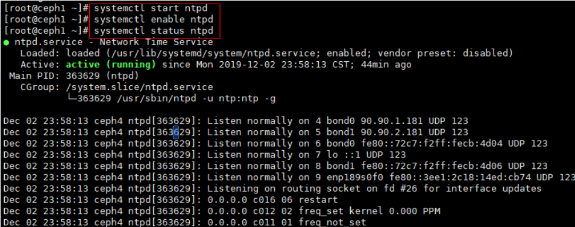
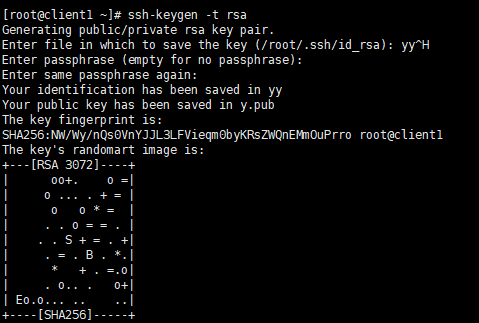
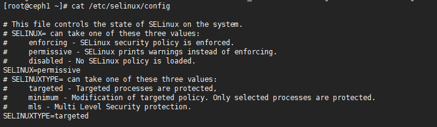
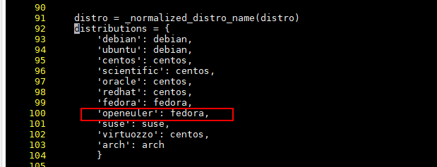
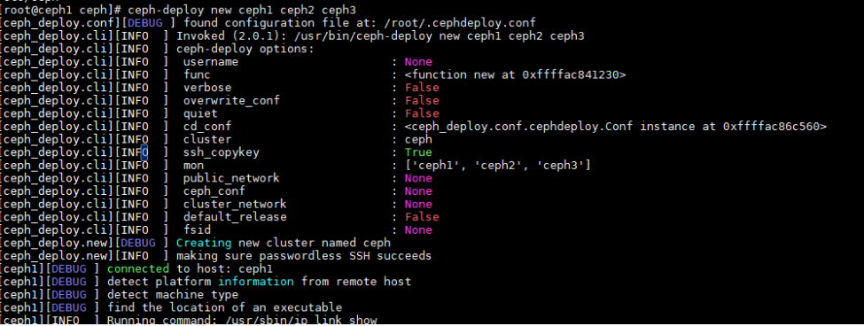
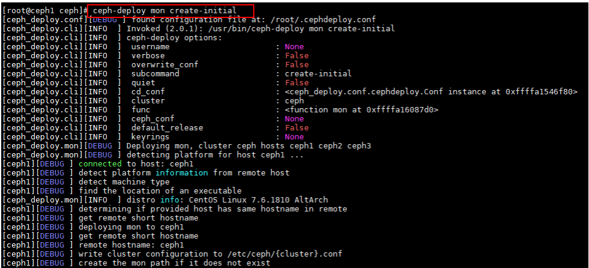
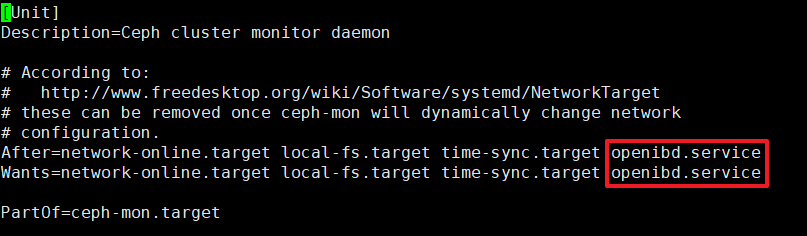
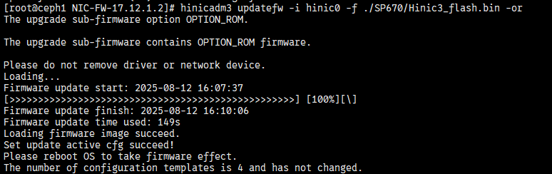

# RDMA Network Acceleration Feature Guide

## Feature Description<a name="EN-US_TOPIC_0000002520751404"></a>

### Overview<a name="EN-US_TOPIC_0000002551871375"></a>

Unified Communication X (UCX) is a general communication framework between the application layer and the driver layer. It provides unified communication interfaces for applications and supports TCP/IP and Remote Direct Memory Access (RDMA). UCX was designed for high performance compact scenarios where RDMA can be enabled to achieve high throughput and low latency. This document describes how to deploy Ceph and configure UCX on a Kunpeng server running openEuler 20.03.

With the development of software-defined storage, the requirements for latency and CPU usage are increasingly strict, and RDMA becomes a preferred choice. The Kunpeng BoostKit for SDS RDMA network acceleration feature applies the UCX framework to enable RDMA in front- and back-end networks of a Ceph cluster. UCX can enable RDMA and TCP/IP together. It has been applied to both the front-end network and cluster network.

### Other Information<a name="EN-US_TOPIC_0000002551871381"></a>

Before configuring this feature, learn about the license requirements, constraints, and principles.

**Availability<a name="section9679018303"></a>**

- Software versions: Ceph 14.2.8 and UCX 1.14.1

**Constraints<a name="section6558111125513"></a>**

The RDMA network acceleration feature is implemented based on UCX + Ceph 14.2.8. UCX + other distributed storage modes are not supported.

**Principles<a name="section123713125487"></a>**

Open source Ceph distributed storage has the following communication frameworks:

- Simple: basic client-server model. Two threads are created for each connection to transmit and receive messages. The number of threads increases as the number of connections increases.
- Async: asynchronous communication framework. Message transmission and receipt are processed by an asynchronous message framework, and the processing results are asynchronously sent to application threads. In this mode, the number of threads does not increase as the number of connections increases, but the message transmission and receipt performance deteriorates due to asynchronous waiting. This framework is widely used.
- XIO: a new communication framework. It has not been put into commercial use.

The RDMA network acceleration feature applies UCX to the asynchronous framework used by open source Ceph distributed storage to enable end-to-end RDMA.

Before configuring this feature, learn about the license requirements, constraints, and principles.

## Environment Requirements<a name="EN-US_TOPIC_0000002520911386"></a>

This document provides guidance based on the Kunpeng server and openEuler OS. Before performing operations, ensure that your hardware and software meet the requirements.

**Environment Networking<a name="section207531556152516"></a>**

Ceph is used in the environment, including three client nodes and three server nodes.


**Hardware Requirements<a name="section116628440251"></a>**

**Table 1** Hardware requirements<a id="hardware-requirements"></a>

|Item|Specifications|
|--|--|
|Server|TaiShan 200 with Kunpeng processors|
|CPU|Kunpeng 920|
|NIC|Client node: one 2 × 25GE NIC, 50GE in total<br>Ceph node: one 4 × 25GE NIC or two 2 × 25GE NICs, 100GE in total|

**OS and Software Requirements<a name="section1240364411598"></a>**

**Table 2** OS and software requirements<a id="OS-and-software-requirements"></a>

|Item|Version|How to Obtain|
|--|--|--|
|Physical machine OS|openEuler 20.03 LTS SP4|[OS](https://mirrors.tools.huawei.com/openeuler/openEuler-20.03-LTS-SP4/ISO/aarch64/openEuler-20.03-LTS-SP4-aarch64-dvd.iso)|
|Ceph|14.2.8|[Ceph](https://download.ceph.com/tarballs/ceph-14.2.8.tar.gz)|
|UCX|1.14.1|[UCX](https://github.com/openucx/ucx/releases/download/v1.14.1/ucx-1.14.1-1.el7.src.rpm)|

## Obtaining the Software Package<a name="EN-US_TOPIC_0000002551791389"></a>

Before compiling and deploying UCX, prepare the following software package.

|Software Package|Description|How to Obtain|
|--|--|--|
|ceph-14.2.8-ucx.patch|Patch for adapting Ceph to UCX|[Patch](https://gitcode.com/boostkit/ceph_BK/blob/master/ceph-14.2.8-ucx.patch)|

## Compiling and Installing the UCX and Ceph Packages<a name="EN-US_TOPIC_0000002520911394"></a>

### Compiling and Installing UCX Packages<a id="compiling-and-installing-the-UCX-packages"></a>

Compile and deploy UCX open-source software packages, including compiling and generating UCX RPM packages required for compiling Ceph.

1. Obtain the UCX open-source software packages.

    ```sh
    wget https://github.com/openucx/ucx/releases/download/v1.14.1/ucx-1.14.1-1.el7.src.rpm --no-check-certificate
    ```

    For details about how to obtain the packages, see [**Table 2**](#OS-and-software-requirements).

2. Set the directory for building RPM packages.
    1. Open the `/root/.rpmmacros` file.

        ```sh
        vi /root/.rpmmacros
        ```

    2. Press `i` to enter the insert mode, set `%_topdir` to the RPM package build directory (`/root/rpmbuild` for example), and comment out other lines.

        ```sh
        %_topdir /root/rpmbuild
        ```

    3. Press `Esc` to exit the insert mode. Type `:wq!` and press `Enter` to save the file and exit.
    4. Create a build directory in the `rpmbuild` directory.

        ```sh
        yum install rpmdevtools
        rpmdev-setuptree
        ```

3. Install the UCX RPM packages.

    ```sh
    rpm -ivh ucx-1.14.1-1.el7.src.rpm
    ```

4. Install the compilation dependencies.

    ```sh
    yum install libibverbs-devel librdmacm-devel libtool numactl-devel
    ```

5. Compile and build RPM packages. In the `rpmbuild` directory, compile and build the `ucx.spec` file to generate RPM packages.

    ```sh
    cd /root/rpmbuild/SPECS
    rpmbuild -bb ucx.spec
    ```

    After the build is complete, eight RPM packages are generated in the `/root/rpmbuild/RPMS/aarch64` directory, as shown in the following figure.

    

6. Install the RPM packages.

    ```sh
    cd /root/rpmbuild/RPMS/aarch64
    ```

    ```sh
    rpm -ivh ucx-1.14.1-1.aarch64.rpm
    rpm -ivh ucx-cma-1.14.1-1.aarch64.rpm
    rpm -ivh ucx-debuginfo-1.14.1-1.aarch64.rpm
    rpm -ivh ucx-debugsource-1.14.1-1.aarch64.rpm
    rpm -ivh ucx-devel-1.14.1-1.aarch64.rpm
    rpm -ivh ucx-ib-1.14.1-1.aarch64.rpm
    rpm -ivh ucx-rdmacm-1.14.1-1.aarch64.rpm
    rpm -ivh ucx-static-1.14.1-1.aarch64.rpm
    ```

### Compiling Ceph Packages<a name="EN-US_TOPIC_0000002551871379"></a>

#### Installing Dependencies<a name="EN-US_TOPIC_0000002551871377"></a>

1. Install common components.

    ```sh
    yum install CUnit-devel boost-random checkpolicy cmake cryptsetup-devel expat-devel fmt-devel fuse-devel gperf java-devel junit keyutils-libs-devel libaio-devel libbabeltrace-devel libblkid-devel libcap-ng-devel libcurl-devel numactl-devel libicu-devel libnl3-devel liboath-devel librabbitmq-devel librdkafka-devel librdmacm-devel libtool libxml2-devel lttng-ust-devel lua-devel lz4-devel make nasm ncurses-devel ninja-build nss-devel openldap-devel openssl-devel libudev-devel python3-Cython python3-devel python3-prettytable python3-pyyaml python3-setuptools python3-sphinx re2-devel selinux-policy-devel sharutils snappy-devel sqlite-devel sudo thrift-devel valgrind-devel xfsprogs-devel xmlstarlet doxygen python2-Cython createrepo gperftools leveldb-devel yasm -y
    ```

2. Install RDMA dependencies.

    ```sh
    yum install libibverbs-devel rdma-core-devel numactl-devel -y
    ```

#### Compiling Ceph<a id="compiling-Ceph"></a>

1. Download the ceph-14.2.8 source code.

    ```sh
    wget https://download.ceph.com/tarballs/ceph-14.2.8.tar.gz --no-check-certificate
    ```

2. Apply the UCX patch by placing `ceph-14.2.8-ucx.patch` in the current directory.

    ```sh
    tar -zxvf ceph-14.2.8.tar.gz
    cd ceph-14.2.8
    patch -p1 < ceph-14.2.8-ucx.patch
    ```

3. Compile Ceph.

    ```sh
    cd ..
    tar -zcvf ceph-14.2.8.tar.bz2 ceph-14.2.8
    cp ceph-14.2.8/ceph.spec /root/rpmbuild/SPECS/
    cp ceph-14.2.8.tar.bz2 /root/rpmbuild/SOURCES/
    rpmbuild -bb /root/rpmbuild/SPECS/ceph.spec
    ```

## Deploying Ceph<a name="EN-US_TOPIC_0000002551791391"></a>

### Configuring the Deployment Environment<a name="EN-US_TOPIC_0000002520911390"></a>

1. Disable the firewall.

    To disable the firewall on the current node, run the following commands on all server and client nodes:

    ```sh
    systemctl stop firewalld
    systemctl disable firewalld
    systemctl status firewalld
    ```

    

2. Configure host names.

    Configure the permanent static host names. Set the names of the server nodes to `ceph1`, `ceph2`, and `ceph3` and the names of the client nodes to `client1`, `client2`, and `client3`.

    1. Configure node names.
        1. Set the host name of server node 1 to `ceph1`.

            ```sh
            hostnamectl --static set-hostname ceph1
            ```

        2. Set the host name of client node 1 to `client1`.

            ```sh
            hostnamectl --static set-hostname client1 
            ```

            Configure host names for other nodes by referring to the preceding examples.

    2. Modify the domain name resolution file.

        ```sh
        vi /etc/hosts
        ```

        Add the following content to the `/etc/hosts` file on all server and client nodes:

        ```sh
        192.168.3.166   ceph1 
        192.168.3.167   ceph2
        192.168.3.168   ceph3
        192.168.3.160   client1 
        192.168.3.161   client2 
        192.168.3.162   client3
        ```

        > **NOTE**
        >
        > - The preceding IP addresses are only examples. Replace them as required. You can run the `ip a` command to obtain the actual IP addresses.
        > - You are advised to set the host names of the server nodes to `ceph1`, `ceph2`, and `ceph3`.
        > - You are advised to set the host names of the client nodes to `client1`, `client2`, and `client3`.
        > - The preceding example uses three servers and three clients. Change the number of nodes based on the site requirements.

3. Configure NTP.

    Ceph automatically checks the time between storage nodes. If the time difference between different nodes is large, an alarm will be generated. You need to configure clock synchronization between nodes.

    1. Install NTP.
        1. Install NTP on all server and client nodes.

            ```sh
            yum -y install ntp ntpdate
            ```

        2. Back up the original configurations of all server and client nodes.

            ```sh
            cd /etc && mv ntp.conf ntp.conf.bak
            ```

        3. Create an NTP file on `ceph1`, which serves as the NTP server.

            ```sh
            vi /etc/ntp.conf
            ```

            Add the following NTP server configuration to the NTP file:

            ```txt
            restrict 127.0.0.1 
            restrict ::1 
            restrict 192.168.3.0 mask 255.255.255.0
            server 127.127.1.0 
            fudge 127.127.1.0 
            stratum 8
            restrict default kod nomodify notrap nopeer noquery
            interface ignore wildcard
            interface listen x.x.x.x (*IP address of the server*)
            ```

            > **NOTE**
            >
            >`restrict 192.168.3.0 mask 255.255.255.0` indicates the network segment and subnet mask of `ceph1`.

        4. Create an NTP file on `ceph2`, `ceph3`, and all client nodes.

            ```sh
            vi /etc/ntp.conf
            ```

            Add the following content, in which the IP address is the IP address of `ceph1`:

            ```txt
            server 192.168.3.166 
            ```

    2. Start NTP.
        1. Start NTP on `ceph1` and check its status.

            ```sh
            systemctl start ntpd 
            systemctl enable ntpd 
            systemctl status ntpd 
            ```

            

        2. Forcibly synchronize the NTP server (`ceph1`) time to all the other nodes.

            ```sh
            ntpdate ceph1 
            ```

        3. Write the hardware clock to all nodes except `ceph1` to prevent configuration failures after the restart.

            ```sh
            hwclock -w 
            ```

        4. Install and start the crontab tool on all nodes except `ceph1`.

            ```sh
            yum install -y crontabs
            systemctl enable crond.service
            systemctl start crond 
            crontab -e 
            ```

        5. Add the following content so that all the other nodes automatically synchronize time with `ceph1` every 10 minutes:

            ```txt
            */10 * * * * /usr/sbin/ntpdate 192.168.3.166
            ```

4. Configure password-free login.

    Generate a public key on `ceph1` and deliver it to other server and client nodes.

    - For a three-node network of `ceph1`, `ceph2`, `ceph3`, `client1`, `client2`, and `client3`:

        ```sh
        ssh-keygen -t rsa 
        for i in {1..3};do ssh-copy-id ceph$i;done
        for i in {1..3};do ssh-copy-id client$i;done
        ```

    - For a network of `ceph1` and `client1`:

        ```sh
        ssh-keygen -t rsa
        ssh-copy-id ceph1
        ssh-copy-id client1
        ```

    >  **NOTE**
    >
    > After entering the first command `ssh-keygen -t rsa`, press **Enter** to use the default configuration.
    >
    > 
    >
    > 

5. Set the permissive mode.

    Set the permissive mode on all server and client nodes.

    - Temporarily disable the SELinux function. The setting becomes invalid after the OS is restarted.

        ```sh
        setenforce permissive
        ```

        

    - Set the permissive mode permanently. The configuration takes effect upon the next restart.

        ```sh
        vi /etc/selinux/config
        ```

        Set `SELINUX` to `permissive`.

        

### Installing Ceph<a name="EN-US_TOPIC_0000002520911384"></a>

Install Ceph on all server and client nodes.

1. Set the Yum certificate verification status of all server nodes and client nodes to verification-free.
    1. Open the file.

        ```sh
        vi /etc/yum.conf
        ```

    2. Press `i` to enter the insert mode and add the following content to the end of the file:

        ```sh
        sslverify=false
        deltarpm=0
        ```

    3. Press `Esc` to exit the insert mode. Type `:wq!` and press `Enter` to save the file and exit.

2. (Optional) Configure the local source of gperftools on all server and client nodes.
    1. Download the RPM packages of `gperftools-devel-2.7.7` and `gperftools-libs-2.7.7`.

        ```sh
        mkdir -p /home/gperftools-2.7-7 && cd /home/gperftools-2.7-7
        wget --no-check-certificate  https://repo.openeuler.org/openEuler-20.03-LTS/OS/aarch64/Packages/gperftools-devel-2.7-7.oe1.aarch64.rpm
        wget --no-check-certificate  https://repo.openeuler.org/openEuler-20.03-LTS/OS/aarch64/Packages/gperftools-libs-2.7-7.oe1.aarch64.rpm
        createrepo .
        ```

    2. Open the `/etc/yum.repos.d/openEuler.repo` file.

        ```sh
        vi /etc/yum.repos.d/openEuler.repo
        ```

    3. Press `i` to enter the insert mode and add the following content to the end of the file:

        ```ini
        [gperftools-2.7-7]
        name=gperftools-2.7-7
        baseurl=file:///home/gperftools-2.7-7
        enabled=1
        gpgcheck=0
        priority=1
        ```

    4. Press `Esc` to exit the insert mode. Type `:wq!` and press `Enter` to save the file and exit.

3. Install the RDMA dependencies on all server and client nodes.

    ```sh
    yum install libibverbs-devel rdma-core-devel numactl-devel -y
    ```

4. Install the UCX RPM packages on all server and client nodes. (Place the RPM packages generated in [4.1](#compiling-and-installing-UCX-packages) on each node.)

    ```sh
    rpm -ivh ucx-1.14.1-1.aarch64.rpm
    rpm -ivh ucx-cma-1.14.1-1.aarch64.rpm
    rpm -ivh ucx-debuginfo-1.14.1-1.aarch64.rpm
    rpm -ivh ucx-debugsource-1.14.1-1.aarch64.rpm
    rpm -ivh ucx-devel-1.14.1-1.aarch64.rpm
    rpm -ivh ucx-ib-1.14.1-1.aarch64.rpm
    rpm -ivh ucx-rdmacm-1.14.1-1.aarch64.rpm
    rpm -ivh ucx-static-1.14.1-1.aarch64.rpm
    ```

5. Save the Ceph RPM packages with UCX enabled ([Compiling Ceph](#compiling-Ceph)) to `/home/ceph-ucx` and configure the local repository.

    ```sh
    vi /etc/yum.repos.d/local.repo
    ```

    Add the following content to the end of the file, save the file, and exit:

    ```ini
    [ceph-ucx]
    name=ceph-ucx
    baseurl=file:///home/ceph-ucx
    enabled=1
    gpgcheck=0
    priority=1
    ```

6. Update the Yum repository.

    ```sh
    cd /home/ceph-ucx
    createrepo .
    ```

7. Install Ceph on all server and client nodes.

    ```sh
    dnf -y install librados2-14.2.8 ceph-14.2.8
    pip install prettytable werkzeug
    ```

    If Ceph fails to be installed, configure a network proxy.

    >  **CAUTION**
    >
    > During Ceph installation, verify that the version of gperftools is 2.7-7.
    >
    > 

8. Install ceph-deploy on `ceph1`.

    ```sh
    pip install ceph-deploy
    ```

9. Adapt to openEuler.
    1. Open the `/lib/python2.7/site-packages/ceph_deploy/hosts/__init__.py` file on `ceph1`.

        ```sh
        vi /lib/python2.7/site-packages/ceph_deploy/hosts/__init__.py
        ```

    2. Press `i` to enter the insert mode and add the following code to the `_get_distro` function:

        ```sh
        'openeuler':fedora,
        ```

        

    3. Press `Esc` to exit the insert mode. Type `:wq!` and press `Enter` to save the file and exit.

10. View the Ceph version on each node.

    ```sh
    ceph -v
    ```

    If the following information is displayed, Ceph is installed.

    ```sh
    ceph version 14.2.8 (2d095e947a02261ce61424021bb43bd3022d35cb) nautilus (stable)
    ```

Install Ceph on all server and client nodes.

### Deploying Ceph<a name="EN-US_TOPIC_0000002551791387"></a>

#### Deploying MON<a name="EN-US_TOPIC_0000002520751406"></a>

The Monitor (MON) monitors the status of the Ceph cluster. You only need to deploy MON on the primary node (`ceph1` is used as an example).

1. Create a Ceph cluster. (`ceph1`, `ceph2`, and `ceph3` are used as examples.)

    ```sh
    cd /etc/ceph
    ceph-deploy new ceph1 ceph2 ceph3
    ```

    

2. Configure global parameters and MON parameters for the Ceph cluster.

    >  **NOTICE**
    >
    > Configuring nodes and using ceph-deploy to configure OSDs need to be performed in the `/etc/ceph` directory. Otherwise, an error may occur.

    1. Open the `ceph.conf` file that is automatically generated in the `/etc/ceph` directory.

        ```sh
        vi /etc/ceph/ceph.conf
        ```

    2. Press `i` to enter the insert mode and change the content in `ceph.conf` to the following information (use the latest `fsid`):

        ```ini
        [global]
        fsid = f5a4f55c-d25b-4339-a1ab-0fceb4a2996f
        mon_initial_members = ceph1, ceph2, ceph3
        mon_host = 192.168.3.166,192.168.3.167,192.168.3.168
        auth_cluster_required = cephx
        auth_service_required = cephx
        auth_client_required = cephx
        
        public_network = 192.168.65.0/24
        cluster_network = 192.168.66.0/24
        
        [mon]
        mon_allow_pool_delete = true
        ```

        For a single-node environment, add the following content below `[global]`:

        ```ini
        osd_pool_default_size = 1
        osd_pool_default_min_size = 1
        ```

    3. Press `Esc` to exit the insert mode. Type `:wq!` and press `Enter` to save the file and exit.

    >  **NOTE**
    >
    > In Ceph 14.2.8, when the BlueStore engine is used, the buffer of the BlueFS is enabled by default. As a result, the system memory may be fully occupied by the buffer or cache, causing performance deterioration. You can use either of the following methods to solve the problem:
    >
    > - If the cluster load is not heavy, set `bluefs_buffered_io` to `false`.
    > - Periodically run the following command to forcibly reclaim the memory occupied by the buffer or cache:
    >
    >    ```sh
    >    echo 3 > /proc/sys/vm/drop_caches
    >    ```

3. <a id="en-us_topic_0000001210295277_li165307499543"></a> Initialize MONs and collect keys.

    ```sh
    ceph-deploy mon create-initial
    ```

    

4. Copy `ceph.client.admin.keyring` generated in [3](#en-us_topic_0000001210295277_li165307499543) to each node.

    ```sh
    ceph-deploy --overwrite-conf admin ceph1 ceph2 ceph3 client1 client2 client3
    ```

    

5. Check the Ceph cluster status to determine whether the MONs are configured.

    ```sh
    ceph -s
    ```

    Expected result of successful configuration:

    ```txt
    cluster:
    id:     f6b3c38c-7241-44b3-b433-52e276dd53c6
    health: HEALTH_OK
    services:
    mon: 3 daemons, quorum ceph1,ceph2,ceph3 (age 25h)
    ```

    >  **NOTE**
    >
    > If MONs fails to be generated, the permission configuration may be incorrect. In this case, you need to configure the Ceph group and users.
    >
    > ```sh
    > /usr/sbin/groupadd ceph -g 167 -o -r 2>/dev/null || :/usr/sbin/useradd ceph -u 167 -o -r -g ceph -s /sbin/nologin -c "Ceph daemons" -d /var/lib/ceph 2>/dev/null || :
    > ```

#### Deploying MGR<a name="EN-US_TOPIC_0000002551871385"></a>

The Manager (MGR) is a key component for Ceph cluster management. It collects the status and runtime metrics of a Ceph cluster. You only need to deploy MGRs on `ceph1`, and then synchronize the configuration to `ceph2` and `ceph3`.

1. Deploy MGRs.

    ```sh
    ceph-deploy mgr create ceph1 ceph2 ceph3
    ```

    

2. Check the Ceph cluster status to determine whether the MGRs are deployed.

    ```sh
    ceph -s
    ```

    The deployment is successful if the command output is similar to the following:

    ```txt
    cluster:
    id:     f6b3c38c-7241-44b3-b433-52e276dd53c6
    health: HEALTH_OK
    
    services:
    mon: 3 daemons, quorum ceph1,ceph2,ceph3 (age 25h)
    mgr: ceph1(active, since 2d), standbys: ceph2, ceph3
    ```

#### Adding OSDs<a name="EN-US_TOPIC_0000002520751410"></a>

In this example, the NVMe SSD is divided into 12 60-GB partitions as WAL partitions and 12 180-GB partitions as DB partitions.

1. Create a `partition.sh` script. (Skip this step if partitioning is not required.)

    ```sh
    vi partition.sh
    ```

2. Add the following content to the script: (Assume that a single NVMe SSD is divided into 12 partitions. Skip this step if partitioning is not required.)

    ```sh
    #!/bin/bash
    
    parted /dev/nvme0n1 mklabel gpt
    
    for j in `seq 1 12`
    do
    ((b = $(( $j * 8 ))))
    ((a = $(( $b - 8 ))))
    ((c = $(( $b - 6 ))))
    str="%"
    echo $a
    echo $b
    echo $c
    parted /dev/nvme0n1 mkpart primary ${a}${str} ${c}${str}
    parted /dev/nvme0n1 mkpart primary ${c}${str} ${b}${str}
    done
    ```

3. Run the script. (Skip this step if partitioning is not required.)

    ```sh
    bash partition.sh
    ```

4. Create a `create_osd.sh` script on `ceph1` and deploy OSDs on the 12 partitions on each server.

    ```sh
    vi /etc/ceph/create_osd.sh
    ```

5. Add the following content:

    ```sh
    #!/bin/bash
    
    for node in ceph1 ceph2 ceph3
    do
    for i in {0..7}
    do
    ceph-deploy osd create ${node} --data /dev/nvme${i}n1
    done
    done
    ```

6. Run the script on `ceph1`.

    ```sh
    bash create_osd.sh
    ```

7. Check whether the created OSDs are normal.

    ```sh
    ceph -s
    ```

    

In this example, the NVMe SSD is divided into 12 60-GB partitions as WAL partitions and 12 180-GB partitions as DB partitions.

### Uninstalling Ceph<a name="EN-US_TOPIC_0000002551871389"></a>

You can delete all Ceph components on nodes to uninstall Ceph.

1. Stop all Ceph service processes.

    ```sh
    systemctl stop ceph.target
    ```

2. Uninstall Ceph.

    ```sh
    yum rm ceph-14.2.8 librados2-14.2.8
    ```

3. Delete Ceph-related directories.

    ```sh
    rm -rf /var/lib/ceph/*
    rm -rf /etc/ceph/*
    rm -rf /var/run/ceph/*
    ```

You can delete all Ceph components on nodes to uninstall Ceph.

## Switching to the UCX Networking for a Cluster<a name="EN-US_TOPIC_0000002520751408"></a>

Before enabling UCX, add UCX-related configurations and configure UCX environment variables in the Ceph configuration file. If the UCX multi-rail function is required, configure the `UCX_MAX_RNDV_RAILS` and `UCX_MAX_EAGER_RAILS` options.

1. Check whether the hardware and driver support RoCE. The Mellanox NIC is used as an example.

    ```sh
    lspci | grep Mellanox
    ```

    If RoCE is available, the following information will be displayed:

    

2. Stop Ceph on all server nodes.

    ```sh
    systemctl stop ceph.target
    ```

3. Modify the Ceph configuration file on all server and client nodes. Add the following information under the `global` field in `/etc/ceph/ceph.conf`:

    ```ini
    ms_type = async+ucx
    ms_public_type = async+ucx
    ms_cluster_type = async+ucx
    ms_async_ucx_device=mlx5_0:1,mlx5_1:1
    ms_async_ucx_tls=rc_verbs,self
    ms_async_ucx_max_recv=14
    ```

    >  **NOTICE**
    >
    > - You can use `show_gids` to query device names and enter multiple network devices in `ms_async_ucx_device`. If the `show_gids` command is abnormal, see [Updating the NIC Firmware and Driver](#EN-US_TOPIC_0000002520911400).
    > - To enable UCX on the front-end network, set `ms_public_type` to `async+ucx`. To enable UCX only on the back-end network, set both `ms_type` and `ms_public_type` to `async+posix`.
    > - The IP addresses of `cluster_network` and `public_network` must be the same as those of the UCX devices (RoCE interfaces).

4. Configure UCX environment variables on all server and client nodes. Add the following information to the blank area in `/etc/sysconfig/ceph`:

    ```ini
    UCX_MODULE_DIR=/lib64/ucx
    UCX_RNDV_THRESH=32k
    UCX_MEM_MMAP_HOOK_MODE=none
    UCX_MAX_RNDV_RAILS=4
    UCX_MAX_EAGER_RAILS=4
    UCX_PROTO_ENABLE=y
    ```

    >  **NOTICE**
    >
    > - If UCX logs are required, add the following configurations:
    >
    >    ```ini
    >    UCX_LOG_FILE=/var/log/ceph/ucx_%p.log
    >    UCX_LOG_LEVEL=DEBUG
    >    ```
    >
    > - `UCX_MEM_MMAP_HOOK_MODE` can be set to `reloc`, `bistro`, or `none`. If the TCMalloc huge page is enabled, set it to `reloc`.
    > - If two interfaces need to be used at the same time, enable the UCX multi-rail function and set `UCX_MAX_RNDV_RAILS` and `UCX_MAX_EAGER_RAILS` to `2` or larger (value range: 1 to 4). The UCX multi-rail configuration can better balance traffic than the bond mode and achieve higher network bandwidth.

5. Modify the memory limit on all server and client nodes. Add the following information to the blank area in `/etc/security/limits.conf`:

    ```sh
    root soft memlock unlimited
    root hard memlock unlimited
    ceph soft memlock unlimited
    ceph hard memlock unlimited
    ```

6. Modify the Ceph configuration files in systemd. Add the following information to the `service` field in `ceph-mds@.service`, `ceph-mgr@.service`, `ceph-mon@.service`, and `ceph-osd@.service` of `/lib/systemd/system/`:

    ```ini
    LimitMEMLOCK=infinity
    LimitCORE=infinity
    PrivateDevices=no
    ```

7. Add the following information to the `After` and `Wants` fields in `ceph-mds@.service`, `ceph-mgr@.service`, `ceph-mon@.service`, and `ceph-osd@.service` of `/lib/systemd/system/`:

    

8. Configure the openibd to wait for 60 seconds after startup.

    ```sh
    vim /usr/lib/systemd/system/openibd.service
    ```

    Configure the following configuration item:

    ```ini
    ExecStartPost=/bin/sleep 60
    ```

    

9. Add the following configurations on all server and client nodes:

    ```sh
    ulimit -l unlimited
    ulimit -n 1048576
    ```

10. Before starting UCX, check whether all the UCX-related installation packages are installed.

    >  **NOTICE**
    >
    > Ensure that the four installation packages have been installed. Otherwise, the OSD service may exit.

    ```sh
    rpm -qa | grep ucx
    ```

    Expected result:

    

11. Update the configuration and start Ceph.

    ```sh
    systemctl daemon-reload
    systemctl start ceph.target
    ```

    >  **NOTE**
    >
    > In heavy-load scenarios, only 256 images are supported.

## Configuring Flow Control and Checking Traffic (RoCE Networking)<a name="EN-US_TOPIC_0000002520911398"></a>

### Configuring Switches<a name="EN-US_TOPIC_0000002551871387"></a>

To configure a lossless network, you need to configure switches. This section uses the HUAWEI CE6863-48S6CQ switch as an example to describe how to execute a flow control policy.

1. <a id="li1100413134"></a>Log in to the switch and enable priority-based flow control (PFC).

    ```sh
    system-view
    dcb pfc
    priority 0
    commit
    quit
    ```

2. Check whether PFC is enabled.

    ```sh
    display dcb pfc-profile
    ```

    If `0` is returned, the configuration in [1](#li1100413134) is successful.

    

3. <a id="li1586514481310"></a>Configure Explicit Congestion Notification (ECN).

    ```sh
    system-view
    drop-profile ecn
    color green buffer-size low-limit 247520 high-limit 18000000 discard-percentage 100
    commit
    quit
    ```

4. Check the ECN profile.

    ```sh
    display drop-profile ecn
    ```

    If the following information is displayed, the configuration in [3](#li1586514481310) takes effect.

    

5. <a id="li202741334141411"></a>Configure flow control for each traffic interface. A 25GE interface 1/0/5 is used as an example.

    ```sh
    interface 25GE 1/0/5
    qos queue 0 wred ecn
    qos queue 0 ecn
    dcb pfc enable mode manual
    dcb pfc buffer 0 xoff static 1500 cells
    commit
    quit
    ```

6. Check whether the configuration takes effect.

    ```sh
    interface 25GE 1/0/5
    display this
    ```

    If the information in [5](#li202741334141411) is returned, the flow control is configured.

To configure a lossless network, you need to configure switches. This section uses the HUAWEI CE6863-48S6CQ switch as an example to describe how to execute a flow control policy.

### Checking Interface Traffic<a name="EN-US_TOPIC_0000002551791393"></a>

You can check whether the switch configuration takes effect on the service side by checking whether there is traffic on interfaces.

1. Configure queue priorities for RoCE NICs on all nodes.

    >  **NOTICE**
    >
    > Even if you have bonded two interfaces (mode 0/2/4), you still need to configure the priority for each interface to achieve optimal network performance.

    ```sh
    mlnx_qos -i enp133s0f0 -f 1,0,0,0,0,0,0,0
    mlnx_qos -i enp133s0f1 -f 1,0,0,0,0,0,0,0
    ```

2. Check whether there is traffic on the NIC.

    ```sh
    watch -n 1 "ethtool -S enp133s0f0 | grep prio"
    watch -n 1 "ethtool -S enp133s0f1 | grep prio"
    ```

    **If the returned traffic changes, there is traffic on the NIC.**

    

    **Figure 1** Example command output for enp133s0f0<a name="fig22151324163920"></a><a id="example-command-output-for enp133s0f0"></a>
    
    

    **Figure 2** Example command output for enp133s0f1<a name="fig97302564393"></a><a id="example-command-output-for-enp133s0f1"></a>

You can check whether the switch configuration takes effect on the service side by checking whether there is traffic on interfaces.

## FAQs<a name="EN-US_TOPIC_0000002520911396"></a>

### Updating the NIC Firmware and Driver<a name="EN-US_TOPIC_0000002520911400"></a>

1. [Download the firmware package](https://support.huawei.com/enterprise/en/software/262409138-ESW2001281575) and decompress it. (The CX-5 NIC is used as an example.)
2. Upgrade the firmware.

    ```sh
    cd NIC-SP382-CX5-FW-16.32.1010-ARM
    ./install.sh upgrade
    ```

3. Install driver dependencies.

    ```sh
    yum install createrepo perl pciutils gcc-gfortran tcsh expat glib2 tcl libstdc++ bc tk gtk2 atk cairo numactl pkgconfig ethtool lsof rpm-build libxml2-python python autoconf automake libtool
    ```

4. [Download the NIC driver](https://support.huawei.com/enterprise/en/management-software/computing-component-idriver-pid-259488843/software/262409128?idAbsPath=fixnode01%7C23710424%7C251364417%7C251364851%7C254884035%7C259488843).
5. Install the driver.
    1. Decompress the downloaded ISO file.

        ```sh
        mkdir /mnt/iso
        mount -o loop ***.iso /mnt/iso
        cd /mnt/iso
        ```

        >  **NOTE**
        >
        > - `***.iso` indicates the ISO file corresponding to the NIC driver, for example, `onboard_driver_openEuler20.03.iso`.
        > - `***.tgz` in the following commands indicates the driver package in the ISO file. Replace it with the actual name.

    2. Install the driver in either of the following ways:
        - Method 1: Decompress the installation package to install the driver.

            ```sh
            cp ***.tgz /home
            cd /home
            tar xf ***.tgz
            cd ***
            ./mlnxofedinstall --force --without-depcheck --without-fw-update --add-kernel-support  --skip-distro-check
            ```

        - Method 2: Use the automatic installation script.

            ```sh
            ./install.sh  # (Refer to the readme_en.txt file in the same directory.)
            ```

6. Reload the driver.

    ```sh
    dracut -f
    /etc/init.d/openibd restart
    ```

    > **NOTE**
    >
    >If the driver is in use, stop related services so that the driver can be reloaded.

7. Reboot the node.

    ```sh
    reboot
    ```

> **NOTE**
>
> The recommended versions are as follows:
>
> 1. Firmware version: 16.32.1010 \(HUA0000000024\)
> 2. Driver version:
>    - openEuler 20.03 (Arm): 24.01-0.3.3
>    - openEuler 20.03 (x86): 5.8-1.1.2

### How Can I Rectify a Driver Error Reported During Service Execution?<a name="EN-US_TOPIC_0000002551791401"></a>

**Symptom<a name="section2294102135420"></a>**

When a service operation is performed, an error message is displayed, as shown in [**Figure 1** Error message](#error-message).


**Figure 1** Error message<a name="fig12478132704215"></a><a id="error-message"></a>

**Solution<a name="section5188164015718"></a>**

If the preceding error information is displayed in dmesg, configure the following parameter on the node:

```sh
mst start
mlxconfig -d 85:00.0 -y s PF_LOG_BAR_SIZE=8
reboot
```

>  **NOTE**
>
> `85:00.0` indicates the PCIe number of the NIC.

### How Can I Update the SP670 Driver to Support UCX?<a name="EN-US_TOPIC_0000002520751412"></a>

1. Download the latest firmware and driver installation packages (`NIC-FW-17.12.1.2.tar.gz` and `SDK_LINUX-17.12.1.2-openEuler22.03SP4-aarch64.tar.gz`) and decompress them. For details, see [the website](https://support.huawei.com/enterprise/en/huawei-computing-components/in220-pid-253287505/software/266018371?idAbsPath=fixnode01).
2. Upgrade the firmware.

    ```sh
    tar -zvxf NIC-FW-17.12.1.2.tar.gz
    cd NIC-FW-17.12.1.2
    rpm -ivh tool/aarch64/hinicadm3-17.12.1.2-1.aarch64.rpm
    hinicadm3 updatefw -i hinic0 -f ./SP670/Hinic3_flash.bin -or
    ```

    

3. Install the driver. You need to install the driver version corresponding to the OS kernel. The following uses openEuler 22.03 LTS SP4 as an example.

    ```sh
    tar -zvxf SDK_LINUX-17.12.1.2-openEuler22.03SP4-aarch64.tar.gz
    cd SDK_LINUX-17.12.1.2-openEuler22.03SP4-aarch64
    rpm -ivh nic/hisdk3-17.12.1.2_5.10.0_216.0.0.115.oe2203sp4.aarch64-1.aarch64.rpm
    rpm -ivh nic/hinic3-17.12.1.2_5.10.0_216.0.0.115.oe2203sp4.aarch64-1.aarch64.rpm
    rpm -ivh roce/hiroce3-17.12.1.2_5.10.0_216.0.0.115.oe2203sp4.aarch64-1.aarch64.rpm
    ```

4. Run the `reboot` command to restart the server.

### How Can I Rectify an Error Reported When UCX Uses SP670?<a name="EN-US_TOPIC_0000002551791397"></a>

**Symptom<a name="section488342804215"></a>**

The following error message is displayed when `ucx_info -d` scans devices:


**Cause<a name="section17231118112312"></a>**

The default Rx queue depth of UCX is 4096, but the maximum depth supported by SP670 is 4095. You need to adjust the default depth of UCX.

**Solution<a name="section5188164015718"></a>**

1. To solve this issue, you need to modify a line of code based on the following code:

    ```sh
    cd /root/rpmbuild/SOURCES/
    tar -zxvf ucx-1.14.1.tar.gz
    vim ucx-1.14.1/src/uct/ib/base/ib_iface.c
    ```

    Change the default value of `RX_QUEUE_LEN` from `4096` to `4095`.

    

    Package the file.

    ```sh
    rm -rf ucx-1.14.1.tar.gz
    tar zcvf ucx-1.14.1.tar.gz ucx-1.14.1
    ```

2. Compile and build RPM packages. In the `rpmbuild` directory, compile and build the `ucx.spec` file to generate RPM packages.

    ```sh
    cd /root/rpmbuild/SPECS
    rpmbuild -bb ucx.spec
    ```

    After the build is complete, eight RPM packages are generated in the `/root/rpmbuild/RPMS/aarch64` directory, as shown in the following figure.

    

3. Install the RPM packages.

    ```sh
    cd /root/rpmbuild/RPMS/aarch64
    ```

    ```sh
    rpm -ivh ucx-1.14.1-1.aarch64.rpm --force
    rpm -ivh ucx-cma-1.14.1-1.aarch64.rpm --force
    rpm -ivh ucx-debuginfo-1.14.1-1.aarch64.rpm --force
    rpm -ivh ucx-debugsource-1.14.1-1.aarch64.rpm --force
    rpm -ivh ucx-devel-1.14.1-1.aarch64.rpm --force
    rpm -ivh ucx-ib-1.14.1-1.aarch64.rpm --force
    rpm -ivh ucx-rdmacm-1.14.1-1.aarch64.rpm --force
    rpm -ivh ucx-static-1.14.1-1.aarch64.rpm --force
    ```

## Security Management<a name="EN-US_TOPIC_0000002520751400"></a>

**Routine Check Using Antivirus Software<a name="section11752161613273"></a>**

Periodically scan clusters for viruses. This protects clusters from viruses, malicious code, spyware, and malicious programs, reducing risks such as system breakdown and information leakage. Mainstream antivirus software can be used for antivirus check.

**Vulnerability Fixing<a name="section208601325152718"></a>**

To ensure the production environment security and reduce attack risks, periodically fix the following vulnerabilities if any:

- OS vulnerabilities
- OpenSSL vulnerabilities
- Vulnerabilities in other components

## Acronyms and Abbreviations<a name="EN-US_TOPIC_0000002520751402"></a>

|Acronym/Abbreviation|Full Name|
|--|--|
|**A - E**|
|ECN|Explicit Congestion Notification|
|**F - J**|
|HPC|High Performance Compact|
|**K - O**|
|NUMA|Non-uniform memory access|
|OSD|Object Storage Daemon|
|**P - T**|
|PFC|Priority-based flow control|
|RDMA|Remote direct memory access|
|RoCE|RDMA over Converged Ethernet|
|SPDK|Storage Performance Development Kit|
|TCP|Transmission Control Protocol|
|**U - Z**|
|UCX|Unified Communication X|

## Change History

| Date | Description |
|-------|----------|
| 2024-09-30 | This is the first official release. |
