# SPDK I/O Acceleration Feature Guide

## Feature Description<a name="EN-US_TOPIC_0000002551432413"></a>

### Overview<a name="EN-US_TOPIC_0000002551432415"></a>

This document describes how to perform container-based deployment of a Ceph cluster on a Kunpeng server running openEuler 20.03. It also describes how to configure and optimize the integration of the Storage Performance Development Kit (SPDK), Unified Communication X (UCX), and Kunpeng Storage Acceleration Library (KSAL) to maximize storage and network performance.

As distributed storage systems have increasing requirements for low latency and high performance, improving the performance of Ceph clusters has become an important issue. I/O latency in Ceph distributed storage mainly occurs during network transmission, data processing and distribution, data flushing, and metadata flushing. In the network transmission phase, UCX can be used to enable a remote direct memory access (RDMA) network and thus shorten network transmission latency. The optimized memcpy algorithm in KSAL can be used to reduce data copy latency. In data and metadata flushing phases, high-performance storage interfaces of SPDK can be used to reduce I/O latency when writing data to drives.

After integrating SPDK, UCX, and KSAL, a Ceph cluster can achieve more efficient SSD access and network communication. Enabling these technologies will improve performance in scenarios where a large number of concurrent requests need to be processed with a low latency.

### Other Information<a name="EN-US_TOPIC_0000002551552427"></a>

Before configuring this feature, learn about the license requirements, constraints, and principles.

**Availability<a name="section9679018303"></a>**

- Software versions: Ceph 17.2.7, SPDK 21.01, and UCX 1.14.1

**Constraints<a name="section6558111125513"></a>**

- The SPDK I/O acceleration feature is implemented based on SPDK + Ceph 17.2.7. SPDK + other distributed storage modes are not supported.
- `bluefs_buffered_io` is not supported in SPDK mode. The time for deleting a pool in SPDK mode is longer than that in non-SPDK mode with `bluefs_buffered_io` enabled, and is the same as that in non-SPDK mode with `bluefs_buffered_io` disabled. If you create a pool immediately after deleting a pool, it takes a long time to run the command for creating images.
- If SPDK is enabled for Ceph, the user-mode NVMe driver is used for disk I/O read and write. This operation requires huge pages. Common users need the `CAP_DAS_OVERRIDE` permission to access `/dev/hugepages` and the `CAP_SYS_ADMIN` permission to access `/proc/self/pagemap`for VA-to-PA translation. You are advised not to enable SPDK in environments that require high system security.

- When cephadm is used to deploy a Ceph 17 cluster, Ceph service containers such as MON and OSD are started in `--privileged` mode by default.

    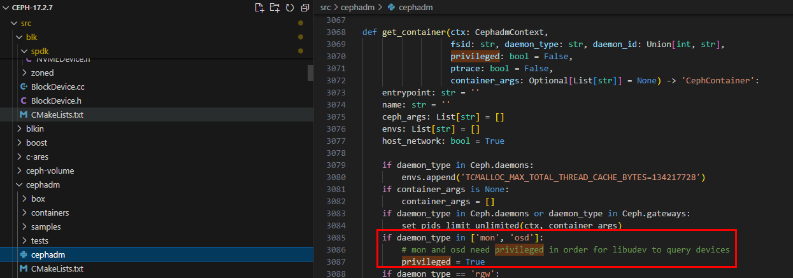

**Principles<a name="section123713125487"></a>**

Open source Ceph distributed storage supports the following NVMe SSD drivers:

- NVMe: kernel-mode driver
- SPDK: user-mode driver

The SPDK I/O acceleration feature enables the user-mode driver to reduce I/O latency and improve Ceph read/write performance. For details, see [Prerequisites](#li11112652145119).

Before configuring this feature, learn about the license requirements, constraints, and principles.

## Environment Requirements<a name="EN-US_TOPIC_0000002520032418"></a>

This document provides guidance based on the TaiShan server with Kunpeng processors and openEuler OS. Before performing operations, ensure that your software and hardware meet the requirements.

**Environment Networking<a name="section207531556152516"></a>**

Ceph is used in the environment, including three client nodes (`client1` to `client3`) and three server nodes (`ceph1` to `ceph3`).

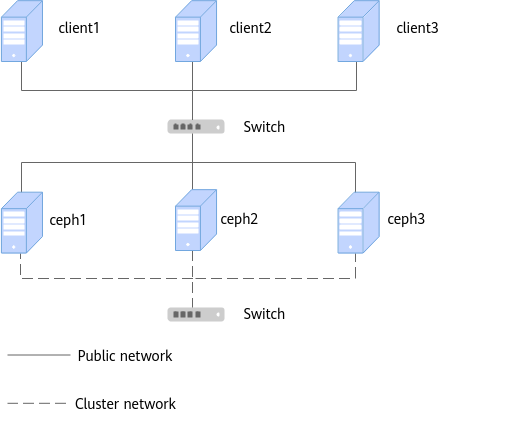

Example server IP addresses in a Ceph cluster are listed in [**Table 1**](#server-IP-addresses).

**Table 1** Server IP addresses<a id="server-IP-addresses"></a>

|Cluster|Management IP Address|Public Network IP Address|Cluster Network IP Address|
|--|--|--|--|
|ceph1|192.168.2.166|192.168.3.166|192.168.4.166|
|ceph2|192.168.2.167|192.168.3.167|192.168.4.167|
|ceph3|192.168.2.168|192.168.3.168|192.168.4.168|

Example client IP addresses are listed in [**Table 2**](#client-IP-addresses).

**Table 2** Client IP addresses<a id="client-IP-addresses"></a>

|Client|Management IP Address|Public Network IP Address|
|--|--|--|
|client1|192.168.2.160|192.168.3.160|
|client2|192.168.2.161|192.168.3.161|
|client3|192.168.2.162|192.168.3.162|

> **NOTE**
>
>- Management IP address: used for remote SSH machine management and configuration.
>- Cluster network IP address: used for data synchronization between nodes in a cluster. The 25GE network port is recommended.
>- Public network IP address: IP address of the storage node for other nodes to access. The 25GE network port is recommended.
>- When clients are used as presses, ensure that the service port IP addresses of clients and the public network IP addresses of the cluster are in the same network segment. The 25GE network port is recommended.

**Hardware Requirements<a name="section116628440251"></a>**

[**Table 3**](#hardware-requirements) lists the hardware requirements.

**Table 3** Hardware requirements<a id="hardware-requirements"></a>

|Item|Specifications|
|--|--|
|Server|Kunpeng server|
|CPU|Kunpeng 920|
|NIC|Two 2 x 25GE NICs|

**OS and Software Requirements<a name="section1240364411598"></a>**

[**Table 4**](#OS-and-software-requirements) lists the OS and software requirements.

**Table 4** OS and software requirements<a id="OS-and-software-requirements"></a>

|Item|Version|How to Obtain|
|--|--|--|
|Physical machine OS|openEuler 20.03 LTS SP4|[OS](https://mirrors.tools.huawei.com/openeuler/openEuler-20.03-LTS-SP4/ISO/aarch64/openEuler-20.03-LTS-SP4-everything-aarch64-dvd.iso)|
|openEuler image|openEuler 22.03 LTS SP4|[Image](https://repo.huaweicloud.com/openeuler/openEuler-22.03-LTS-SP4/docker_img/aarch64/openEuler-docker.aarch64.tar.xz)|
|Ceph|17.2.7|[Ceph](https://download.ceph.com/tarballs/ceph-17.2.7.tar.gz)|
|UCX|1.14.1|[1](https://github.com/openucx/ucx/releases/download/v1.14.1/ucx-1.14.1-1.el7.src.rpm)<br>[2](https://github.com/openucx/ucx/releases/download/v1.14.1/ucx-1.14.1.tar.gz)|
|SPDK|21.01.1 (openEuler 22.03 LTS SP4)|`git clone -b openEuler-22.03-LTS-SP4 https://gitee.com/src-openeuler/spdk.git`|
|DPDK|21.11 (openEuler 22.03 LTS SP4)|`git clone -b openEuler-22.03-LTS-SP4 https://gitee.com/src-openeuler/dpdk.git`|
|isa-l|2.30.0 (openEuler 22.03 LTS SP4)|`git clone -b openEuler-22.03-LTS-SP4 https://gitee.com/src-openeuler/isa-l.git`|

> **NOTE**
>
>- This document uses Ceph 17.2.7 as an example. You can also refer to this document to install other versions.
>
>- By default, the compilation container uses the root directory. You are advised to ensure that the available space of the root directory is greater than 500 GB when installing the OS.

This document provides guidance based on the TaiShan server with Kunpeng processors and openEuler OS. Before performing operations, ensure that your software and hardware meet the requirements.

## Obtaining Software Packages<a id="obtaining-software-packages"></a>

Before compiling and deploying UCX, prepare the following software packages.

|Software Package|Description|How to Obtain|
|--|--|--|
|ceph-17.2.x-spdk.patch|Patch for adapting Ceph to SPDK|[Package](https://gitcode.com/boostkit/ceph_BK/blob/master/ceph-17.2.x-spdk.patch)|
|ceph-17.2.x-ucx.patch|Patch for adapting Ceph to UCX|[Package](https://gitcode.com/boostkit/ceph_BK/blob/master/ceph-17.2.x-ucx.patch)|
|BoostKit-KSAL_1.10.0.zip|Closed source KSAL package, which improves the computing efficiency of Ceph-related algorithms|[Package](https://kunpeng-repo.obs.cn-north-4.myhuaweicloud.com/Kunpeng%20BoostKit/Kunpeng%20BoostKit%2024.0.0/BoostKit-KSAL_1.10.0.zip)|

## Preparing the Compilation Environment<a name="EN-US_TOPIC_0000002551552409"></a>

### Installing Podman on All Nodes<a name="EN-US_TOPIC_0000002551552413"></a>

To ensure unified management and deployment of applications and improve deployment consistency and reliability, you need to install Podman on all nodes (`ceph1` to `ceph3` and `client1` to `client3` in this document).

> **NOTE**
>
> - Podman is used to deploy Ceph in a container. Ceph has requirements on the Podman versions. For details about the version mapping, see the following table.
> 
>    |Ceph|Podman 1.9|Podman 2.0|Podman 2.1|Podman 2.2|Podman 3.0|Podman >3.0|
>    |--|--|--|--|--|--|--|
>    |≤ 15.2.5|True|False|False|False|False|False|
>    |≥ 15.2.6|True|True|True|False|False|False|
>    |≥ 16.2.1|False|True|True|False|True|True|
>    |≥ 17.2.0|False|True|True|False|True|True|
>    
>    True indicates compatible, and False indicates incompatible.
> 
> - Ceph 17.2.7 requires Podman 2.0 or later. The Podman version in the openEuler 20.03 LTS SP4 community source is 0.10.1. You need to manually update Podman to a later version. This section uses Podman 3.4.4 as an example.
> - If you want to manually create a container image with the minimum dependency, prepare an additional compilation node and install Podman on it.

1. Download dependencies.

    ```sh
    yum install rpmdevtools python3-pyyaml git
    ```

2. Build the RPM package of Podman 3.4.4.

    ```sh
    cd /home
    wget https://repo.openeuler.org/openEuler-22.03-LTS-SP2/source/Packages/podman-3.4.4-1.oe2203sp2.src.rpm --no-check-certificate
    rpmdev-setuptree
    rpm -ivUh podman-3.4.4-1.oe2203sp2.src.rpm
    yum-builddep -y /root/rpmbuild/SPECS/podman.spec
    rpmbuild -bb /root/rpmbuild/SPECS/podman.spec
    ```

3. Build the RPM package of crun 1.4.5.

    ```sh
    cd /home
    wget https://repo.openeuler.org/openEuler-22.03-LTS-SP2/source/Packages/crun-1.4.5-1.oe2203sp2.src.rpm --no-check-certificate
    rpm -ivUh crun-1.4.5-1.oe2203sp2.src.rpm
    yum-builddep -y /root/rpmbuild/SPECS/crun.spec
    rpmbuild -bb /root/rpmbuild/SPECS/crun.spec
    ```

4. Build the RPM package of Conmon 2.1.0.

    ```sh
    cd /home
    wget https://repo.openeuler.org/openEuler-22.03-LTS-SP2/source/Packages/conmon-2.1.0-1.oe2203sp2.src.rpm --no-check-certificate
    rpm -ivUh conmon-2.1.0-1.oe2203sp2.src.rpm
    yum-builddep -y /root/rpmbuild/SPECS/conmon.spec 
    rpmbuild -bb /root/rpmbuild/SPECS/conmon.spec
    ```

5. Install all RPM packages.

    ```sh
    cd /root/
    yum install -y rpmbuild/RPMS/noarch/podman-docker-3.4.4-1.noarch.rpm rpmbuild/RPMS/aarch64/podman-remote-3.4.4-1.aarch64.rpm rpmbuild/RPMS/aarch64/podman-3.4.4-1.aarch64.rpm rpmbuild/RPMS/aarch64/crun-help-1.4.5-1.aarch64.rpm rpmbuild/RPMS/aarch64/crun-1.4.5-1.aarch64.rpm rpmbuild/RPMS/aarch64/conmon-2.1.0-1.aarch64.rpm rpmbuild/RPMS/aarch64/podman-help-3.4.4-1.aarch64.rpm rpmbuild/RPMS/aarch64/podman-gvproxy-3.4.4-1.aarch64.rpm rpmbuild/RPMS/aarch64/podman-plugins-3.4.4-1.aarch64.rpm
    ```

6. Install catatonit.

    ```sh
    git clone https://github.com/openSUSE/catatonit.git
    cd catatonit
    ./autogen.sh
    ./configure
    make
    make install
    cp catatonit /usr/libexec/podman/catatonit
    ```

7. Start Podman.

    ```sh
    systemctl daemon-reload
    systemctl enable podman
    systemctl start podman
    systemctl status podman
    ```

To ensure unified management and deployment of applications and improve deployment consistency and reliability, you need to install Podman on all nodes (`ceph1` to `ceph3` and `client1` to `client3` in this document).

### Building a Compilation Container and a Deployment Container on the Compilation Node<a id="creating-a-compilation-container-and-a-deployment-container-on-the-compilation-node"></a>

To avoid installing extra software in the cluster, you are advised to use another server outside the cluster to create a container image. The server, referred to as the compilation node in this section, must use the same hardware configuration and OS as the cluster. To efficiently manage and perform software build and deployment, you need to build a compilation container and a deployment container on the compilation node.

1. Download the openEuler 22.03 LTS SP4 base image.

    ```sh
    wget http://repo.huaweicloud.com/openeuler/openEuler-22.03-LTS-SP4/docker_img/aarch64/openEuler-docker.aarch64.tar.xz
    ```

2. Import the downloaded base image.

    ```sh
    podman load -i openEuler-docker.aarch64.tar.xz
    ```

3. <a id="li13655102819130"></a>Create a container based on the image. Before starting the container, run the `unset` commands to reset the proxy environment variables on the physical machine.

    ``` sh
    unset http_proxy
    unset https_proxy
    podman run -dit --name openeuler2203sp4_base --hostname openeuler2203sp4_base -p 10000:22 --privileged --ipc=host docker.io/library/openeuler-22.03-lts-sp4:latest
    ```

4. Access the container.

    ```sh
    podman exec -it openeuler2203sp4_base /bin/bash
    ```

5. Configure environment variables such as proxies in the container. You are not advised to configure the environment variables in `bashrc`.

    ``` sh
    export TMOUT=0
    export http_proxy=http://xxx
    export https_proxy=http://xxx
    ```

6. Install the software packages in the container.

    ```sh
    yum install openssh-server openssh-clients passwd vim perf sysstat dos2unix htop sshpass jq numactl hostname python3 python3-devel python3-pip tar createrepo ipmitool iproute git systemd psmisc udev wget rpmdevtools gtk-doc pam-devel xmlsec1-devel libtool libtool-ltdl-devel cmake gcc-c++ libstdc++-static java-1.8.0-openjdk java-1.8.0-openjdk-devel fio iputils make -y
    ```

7. Install the RDMA dependencies in the container.

    ```sh
    yum install libibverbs-devel librdmacm-devel numactl-devel -y
    ```

8. Exit the container and create an image.

    ```sh
    exit
    podman commit openeuler2203sp4_base openeuler2203sp4_base:v2203sp4
    ```

9. Start the compilation container.

    ```sh
    podman run --name openeuler2203sp4_build --hostname openeuler2203sp4_base -p 10001:22 --privileged --ipc=host -dti localhost/openeuler2203sp4_base:v2203sp4 /usr/sbin/init
    ```

10. Create a deployment container.

    ```sh
    podman run --name openeuler2203sp4_release --hostname openeuler2203sp4_base -p 10003:22 --privileged --ipc=host -dti localhost/openeuler2203sp4_base:v2203sp4 /usr/sbin/init
    ```

11. Verify that the container environment variables do not contain proxy configurations. Otherwise, reset the proxy environment variables on the physical machine and take steps from [3](#li13655102819130).

    ```sh
    podman inspect openeuler2203sp4_release | grep Env -A 10
    ```

    

    >  **NOTE**
    >
    > - You can run the following commands to delete a container. `[CONTAINER_ID]` can be obtained by running the `podman ps` command.
    >
    >    ``` sh
    >    podman stop [CONTAINER_ID]
    >    podman rm [CONTAINER_ID]
    >    ```
    >
    > - You can run the following command to delete an image. `[IMAGE_ID]` can be obtained by running the `podman images` command. To delete an image, you need to delete all containers created based on the image as well.
    >
    >    ``` sh
    >    podman rmi [IMAGE_ID]
    >    ```

To avoid installing extra software in the cluster, you are advised to use another server outside the cluster to create a container image. The server, referred to as the compilation node in this section, must use the same hardware configuration and OS as the cluster. To efficiently manage and perform software build and deployment, you need to build a compilation container and a deployment container on the compilation node.

## Compiling Software Packages in the Compilation Container<a name="EN-US_TOPIC_0000002551432429"></a>

### Compiling and Installing UCX<a name="EN-US_TOPIC_0000002520352446" id="compiling-and-installing-UCX"></a>

Compile and deploy UCX open-source software packages, including compiling and generating UCX RPM packages required for compiling Ceph.

1. Access the compilation container and configure environment variables such as proxies. You are not advised to configure the environment variables in `bashrc`.

    ```sh
    podman exec -it openeuler2203sp4_build /bin/bash
    export TMOUT=0
    export http_proxy=http://xxx
    export https_proxy=http://xxx
    ```

2. Obtain the UCX open-source software packages. For details how to obtain them, see [OS and Software Requirements](#OS-and-software-requirements).

    ```sh
    cd /home
    wget https://github.com/openucx/ucx/releases/download/v1.14.1/ucx-1.14.1-1.el7.src.rpm --no-check-certificate
    wget https://github.com/openucx/ucx/releases/download/v1.14.1/ucx-1.14.1.tar.gz --no-check-certificate
    ```

3. Install common components.

    ```sh
    yum install CUnit-devel boost-random checkpolicy cmake cryptsetup-devel expat-devel fmt-devel fuse-devel gperf java-devel junit keyutils-libs-devel libaio-devel libbabeltrace-devel libblkid-devel libcap-ng-devel libcurl-devel numactl-devel libicu-devel libnl3-devel liboath-devel librabbitmq-devel librdkafka-devel librdmacm-devel libtool libxml2-devel lttng-ust-devel lua-devel luarocks lz4-devel make nasm ncurses-devel ninja-build nss-devel openldap-devel openssl-devel libudev-devel python3-Cython python3-devel python3-prettytable python3-pyyaml python3-setuptools python3-sphinx re2-devel selinux-policy-devel sharutils snappy-devel sqlite-devel sudo thrift-devel valgrind-devel xfsprogs-devel xmlstarlet doxygen meson python3-pyelftools -y
    ```

4. Set the directory for building RPM packages.
    1. Open the `/root/.rpmmacros` file.

        ```sh
        vi /root/.rpmmacros
        ```

    2. Press `i` to enter the insert mode, set `%_topdir` to the path for building RPM packages (`/root/rpmbuild` is used as an example), and comment out other lines. (When setting the path for the first time, the file does not exist or is empty. You can add the following content and save it.)

        ```sh
        %_topdir /root/rpmbuild
        ```

    3. Press `Esc` to exit the insert mode. Type `:wq!` and press `Enter` to save the file and exit.

    4. Create a build directory in the `rpmbuild` directory.

        ```sh
        rpmdev-setuptree
        ```

5. Download the UCX package and upload the package to the server. For details about how to obtain the package, see [OS and Software Requirements](#OS-and-software-requirements).

6. Install the UCX package.

    ```sh
    rpm -ivh ucx-1.14.1-1.el7.src.rpm
    ```

7. To avoid errors reported when UCX is deployed in a container and further improve UCX performance, modify several lines of code based on the following code.
    1. Switch to the `/root/rpmbuild/SOURCES/` directory.

        ```sh
        cd /root/rpmbuild/SOURCES/
        ```

    2. Decompress `ucx-1.14.1.tar.gz`.

        ```sh
        tar -zxvf ucx-1.14.1.tar.gz
        ```

    3. Open the `ucx-1.14.1/src/ucs/sys/sys.c` file and locate line 1560.

        ```sh
        vim ucx-1.14.1/src/ucs/sys/sys.c +1560
        ```

    4. Press `i` to enter the insert mode. Add the following content to line 1560:

        ```c
        pid = getpid();
        ```

        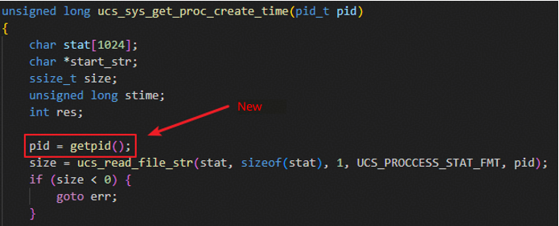

    5. Press `Esc` to exit the insert mode. Type `:wq!` and press `Enter` to save the file and exit.

    6. Open the `ucx-1.14.1/src/ucp/core/ucp_context.c` file and locate line 2156.

        ```sh
        vim ucx-1.14.1/src/ucp/core/ucp_context.c +2156
        ```

    7. Press `i` to enter the insert mode, add `#if 0` to line 2156, and add `#endif` to the end of the function.

        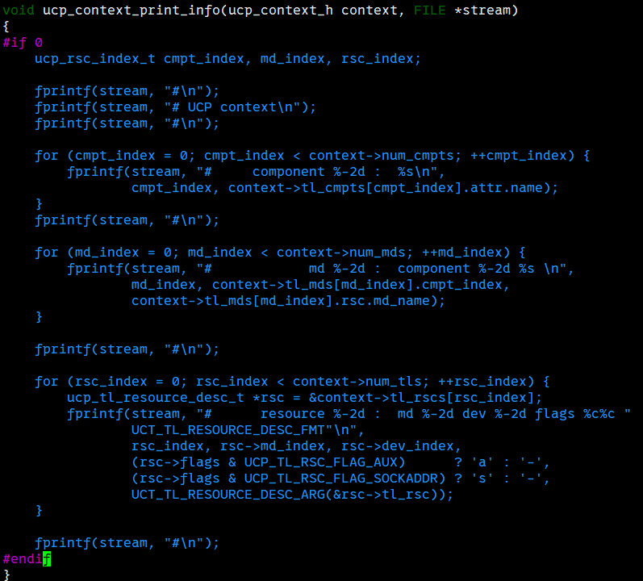

    8. Press `Esc` to exit the insert mode. Type `:wq!` and press `Enter` to save the file and exit.

    9. Open the `ucx-1.14.1/src/ucs/config/parser.c` file and locate line 1989.

        ```sh
        vim ucx-1.14.1/src/ucs/config/parser.c +1989
        ```

    10. Press `i` to enter the insert mode, add `#if 0` to line 1989, and add `#endif` to the end of the print.

        

    11. Press `Esc` to exit the insert mode. Type `:wq!` and press `Enter` to save the file and exit.
      
    12. Open the `ucx-1.14.1/src/uct/ib/base/ib_iface.c` file and locate line 735.

        ```sh
        vim ucx-1.14.1/src/uct/ib/base/ib_iface.c +735
        ```

    13. Press `i` to enter the insert mode, comment out line 735, and add the following code:

        ```c
        ah_attr->grh.flow_label = 0;
        ```

        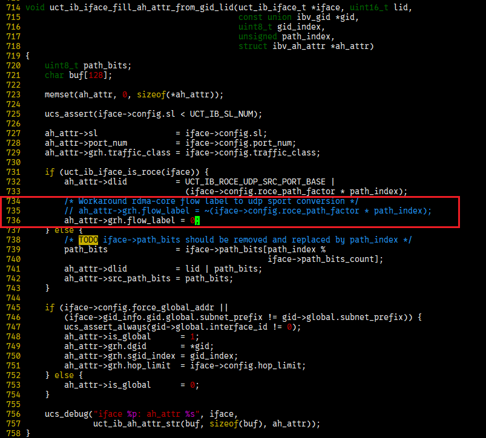

    14. Press `Esc` to exit the insert mode. Type `:wq!` and press `Enter` to save the file and exit.

    15. Package the file.

        ```sh
        rm -rf ucx-1.14.1.tar.gz
        tar zcvf ucx-1.14.1.tar.gz ucx-1.14.1
        ```

8. In the `rpmbuild` directory, compile and build the `ucx.spec` file to generate RPM packages.

    ```sh
    cd /root/rpmbuild/SPECS
    rpmbuild -bb ucx.spec
    ```

    After the build is complete, eight RPM packages are generated in the `/root/rpmbuild/RPMS/aarch64` directory, as shown in the following figure.

    

9. Copy the RPM packages to the `/home/local_rpm/` directory and install them.

    ```sh
    mkdir -p /home/local_rpm/
    cp /root/rpmbuild/RPMS/aarch64/ucx* /home/local_rpm/
    cd /home/local_rpm/
    ```

    ```sh
    rpm -ivh ucx-1.14.1-1.aarch64.rpm
    rpm -ivh ucx-cma-1.14.1-1.aarch64.rpm
    rpm -ivh ucx-debuginfo-1.14.1-1.aarch64.rpm
    rpm -ivh ucx-debugsource-1.14.1-1.aarch64.rpm
    rpm -ivh ucx-devel-1.14.1-1.aarch64.rpm
    rpm -ivh ucx-ib-1.14.1-1.aarch64.rpm
    rpm -ivh ucx-rdmacm-1.14.1-1.aarch64.rpm
    rpm -ivh ucx-static-1.14.1-1.aarch64.rpm
    ```

Compile and deploy UCX open-source software packages, including compiling and generating UCX RPM packages required for compiling Ceph.

### Compiling Ceph Packages<a name="EN-US_TOPIC_0000002551432417"></a>

#### Installing Dependencies<a name="EN-US_TOPIC_0000002520352444"></a>

Install the dependencies required for compiling Ceph in the compilation container.

1. Access the compilation container.

    ```sh
    podman exec -it openeuler2203sp4_build /bin/bash
    ```

2. Configure environment variables such as proxies in the container. You are not advised to configure the environment variables in `bashrc`.

    ```sh
    export TMOUT=0
    export http_proxy=http://xxx
    export https_proxy=http://xxx
    ```

3. Install common components.

    ```sh
    yum install CUnit-devel boost-random checkpolicy cmake cryptsetup-devel expat-devel fmt-devel fuse-devel gperf java-devel junit keyutils-libs-devel libaio-devel libbabeltrace-devel libblkid-devel libcap-ng-devel libcurl-devel numactl-devel libicu-devel libnl3-devel liboath-devel librabbitmq-devel librdkafka-devel librdmacm-devel libtool libxml2-devel lttng-ust-devel lua-devel luarocks lz4-devel make nasm ncurses-devel ninja-build nss-devel openldap-devel openssl-devel libudev-devel python3-Cython python3-devel python3-prettytable python3-pyyaml python3-setuptools python3-sphinx re2-devel selinux-policy-devel sharutils snappy-devel sqlite-devel sudo thrift-devel valgrind-devel xfsprogs-devel xmlstarlet doxygen meson python3-pyelftools libatomic gperftools-devel -y
    ```

4. Set the directory for building RPM packages.
    1. Open the `/root/.rpmmacros` file.

        ```sh
        vi /root/.rpmmacros
        ```

    2. Press `i` to enter the insert mode, set `%_topdir` to the RPM package build directory (`/root/rpmbuild` for example), and comment out other lines.

        ```sh
        %_topdir /root/rpmbuild
        ```

    3. Press `Esc` to exit the insert mode. Type `:wq!` and press `Enter` to save the file and exit.
    4. Create a build directory in the `rpmbuild` directory.

        ```sh
        rpmdev-setuptree
        ```

5. Compile the `ceph-mgr-cephadm` package.
    1. Configure Git.

        ```sh
        git config --global http.proxy http://*****
        git config --global http.sslVerify "false"
        git config --global https.proxy http://*****
        git config --global https.sslVerify "false"
        git config --global http.postBuffer 1048576000 # Increase the Git buffer size to the maximum size (1 GB) of a single Repo file.
        ```

    2. Compile the python-asyncssh dependency (python-asyncssh 2.7 is recommended).

        ```sh
        git clone https://gitee.com/src-oepkgs/python-asyncssh.git
        cp python-asyncssh/* /root/rpmbuild/SOURCES/
        cp python-asyncssh/* /root/rpmbuild/SPECS/
        rpmbuild -bb /root/rpmbuild/SPECS/python-asyncssh.spec
        ```

    3. Compile the python-natsort dependency.

        ```sh
        git clone https://gitee.com/src-openeuler/python-natsort.git
        yum install python3-coverage python3-hypothesis python3-pytest python3-pytest-cov python3-pytest-mock -y
        cp python-natsort/* /root/rpmbuild/SOURCES/
        cp python-natsort/* /root/rpmbuild/SPECS/
        rpmbuild -bb /root/rpmbuild/SPECS/python-natsort.spec
        ```

    4. Install the RPM packages.

        ```sh
        mkdir -p /home/local_rpm/
        mv /root/rpmbuild/RPMS/noarch/* /home/local_rpm/
        cd /home/local_rpm/
        yum install python-asyncssh-help-2.7.0-2.noarch.rpm python3-asyncssh-2.7.0-2.noarch.rpm python3-natsort-8.4.0-3.noarch.rpm -y
        ```

Install the dependencies required for compiling Ceph in the compilation container.

#### Compiling Ceph<a name="EN-US_TOPIC_0000002551552417"></a>

##### Enabling SPDK<a name="EN-US_TOPIC_0000002520032424"></a>

Compile the SPDK module in the compilation container to replace the default SPDK module in Ceph, thereby improving OSD performance.

1. Access the compilation container.

    ```sh
    podman exec -it openeuler2203sp4_build /bin/bash
    ```

2. In the `/home` directory, download ceph-17.2.7 source code.

    ```sh
    cd /home
    wget https://download.ceph.com/tarballs/ceph-17.2.7.tar.gz
    ```

3. In the `/home` directory, download the SPDK code from the openEuler community and compile the code.

    ```sh
    cd /home/
    git clone -b openEuler-22.03-LTS-SP4 https://gitee.com/src-openeuler/spdk.git
    cd spdk/
    rpmbuild -bp -D "_sourcedir `pwd`" -D "_builddir `pwd`" spdk.spec
    ```

4. In the `/home` directory, download the DPDK code from the openEuler community and compile the code.

    ```sh
    cd /home/
    git clone -b openEuler-22.03-LTS-SP4 https://gitee.com/src-openeuler/dpdk.git
    cd dpdk/
    rpmbuild -bp -D "_sourcedir `pwd`" -D "_builddir `pwd`" dpdk.spec
    ```

5. Replace the DPDK module in the SPDK code with the compiled DPDK module.

    ```sh
    cd /home
    rm -rf spdk/spdk-21.01.1/dpdk/
    cp -r dpdk/dpdk-21.11 spdk/spdk-21.01.1/dpdk
    ```

6. In the `/home` directory, download the ISA-L code from the openEuler community. Replace the ISA-L module in the SPDK code with the compiled ISA-L module.

    ```sh
    cd /home
    git clone -b openEuler-22.03-LTS-SP4 https://gitee.com/src-openeuler/isa-l.git
    cd isa-l
    tar -zxvf v2.30.0.tar.gz
    
    cd /home
    rm -rf spdk/spdk-21.01.1/isa-l/
    cp -r isa-l/isa-l-2.30.0/ spdk/spdk-21.01.1/isa-l
    ```

7. In the `/home` directory, download the selinux-policy code. The packaging result can be temporarily stored in `/root/rpmbuild/RPMS/noarch`.

    >  **NOTE**
    >
    > - You need to manually compile selinux-policy only when openEuler 22.03 LTS SP3 and Ceph 17.2.8 are used.
    > - Ceph 17.2.8 requires selinux-policy 35.5-22 or later. The openEuler community does not release the RPM package of this version in openEuler 22.03 LTS SP3. A manual compilation is required.
    > - If you use openEuler 22.03 LTS SP4, skip this step.
    > - If you use Ceph 17.2.7 or earlier, skip this step.

    ```sh
    cd /home
    git clone https://gitee.com/src-openeuler/selinux-policy.git
    git checkout -b 2203sp3 origin/openEuler-22.03-LTS-SP3
    cp -r selinux-policy/* /root/rpmbuild/SOURCES/
    cp selinux-policy/selinux-policy.spec /root/rpmbuild/SPECS/
    rpmbuild -bb /root/rpmbuild/SPECS/selinux-policy.spec
    ```

8. Decompress Ceph source code in the `/home` directory and move the openEuler SPDK code to the `ceph-17.2.7/src` directory.

    ```sh
    cd /home
    tar -zxvf ceph-17.2.7.tar.gz
    rm -rf ceph-17.2.7/src/spdk
    cp -r spdk/spdk-21.01.1 ceph-17.2.7/src/spdk
    ```

9. Place the `ceph-17.2.x-spdk.patch` file in the `ceph-17.2.7` directory and apply the SPDK patch.

    ```sh
    cd ceph-17.2.7
    patch -p1 < ceph-17.2.x-spdk.patch
    ```

    >  **NOTE**
    >
    > You can run the `podman cp` command to copy files from a physical machine to the container.
    >
    > ```sh
    > podman cp ./ceph-17.2.x-spdk.patch openeuler2203sp4_build:/home/ceph-17.2.7
    > ```

10. After the preceding steps are complete, compile Ceph. For details, see [Compiling Ceph](#compiling-Ceph).

Compile the SPDK module in the compilation container to replace the default SPDK module in Ceph, thereby improving OSD performance.

##### Enabling UCX<a name="EN-US_TOPIC_0000002551552419"></a>

Add the UCX module to the compilation container to improve the network communication performance of the Ceph cluster.

1. Access the compilation container.

    ```sh
    podman exec -it openeuler2203sp4_build /bin/bash
    ```

2. <a id="applying-patch"></a> After applying the SPDK patch, download `ceph-17.2.x-ucx.patch` to the `/home/ceph-17.2.7` directory and then apply the UCX patch.

    ```sh
    cd /home/ceph-17.2.7
    patch -p1 < ceph-17.2.x-ucx.patch
    ```

3. Modify code in the `EventEpoll.h` file.
    1. Open the `EventEpoll.h` file.

        ```sh
        vim src/msg/async/EventEpoll.h
        ```

    2. Press `i` to enter the insert mode and replace line 34 with the following content:

        ```c
        is_polling = cct->_conf->ms_async_op_threads_polling | cct->_conf->ms_async_ucx_event_polling;
        ```

        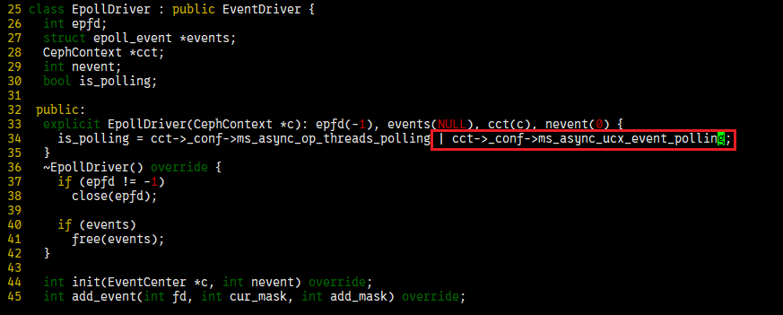

    3. Press `Esc` to exit the insert mode. Type `:wq!` and press `Enter` to save the file and exit.

4. After the preceding steps are complete, compile Ceph. For details, see [Compiling Ceph](#compiling-Ceph).

Add the UCX module to the compilation container to improve the network communication performance of the Ceph cluster.

##### Compiling Ceph<a name="EN-US_TOPIC_0000002520032422" id="compiling-Ceph"></a>

This section describes how to compile Ceph after SPDK and UCX are enabled.

1. Modify the `ceph.spec` file.

    ```sh
    sed -i 's/redhat-rpm-config/openEuler-rpm-config/g' ceph.spec
    sed -i 's#%if 0%{?fedora} || 0%{?rhel}#%if 0%{?fedora} || 0%{?rhel} || 0%{?openEuler}#' ceph.spec
    sed -i 's#%if 0%{?rhel} || 0%{?fedora}#%if 0%{?rhel} || 0%{?fedora} || 0%{?openEuler}#' ceph.spec
    sed -i 's#%if 0%{?fedora} || 0%{?suse_version} > 1500 || 0%{?rhel} == 9 || 0%{?openEuler}#%if 0%{?fedora} || 0%{?suse_version} > 1500 || 0%{?rhel} == 9#' ceph.spec
    sed -i '1a\%define _binaries_in_noarch_packages_terminate_build 0' ceph.spec
    sed -i '2a\%define _unpackaged_files_terminate_build 0' ceph.spec
    ```

    >  **NOTE**
    >
    > 1. In Ceph 17.2.8, OSDs occasionally restart. For details, see [How Can I Rectify an Error Reported When Ceph 17.2.8 Is Running Continuously?](#error-reported-during-continuous-running)
    > 2. If the Ceph source code `src/osd/SnapMapper.cc` conflicts with the fmt package version, a compilation error will be reported. In this case, comment out the code lines related to `fmt::format` in the `src/osd/SnapMapper.cc` file and recompile the code. Four modifications are involved:
    >    - Lines 233 to 234
    >    - Lines 272 to 275
    >    - Lines 321 to 324
    >    - Lines 327 to 329
    >
    >    ```c
    >        228 tl::expected<SnapMapper::object_snaps, Scrub::SnapMapReaderI::result_t>
    >        229 SnapMapper::get_snaps_common(const hobject_t &oid) const
    >        230 {
    >        231   ceph_assert(check(oid));
    >        232   set<string> keys{to_object_key(oid)};
    >        233 //  dout(20) << fmt::format("{}: key string: {} oid:{}", __func__, keys, oid)
    >        234 //         << dendl;
    >        235
    >        236   map<string, ceph::buffer::list> got;
    >    ...
    >        264 std::set<std::string> SnapMapper::to_raw_keys(
    >        265   const hobject_t &clone,
    >        266   const std::set<snapid_t> &snaps) const
    >        267 {
    >        268   std::set<std::string> keys;
    >        269   for (auto snap : snaps) {
    >        270     keys.insert(to_raw_key(snap, clone));
    >        271   }
    >        272 //  dout(20) << fmt::format(
    >        273 //              "{}: clone:{} snaps:{} -> keys: {}", __func__, clone, snaps,
    >        274 //              keys)
    >        275 //         << dendl;
    >        276   return keys;
    >        277 }
    >    ...
    >        305   std::set<snapid_t> snaps_from_mapping;
    >        306   for (auto &[k, v] : kvmap) {
    >        307     dout(20) << __func__ << " " << hoid << " " << k << dendl;
    >        308     // extract the object ID from the value fetched for an SNA mapping key
    >        309     auto [sn, obj] = SnapMapper::from_raw(v);
    >        310     if (obj != hoid) {
    >        311       dout(1) << fmt::format(
    >        312                    "{}: unexpected object ID {} for key{} (expected {})",
    >        313                    __func__, obj, k, hoid)
    >        314               << dendl;
    >        315       return tl::unexpected(result_t{code_t::inconsistent});
    >        316     }
    >        317     snaps_from_mapping.insert(sn);
    >        318   }
    >        319
    >        320   if (snaps_from_mapping != *obj_snaps) {
    >        321 //    dout(10) << fmt::format(
    >        322 //                "{}: hoid:{} -> mapper internal inconsistency ({} vs {})",
    >        323 //                __func__, hoid, *obj_snaps, snaps_from_mapping)
    >        324 //           << dendl;
    >        325     return tl::unexpected(result_t{code_t::inconsistent});
    >        326   }
    >        327  // dout(10) << fmt::format(
    >        328 //              "{}: snaps for {}: {}", __func__, hoid, snaps_from_mapping)
    >        329 //         << dendl;
    >        330   return obj_snaps;
    >        331 }
    >    ```
    >
    >    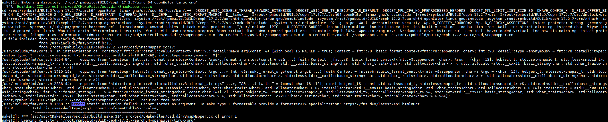
    
2. Compile Ceph.

    ```sh
    cd ..
    tar cvf ceph-17.2.7.tar.bz2 ceph-17.2.7/
    cp ceph-17.2.7/ceph.spec /root/rpmbuild/SPECS/
    cp ceph-17.2.7.tar.bz2 /root/rpmbuild/SOURCES/
    rpmbuild -bb /root/rpmbuild/SPECS/ceph.spec
    ```

    >  **NOTE**
    >
    > During Ceph compilation, you need to configure a network proxy so that the compilation container can access the Internet. For details, see [Preparing the Compilation Environment](#building-a-compilation-container-and-a-deployment-container-on-the-compilation-node).

3. Copy generated Ceph packages.

    ```sh
    mv /root/rpmbuild/RPMS/aarch64 /home/local_rpm/
    mv /root/rpmbuild/RPMS/noarch /home/local_rpm/
    ```

4. On the physical machine, import the RPM packages to the deployment container.

    ```sh
    podman cp openeuler2203sp4_build:/home/local_rpm openeuler2203sp4_release:/home/
    ```

    >  **NOTE**
    >
    > The packages imported to the deployment container are all the packages involved in [Compiling Ceph](#compiling-Ceph), including python-asyncssh, python3-natsort, UCX packages, and Ceph packages.

This section describes how to compile Ceph after SPDK and UCX are enabled.

#### Creating a Deployment Image<a name="EN-US_TOPIC_0000002551432419" id="skip_001"></a>

Install each RPM package in the deployment container to create an image with the minimum specifications.

1. Access the deployment container.

    ```sh
    podman exec -it openeuler2203sp4_release /bin/bash
    ```

2. Install the UCX packages.

    ```sh
    cd /home/local_rpm
    yum install ucx-1.14.1-1.aarch64.rpm ucx-cma-1.14.1-1.aarch64.rpm ucx-debuginfo-1.14.1-1.aarch64.rpm ucx-debugsource-1.14.1-1.aarch64.rpm ucx-devel-1.14.1-1.aarch64.rpm ucx-ib-1.14.1-1.aarch64.rpm ucx-rdmacm-1.14.1-1.aarch64.rpm ucx-static-1.14.1-1.aarch64.rpm -y
    ```

    >  **NOTE**
    >
    > Skip this step if only SPDK is required.

3. Install the Ceph dependencies.

    ```sh
    yum install python-asyncssh-help-2.7.0-2.noarch.rpm python3-asyncssh-2.7.0-2.noarch.rpm python3-natsort-8.4.0-3.noarch.rpm -y
    pip3 install kubernetes==18.20.0
    pip install pycryptodome==3.19.1
    ```

    >  **NOTE**
    >
    > - To prevent deployment failures caused by earlier versions of the third-party Python library pycryptodome, you are advised to upgrade it as follows:
    >
    >    ```sh
    >    pip install pycryptodome==3.19.1
    >    ```
    >
    > - To prevent the `No module named 'kubernetes.client.models.v1_event` error during MGR deployment, you need to install a dependency as follows:
    >
    >    ```sh
    >    pip3 install kubernetes==18.20.0
    >    ```

4. If Ceph 17.2.8 and openEuler 22.03 LTS SP3 are used, install the selinux-policy dependency before installing Ceph.

    >  **NOTE**
    >
    > - For details about how to obtain the dependency, see [Enabling SPDK](#enabling-spdk).
    > - When deploying Ceph 17.2.7, you need to install selinux-policy for openEuler 22.03 LTS SP3 and earlier versions. If the OS version is openEuler 22.03 LTS SP4, skip this step.

    ```sh
    yum install noarch/selinux-policy-35.5-23.noarch.rpm noarch/selinux-policy-devel-35.5-23.noarch.rpm noarch/selinux-policy-help-35.5-23.noarch.rpm noarch/selinux-policy-minimum-35.5-23.noarch.rpm noarch/selinux-policy-mls-35.5-23.noarch.rpm noarch/selinux-policy-sandbox-35.5-23.noarch.rpm noarch/selinux-policy-targeted-35.5-23.noarch.rpm -y
    ```

5. Install Ceph.

    ```sh
    yum install aarch64/ceph-17.2.7-0.aarch64.rpm aarch64/ceph-base-17.2.7-0.aarch64.rpm aarch64/ceph-common-17.2.7-0.aarch64.rpm aarch64/ceph-debugsource-17.2.7-0.aarch64.rpm aarch64/ceph-exporter-17.2.7-0.aarch64.rpm aarch64/ceph-fuse-17.2.7-0.aarch64.rpm aarch64/ceph-immutable-object-cache-17.2.7-0.aarch64.rpm aarch64/ceph-mds-17.2.7-0.aarch64.rpm aarch64/ceph-mgr-17.2.7-0.aarch64.rpm aarch64/ceph-mon-17.2.7-0.aarch64.rpm aarch64/ceph-osd-17.2.7-0.aarch64.rpm aarch64/ceph-radosgw-17.2.7-0.aarch64.rpm aarch64/ceph-selinux-17.2.7-0.aarch64.rpm aarch64/ceph-test-17.2.7-0.aarch64.rpm aarch64/cephfs-java-17.2.7-0.aarch64.rpm aarch64/cephfs-mirror-17.2.7-0.aarch64.rpm aarch64/libcephfs-devel-17.2.7-0.aarch64.rpm aarch64/libcephfs2-17.2.7-0.aarch64.rpm aarch64/libcephfs_jni-devel-17.2.7-0.aarch64.rpm aarch64/libcephfs_jni1-17.2.7-0.aarch64.rpm aarch64/libcephsqlite-17.2.7-0.aarch64.rpm aarch64/libcephsqlite-devel-17.2.7-0.aarch64.rpm aarch64/librados-devel-17.2.7-0.aarch64.rpm aarch64/librados2-17.2.7-0.aarch64.rpm aarch64/libradospp-devel-17.2.7-0.aarch64.rpm aarch64/libradosstriper-devel-17.2.7-0.aarch64.rpm aarch64/libradosstriper1-17.2.7-0.aarch64.rpm aarch64/librbd-devel-17.2.7-0.aarch64.rpm aarch64/librbd1-17.2.7-0.aarch64.rpm aarch64/librgw-devel-17.2.7-0.aarch64.rpm aarch64/librgw2-17.2.7-0.aarch64.rpm aarch64/python3-ceph-argparse-17.2.7-0.aarch64.rpm aarch64/python3-ceph-common-17.2.7-0.aarch64.rpm aarch64/python3-cephfs-17.2.7-0.aarch64.rpm aarch64/python3-rados-17.2.7-0.aarch64.rpm aarch64/python3-rbd-17.2.7-0.aarch64.rpm aarch64/python3-rgw-17.2.7-0.aarch64.rpm aarch64/rados-objclass-devel-17.2.7-0.aarch64.rpm aarch64/rbd-fuse-17.2.7-0.aarch64.rpm aarch64/rbd-mirror-17.2.7-0.aarch64.rpm aarch64/rbd-nbd-17.2.7-0.aarch64.rpm noarch/ceph-grafana-dashboards-17.2.7-0.noarch.rpm noarch/ceph-mgr-cephadm-17.2.7-0.noarch.rpm noarch/ceph-mgr-dashboard-17.2.7-0.noarch.rpm noarch/ceph-mgr-diskprediction-local-17.2.7-0.noarch.rpm noarch/ceph-mgr-k8sevents-17.2.7-0.noarch.rpm noarch/ceph-mgr-modules-core-17.2.7-0.noarch.rpm noarch/ceph-mgr-rook-17.2.7-0.noarch.rpm noarch/ceph-prometheus-alerts-17.2.7-0.noarch.rpm noarch/ceph-resource-agents-17.2.7-0.noarch.rpm noarch/ceph-volume-17.2.7-0.noarch.rpm noarch/cephadm-17.2.7-0.noarch.rpm noarch/cephfs-top-17.2.7-0.noarch.rpm -y
    
    yum install chrony haproxy keepalived -y
    ```

6. Install the closed source KSAL package.

    ```sh
    cd /home
    unzip BoostKit-KSAL_1.10.0.zip
    rpm -ivh libksal-release-1.10.0.oe1.aarch64.rpm
    ```

    >  **NOTE**
    >
    > To obtain the KSAL software package, see [Obtaining Software Packages](#obtaining-software-packages). You are advised to upload the package to the `/home` directory.

7. SPDK requires user-mode huge pages. Privilege escalation is required for ceph-osd.

    ```sh
    setcap 'CAP_DAC_OVERRIDE+eip CAP_SYS_ADMIN+eip' /usr/bin/ceph-osd
    ```

8. Modify the Ceph user login configuration.
    1. Open the `/etc/passwd` file.

        ```sh
        vim /etc/passwd
        ```

    2. Press `i` to enter the insert mode and change the Ceph login shell to `/bin/bash`.

        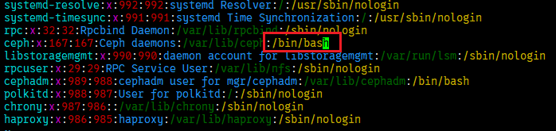

    3. Press `Esc` to exit the insert mode. Type `:wq!` and press `Enter` to save the file and exit.

9. Configure user resource limits (required for enabling UCX).
    1. Open the `limits.conf` file:

        ```sh
        vim /etc/security/limits.conf
        ```

    2. Press `i` to enter the insert mode and add the following content to the end of the file:

        ```conf
        * soft nofile 1048576
        * hard nofile 1048576
        * soft nproc unlimited
        * hard nproc unlimited
        * soft memlock unlimited
        * hard memlock unlimited
        ```

    3. Press `Esc` to exit the insert mode. Type `:wq!` and press `Enter` to save the file and exit.

10. <a id="li634218914416"></a>Commit the container as an image on the physical machine.

    ```sh
    podman commit 688247c8b260 [IP]:5000/ceph/ceph_release:v17.2.7
    ```

    >  **NOTE**
    >
    > - `688247c8b260` is the ID of the `openeuler2203sp4_release` container. You can run the `podman ps` command to obtain the container ID.
    > - `[IP]` indicates the actual IP address of the local host.
    > - Before committing the container, remove installed RPM packages from the `/home` directory to reduce the image size.

11. Export the deployment image.

    ```sh
    podman save -o ceph_release.tar a6e8aff2def8
    ```

    >  **NOTE**
    >
    > `a6e8aff2def8` is the ID of the image committed in [10](#li634218914416). You can run `podman images` to obtain the image ID.

Install each RPM package in the deployment container to create an image with the minimum specifications.

## Deploying Ceph on a Physical Machine<a name="EN-US_TOPIC_0000002520352438"></a>

### Configuring the Local Repository and Image<a name="EN-US_TOPIC_0000002551432423"></a>

To start the Ceph cluster, the image needs to be dynamically pulled from the remote repository. To facilitate the normal startup of the cluster on the LAN, you need to configure a local image repository and import the created deployment image. Perform operations in this section on the physical machine of `ceph1`.

1. <a id="en-us_topic_0000001204870207_li1754643514419"></a> Pull `registry:2` to the local repository.

    ```sh
    podman pull docker.io/library/registry:2
    ```

    > **NOTE**
    >
    > - If you cannot access the Internet, run the following commands or manually download the package and import it to the current node.
    >
    >    ```sh
    >    git config --global http.sslVerify false
    >    git config --global https.sslVerify false
    >    git clone https://github.com/NotGlop/docker-drag.git
    >    ```
    >
    > - Start the local image repository.
    >
    >    ```sh
    >    podman load -i registry_2.tar
    >    ```
    >
    > - If the image cannot be pulled when a proxy is used to access the Internet, check the proxy setting. Podman depends on the environment variables `HTTP_PROXY` and `HTTPS_PROXY` for Internet access.

2. Modify the container configuration file `/etc/containers/registries.conf`.

    ```ini
    unqualified-search-registries = ["[IP]:5000", "quay.io"]
    short-name-mode="enforcing"
    [[registry]]
    location = "[IP]:5000"
    insecure = true
    ```

    >  **NOTE**
    >
    > Replace `[IP]` with the actual public network IP address of the current node.

3. Modify the local repository settings.

    ```sh
    mkdir -p /home/registry-data
    podman run -d -p 5000:5000 -v /home/registry-data:/var/lib/registry --restart always --name registry docker.io/library/registry:2
    ```

    >  **NOTE**
    >
    > `docker.io/library/registry` is the image name used by the image repository configured in [1](#en-us_topic_0000001204870207_li1754643514419). You can run `podman images` to check.

4. Import the Ceph deployment image generated in [Creating a Deployment Image](#skip_001).

    ```sh
    podman load -i ceph_release.tar
    ```

5. Rename the image and upload it to the local repository.

    ```sh
    podman tag 8bbba7d5cc80 [IP]:5000/ceph/ceph_release:v17.2.7
    podman push [IP]:5000/ceph/ceph_release:v17.2.7 [IP]:5000/ceph/ceph_release:v17.2.7
    podman rmi 8bbba7d5cc80
    ```

    >  **NOTE**
    >
    > - `8bbba7d5cc80` indicates the image ID corresponding to `ceph_release.tar`, and `[IP]` indicates the local IP address. Replace them with the actual values.
    > - If the `Gateway Time-out` error is reported during the push, check whether any proxy is configured. If yes, run the following commands to disable proxy configurations:
    >
    >    ```sh
    >    unset http_proxy
    >    unset https_proxy
    >    ```
    >
    > - After the image is pushed to the local repository, its tag may conflict with that of a package in the local repository. You need to delete the local Ceph image.

6. Modify `DEFAULT_IMAGE` in the `cephadm` file.
    1. Open the `/usr/sbin/cephadm` file.

        ```sh
        vim /usr/sbin/cephadm
        ```

    2. Press `i` to enter the insert mode and modify `DEFAULT_IMAGE` as follows:

        ```sh
        DEFAULT_IMAGE = "[IP]:5000/ceph/ceph_release:v17.2.7"
        ```

        > **NOTE**
        >Replace `[IP]` with the IP address of the current image repository.

    3. Press `Esc` to exit the insert mode. Type `:wq!` and press `Enter` to save the file and exit.

7. Modify the container creation permission in `cephadm`.

    ```sh
    Change if self.privileged to if self.privileged or not self.privileged
    ```

    

    >  **NOTE**
    >
    > - The `/usr/sbin/cephadm` file must have the SPDK patch applied in its source code.
    > - The line to be modified is in the `run_cmd` function.
    > - If you have [applied ceph-17.2.x-ucx.patch](#applying-patch), skip this step.

8. Copy the `ceph-17.2.7/src/cephadm/cephadm` file applied with the SPDK patch from the compilation container on the compilation node to the `/usr/sbin/` directory on physical machines of `ceph1`, `ceph2`, `ceph3`, `client1`, `client2`, and `client3`.

To start the Ceph cluster, the image needs to be dynamically pulled from the remote repository. To facilitate the normal startup of the cluster on the LAN, you need to configure a local image repository and import the created deployment image. Perform operations in this section on the physical machine of `ceph1`.

### Deploying Ceph<a name="EN-US_TOPIC_0000002551552411"></a>

#### Configuring the Environment<a name="EN-US_TOPIC_0000002520032416"></a>

This section uses three servers and three clients as an example.

1. Set the host name on each node.

    ```sh
    hostnamectl set-hostname ceph1
    hostnamectl set-hostname ceph2
    hostnamectl set-hostname ceph3
    hostnamectl set-hostname client1
    hostnamectl set-hostname client2
    hostnamectl set-hostname client3
    ```

2. Configure machine name resolution on `ceph1` to `ceph3`.
    1. Run the following command to open the file:

        ```sh
        vim /etc/hosts
        ```

    2. Press `i` to enter the insert mode and add the following content to the file:

        ```sh
        192.168.3.166 ceph1
        192.168.3.167 ceph2
        192.168.3.168 ceph3
        192.168.3.160 client1
        192.168.3.161 client2
        192.168.3.162 client3
        ```

        >  **NOTE**
        >
        > - The example IP addresses are those planned in [environment networking](#environment-requirements). Replace them with the actual ones. You can run the `ip a` command to obtain the actual IP addresses.
        > - In this document, the cluster consists of three server nodes and three client nodes. Modify the commands based on the actual number of nodes.

    3. Press `Esc` to exit the insert mode. Type `:wq!` and press `Enter` to save the file and exit.

3. Run the following commands on `ceph1`, `ceph2`, and `ceph3` respectively to configure password-free login:

    ```sh
    ssh-keygen -t rsa 
    for i in {1..3};do ssh-copy-id ceph$i;done
    ```

4. Disable the firewall.

    ```sh
    systemctl stop firewalld
    systemctl disable firewalld
    systemctl status firewalld
    ```

    >  **NOTE**
    >
    > - Disable the firewall only in a trusted intranet or offline test environment.
    > - In the production environment, the firewall must be enabled and required ports must be precisely allowed. For example, the MON port is 6789, and the OSD port ranges from 6800 to 7300.

5. Disable SELinux.

    ```sh
    setenforce 0
    sed -i 's/=permissive/=disabled/g' /etc/selinux/config
    ```

    >  **NOTE**
    >
    > - Disabling SELinux will invalidate the MAC mechanism of the system. You are advised to disable SELinux only in the test environment.
    > - In the production environment, the enforcing mode must be retained, and the audit2allow tool must be used to generate custom policies that adapt to services.

6. Configure clock synchronization on `ceph1`, `ceph2`, and `ceph3`.
    1. Install the chrony service.

        ```sh
        dnf install -y chrony
        ```

    2. Back up the configuration file.

        ```sh
        mv /etc/chrony.conf /etc/chrony.conf.bak
        ```

    3. Modify the configuration file.

        ```sh
        cat > /etc/chrony.conf <<EOF
        server [IP1] iburst
        allow [IP/MASK]
        local stratum 10
        EOF
        ```

        >  **NOTE**
        >
        > - `[IP1]` indicates the IP address or domain name of the server that provides the clock service on the network, for example, 192.168.3.166.
        > - `[IP/MASK]` indicates the IP address range of the local network, for example, 192.168.1.0/24. Only devices within this subnet can synchronize the clock with the server.

    4. Restart chronyd.

        ```sh
        systemctl restart chronyd
        systemctl enable chronyd
        ```

    5. Check the time synchronization status.

        ```sh
        chronyc -a makestep   # Forcibly synchronize the system time.
        chronyc sourcestats   # Display the synchronization statistics of the current time source.
        chronyc sources -v    # Display details about the current time source.
        ```

This section uses three servers and three clients as an example.

#### Booting the New Cluster on ceph1<a name="EN-US_TOPIC_0000002551552415"></a>

Create a cluster configuration file on `ceph1` to boot a Ceph container cluster. The cluster will manage all nodes.

1. Create a default configuration file `ceph.conf`.
    1. Return to the `home` directory and open the `ceph.conf` file.

        ```sh
        cd /home
        vim ceph.conf
        ```

    2. Press `i` to enter the insert mode and add the following content to the file:

        ```ini
        [global]
        mon_allow_pool_delete = true
        osd_pool_default_size = 3
        osd_pool_default_min_size = 2
        
        osd_pg_object_context_cache_count = 256
        
        bluestore_kv_sync_thread_polling = true
        bluestore_kv_finalize_thread_polling = true
        
        osd_min_pg_log_entries = 10
        osd_max_pg_log_entries = 10
        osd_pool_default_pg_autoscale_mode = off
        
        bluestore_cache_size_ssd = 18G
        
        osd_memory_target = 20G # Limits the OSD memory.
        
        bluestore_block_db_path = ""
        bluestore_block_db_size = 0
        bluestore_block_wal_path = ""
        bluestore_block_wal_size = 0
        
        bluestore_rocksdb_options = use_direct_reads=true,use_direct_io_for_flush_and_compaction=true,compression=kNoCompression,max_write_buffer_number=128,min_write_buffer_number_to_merge=32,recycle_log_file_num=64,compaction_style=kCompactionStyleLevel,write_buffer_size=4M,target_file_size_base=4M,max_background_compactions=2,level0_file_num_compaction_trigger=64,level0_slowdown_writes_trigger=128,level0_stop_writes_trigger=256,max_bytes_for_level_base=6GB,compaction_threads=2,max_bytes_for_level_multiplier=8,flusher_threads=2
        ```

        >  **NOTE**
        >
        > For more information about Ceph tuning configuration and configuration description, see "Ceph Tuning" in [Ceph Object Storage Tuning Guide](https://www.hikunpeng.com/document/detail/en/kunpengsdss/ecosystemEnable/Ceph/kunpengcephobject_05_0012.html).

    3. Press `Esc` to exit the insert mode. Type `:wq!` and press `Enter` to save the file and exit.

2. Boot a Ceph cluster.

    ```sh
    cephadm bootstrap -c ceph.conf --mon-ip 192.168.3.166 --cluster-network 192.168.4.0/24 --skip-monitoring-stack
    ```

    >  **NOTE**
    >
    > - --`mon-ip`: IP address of the frontend public network
    > - --`cluster-network`: IP address of the backend cluster network
    > - -`c ceph.conf`: (Optional) It can be used to change the default Ceph configuration.

    

3. Copy the public key to other nodes.

    ```sh
    ssh-copy-id -f -i /etc/ceph/ceph.pub root@ceph2
    ssh-copy-id -f -i /etc/ceph/ceph.pub root@ceph3
    ```

4. Synchronize the local repository configuration to other nodes.

    ```sh
    scp /etc/containers/registries.conf ceph2:/etc/containers/
    scp /etc/containers/registries.conf ceph3:/etc/containers/
    ```

5. Access the Ceph cluster container.

    ```sh
    cephadm shell
    ```

6. Add the other two host nodes to the cluster.

    ```sh
    ceph orch host add ceph2 --labels _admin
    ceph orch host add ceph3 --labels _admin
    ```

    >  **NOTE**
    >
    > It takes 3 to 5 minutes for the Ceph cluster on `ceph2` and `ceph3` to start after the commands are executed.

7. Check whether the hosts are added.

    ```sh
    ceph orch host ls
    ```

    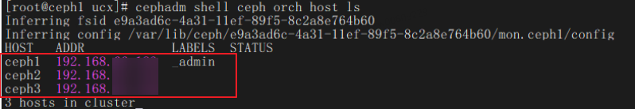

8. Check the cluster status and ensure that the other two nodes are added to the cluster.

    ```sh
    ceph -s
    ```

    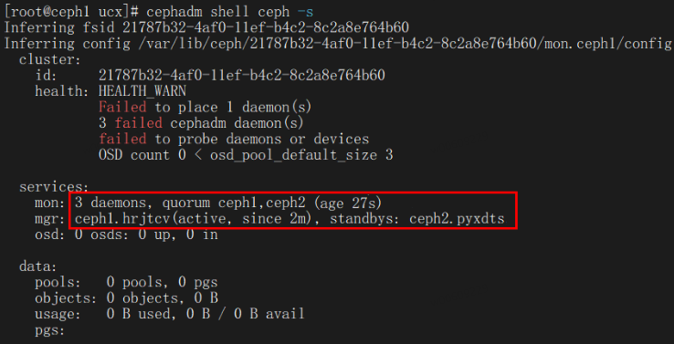

#### Switching to UCX Networking for a Cluster<a name="EN-US_TOPIC_0000002551432425"></a>

Before enabling UCX, you need to configure UCX parameters and modify the configuration files of all nodes. If only SPDK is enabled, skip this section.

1. Access the Ceph cluster container.

    ```sh
    cephadm shell
    ```

2. Configure UCX parameters.

    ```sh
    ceph config set global ms_type async+ucx
    ceph config set global ms_public_type async+ucx
    ceph config set global ms_cluster_type async+ucx
    ceph config set global ms_async_ucx_device mlx5_bond_0:1,mlx5_bond_1:1
    ceph config set global ms_async_ucx_tls rc_verbs
    ceph config set global ms_async_ucx_event_polling true
    ```

3. Exit the container and add the following configurations to the MON configuration file on the physical machine of each server node (`ceph1` to `ceph3`):

    ```sh
    vim /var/lib/ceph/[fsid]/mon*/config
    ```

    ```ini
    ms_type = async+ucx
    ms_public_type = async+ucx
    ms_cluster_type = async+ucx
    ms_async_ucx_device = mlx5_bond_0:1,mlx5_bond_1:1
    ms_async_ucx_tls = rc_verbs
    ms_async_ucx_event_polling = true
    ```

    

    >  **NOTE**
    >
    > - You can run the `show_gids` command to obtain device names and configure multiple network devices in `ms_async_ucx_device`. The selected device(s) must contain the public network IP address and cluster network IP address configured for the node. If the command is not supported, update the NIC firmware and driver. For details, see [Updating the NIC Firmware and Driver](#updating-the-NIC-firmware-and-driver).
    > - `[fsid]` indicates the Ceph cluster FSID. You can run the `cephadm ls` command to obtain.
    > - Ensure that the RDMA network device names of server nodes are the same. Otherwise, OSD nodes cannot be started. You can use tools such as `/usr/lib/udev/rdma_rename` to rename RDMA network devices. The RDMA network device names of client nodes do not need to be the same.
    > - The IP addresses of `cluster_network` and `public_network` must be the same as those of the UCX devices (RoCE/IB interfaces).
    > - If `ms_async_ucx_event_polling` is set to `true`, event polling is enabled. This reduces latency, improves cluster throughput, and optimizes concurrency. However, the CPU usage increases. In some scenarios where no event is generated, resources are wasted and the system debugging complexity increases. You can toggle this function as required.

4. Synchronize the MON modification to MGRs and OSDs on all nodes.

    ```sh
    ls /var/lib/ceph/*/*/config|grep 'osd\|mgr\|crash'|xargs -I {} cp -r /var/lib/ceph/*/mon.*/config {}
    ```

5. Modify the `service` file on each node.

    ```sh
    sed -i 's/on-failure/always/g' /etc/systemd/system/ceph-*\@.service
    sed -i 's/30min/1min/g' /etc/systemd/system/ceph-*\@.service
    sed -i '/StartLimitBurst=/c\StartLimitBurst=20' /etc/systemd/system/ceph-*\@.service
    ```

6. Restart the Ceph cluster on each node.

    ```sh
    systemctl daemon-reload
    systemctl restart ceph.target
    ```

7. After all containers are started, enter the Ceph cluster container again to check the cluster status.

    ```sh
    cephadm shell
    ceph -s
    ```

Before enabling UCX, you need to configure UCX parameters and modify the configuration files of all nodes. If only SPDK is enabled, skip this section.

#### Adding OSDs<a name="EN-US_TOPIC_0000002520352432"></a>

OSD is a Ceph cluster data management service. To add an OSD on a drive, the following conditions must be met.

> **Prerequisites<a name="section20395642181910"></a>**
>
>- The `root` user is used for deploying Ceph.
>- To enable SPDK, you need to disable the IOMMU feature (SMMU in Arm).
>    1. Restart the server to access the BIOS screen. For details, see "Accessing the BIOS" in [TaiShan Server BIOS Parameter Reference (Kunpeng 920 Processor)](https://support.huawei.com/enterprise/en/doc/EDOC1100088647/77ba4819/accessing-the-bios).
>    2. On the BIOS screen, choose `Advanced` > `MISC Config` > `Support Smmu` to access the SMMU configuration screen.
>
>        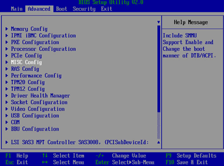
> 
>    3. Set `Support Smmu` to `Disabled` and press `F10` to save the configuration and exit. (The configuration is permanently valid.)
>        
>        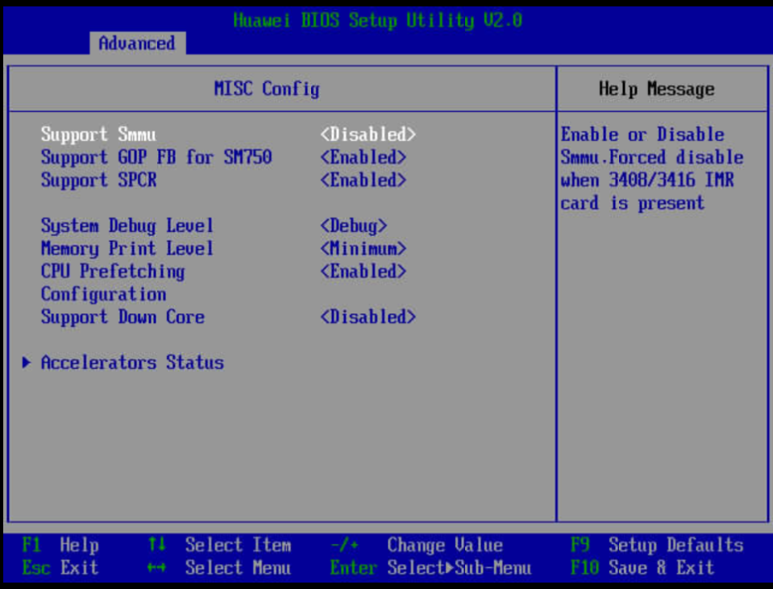
>
>- The deployment must be performed on all physical machines of server nodes.
>- The drive must have no partition.
>- The drive must have no LVM status.
>- The drive cannot contain a file system.
>- The drive cannot contain Ceph BlueStore OSDs.
>- The drive size must be greater than 5 GB.

1. Change the huge page size.

    >  **NOTE**
    >
    > To deploy SPDK, the OS must support huge pages. If the huge page size is not 2 MB, perform the following operations to change the size.

    1. Open the `/boot/efi/EFI/openEuler/grub.cfg` file.

        ```sh
        vim /boot/efi/EFI/openEuler/grub.cfg
        ```

    2. Press `i` to enter the insert mode, find the kernel startup parameter, and add `default_hugepagesz=2M hugepagesz=2M hugepages=1024`.

    3. Press `Esc` to exit the insert mode. Type `:wq!` and press `Enter` to save the file and exit.

2. <a id="li27684565510"></a>Configure the number of huge pages.

    ```sh
    echo 20480 > /sys/devices/system/node/node0/hugepages/hugepages-2048kB/nr_hugepages
    ```

3. <a id="li11112652145119"></a>Switch the NVMe SSD to the user-mode driver.

    ```sh
    cephadm shell -v /lib/modules:/lib/modules -e DRIVER_OVERRIDE=uio_pci_generic sh /var/lib/ceph/spdk_lib/scripts/setup.sh
    ```

4. Write the commands in [2](#li27684565510) and [3](#li11112652145119) to `/etc/rc.d/rc.local` for persistent storage. The commands automatically start upon system startup.

    ```sh
    vim /etc/rc.d/rc.local
    chmod +x /etc/rc.d/rc.local
    ```

    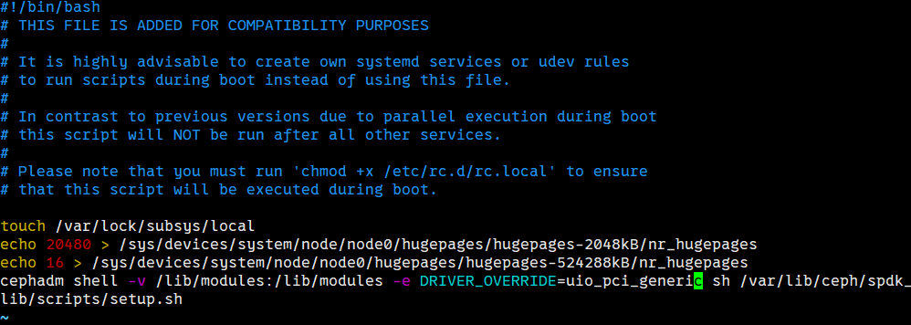

5. <a id="en-us_topic_0000001173276984_en-us_topic_0266583442_en-us_topic_0266851355_li10464154919390"></a>Check the available disks in the system.

    ```sh
    cephadm shell sh /var/lib/ceph/spdk_lib/scripts/setup.sh status
    ```

    

6. Disables automatic OSD memory adjustment.

    ```sh
    cephadm shell ceph config set osd osd_memory_target_autotune false
    ```

7. Add OSDs. (Each node is allowed to start its own OSDs only.)
    - Method 1: Specify only BDFs.

        ```sh
        # Creates an OSD.
        cephadm spdkosd --bstr 0000:82:00.0;0000:83:00.0;0000:84:00.0 init
        
        # Start the daemon process.
        cephadm spdkosd deploy
        ```

    - Method 2: Use the configuration file.

        >  **NOTE**
        >
        > You can use the .yaml configuration file to start a service for deploying OSDs. This mode has the following advantages:
        > - You can specify devices.
        > - You can specify OSD IDs.

        1. Create an `osd.yaml` file and add the following content to the file to specify available devices.
            1. Open the `osd.yaml` file.

                ```sh
                vi osd.yaml
                ```

            2. Press `i` to enter the insert mode and add the following content:

                ```yaml
                - osd_id: 0 # osd_id
                  bdfs: "0000:82:00.0" 
                - osd_id: 1
                  bdfs: "0000:83:00.0"
                - osd_id: 2
                  bdfs: "0000:84:00.0"
                ```

                >  **NOTE**
                >
                > - `osd_id`: OSD service ID. The value must be unique in the cluster.
                > - Devices specified by the `bdfs` field must be taken over by the uio driver. Run the command in [5](#en-us_topic_0000001173276984_en-us_topic_0266583442_en-us_topic_0266851355_li10464154919390) to check whether the driver of the NVMe device is uio\_pci\_generic. If not, the device is not taken over by the uio driver. In this case, run the command in [3](#li11112652145119) to switch the driver.

            3. Press `Esc` to exit the insert mode. Type `:wq!` and press `Enter` to save the file and exit.

        2. Start OSDs.

            ```sh
            cephadm spdkosd --b osd.yaml create
            
            # # Other startup methods:
            cephadm spdkosd create  # Automatically selects available devices and OSD IDs, and uses the default configuration to create and start OSDs.
            cephadm spdkosd --b osd.yaml --c osd.conf create # Specifies required devices and configurations for creating and starting OSDs.
            
            # # Startup parameter description
            -vv: specifies whether to save detailed OSD logs to a file when Podman starts the daemon process. The default setting is False.
            Example command for enabling this function: cephadm spdkosd -vv create
            ```

            >  **NOTE**
            >
            > - The `/mnt/osd_xx` directory is used to mount huge pages to enable SPDK. After the `/mnt` directory is mounted with an image, its permission may change to read-only. Verify that this directory on the physical machines has the write permission.
            > - This command must be executed on `ceph1` to `ceph3` in sequence.

8. Change the upper limit of the OSD memory of `ceph1`, `ceph2`, and `ceph3` to 20 GB.

    ```sh
    cephadm shell ceph config set osd/host:ceph1 osd_memory_target 20G
    cephadm shell ceph config set osd/host:ceph2 osd_memory_target 20G
    cephadm shell ceph config set osd/host:ceph3 osd_memory_target 20G
    ```

9. Check the cluster status.

    ```sh
    cephadm shell
    ceph -s
    ```

    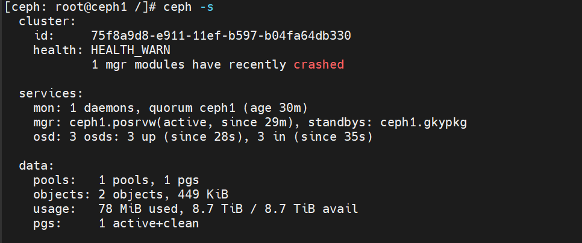

    ```sh
    ceph orch ps
    ```

    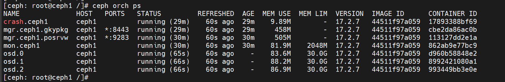

#### Deploying the Client<a name="EN-US_TOPIC_0000002520032434"></a>

Ceph client deployment enables storage access between the client nodes and the Ceph cluster so that users or applications can read data from or write data to the cluster. This section describes how to perform container-based client deployment.

1. Start a container on a client node.

    ```sh
    podman load -i ceph_release.tar
    podman tag [IMAGE_ID] localhost/ceph_release:v17.2.7
    podman run --name client1 --hostname client1 --privileged --net=host --ipc=host -dti localhost/ceph_release:v17.2.7 /usr/sbin/init
    ```

    >  **NOTE**
    >
    > Replace `[IMAGE_ID]` with the actual image ID. You can run the `podman images` command to obtain.

2. Synchronize the configuration file from the server to the client.

    ```sh
    mkdir -p /etc/ceph
    scp -r ceph1:/etc/ceph/ceph.conf /etc/ceph/
    scp -r ceph1:/etc/ceph/ceph.client.admin.keyring /etc/ceph/
    ```

3. On the client, modify `ms_async_ucx_device` in the `/etc/ceph/ceph.conf` file based on the devices in `show_gids` of the local host.

    ```sh
    ms_async_ucx_device = mlx5_xxx:1      # Replace mlx5_xxx with the device(s) in show_gids.
    ```

    >  **NOTE**
    >
    > You can enter multiple network device names in `ms_async_ucx_device`. The management IP address and public network IP address of the client node must be configured for the device(s) specified by this field.

    Add the following configurations to `/etc/ceph/ceph.conf`:

    ```sh
    ms_async_ucx_event_polling = false
    ms_async_op_threads = 5
    librados_thread_count = 3
    ```

    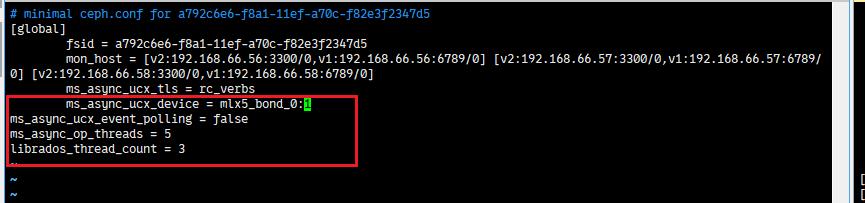

4. Copy the file to the client container.

    ```sh
    podman exec client1 mkdir -p /etc/ceph
    podman cp /etc/ceph/ceph.conf client1:/etc/ceph/
    podman cp /etc/ceph/ceph.client.admin.keyring client1:/etc/ceph/
    ```

5. Go to the client container and check the cluster status.

    > **NOTE**
    >
    > By default, Ceph 17 automatically scales the number of placement groups (PGs) according to the number of OSDs. Ceph administrators can manually adjust the number of PGs to optimize the system and avoid unexpected short-term performance fluctuation. If auto scaling is not required, you can run the following command to disable it:
    >
    > ```sh
    > ceph osd pool set ${pool_name} pg_autoscale_mode off
    > ```

    ```sh
    podman exec -it client1 /bin/bash
    ceph -s
    ```

    

### Uninstalling Ceph<a name="EN-US_TOPIC_0000002551432421"></a>

You can delete all Ceph containers on nodes to uninstall Ceph.

1. On `ceph1`, access the Ceph cluster and delete `ceph2` and `ceph3`.

    ```sh
    ceph orch host drain ceph2
    ceph orch host drain ceph3
    ```

2. Remove the Ceph cluster.

    ```sh
    cephadm rm-cluster --fsid XXXXXX --force
    ```

    `XXXXXX` indicates the cluster FSID. You need to run the cluster removal command on each server.

## Configuring Flow Control and Checking Traffic (RoCE Networking)<a name="EN-US_TOPIC_0000002520352440"></a>

### Configuring Switches<a name="EN-US_TOPIC_0000002520352434"></a>

Flow control is a mechanism used to prevent data packet loss and network congestion, especially in a high-bandwidth and low-latency environment. Configuring flow control policies can improve network reliability and stability, especially for key applications and lossless networks. To configure a lossless network, you need to configure switches. This section uses the HUAWEI CE6863-48S6CQ switch as an example to describe how to execute a flow control policy.

1. <a id="li1100413134"></a>Log in to the switch and enable priority-based flow control (PFC).

    ```sh
    system-view
    dcb pfc
    priority 0
    commit
    quit
    ```

2. Check whether PFC is enabled.

    ```sh
    display dcb pfc-profile
    ```

    If `0` is returned, the configuration in [1](#li1100413134) is successful.

    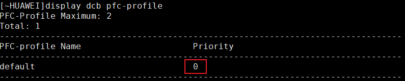

3. <a id="li1586514481310"></a>Configure Explicit Congestion Notification (ECN).

    ```sh
    drop-profile ecn
    color green buffer-size low-limit 247520 high-limit 18000000 discard-percentage 100
    commit
    quit
    ```

4. Check the ECN profile.

    ```sh
    display drop-profile ecn
    ```

    If the following information is displayed, the configuration in [3](#li1586514481310) takes effect.

    

5. <a id="li202741334141411"></a>Configure flow control for each traffic interface. The following uses `25GE 1/0/5` as an example.

    ```sh
    interface 25GE 1/0/5
    qos queue 0 wred ecn
    qos queue 0 ecn
    dcb pfc enable mode manual
    dcb pfc buffer 0 xoff static 1500 cells
    commit
    quit
    ```

6. Check whether the configuration takes effect.

    ```sh
    interface 25GE 1/0/5
    display this
    ```

    If the information in [5](#li202741334141411) is returned, the flow control is configured.

### Checking Interface Traffic<a name="EN-US_TOPIC_0000002551552421"></a>

You can check whether the switch configuration takes effect on the service side by checking whether there is traffic on interfaces.

1. Configure queue priorities for RoCE NICs on all nodes.

    >  **NOTE**
    >
    > Even if you have bonded two interfaces (mode 0/2/4), you still need to configure the priority for each interface to achieve better network performance.

    ```sh
    mlnx_qos -i enp133s0f0 -f 1,0,0,0,0,0,0,0
    mlnx_qos -i enp133s0f1 -f 1,0,0,0,0,0,0,0
    ```

2. Check whether the configuration is successful.

    ```sh
    mlnx_qos -i enp133s0f0
    mlnx_qos -i enp133s0f1
    ```

    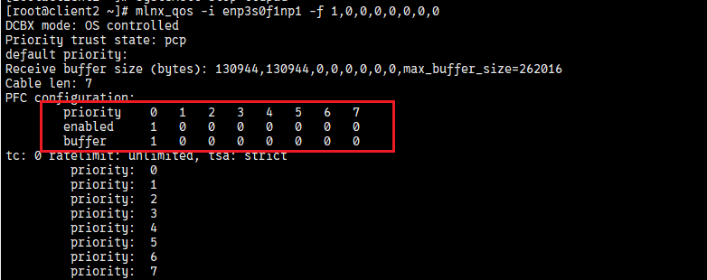

3. If the lldpad warning is generated, disable the lldpad service and specify the preceding configuration again.

    

    ```sh
    systemctl stop lldpad
    systemctl disable lldpad
    ```

4. Check whether there is traffic on the NIC. If the returned traffic changes, there is traffic on the NIC.

    ```sh
    watch -n 1 "ethtool -S enp133s0f0 | grep prio"
    watch -n 1 "ethtool -S enp133s0f1 | grep prio"
    ```

    Example command output for enp133s0f0:

    
    
    Example command output for enp133s0f1:

    
    
## FAQs<a name="EN-US_TOPIC_0000002520032432"></a>

### How Can I Rectify an Error Reported When Ceph 17.2.8 Is Running Continuously?<a id="error-reported-during-continuous-running"></a>

**Symptom<a name="section6838184010412"></a>**

After a Ceph 17.2.8 cluster runs continuously, OSDs may break down and then recover. An error similar to the following is reported:

```json
ceph crash info 2025-02-03T09:19:08.749233Z_9e2800fb-77f6-46cb-8087-203ea15a2039
{
   "assert_condition": "log.t.seq == log.seq_live",
   "assert_file": "/home/jenkins-build/build/workspace/ceph-build/ARCH/x86_64/AVAILABLE_ARCH/x86_64/AVAILABLE_DIST/centos9/DIST/centos9/MACHINE_SIZE/gigantic/release/17.2.8/rpm/el9/BUILD/ceph-17.2.8/src/os/bluestore/BlueFS.cc",
   "assert_func": "uint64_t BlueFS::_log_advance_seq()",
   "assert_line": 3029,
   "assert_msg": "/home/jenkins-build/build/workspace/ceph-build/ARCH/x86_64/AVAILABLE_ARCH/x86_64/AVAILABLE_DIST/centos9/DIST/centos9/MACHINE_SIZE/gigantic/release/17.2.8/rpm/el9/BUILD/ce
ph-17.2.8/src/os/bluestore/BlueFS.cc: In function 'uint64_t BlueFS::_log_advance_seq()' thread 7ff983564640 time 2025-02-03T09:19:08.738781+0000\n/home/jenkins-build/build/workspace/ceph-bu
ild/ARCH/x86_64/AVAILABLE_ARCH/x86_64/AVAILABLE_DIST/centos9/DIST/centos9/MACHINE_SIZE/gigantic/release/17.2.8/rpm/el9/BUILD/ceph-17.2.8/src/os/bluestore/BlueFS.cc: 3029: FAILED ceph_assert
(log.t.seq == log.seq_live)\n",
   "assert_thread_name": "bstore_kv_sync",
   "backtrace": [
       "/lib64/libc.so.6(+0x3e730) [0x7ff9930f5730]",
       "/lib64/libc.so.6(+0x8bbdc) [0x7ff993142bdc]",
       "raise()",
       "abort()",
       "(ceph::__ceph_assert_fail(char const*, char const*, int, char const*)+0x179) [0x55882dfb7fdd]",
       "/usr/bin/ceph-osd(+0x36b13e) [0x55882dfb813e]",
       "/usr/bin/ceph-osd(+0x9cff3b) [0x55882e61cf3b]",
       "(BlueFS::_flush_and_sync_log_jump_D(unsigned long)+0x4e) [0x55882e6291ee]",
       "(BlueFS::_compact_log_async_LD_LNF_D()+0x59b) [0x55882e62e8fb]",
       "/usr/bin/ceph-osd(+0x9f2b15) [0x55882e63fb15]",
       "(BlueFS::fsync(BlueFS::FileWriter*)+0x1b9) [0x55882e631989]",
       "/usr/bin/ceph-osd(+0x9f4889) [0x55882e641889]",
       "/usr/bin/ceph-osd(+0xd74cd5) [0x55882e9c1cd5]",
       "(rocksdb::WritableFileWriter::SyncInternal(bool)+0x483) [0x55882eade393]",
       "(rocksdb::WritableFileWriter::Sync(bool)+0x120) [0x55882eae0b60]",
       "(rocksdb::DBImpl::WriteToWAL(rocksdb::WriteThread::WriteGroup const&, rocksdb::log::Writer*, unsigned long*, bool, bool, unsigned long)+0x337) [0x55882ea00ab7]",
       "(rocksdb::DBImpl::WriteImpl(rocksdb::WriteOptions const&, rocksdb::WriteBatch*, rocksdb::WriteCallback*, unsigned long*, unsigned long, bool, unsigned long*, unsigned long, rocksdb
::PreReleaseCallback*)+0x1935) [0x55882ea07675]",
       "(rocksdb::DBImpl::Write(rocksdb::WriteOptions const&, rocksdb::WriteBatch*)+0x35) [0x55882ea077c5]",
       "(RocksDBStore::submit_common(rocksdb::WriteOptions&, std::shared_ptr<KeyValueDB::TransactionImpl>)+0x83) [0x55882e992593]",
       "(RocksDBStore::submit_transaction_sync(std::shared_ptr<KeyValueDB::TransactionImpl>)+0x99) [0x55882e992ee9]",
       "(BlueStore::_kv_sync_thread()+0xf64) [0x55882e578e24]",
       "/usr/bin/ceph-osd(+0x8afb81) [0x55882e4fcb81]",
       "/lib64/libc.so.6(+0x89e92) [0x7ff993140e92]",
       "/lib64/libc.so.6(+0x10ef20) [0x7ff9931c5f20]"
   ],
   "ceph_version": "17.2.8",
   "crash_id": "2025-02-03T09:19:08.749233Z_9e2800fb-77f6-46cb-8087-203ea15a2039",
   "entity_name": "osd.211",
   "os_id": "centos",
   "os_name": "CentOS Stream",
   "os_version": "9",
   "os_version_id": "9",
   "process_name": "ceph-osd",
   "stack_sig": "ba90de24e2beba9c6a75249a4cce7c533987ca5127cfba5b835a3456174d6080",
   "timestamp": "2025-02-03T09:19:08.749233Z",
   "utsname_hostname": "afra-osd18",
   "utsname_machine": "x86_64",
   "utsname_release": "5.15.0-119-generic",
   "utsname_sysname": "Linux",
   "utsname_version": "#129-Ubuntu SMP Fri Aug 2 19:25:20 UTC 2024"
}

```

**Cause<a name="section341017332430"></a>**

Ceph 17.2.8 has known issues. For details, see the [Ceph community PR](https://github.com/ceph/ceph/pull/61653).

**Solution<a name="section5594134712437"></a>**

1. Modify lines 3120 to 3132 in the source code `src/os/bluestore/BlueFS.cc` as follows:

    ```cc
      _pad_bl(bl, super.block_size);
      log.writer->append(bl);
      ceph_assert(allocated_before_extension >= log.writer->get_effective_write_pos());
    
      // before sync_core we advance the seq
      {
        std::unique_lock<ceph::mutex> l(dirty.lock);
        dirty.seq_live++;
        log.seq_live++;
        log.t.seq++;
      }
    }
    ```

    
    
2. Recompile and deploy Ceph.

### How Can I Rectify a Driver Error Reported During Service Execution?<a name="EN-US_TOPIC_0000002520032428"></a>

**Symptom<a name="section6838184010412"></a>**

When a service operation is performed, an error message is displayed, as shown in the following figures.

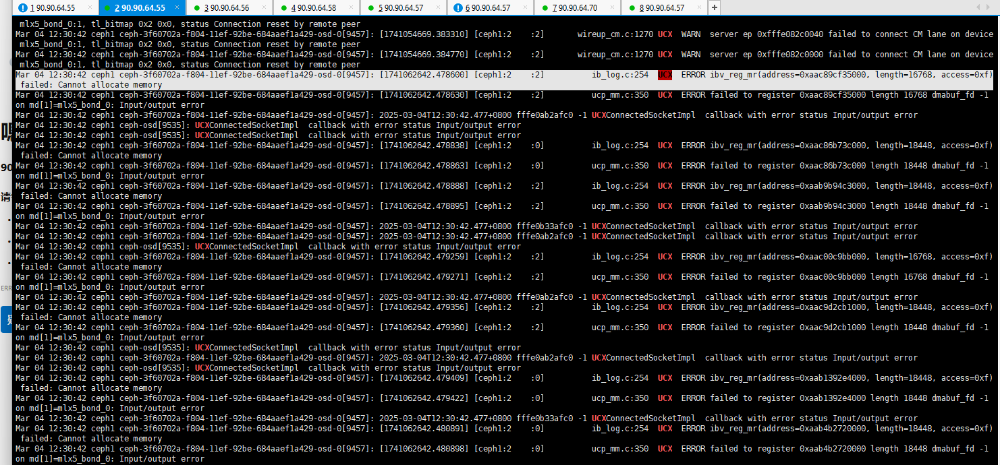


**Cause Analysis<a name="section10617103715593"></a>**

The RCache size registered by the UCX service exceeds the hardware buffer size limit. You can increase the hardware buffer size by adding the configuration in step 1 or bonding network interfaces in step 2.

**Solution<a name="section152612051134212"></a>**

1. Configure the following information on the node:

    ```sh
    mst start
    mlxconfig -d 85:00.0 -y s PF_LOG_BAR_SIZE=8
    reboot
    ```

    >  **NOTE**
    >
    > `85:00.0` indicates the PCIe number of the NIC. You can run the `lspci | grep Mellanox` command to obtain the number.

2. Bond network interfaces.
    1. Create a bond device.

        ```sh
        nmcli con add type bond ifname bond_01 mode 4
        ```

    2. Set an IP address for `bond_01`.

        ```sh
        nmcli connection modify bond-bond_01 ipv4.addresses 10.5.5.131/24
        nmcli connection modify bond-bond_01 ipv4.method manual
        ```

    3. Add slave network interfaces. In this example, the slave network interfaces are `ens7f1` and `ens8f1`. Change them as required.

        ```sh
        nmcli con add type bond-slave ifname ens7f1 master bond-bond_01
        nmcli con add type bond-slave ifname ens8f1 master bond-bond_01
        ```

    4. Modify the `BONDING_OPTS` configuration.
        1. Open the `/etc/sysconfig/network-scripts/ifcfg-bond-bond_01` file.

            ```sh
            vim /etc/sysconfig/network-scripts/ifcfg-bond-bond_01
            ```

        2. Press `i` to enter the insert mode and modify the `BONDING_OPTS` configuration.

            ```sh
            BONDING_OPTS="mode=4 miimon=100 xmit_hash_policy=layer3+4"
            MTU=4200
            ```

            

        3. Press `Esc` to exit the insert mode. Type `:wq!` and press `Enter` to save the file and exit.

    5. Enable the network device.

        ```sh
        ifdown  bond-bond_01
        ifup bond-bond_01
        systemctl restart NetworkManager
        ```

    6. On the switch, configure the port corresponding to the network interfaces to work in trunk mode. For details about the switch model and operation commands, contact the network IT owner. The following commands are for reference.
        - Configure the port to work in trunk mode.

            ```sh
            Switch(config)# interface GigabitEthernet1/0/1
            Switch(config-if)# switchport mode trunk
            Switch(config-if)# switchport trunk allowed vlan 10,20
            ```

            The commands configure GigabitEthernet1/0/1 to work in trunk mode and allow traffic of VLAN 10 and VLAN 20.

        - If multiple VLANs are connected between switches:

            ```sh
            Switch(config)# interface GigabitEthernet1/0/2
            Switch(config-if)# switchport mode trunk
            Switch(config-if)# switchport trunk allowed vlan 10-30
            ```

            The commands configure GigabitEthernet1/0/2 to work in trunk mode and allow traffic of VLAN 10 to VLAN 30.

### How Can I Rectify an Error Reported During SPDK OSD Deployment?<a name="EN-US_TOPIC_0000002551432427"></a>

**Symptom<a name="section6838184010412"></a>**

When a service operation is performed, an error message is displayed, as shown in the following figure.


**Cause Analysis<a name="section10617103715593"></a>**

"Current mode is 'VA'" is recorded in logs. The SMMU (IOMMU) may not be disabled.

**Solution<a name="section15834282575"></a>**

1. Access the BIOS screen. For details, see "Accessing the BIOS" in [TaiShan Server BIOS Parameter Reference (Kunpeng 920 Processor)](https://support.huawei.com/enterprise/en/doc/EDOC1100088647/77ba4819/accessing-the-bios).

2. Choose `Advanced` > `MISC Config` > `Support Smmu`.

    

3. Set `Support Smmu` to `Disabled` and press `F10` to save the settings and exit.

    

### What Can I Do If OSDs on a Node Cannot Change to the Up State?<a name="EN-US_TOPIC_0000002551552423"></a>

**Symptom<a name="section7359519194815"></a>**

After a server node is restarted and OSDs are deployed, all OSDs on the node are in the `In` state and some OSDs cannot be started. Check whether there are available huge pages based on [5](#en-us_topic_0000001173276984_en-us_topic_0266583442_en-us_topic_0266851355_li10464154919390). Error information similar to the following is displayed in cephadm logs:

```log
[2025-03-15 17:49:42.399173] --base-virtaddr=0x200000000000 [2025-03-15 17:49:42.399182] --match-allocations [2025-03-15 17:49:42.399191] --file-prefix=spdk_pid152 [2025-03-15 17:49:42.399200] ]
EAL: No free 2048 kB hugepages reported on node 1
EAL: No free 2048 kB hugepages reported on node 2
EAL: No free 2048 kB hugepages reported on node 3
EAL: No free 524288 kB hugepages reported on node 1
EAL: No free 524288 kB hugepages reported on node 2
EAL: No free 524288 kB hugepages reported on node 3
TELEMETRY: No legacy callbacks, legacy socket not created
[2025-03-15 17:50:12.491533] nvme_ctrlr.c:3238:nvme_ctrlr_process_init: *ERROR*: Initialization timed out in state 8
[2025-03-15 17:50:12.491716] nvme.c: 710:nvme_ctrlr_poll_internal: *ERROR*: Failed to initialize SSD: 0000:88:00.0
[2025-03-15 17:50:12.491743] nvme_pcie_common.c: 677:nvme_pcie_qpair_abort_trackers: *ERROR*: aborting outstanding command
[2025-03-15 17:50:12.491759] nvme_qpair.c: 248:nvme_admin_qpair_print_command: *NOTICE*: IDENTIFY (06) qid:0 cid:23 nsid:0 cdw10:00000001 cdw11:00000000 PRP1 0x2b5c991000 PRP2 0x0
[2025-03-15 17:50:12.491775] nvme_qpair.c: 452:spdk_nvme_print_completion: *NOTICE*: ABORTED - BY REQUEST (00/07) qid:0 cid:23 cdw0:0 sqhd:0000 p:0 m:0 dnr:0
[2025-03-15 17:50:12.491791] nvme_ctrlr.c:1520:nvme_ctrlr_identify_done: *ERROR*: nvme_identify_controller failed!
[2025-03-15 17:50:12.491801] nvme_ctrlr.c: 891:nvme_ctrlr_fail: *ERROR*: ctrlr 0000:88:00.0 in failed state.
2025-03-15T17:50:12.512+0800 fffbd1fb0040 -1 bdev() open failed to get nvme device with transport address 0000:88:00.0
2025-03-15T17:50:12.512+0800 fffbd1fb0040 -1 bluestore(/var/lib/ceph/osd/ceph-15/) mkfs failed, (1) Operation not permitted
2025-03-15T17:50:12.512+0800 fffbd1fb0040 -1 OSD::mkfs: ObjectStore::mkfs failed with error (1) Operation not permitted
2025-03-15T17:50:12.512+0800 fffbd1fb0040 -1  ** ERROR: error creating empty object store in /var/lib/ceph/osd/ceph-15/: (1) Operation not permitted
2025-03-15 17:50:12,690 fffdf1eb4dc0 DEBUG create osd.15 with 0000:88:00.0 done
2025-03-15 17:50:12,910 fffdf1eb4dc0 DEBUG systemctl: stderr Created symlink /etc/systemd/system/ceph-366437b4-0181-11f0-bcfe-f82e3f2347d5.target.wants/ceph-366437b4-0181-11f0-bcfe-f82e3f2347d5@osd.9.service → /etc/systemd/system/ceph-366437b4-0181-11f0-bcfe-f82e3f2347d5@.service.
2025-03-15 17:50:13,426 fffdf1eb4dc0 DEBUG systemctl: stderr Created symlink /etc/systemd/system/ceph-366437b4-0181-11f0-bcfe-f82e3f2347d5.target.wants/ceph-366437b4-0181-11f0-bcfe-f82e3f2347d5@osd.8.service → /etc/systemd/system/ceph-366437b4-0181-11f0-bcfe-f82e3f2347d5@.service.
```

**Cause Analysis<a name="section202848387527"></a>**

The logs show that the current node cannot create objects due to no available huge pages. The actual reason is that the allocation and usage of huge pages are abnormal. Common causes include the following: (1) The allocated huge pages are insufficient; (2) The mount point of huge pages conflicts with the default one.

**Solution<a name="section754415714523"></a>**

1. Unmount `/dev/hugepages`.

    ```sh
    umount /dev/hugepages
    ```

2. Reset OSD environment configurations.

    ```sh
    cephadm shell -v /lib/modules:/lib/modules -e DRIVER_OVERRIDE=uio_pci_generic sh /var/lib/ceph/spdk_lib/scripts/setup.sh reset
    ```

3. Repeat [2](#li27684565510) and [3](#li11112652145119) to allocate huge pages and switch the NVMe device to the user-mode driver.

    ```sh
    echo 20480 > /sys/devices/system/node/node0/hugepages/hugepages-2048kB/nr_hugepages
    cephadm shell -v /lib/modules:/lib/modules -e DRIVER_OVERRIDE=uio_pci_generic sh /var/lib/ceph/spdk_lib/scripts/setup.sh
    ```

4. Restart the cluster.

    ```sh
    systemctl daemon-reload
    systemctl restart ceph.target
    ```

    >  **NOTE**
    >
    > If an error message is displayed during OSD deployment and the OSDs cannot be started after the cluster is restarted, delete the OSDs and deploy them again.
    > Run the following commands to remove an abnormal OSD from the Ceph cluster.
    > `[OSD_ID]` indicates the ID of an OSD to be removed, for example, `osd.0`. `[FSID]` indicates the FSID of the current Ceph cluster.
    >
    > ```sh
    > cephadm shell
    > ceph osd stop [OSD_ID]
    > ceph osd out [OSD_ID]
    > ceph osd crush remove [OSD_ID]
    > ceph osd rm [OSD_ID]
    > ceph orch daemon rm [OSD_ID] --force 
    > ceph auth rm [OSD_ID]
    > ```
    >
    > Delete the OSD configuration file on the physical machine.
    >
    > ```sh
    > exit
    > rm -rf /var/lib/ceph/[FSID]/[OSD_ID]/ 
    > ```

### Updating the NIC Firmware and Driver<a id="updating-the-NIC-firmware-and-driver"></a>

1. [Download the firmware package](https://support.huawei.com/enterprise/en/software/260855985-ESW2000807877) and decompress it. (The CX-5 NIC is used as an example.)
2. Upgrade the firmware.

    ```sh
    cd NIC-SP382-CX5-FW-16.32.1010-ARM
    ./install.sh upgrade
    ```

3. Install driver dependencies.

    ```sh
    yum install createrepo perl pciutils gcc-gfortran tcsh expat glib2 tcl libstdc++ bc tk gtk2 atk cairo numactl pkgconfig ethtool lsof rpm-build python3-libxml2 python autoconf automake libtool
    ```

4. [Download the NIC driver](https://support.huawei.com/enterprise/en/management-software/computing-component-idriver-pid-259488843/software/262409128?idAbsPath=fixnode01%7C23710424%7C251364417%7C251364851%7C254884035%7C259488843).

    >  **NOTE**
    >
    > The driver for openEuler 20.03 LTS SP4 is not provided. You can use that for openEuler 20.03 LTS SP3.

5. Install the driver.
    1. Decompress the downloaded ISO file.

        ```sh
        mkdir /mnt/iso
        mount -o loop ***.iso /mnt/iso
        cd /mnt/iso
        ```

    2. Install the driver.
        - Method 1: Decompress the package to install the driver.

            ```sh
            tar xf MLX-*.tgz
            cd MLNX*
            ./mlnxofedinstall --force --without-depcheck --without-fw-update --add-kernel-support  --skip-distro-check
            ```

        - Method 2: Use the automatic installation script.

            ```sh
            ./install.sh  (Refer to the readme_en.txt file in the same directory.)
            ```

6. Reload the driver.

    ```sh
    dracut -f
    /etc/init.d/openibd restart
    ```

7. Reboot the node.

    ```sh
    reboot
    ```

>  **NOTE**
>
> The recommended versions are as follows:
>
> 1. Firmware version: 16.32.1010 \(HUA0000000024\)
>
> 2. Driver version:
>
> - openEuler 20.03 (Arm): 24.01-0.3.3
> 
> - openEuler 20.03 (x86): 5.8-1.1.2

### What Can I Do If a Device of SP670 Is Missing in a Container?<a name="EN-US_TOPIC_0000002520352428"></a>

**Symptom<a name="section2294102135420"></a>**

In the container started by `cephadm shell`, the RDMA device of SP670 is not displayed when `ibv_devices` is executed.

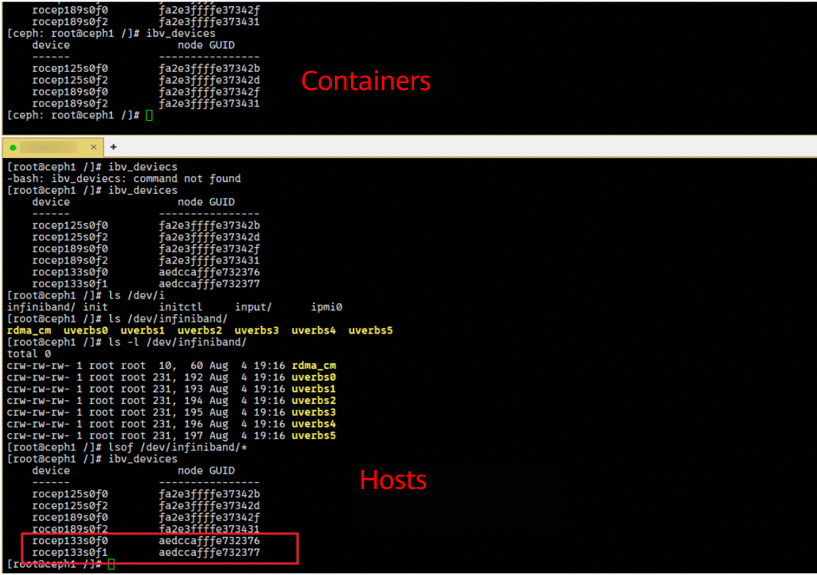

**Cause<a name="section833701191218"></a>**

The RDMA driver of SP670 is not correctly installed in the container.

**Solution<a name="section17451976234"></a>**

1. [Download the latest firmware and driver installation packages](https://support.huawei.com/enterprise/en/huawei-computing-components/in220-pid-253287505/software/266018371?idAbsPath=fixnode01) and decompress them. \(Download `NIC-FW-17.12.1.2.tar.gz` and `SDK_LINUX-17.12.1.2-openEuler22.03SP4-aarch64.tar.gz`.)

2. Upgrade the firmware.

    ```sh
    tar -zvxf NIC-FW-17.12.1.2.tar.gz
    cd NIC-FW-17.12.1.2
    rpm -ivh tool/aarch64/hinicadm3-17.12.1.2-1.aarch64.rpm
    hinicadm3 updatefw -i hinic0 -f ./SP670/Hinic3_flash.bin -or
    ```

    

3. Install the driver. You need to install the driver versions corresponding to the OS kernels of the container and physical machine. The following uses openEuler 22.03 LTS SP4 as an example.

    ```sh
    tar -zvxf SDK_LINUX-17.12.1.2-openEuler22.03SP4-aarch64.tar.gz
    cd SDK_LINUX-17.12.1.2-openEuler22.03SP4-aarch64
    rpm -ivh nic/hisdk3-17.12.1.2_5.10.0_216.0.0.115.oe2203sp4.aarch64-1.aarch64.rpm
    rpm -ivh nic/hinic3-17.12.1.2_5.10.0_216.0.0.115.oe2203sp4.aarch64-1.aarch64.rpm
    rpm -ivh roce/hiroce3-17.12.1.2_5.10.0_216.0.0.115.oe2203sp4.aarch64-1.aarch64.rpm
    ```

4. Run the `reboot` command to reboot the server.

    >  **NOTE**
    >
    > You can run the `ethtool -i [device-name]` command to check the firmware and driver versions. You need to create a Ceph deployment container again. For details, see [5.2.3](#skip_001). During the creation, install the driver.

### How Can I Rectify an Error Reported When UCX Uses SP670?<a name="EN-US_TOPIC_0000002551552425"></a>

**Symptom<a name="section488342804215"></a>**

In the container started by `cephadm shell`, the following error message is displayed when `ucx_info -d` is executed to scan devices:

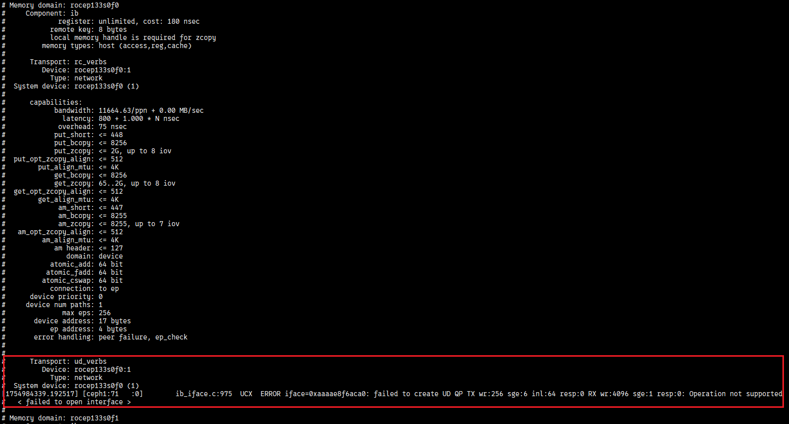

**Cause<a name="section18208111291513"></a>**

The default Rx queue depth of UCX is 4096, but the maximum depth supported by SP670 is 4095. You need to adjust the default depth of UCX.

**Solution<a name="section5188164015718"></a>**

1. To solve this issue, you need to modify a line of code by referring to [section 5.1](#compiling-and-installing-UCX) based on the following code:

    ```sh
    cd /root/rpmbuild/SOURCES/
    tar -zxvf ucx-1.14.1.tar.gz
    vim ucx-1.14.1/src/uct/ib/base/ib_iface.c
    ```

    Change the default value of `RX_QUEUE_LEN` from `4096` to `4095`.

    

    Package the file.

    ```sh
    rm -rf ucx-1.14.1.tar.gz
    tar zcvf ucx-1.14.1.tar.gz ucx-1.14.1
    ```

2. <a id="li02284812446"></a>Compile and build RPM packages. In the `rpmbuild` directory, compile and build the `ucx.spec` file to generate RPM packages.

    ```sh
    cd /root/rpmbuild/SPECS
    rpmbuild -bb ucx.spec
    ```

    After the build is complete, eight RPM packages are generated in the `/root/rpmbuild/RPMS/aarch64` directory, as shown in the following figure.

    

3. Use the local image to start a temporary container.

    ```sh
    podman run --name server1 --hostname ceph_server1 --privileged --net=host --ipc=host -dti [IP]:5000/ceph/ceph_release:v17.2.7 /usr/sbin/init
    ```

4. Copy the RPM packages generated in [2](#li02284812446) from the compilation container to the newly started container.

    ```sh
    podman cp openeuler2203sp3_build:/root/rpmbuild/RPMS/aarch64 ./
    podman cp aarch64 server1:/home
    ```

5. Access the newly started container and reinstall UCX.

    ```sh
    podman exec -it server1 bash
    cd /home
    rpm -ivh aarch64/ucx-* --force
    ```

6. Exit the container and create a Ceph deployment container.

    ```sh
    exit
    podman commit server1
    podman tag [IMAGE ID] [IP]:5000/ceph/ceph_release:v17.2.7
    podman push [IP]:5000/ceph/ceph_release:v17.2.7 [IP]:5000/ceph/ceph_release:v17.2.7
    ```

    >  **NOTE**
    >
    > `[IMAGE ID]` indicates the image ID generated by the commit command, and `[IP]` indicates the local IP address. Replace them with the actual ones.

## Security Management<a name="EN-US_TOPIC_0000002520032426"></a>

**Routine Check Using Antivirus Software<a name="section11752161613273"></a>**

Periodically scan clusters for viruses. This protects clusters from viruses, malicious code, spyware, and malicious programs, reducing risks such as system breakdown and information leakage. Mainstream antivirus software can be used for antivirus check.

**Vulnerability Fixing<a name="section208601325152718"></a>**

To ensure the production environment security and reduce attack risks, periodically fix the following vulnerabilities if any:

- OS vulnerabilities
- OpenSSL vulnerabilities
- Vulnerabilities in other components

## Acronyms and Abbreviations<a name="EN-US_TOPIC_0000002520352436"></a>

|Acronym/Abbreviation|Full Name|
|--|--|
|**A - E**|
|ECN|Explicit Congestion Notification|
|**F - J**|
|HPC|High Performance Compact|
|**K - O**|
|NUMA|Non-uniform memory access|
|OSD|Object Storage Daemon|
|**P - T**|
|PFC|Priority-based flow control|
|RDMA|Remote direct memory access|
|RoCE|RDMA over Converged Ethernet|
|SPDK|Storage Performance Development Kit|
|TCP|Transmission Control Protocol|
|**U - Z**|
|UCX|Unified Communication X|

## Change History

| Date  | Description |
|-------|----------|
| 2025-03-30 | This is the first official release. |
