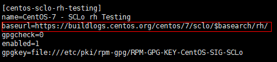
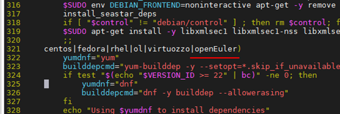
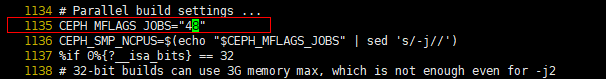
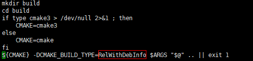
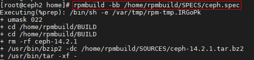
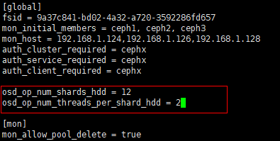

# 数据压紧特性指南

## 简介<a name="ZH-CN_TOPIC_0000002521000682"></a>

鲲鹏BoostKit分布式存储数据压紧算法（以下简称“数据压紧算法”）部署在开源分布式存储集群Ceph上，通过消除补零对齐操作带来的数据浪费问题，结合压紧封装、空间计数分配、粒度分流、聚合提交、批量回调等手段提升数据缩减率并提升系统整体IOPS，实现成本性能双收益。

本文指导用户如何在Ceph上使能数据压紧算法。数据压紧算法分为开源patch和闭源RPM包两部分，将数据压紧软件合入Ceph源码后编译Ceph并部署，数据压紧功能跟随Ceph集群生效。

**版本说明<a name="section1493132715294"></a>**

本特性随Kunpeng BoostKit 21.0.0版本发布。

**安全加固声明<a name="section1867017506565"></a>**

建议关注Ceph官网和Ceph官方Github上的漏洞信息，按照需求及时地进行漏洞修复。

## 环境要求<a name="ZH-CN_TOPIC_0000002551960673"></a>

> **说明：** 
>由于数据压紧算法是华为自研闭源算法，算法仅支持在华为鲲鹏处理器上使用。

**硬件要求<a name="section175763583914"></a>**

| 项目    | 描述       |
|-------|----------|
| CPU型号 | 鲲鹏920处理器 |

**软件要求<a name="section11547175216395"></a>**

| 项目   | 描述                            |
|------|-------------------------------|
| OS   | CentOS Linux release 7.6.1810 |
| OS   | openEuler 20.03 LTS SP1       |
| GCC  | GCC version 7.3.0             |
| Ceph | Ceph 14.2.8                   |

## Ceph合入数据压紧功能<a name="ZH-CN_TOPIC_0000002551960671"></a>

1. 下载[Ceph-14.2.8源码压缩包](https://download.ceph.com/tarballs/ceph-14.2.8.tar.gz)。

2. 将源码包放入服务器`/home`目录下解压。

    ```sh
    cd /home
    tar zxvf ceph-14.2.8.tar.gz
    ```

3. 合入数据压紧插件。
    1. 下载[ceph-14.2.8-compaction.patch](https://gitcode.com/boostkit/ceph_BK/releases/download/datacompaction/ceph-14.2.8-compaction.patch)放入`/home/ceph-14.2.8`目录。

    2. 合入patch。

        ```sh
        cd /home/ceph-14.2.8
        patch -p2 < ceph-14.2.8-compaction.patch
        ```

4. 将数据压紧软件包下载至目录`/home/ceph-14.2.8`。

    鲲鹏社区下载链接：[BoostKit-compaction\_1.0.0.zip](https://kunpeng-repo.obs.cn-north-4.myhuaweicloud.com/Kunpeng%20BoostKit/Kunpeng%20BoostKit%2021.0.0/BoostKit-compaction_1.0.0.zip)。

5. 解压安装包。

    ```sh
    cd /home/ceph-14.2.8/
    unzip BoostKit-compaction_1.0.0.zip
    ```

    生成boostkit-compaction-1.0.0-1.aarch64.rpm文件。

6. 安装RPM包。

    ```sh
    rpm -ivh boostkit-compaction-1.0.0-1.aarch64.rpm 
    ```

## 编译部署Ceph<a name="ZH-CN_TOPIC_0000002520840702"></a>

### 环境准备<a name="ZH-CN_TOPIC_0000002552040685"></a>

> **说明：** 
>
>本文档中，不同操作系统下的操作若有不同，会进行说明区分，若未说明，则该操作在两个操作系统下一致。

**CentOS 7.6<a name="section4224553104811"></a>**

1. 安装EPEL源。

    ```sh
    yum install epel-release -y
    ```

2. 安装SCL软件集。

    ```sh
    yum -y install centos-release-scl
    ```

3. 修改SCL repo源。

    ```sh
    vi /etc/yum.repos.d/CentOS-SCLo-scl.repo
    ```

    添加以下字段：

    ```sh
    baseurl=http://mirror.centos.org/altarch/7/sclo/$basearch/rh/
    ```

    修改scl-rh repo源中http为https。

    ```sh
    vi /etc/yum.repos.d/CentOS-SCLo-scl-rh.repo
    ```

    

4. 设置yum证书验证。

    ```sh
    vi /etc/yum.conf
    ```

    ```ini
    sslverify=false
    deltarpm=0
    ```

5. 更新yum。

    ```sh
    yum clean all && yum makecache
    ```

6. （可选）模拟GCC 7编译环境并验证。

    编译依赖GCC 7及以上版本，若GCC版本符合要求则请跳过此步骤，若低于7则可参考此步骤开启GCC 7模拟环境。

    ```sh
    yum -y install devtoolset-7
    scl enable devtoolset-7 bash
    gcc --version
    ```

    回显打印GCC版本为7.0即为模拟环境开启成功。

**openEuler 20.03<a name="section12464454497"></a>**

1. 配置liboath本地源。
    1. 下载liboath源码及补丁。

        ```sh
        yum install git -y
        git config --global http.sslVerify false
        git clone https://gitee.com/src-openeuler/oath-toolkit.git
        ```

    2. Yum安装rpm打包所需的依赖。

        ```sh
        yum install wget rpmdevtools gtk-doc pam-devel xmlsec1-devel libtool libtool-ltdl-devel createrepo cmake -y
        ```

    3. 创建`rpmbuild`目录，并将patch文件和源码包移动到`/root/rpmbuild/SOURCES`目录下。

        ```sh
        rpmdev-setuptree
        cd oath-toolkit
        mv 0001-oath-toolkit-2.6.5-lockfile.patch /root/rpmbuild/SOURCES
        mv oath-toolkit-2.6.5.tar.gz /root/rpmbuild/SOURCES
        cp oath-toolkit.spec /root/rpmbuild/SPECS/
        ```

    4. 编译RPM包。

        ```sh
        rpmbuild -bb /root/rpmbuild/SPECS/oath-toolkit.spec
        ```

    5. 将编译好的RPM包作为本地Yum源。

        ```sh
        mkdir -p /home/oath
        cp -r /root/rpmbuild/RPMS/*  /home/oath/
        cd  /home/oath && createrepo .
        ```

    6. 配置repo文件。

        ```sh
        vi /etc/yum.repos.d/local.repo
        ```

        文件中加入以下内容：

        ```ini
        [local-oath]
        name=local-oath
        baseurl=file:///home/oath
        enabled=1
        gpgcheck=0
        priority=1
        ```

2. 编辑`yum.conf`文件，设置Yum证书验证状态为不验证。

    ```sh
    vi /etc/yum.conf
    ```

    在末尾添加如下内容：

    ```ini
    sslverify=false
    deltarpm=0
    ```

3. 配置华为代理，提高下载速度。

    ```sh
    mkdir -p ~/.pip
    vi ~/.pip/pip.conf
    ```

    添加如下内容：

    ```ini
    [global]
    timeout = 120
    index-url =https://repo.huaweicloud.com/repository/pypi/simple
    trusted-host = repo.huaweicloud.com
    ```

4. 下载华为镜像源repo。

    ```sh
    wget -O /etc/yum.repos.d/openEulerOS.repo https://repo.huaweicloud.com/repository/conf/openeuler_aarch64.repo
    ```

5. 安装服务端Ceph源码编译需要的依赖。

    ```sh
    yum install -y java-devel sharutils checkpolicy selinux-policy-devel gperf cryptsetup fuse-devel /
     gperftools-devel libaio-devel libblkid-devel libcurl-devel libudev-devel libxml2-devel /
     libuuid-devel ncurses-devel python-devel valgrind-devel xfsprogs-devel xmlstarlet yasm /
     nss-devel libibverbs-devel openldap-devel CUnit-devel python2-Cython python3-setuptools /
     python-prettytable lttng-ust-devel expat-devel junit boost-random keyutils-libs-devel openssl-devel /
     libcap-ng-devel python-sphinx python2-sphinx python3-sphinx leveldb leveldb-devel snappy /
     snappy-devel lz4 lz4-devel liboath liboath-devel libbabeltrace-devel librabbitmq librabbitmq-devel /
     librdkafka librdkafka-devel libnl3 libnl3-devel rdma-core-devel numactl numactl-devel numactl-libs /
     createrepo openldap-devel rdma-core-devel lz4-devel expat-devel lttng-ust-devel libbabeltrace-devel /
     python3-Cython python2-Cython gperftools-devel bc dnf-plugins-core librabbitmq-devel rpm-build /
     java-1.8.0-openjdk-devel
    ```

6. 在`/home`目录重新生成`rpmbuild/`目录。
    1. 执行rpmbuild安装命令。

        ```sh
        rpmdev-setuptree
        ```

    2. 修改`.rpmmacros`文件。

        ```sh
        vi /root/.rpmmacros
        ```

        修改`%_topdir`为`/home/rpmbuild`。

        

    3. 再次执行rpmbuild安装命令。

        ```sh
        rpmdev-setuptree
        ```

### 编译Ceph并验证<a name="ZH-CN_TOPIC_0000002521000684"></a>

**CentOS 7.6<a name="section116341113564"></a>**

1. 修改ceph.spec文件。

    ```sh
    cd /home/ceph-14.2.8/
    vi ceph.spec.in
    ```

    修改scipy版本为“python36-scipy”。

    

2. 修改`dashboard/requirements.txt`。

    ```sh
    vi /home/ceph-14.2.8/src/pybind/mgr/dashboard/requirements.txt
    ```

    注释pyopenssl。

    ```sh
    PyJWT==1.6.4
    #pyopenssl==17.5.0
    pytest==3.3.2
    ```

3. 安装依赖。

    ```sh
    yum -y install epel-release
    yum -y install python36-scipy.aarch64
    cd /home/ceph-14.2.8/
    sh install-deps.sh
    ```

4. 编译。

    ```sh
    sh do_cmake.sh
    cd build
    make -j 48
    ```

5. UT测试。

    ```sh
    ctest3 -V -R unittest_compression
    ```

    

6. 删除`build`目录。

    ```sh
    cd /home/ceph-14.2.8/
    rm -rf build
    ```

**openEuler 20.03<a name="section194721116145614"></a>**

1. 借助EPEL安装openEuler中缺少的依赖。
    1. 配置EPEL源。

        ```sh
        vi /etc/yum.repos.d/epel.repo
        ```

        添加如下内容：

        ```ini
        [epel]
        name=epel
        baseurl=https://repo.huaweicloud.com/epel/7/aarch64/
        enabled=1
        gpgcheck=0
        priority=1
        ```

    2. 使用EPEL源安装依赖。

        ```sh
        yum install python-routes python-tox -y
        ```

    3. 删除EPEL源。

        ```sh
        rm -rf /etc/yum.repos.d/epel.repo
        ```

        > **说明：** 
        >
        >EPEL源必须删除，否则后续步骤将会从EPEL源下载与openEuler冲突的RPM包。

2. 修改Ceph相关代码，使其兼容openEuler。

    ```sh
    cd /home/ceph-14.2.8/
    ```

    1. 修改install-deps.sh文件，如下图所示增加`openEuler`。

        ```sh
        vim install-deps.sh
        ```

        

    2. 修改ceph.spec.in。

        ```sh
        sed -i 's#%if 0%{?fedora} || 0%{?rhel}#%if 0%{?fedora} || 0%{?rhel} || 0%{?openEuler}#' ceph.spec.in
        ```

    3. 修改ceph.spec文件。

        ```sh
        vim ceph.spec
        ```

        1. 文件开头添加以下内容。

            ```spec
            %define _binaries_in_noarch_packages_terminate_build 0
            ```

        2. 如下图所示修改`CEPH_MFLAGS_JOBS="-j48"`，提高openEuler版本编译速度。

            

3. 安装依赖并编译。
    1. 安装依赖。

        ```sh
        cd /home/ceph-14.2.8/
        sh install-deps.sh
        ```

    2. 编译。

        ```sh
        sh do_cmake.sh
        cd build
        make -j 48
        ```

    3. UT测试。

        ```sh
        ctest3 -V -R unittest_compression
        ```

        

### 生成数据压紧算法RPM包<a name="ZH-CN_TOPIC_0000002552040687"></a>

**CentOS 7.6<a name="section1791519327575"></a>**

1. 修改`do_cmake.sh`中默认BUILD模式为高性能模式。

    ```sh
    vi do_cmake.sh
    ```

    

2. 将ceph-14.2.8目录打包为tar.bz2格式的压缩包。

    ```sh
    cd /home
    tar -cjvf ceph-14.2.8.tar.bz2 ceph-14.2.8
    ```

3. 将ceph.spec文件拷贝到`SPECS`目录下。

    ```sh
    cp ceph-14.2.8/ceph.spec /home/rpmbuild/SPECS/
    ```

4. 将打包好的文件放到`SOURCES`目录下。

    ```sh
    cp ceph-14.2.8.tar.bz2 /home/rpmbuild/SOURCES/
    ```

5. 在ceph.spec文件开头添加字段。

    ```sh
    vi /home/rpmbuild/SPECS/ceph.spec
    ```

    添加字段如下：

    ```txt
    %define _binaries_in_noarch_packages_terminate_build 0
    ```

    

6. 构建RPM包。

    ```sh
    rpmbuild -bb /home/rpmbuild/SPECS/ceph.spec
    ```

    

    编译过程需要20-30分钟，编译完成后会在`/home/rpmbuild/RPMS`目录下生成两个目录`aarch64`和`noarch`，其中包含有Ceph相关的RPM包。

    

**openEuler 20.03<a name="section966654717572"></a>**

1. 删除`build`目录。

    ```sh
    cd /home/ceph-14.2.8/
    rm -rf build
    ```

2. 修改`do_cmake.sh`中默认BUILD模式为高性能模式。

    ```sh
    vi do_cmake.sh
    ```

    

3. 回到上级目录并将`ceph-14.2.8`目录打包为tar.bz2格式的压缩包。

    ```sh
    cd /home
    tar -cjvf ceph-14.2.8.tar.bz2 ceph-14.2.8
    ```

4. 将ceph.spec文件拷贝到`SPECS`目录下。

    ```sh
    cp ceph-14.2.8/ceph.spec /home/rpmbuild/SPECS/
    ```

5. 将打包好的文件放到`SOURCES`目录下。

    ```sh
    cp ceph-14.2.8.tar.bz2 /home/rpmbuild/SOURCES/
    ```

6. 构建RPM包。
    1. 移除并备份`/etc/profile.d/performance.sh`以提高编译速度。

        ```sh
        mv /etc/profile.d/performance.sh /home/
        ```

    2. 重新开启一个新的终端，使用rpmbuild开始编译。

        ```sh
        unset GOMP_CPU_AFFINITY
        rpmbuild -bb /home/rpmbuild/SPECS/ceph.spec
        ```

        

        编译过程需要20-30分钟，编译完成后会在`/home/rpmbuild/RPMS`目录下生成两个目录`aarch64`和`noarch`，其中包含有Ceph相关的RPM包。

        

### 部署Ceph集群<a name="ZH-CN_TOPIC_0000002520840704"></a>

1. 创建本地源。

    ```sh
    yum -y install createrepo
    mkdir /home/ceph-compaction
    cd /home/ceph-compaction
    cp /home/rpmbuild/RPMS/aarch64/*rpm ./
    createrepo ./
    cd /etc/yum.repos.d/
    vi ceph-local.repo
    ```

    ```ini
    [local]
    name=local
    baseurl=file:///home/ceph-compaction
    enable=1
    gpgcheck=0
    [Ceph-noarch]
    name = Ceph noarch packages
    baseurl = http://download.ceph.com/rpm-nautilus/el7/noarch
    enabled = 1
    gpgcheck = 1
    type = rpm-md
    gpgkey = https://download.ceph.com/keys/release.asc
    priority = 1
    ```

2. 部署MON、MGR。

    详细操作请参考Ceph部署指导：

    - 块存储场景请参考《Ceph块存储 部署指南》中的[安装Ceph软件](https://www.hikunpeng.com/document/detail/zh/kunpengsdss/ecosystemEnable/Ceph/kunpengcephblock_04_0005.html)、[部署MON节点](https://www.hikunpeng.com/document/detail/zh/kunpengsdss/ecosystemEnable/Ceph/kunpengcephblock_04_0006.html)和[部署MGR节点](https://www.hikunpeng.com/document/detail/zh/kunpengsdss/ecosystemEnable/Ceph/kunpengcephblock_04_0007.html)。
    - 对象存储场景请参考《Ceph对象存储 部署指南》中的[安装Ceph软件](https://www.hikunpeng.com/document/detail/zh/kunpengsdss/ecosystemEnable/Ceph/kunpengcephobject_04_0005.html)、[部署MON节点](https://www.hikunpeng.com/document/detail/zh/kunpengsdss/ecosystemEnable/Ceph/kunpengcephobject_04_0006.html)和[部署MGR节点](https://www.hikunpeng.com/document/detail/zh/kunpengsdss/ecosystemEnable/Ceph/kunpengcephobject_04_0007.html)。
    - 文件存储场景请参考《Ceph文件存储 部署指南》中的[安装Ceph软件](https://www.hikunpeng.com/document/detail/zh/kunpengsdss/ecosystemEnable/Ceph/kunpengcephblock_04_0005_1.html)、[部署MON节点](https://www.hikunpeng.com/document/detail/zh/kunpengsdss/ecosystemEnable/Ceph/kunpengcephblock_04_0006_1.html)和[部署MGR节点](https://www.hikunpeng.com/document/detail/zh/kunpengsdss/ecosystemEnable/Ceph/kunpengcephblock_04_0007_1.html)。

    > **说明：**
    > 
    > 部署指南中的配置Ceph镜像源为Ceph官方镜像，该镜像为不包含数据压紧算法插件的Ceph RPM包，因此，需要采用本地源的方式配置。数据压紧算法仅支持Ceph 14.2.8版本，部署时需动态调整。

3. 修改Ceph配置文件ceph.conf。

    `osd_op_num_shards_hdd`与`osd_op_num_threads_per_shard_hdd`相乘为OSD进程处理I/O请求的线程数，默认为5\*1，修改为12\*2可以保证数据压紧算法发挥最大性能。

    > **说明：**
    > 
    > - 本步骤提供配置项仅针对HDD场景适用。
    > - 该修改可在部署完OSD后动态调整。

    ```sh
    vi /etc/ceph/ceph.conf
    ```

    修改默认OSD线程数。

    ```ini
    osd_op_num_shards_hdd = 12
    osd_op_num_threads_per_shard_hdd = 2
    ```

    

4. 部署OSD。

    详细操作请参考《Ceph块存储 部署指南（CentOS 7.6&openEuler 20.03）》中的[部署OSD节点](https://www.hikunpeng.com/document/detail/zh/kunpengsdss/ecosystemEnable/Ceph/kunpengcephblock_04_0008.html)。

## 修订记录

| 发布日期  | 修改说明       |
|-------|----------|
| 2021-12-31 | 第一次正式发布。|