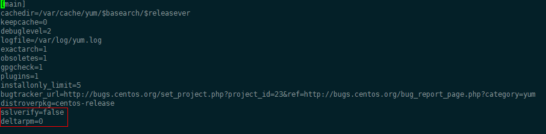
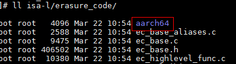
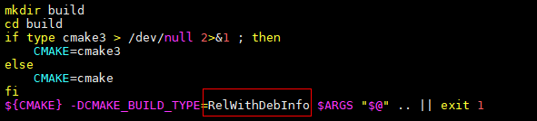
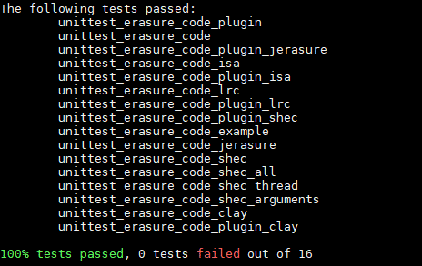
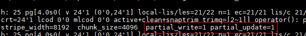
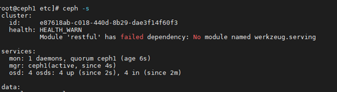
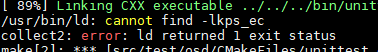

# EC Turbo特性指南

## 介绍<a name="ZH-CN_TOPIC_0000002520752324"></a>

EC Turbo是华为自研的Ceph纠删码存储池性能优化特性库。EC Turbo提升了长度在一个条带内的数据的I/O读写性能。本文指导用户如何在Ceph上使能EC Turbo。

**版本说明<a name="section1493132715294"></a>**

本特性随Kunpeng BoostKit 21.0.0版本发布。

**安全加固声明<a name="section1867017506565"></a>**

建议关注Ceph官网和Ceph官方GitHub上的漏洞信息，按照需求及时地进行漏洞修复。

## 环境要求<a name="ZH-CN_TOPIC_0000002551792313"></a>

**硬件兼容列表<a name="section195mcpsimp"></a>**

| 兼容项目  | 兼容性规格描述    |
|-------|------------|
| CPU型号 | 华为鲲鹏916处理器 |
| CPU型号 | 华为鲲鹏920处理器 |

> **说明：** 
> 
> 由于EC Turbo是华为自研闭源算法，算法仅支持华为鲲鹏处理器使用。

**软件兼容列表<a name="section224mcpsimp"></a>**

| 软件名称 | 软件版本                    |
|------|-------------------------|
| OS   | openEuler 20.03 LTS SP1 |
| Ceph | Ceph 14.2.8             |

> **说明：** 
> 
> EC Turbo目前仅适配Ceph 14.2.8版本，如果需要在其他版本使用该特性，可根据开源的Patch与该特性API接口对相应版本进行修改适配。

## 适用场景<a name="ZH-CN_TOPIC_0000002551872301"></a>

EC Turbo特性适用于使用EC（Erasure Code）数据存储池的场景，可优化EC数据存储池性能。

Ceph的数据存储池分为副本和EC两种类型。EC是一种数据保护方法。原始数据分成K个数据块（这K个数据块组成一个条带），数据块经过编码后生成M个冗余块，用户可以使用K+M中的任意K个块还原出原始数据。用户可以将数据块和冗余块分别存储在不同位置。

## 环境准备<a name="ZH-CN_TOPIC_0000002520752322" id="0001"></a>

### EC Turbo安装包获取<a name="ZH-CN_TOPIC_0000002551792319"></a>

1. <a id="li19635349165712"></a>终端键入`gcc --version`命令检查系统GCC版本。

    ```sh
    gcc --version
    ```

2. <a id="li194271803560"></a>下载软件包。

    根据GCC版本，下载对应的软件包。

    - 若GCC版本在4.8.1以下，选择[BoostKit-ec_1.2.2_abi-cxx-03.zip](https://kunpeng-repo.obs.cn-north-4.myhuaweicloud.com/Kunpeng%20BoostKit/Kunpeng%20BoostKit%2024.0.0/BoostKit-ec_1.2.2_abi-cxx-03.zip)下载。
    - 若在4.8.1及以上，选择[BoostKit-ec\_1.2.2\_abi-cxx-11.zip](https://kunpeng-repo.obs.cn-north-4.myhuaweicloud.com/Kunpeng%20BoostKit/Kunpeng%20BoostKit%2024.0.0/BoostKit-ec_1.2.2_abi-cxx-11.zip)下载。

    用户解压缩后的安装包名称为：boostkit-ec-1.2.2-1.openeuler.aarch64.rpm，boostkit-sdslog-1.2.2-1.openeuler.aarch64.rpm。boostkit-ec安装包依赖boostkit-sdslog安装包。解压后将rpm放置在`/home/ec_turbo`目录下。

3. <a id="li121781035183520"></a>安装[步骤2](#li194271803560)下载的RPM包。

    ```sh
    cd /home/ec_turbo   
    yum install boostkit-ec-1.2.2-1.openeuler.aarch64.rpm boostkit-sdslog-1.2.2-1.openeuler.aarch64.rpm  
    ```

    新增文件及位置如下表所示。

    |文件|目录位置|
    |--|--|
    |libkps_ec, libkps_bluestore, libsdslog|/usr/lib64|
    |hi_coreutil.h, kps_bluestore.h, sdslog.h, sdslog_param.h|/usr/include|
    |logrotate_sdslog.conf|/etc|
    |cron_sdslog|/etc/cron.d|

### 获取Ceph源码<a name="ZH-CN_TOPIC_0000002520752320"></a>

1. [获取ceph-14.2.8源码](https://download.ceph.com/tarballs/)。
2. 将源码包放入服务器`/home`目录下并解压。

    ```sh
    cd /home 
    tar -zxvf ceph-14.2.8.tar.gz
    ```

### 合入Ceph EC优化补丁<a name="ZH-CN_TOPIC_0000002520752318"></a>

>  **说明：** 
> 
> 如需叠加分布式存储其他特性，请参考相应的特性指南进行合入patch操作。

1. <a id="p270mcpsimp"></a>获取[ceph-14.2.8-ec_turbo-release.patch](https://gitcode.com/boostkit/ceph/releases/download/14.2.8/ceph-14.2.8-ec_turbo-release.patch)放到`/home/ceph-14.2.8`。

2. 备份原有的ceph.spec文件，下一步合入patch时生成新的ceph.spec。

    ```sh
    cd /home/ceph-14.2.8 
    cp ceph.spec ceph.spec.bak
    ```

3. 合入[步骤1](#p270mcpsimp)下载的patch。

    ```sh
    git apply --check ceph-14.2.8-ec_turbo-release.patch    
    patch -p1 < ceph-14.2.8-ec_turbo-release.patch  
    ```

    在合入补丁时会提示类似下图的src/isa-l相关信息，该信息可以忽略。后文将通过升级isa-l解决此问题。

    

### 制作liboath-devel包<a name="ZH-CN_TOPIC_0000002520912320"></a>

由于openEuler的软件安装源没有liboath-devel，需要制作相关安装包。

1. 下载相关代码和补丁。

    ```sh
    cd /home/oath  
    wget --no-check-certificate https://gitee.com/src-openeuler/oath-toolkit/repository/archive/openEuler-21.03-20210330.zip  
    unzip openEuler-21.03-20210330.zip    
    cd oath-toolkit   
    ```

2. 安装相关依赖。

    ```sh
    yum install gtk-doc pam-devel rpmdevtools  
    rpmdev-setuptree  
    ```

3. 将相关文件移动到`/root/rpmbuild/SOURCES`目录。

    ```sh
    mv /home/oath-toolkit/0001-oath-toolkit-2.6.5-lockfile.patch oath-toolkit-2.6.5.tar.gz /root/rpmbuild/SOURCES/
    ```

4. 编译RPM包。

    ```sh
    cd /root/oath-toolkit
    rpmbuild -bb oath-toolkit.spec
    ```

5. 将编译好的RPM包作为本地Yum源。

    ```sh
    mkdir -p /home/rpm/oath
    cp -r /root/rpmbuild/RPMS/*  /home/rpm/oath/
    yum install -y createrepo
    cd  /home/rpm/oath
    createrepo ./
    ```

6. 配置repo文件。
    1. 打开`local.repo`文件。

        ```sh
        vi /etc/yum.repos.d/local.repo
        ```

    2. 按`i`键进入编辑模式，在文件中加入以下内容。

        ```ini
        [local-oath]
        name=local-oath
        baseurl=file:///home/rpm/oath
        enabled=1
        gpgcheck=0
        priority=1
        ```

    3. 按`Esc`键退出编辑模式，输入`:wq!`，按`Enter`键保存退出文件。

7. 安装liboath相关依赖。

    ```sh
    yum install liboath liboath-devel -y
    ```

## 编译部署Ceph<a name="ZH-CN_TOPIC_0000002551872299"></a>

### 编译环境准备<a name="ZH-CN_TOPIC_0000002551872305"></a>

目前的Ceph不支持在openEuler系统下直接编译，需要根据下方的操作步骤做适配。

1. 返回`ceph-14.2.8`目录下。

    ```sh
    cd /home/ceph-14.2.8  
    ```

2. 打开`install-deps.sh`文件。

    ```sh
    vim install-deps.sh
    ```

3. 在文件中添加**openEuler**。

    

4. 创建libkps\_bluestore.so与libkps\_ec.so。

    ```sh
    cd /usr/lib64/ 
    ln -snf libkps_bluestore.so.1.0.0 libkps_bluestore.so 
    ```

### 编译Ceph并验证<a name="ZH-CN_TOPIC_0000002520912308"></a>

**编译环境准备<a id="section27715311341"></a>**

1. 修改`yum.conf`文件。

    ```sh
    vim /etc/yum.conf
    ```

2. 按“i“进入编辑模式，添加`sslverify=false`和`deltarpm=0`。

    

3. 按`Esc`键退出编辑模式，输入`:wq!`后`Enter`键保存并退出文件。

**编译软件<a name="section577773120346"></a>**

1. 升级isa-l。

    由于Ceph 14.2.8源码自带的isa-l的版本较低，需要升级isa-l。

    1. 进入`src`目录。

        ```sh
        cd /home/ceph-14.2.8/src
        ```

    2. 备份原有isa-l，获取最新isa-l 2.29源码。

        ```sh
        mv isa-l isa-l.bak
        wget https://github.com/intel/isa-l/archive/refs/tags/v2.29.0.tar.gz --no-check-certificate
        tar -xzvf v2.29.0.tar.gz
        mv isa-l-2.29.0 isa-l
        ```

    3. 修改ISA部分代码，适配aarch64。

        具体修改内容请参考[Github](https://github.com/intel/isa-l/pull/172/files#diff-bc8cf88ff358e79a71c59968b5909fab53becf65dc8d644d02ee672907deabfd)。

        >  **说明：** 
        > 
        > 该文件中红色代码行为删除内容，绿色代码行为新增修改内容。

        升级成功后，在`isa-l/erasure_code/`目录下有`aarch64`目录。

        

2. 安装依赖。

    ```sh
    cd /home/ceph-14.2.8/ 
    sh install-deps.sh
    ```

3. 修改`do_cmake.sh`。
    1. 打开文件。

        ```sh
        vim do_cmake.sh
        ```

    2. 按`i`进入编辑模式，进行如下修改。

        ```sh
        ${CMAKE} -DCMAKE_BUILD_TYPE=RelWithDebInfo $ARGS "$@" .. || exit 1
        ```

        

        并注释`git submodule update --init --recursive`，防止做RPM包时将isa-l回退到旧版。

        

    3. 按`Esc`键退出编辑模式，输入`:wq!`后按`Enter`键保存并退出文件。

4. 执行`do_cmake.sh`。

    ```sh
    sh do_cmake.sh    
    ```

5. 编译。

    编译环境需要gcc 7及以上版本，用户需准备好编译环境。下文中的`{number}`指编译时的job数量，一般情况下该数值越大编译速度越快，但不应超过CPU核数量。

    ```sh
    cd /home/ceph-14.2.8/build 
    make -j{number}
    ```

6. UT测试。

    ```sh
    ctest3 -V -R unittest_erasure_code
    ```

    

7. 删除`build`目录。

    ```sh
    cd /home/ceph-14.2.8/ 
    rm -rf build
    ```

### 生成Ceph RPM包<a name="ZH-CN_TOPIC_0000002551792315"></a>

1. 安装rpmbuild。

    ```sh
    yum install rpmdevtools -y  
    rpmdev-setuptree   
    ```

    若使用root用户进行编译，则会在`/root`目录下生成一个`rpmbuild`目录。由于编译过程会占用20\~30GB左右的空间，若`/root`目录下空间较小，可以更改`rpmbuild`目录到其他路径下，如`/home`目录。

2. 修改`.rpmmacros`文件。
    1. 打开`.rpmmacros`文件。

        ```sh
        vim /root/.rpmmacros   
        ```

    2. 按`i`进入编辑模式，修改`%_topdir`为`/home/rpmbuild`。

        

    3. 按`Esc`键退出编辑模式，输入`:wq!`后按`Enter`键保存并退出文件。

3. 再次执行rpmbuild安装命令。

    ```sh
    rpmdev-setuptree
    ```

4. 拷贝ceph.spec。

    ```sh
    cp ceph.spec /home/rpmbuild/SPECS/
    ```

5. 拷贝源码压缩包。

    ```sh
    cd /home/
    tar -cjvf ceph-14.2.8.tar.bz2 ceph-14.2.8
    cp ceph-14.2.8.tar.bz2 /home/rpmbuild/SOURCES/
    ```

6. 制作RPM包。

    1. 将`performance.sh`移动至`/home`目录下。

        ```sh
        mv /etc/profile.d/performance.sh /home/
        source /etc/profile
        ```

    2. 制作RPM包。

        ```sh
        rpmbuild -bb /home/rpmbuild/SPECS/ceph.spec   
        ```

    3. 恢复`performance.sh`。

        ```sh
        mv /home/performance.sh /etc/profile.d/   
        source /etc/profile
        ```

### 部署Ceph集群<a name="ZH-CN_TOPIC_0000002520912318"></a>

1. 创建本地源。
    1. 创建`/home/ecturbo_rpm`目录，将生成的RPM包拷贝到该目录。

        ```sh
        mkdir /home/ecturbo_rpm 
        cp /home/rpmbuild/RPMS/aarch64/* /home/ecturbo_rpm   
        cp /home/rpmbuild/RPMS/noarch/* /home/ecturbo_rpm
        ```

    2. 进入`/home/ecturbo_rpm`目录，生成repodata。

        ```sh
        cd /home/ecturbo_rpm
        createrepo ./
        ```

    3. 进入`/etc/yum.repos.d`目录，创建 `my_ceph_local.repo`文件。

        ```sh
        cd /etc/yum.repos.d
        vim my_ceph_local.repo
        ```

    4. 按`i`进入编辑模式，编辑`my_ceph_local.repo`文件。添加Ceph和oath的内容。

        ```ini
        [myceph]
        name=myceph
        baseurl=file:///home/ecturbo_rpm
        enabled=1
        gpgcheck=0
            
        [local-oath]
        name=local-oath
        baseurl=file:///home/rpm/oath
        enabled=1
        gpgcheck=0
        ```

    5. 按`Esc`键退出编辑模式，输入`:wq!`后按`Enter`键保存并退出文件。

    6. 更新Yum缓存。

        ```sh
        yum clean all
        yum makecache
        ```

2. 安装Ceph。

    详细操作请参考《Ceph块存储 部署指南（CentOS 7.6&openEuler 20.03）》中的“[安装Ceph](https://www.hikunpeng.com/document/detail/zh/kunpengsdss/ecosystemEnable/Ceph/kunpengcephblock_04_0004.html)”相关内容。

    >  **说明：** 
    > 
    > - 部署指南中配置的Ceph镜像源为Ceph官方镜像，该镜像为不包含EC Turbo特性的Ceph RPM包，因此，需要采用本地源的方式配置。
    > - 安装Ceph前通过`yum list | grep ceph`命令确认从本地源安装Ceph。通过该命令可以看到安装Ceph各组件的repo名称是myceph。
    > - 安装Ceph过程中可能需要安装其他第三方软件，需要保持联网状态。

## 使用指导<a name="ZH-CN_TOPIC_0000002551872295"></a>

### EC Turbo特性使能<a name="ZH-CN_TOPIC_0000002520912314"></a>

1. 使能EC Turbo特性。

    创建EC存储池请参考《Ceph对象存储 部署指南（CentOS 7.6&openEuler 20.03）》中的“[创建存储池](https://www.hikunpeng.com/document/detail/zh/kunpengsdss/ecosystemEnable/Ceph/kunpengcephobject_04_0011.html)”相关内容。

    > **说明：** 
    > 
    > - EC数据池的stripe\_unit等于256KB。在k=4，m=2的条件下，条带大小（stripe\_width）是1MB。EC Turbo对于1MB大小以内的I/O有优化效果。
    > - EC Turbo使用了isa-l的纠删码库，创建“EC profile”时必须启用isa-l插件，即增加`plugin=isa`参数。同时修改`stripe_unit=256KB`。创建EC profile的命令不能使用参考文档中的命令，正确的创建EC profile的命令是：
    >
    >    ```sh
    >    ceph osd erasure-code-profile set myprofile k=4 m=2 crush-failure-domain=osd crush-device-class=hdd plugin=isa stripe_unit=256K  
    >    ```
    >
    >    当集群的节点数量大于等于6（k+m）时，crush-failure-domain可以配置成host。

    修改ceph.conf，在`[global]`中增加以下项目。这些参数可以在创建池的前后修改。

    ```ini
    osd_ec_partial_read = true
    osd_ec_partial_write = true
    osd_ec_partial_update = true
    osd_ec_zero_opt = true
    bluestore_kpsallocator_enable = true
    ```

    > **说明：** 
    > 
    > - partial read与 ec 的fast read 冲突。开启`osd_ec_partial_read`必须关闭`osd_pool_default_ec_fast_read`（该参数默认关闭），否则partial read无法生效。
    > - 上文中的五个参数的默认值为true。用户如果不在ceph.conf中添加这几个参数，系统将生效默认值。如需关闭EC Turbo特性，用户必须在ceph.conf中显示的将参数都改为false。
    > - 检查参数当前生效情况，可执行`ceph daemon osd.<OSD编号> config show | grep -E 'osd_ec_partial_read|osd_ec_partial_write|osd_ec_partial_update|osd_ec_zero_opt|bluestore_kpsallocator_enable'`命令。

2. 配置EC Turbo相关日志参数`kpsec_log_fullpath`，`kpsec_log_level`，`kpsec_log_memlogsize`。

    这些参数可以在`ceph.conf`的`[global]`区域中定义。如果用户没有定义这些参数，系统将使用默认值。

    下面列出这些参数的默认值：

    ```ini
    [global]
    ......
    kpsec_log_fullpath = /var/log/ceph/
    kpsec_log_level = CRITICAL/DEBUG
    kpsec_log_memlogsize = 100
    ......
    ```

    > **说明：**
    > 
    > - EC Turbo的主要业务封装在libkps\_ec动态库。该动态库不使用Ceph的日志系统，所以需要新增日志。
    > - 一般情况下，Ceph的日志记录在`/var/log/ceph`目录里。如果定义其他目录，用户需要确保Ceph对应用户可以对该目录读写。
    > - 日志等级分为文件日志等级和内存日志等级，两个等级需要分别定义。一般情况下内存日志记录的内容比文件日志记录的更详细。日志等级必须在\[`CRITICAL=0`，`ERROR=1`，`WARNING=2`，`INFORMATION=3`，`DEBUG=4`\]中选择。`mem_log_size`的范围是100-1000。
    > - 用户在OSD进程运行时修改kpsec日志参数，需要重启OSD进程使之生效。
    > - 如果不方便重启OSD进程，可以使用`ceph tell osd.<OSD编号> injectargs --<参数名>=<参数值>`命令在线修改参数，之后执行`ceph tell osd.<OSD编号> reload_kps_conf`重载kpsec日志参数。

3. 将ceph.conf推送到各个节点。

    ```sh
    ceph-deploy --overwrite-conf admin {node1} {node2}
    ```

    >  **说明：** 
    > 
    > `{nodeX}`是Ceph的节点名，一条命令可以将ceph.conf推送到集群下的多个节点。推送完成后重启集群。

4. 验证EC Turbo生效。
    1. 调整ceph-osd的日志等级到20/20。例如修改OSD.3的日志等级。

        ```sh
        ceph daemon osd.3 config set debug_osd 20/20
        ```

    2. 执行EC池的数据读写业务，查看编号3的ceph-osd日志。日志中如有`partial_write=1 partial_update=1`的字样表示EC Turbo已生效。

        

    3. 将该ceph-osd的日志等级改回默认值。

        ```sh
        ceph daemon osd.3 config set debug_osd 0/1
        ```

### 日志管理<a name="ZH-CN_TOPIC_0000002520912316"></a>

该模块的日志管理使用logrotate和Crontab。

Logrotate是Linux系统中常用的日志管理程序，Crontab是基于时间的任务管理系统。

`/etc/logrotate_sdslog.conf`文件是EC Turbo配套的日志文件管理参数，该文件在安装EC Turbo时安装到指定目录。该文件的内容如下：

```txt
/var/log/ceph/kpsec*.log {
    rotate 30
    daily
    compress
    dateext
    dateformat.%Y%m%d.%s
    size=100M
    missingok
    su ceph ceph
    lastaction
        /usr/bin/chmod 440 /var/log/ceph/kpsec*.gz
        /usr/bin/chmod 440 /var/log/ceph/kpsec*.log-*
        /usr/bin/chmod 440 /var/log/ceph/kpsec*.log.*
    endscript
}

/var/log/sdslog*.log {
    rotate 30
    daily
    compress 
    dateext
    dateformat.%Y%m%d.%s
    size=100M
    missingok
    su ceph ceph
    lastaction
        /usr/bin/chmod 440 /var/log/sdslog*.gz
        /usr/bin/chmod 440 /var/log/sdslog*.log-*
        /usr/bin/chmod 440 /var/log/sdslog*.log.*
    endscript
}

```

Crontab可以在固定时间、日期、时间间隔下运行指定的任务。在Crontab增加一条任务使logrotate每1分钟执行一次。

1. 在`/etc/cron.d/`目录中增加文件`cron_sdslog`，文件内容如下：

    ```txt
    */1 * * * * root /usr/sbin/logrotate /etc/logrotate_sdslog.conf
    ```

2. 修改新`cron_sdslog`的权限为600。

## 故障排除<a name="ZH-CN_TOPIC_0000002551872303"></a>

### 编译Ceph过程中提示缺少依赖的解决方法<a name="ZH-CN_TOPIC_0000002551792311"></a>

**问题现象描述<a name="zh-cn_topic_0000001640989793_section3941254"></a>**

为使能EC Turbo特性，编译Ceph时提示`Could NOT find LTTngUST (missing: LTTNGUST_LIBRARIES LTTNGUST_INCLUDE_DIRS)`。

**关键过程、根本原因分析<a name="zh-cn_topic_0000001640989793_section35471290"></a>**

环境上缺少对应的开源三方依赖包。

**结论、解决方案及效果<a name="zh-cn_topic_0000001640989793_section50806158"></a>**

根据报错信息安装所需依赖包。

```sh
yum install -y lttng-ust-devel keyutils-libs-devel openldap-devel leveldb-devel snappy-devel lz4-devel curl-devel expat-devel openssl-devel libbabeltrace-devel librabbitmq-devel rdma-core-devel python2-Cython python3-Cython
```

### ceph-deploy mon create-initial初始化失败的解决方法<a name="ZH-CN_TOPIC_0000002551792317"></a>

**问题现象描述<a name="zh-cn_topic_0000001590949856_section3941254"></a>**

ceph-deploy mon create-initial初始化失败。


**关键过程、根本原因分析<a name="zh-cn_topic_0000001590949856_section35471290"></a>**

无。

**结论、解决方案及效果<a name="zh-cn_topic_0000001590949856_section50806158"></a>**

1. 添加Ceph用户组。

    ```sh
    groupadd ceph
    ```

2. 添加用户。

    ```sh
    useradd ceph -g ceph
    ```

3. 重新安装Ceph。

### 查询Ceph状态时提示no module named werkzeug.serving的解决方法<a name="ZH-CN_TOPIC_0000002551872297"></a>

**问题现象描述<a name="zh-cn_topic_0000001640870397_section3941254"></a>**

查询Ceph状态时报告`no module named werkzeug.serving`。



**关键过程、根本原因分析<a name="zh-cn_topic_0000001640870397_section35471290"></a>**

无。

**结论、解决方案及效果<a name="zh-cn_topic_0000001640870397_section50806158"></a>**

安装werkzeug。

```sh
pip install werkzeug
```

### 查询Ceph状态时提示No module named OpenSSL的解决方法<a name="ZH-CN_TOPIC_0000002520912310"></a>

**问题现象描述<a name="zh-cn_topic_0000001640750997_section3941254"></a>**

查询Ceph状态时报告`No module named OpenSSL`。


**关键过程、根本原因分析<a name="zh-cn_topic_0000001640750997_section35471290"></a>**

无

**结论、解决方案及效果<a name="zh-cn_topic_0000001640750997_section50806158"></a>**

安装OpenSSL。

```sh
yum install python2-pyOpenSSL.noarch  
yum install python3-pyOpenSSL.noarch  
```

### 执行do\_cmake.sh和编译时报错找不到动态库的解决方法<a name="ZH-CN_TOPIC_0000002520752326"></a>

**问题现象描述<a name="zh-cn_topic_0000001640750989_section3941254"></a>**

类似以下现象。

- 找不到kps\_bluestore。

    ```txt
    Could Not find kps_bluestore (missing: KPS_BLUESTORE_LIBRARIES)
    CMake Error at CMakeLists.txt:277 (message):
    no libkpsbluestore.so found
    ```

    

- 找不到lkps\_ec库。

    ```txt
    cannot find -lkps_ec
    collect2: error: ld returned 1 exit status
    ```

    

**关键过程、根本原因分析<a name="zh-cn_topic_0000001640750989_section35471290"></a>**

无。

**结论、解决方案及效果<a name="zh-cn_topic_0000001640750989_section50806158"></a>**

1. 创建软链接。

    ```sh
    ln -snf /usr/lib64/libkps_bluestore.so.1.0.0 /usr/lib64/libkps_bluestore.so
    ln -snf /usr/lib64/libkps_ec.so.1.2.1 /usr/lib64/libkps_ec.so  
    ```

2. 重新执行编译命令。

    ```sh
    rm -rf build/ && sh do_cmake.sh
    ```
