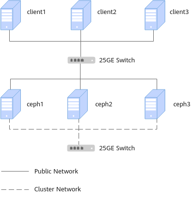
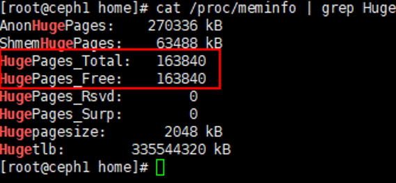
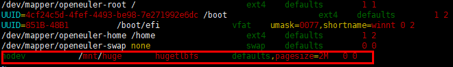
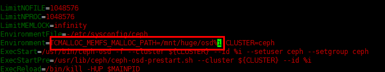
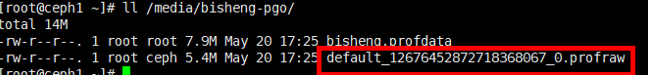
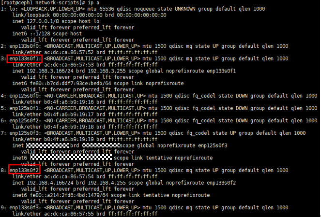
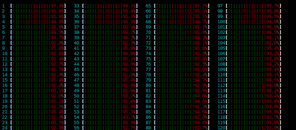

# EC Turbo调优指南

## 调优概述<a name="ZH-CN_TOPIC_0000002551873135"></a>

### EC介绍<a name="ZH-CN_TOPIC_0000002520913146"></a>

EC（Erasure Code）是Ceph中的一种存储池模式，Ceph中存储池分为多副本与EC两种模式。本文主要指导用户在叠加EC Turbo特性后优化EC模式4k块集群的读写性能。

EC也称纠删码，是一种纠正数据丢失的校验码。例如EC4+2模式，我们如果知道4个数据a、b、c、d，就可以通过公式计算出2个校验数据x和y，把6个数据一起保存起来，那么当a、b、c、d其中1个或2个数据丢失的话，就可以通过剩余的2个值和计算公式，反推出丢失的2个数据。由于EC模式涉及到数据块的编解码，因此读写性能会劣于多副本，特别是在小块的写场景。

### 环境介绍<a name="ZH-CN_TOPIC_0000002551873133"></a>

**硬件要求<a name="zh-cn_topic_0000001217080138_section10273165810425"></a>**

**表 1** 硬件要求<a id="硬件要求"></a>

| 项目    | 规格                                                   |
|-------|------------------------------------------------------|
| CPU型号 | 鲲鹏920                                                |
| 内存大小  | 12*32GB                                              |
| 网卡    | IN200网卡4*25GE                                        |
| 硬盘    | 系统盘：960GB SATA HDD<br>数据盘：8*ES3000 V5 3.2TB NVMe SSD |

**软件要求<a name="section1240364411598"></a>**

**表 2** 软件要求<a id="软件要求"></a>

| 项目   | 版本              |
|------|-----------------|
| 操作系统 | openEuler 20.03 |
| Ceph | 14.2.10         |

**集群环境规划<a name="section7471129153117"></a>**

集群由Ceph客户端和Ceph服务端组成，其组网方式如下图所示。



Ceph集群部署时各服务端IP地址举例如[**表 3** 服务端组网示例](#服务端组网示例)所示。

**表 3** 服务端组网示例<a id="服务端组网示例"></a>

| 节点名称  | Public Network | Cluster Network |
|-------|----------------|-----------------|
| ceph1 | 192.168.3.166  | 192.168.4.166   |
| ceph2 | 192.168.3.167  | 192.168.4.167   |
| ceph3 | 192.168.3.168  | 192.168.4.168   |

Ceph集群部署各客户端IP地址举例如[**表 4** 客户端部署示例](#客户端部署示例)所示。

**表 4** 客户端部署示例<a id="客户端部署示例"></a>

| 节点名称    | Public Network |
|---------|----------------|
| client1 | 192.168.3.160  |
| client2 | 192.168.3.161  |
| client3 | 192.168.3.162  |

> **说明：** 
>
>- 内部集群IP地址（Cluster Network）：用于集群内部服务端节点之间同步数据的IP地址，选取任意一个25GE网口配置即可。
>- 外部访问IP地址（Public Network）：服务端节点供其他客户端节点访问的IP地址，选取任意一个25GE网口配置即可。
>- 客户端当作压力机，需保证客户端业务口IP地址与集群的外部访问IP地址在同一个网段，建议选用25GE网口进行配置。

### 调优原则<a name="ZH-CN_TOPIC_0000002551793149"></a>

在性能优化时，需要遵循以下的原则：

- 对性能进行分析时，要多方面分析系统的资源瓶颈所在，如CPU利用率达到100%时，也可能是内存容量限制，导致CPU忙于处理内存调度。
- 一次只对一个性能指标参数进行调整，且调整后不会影响其它模块的性能。
- 分析工具本身运行可能会带来资源损耗，导致系统某方面的资源瓶颈情况更加严重，应避免或降低对应用程序的影响。
- 配置或者代码调优后，必须保证程序运行正确且不影响原有功能。

## 系统调优<a name="ZH-CN_TOPIC_0000002520913148"></a>

本文档主要介绍了六种调优手段，建议按照顺序进行调优。其中系统调优主要分为BIOS调优与操作系统调优，BIOS调优是为了充分发挥CPU性能，操作系统调优是为了充分发挥其它硬件特性。

- BIOS调优具体请参见：《Ceph块存储 调优指南》中的[BIOS调优](https://www.hikunpeng.com/document/detail/zh/kunpengsdss/ecosystemEnable/Ceph/kunpengcephblock_05_0015.html)章节。
- 操作系统调优具体请参见：《Ceph块存储 调优指南》中的[系统调优](https://www.hikunpeng.com/document/detail/zh/kunpengsdss/ecosystemEnable/Ceph/kunpengcephblock_05_0007.html)章节。

本文档主要介绍了六种调优手段，建议按照顺序进行调优。其中系统调优主要分为BIOS调优与操作系统调优，BIOS调优是为了充分发挥CPU性能，操作系统调优是为了充分发挥其它硬件特性。

## Ceph代码优化<a name="ZH-CN_TOPIC_0000002551793147"></a>

代码优化包括EC Turbo以及Ceph中的一些通用基础优化，如Crush算法指令加速，RocksDB CRC算法优化等。

通过叠加EC Turbo以及这些基础优化代码后，读写性能有较为明显的提升。这两部分优化已合并在同一个补丁当中。以下是具体的编译部署指导。

1. 请参见《[EC Turbo特性指南](ec_turbo_feature_guide.md)》的“EC Turbo安装包获取”章节，完成安装包获取的操作。

2. 获取Ceph源码。
    1. 下载[ceph-14.2.10.tar.gz](https://download.ceph.com/tarballs/ceph-14.2.10.tar.gz)源码包。

    2. 执行以下命令将源码包放置于`/home`目录下并解压。

        ```sh
        cd /home
        tar -zxvf ceph-14.2.10.tar.gz
        ```

3. 合入Ceph EC代码优化补丁。
    1. 下载[ceph-ecturbo-optimization.patch](https://gitcode.com/boostkit/ceph/releases/download/ec_turbo_optimization/ceph-ecturbo-optimization.patch)放置到`/home/ceph-14.2.10`。

    2. 备份原有的`ceph.spec`文件。

        ```sh
        cd /home/ceph-14.2.10
        mv ceph.spec ceph.spec.bak
        ```

    3. 合入patch，合入此patch后会生成新的`ceph.spec`文件。

        ```sh
        patch -p1 < ceph-ecturbo-optimization.patch
        ```

4. 请参见《EC Turbo特性指南》中的[制作liboath-devel包](https://www.hikunpeng.com/document/detail/zh/kunpengsdss/appAccelFeatures/ecturbo/kunpengecturbo_20_0017.html)章节制作liboath-devel包。

5. 请参见《EC Turbo特性指南》中的[编译环境准备](https://www.hikunpeng.com/document/detail/zh/kunpengsdss/appAccelFeatures/ecturbo/kunpengecturbo_20_0018.html)章节完成Ceph的编译环境准备。

    > **说明：** 
    >
    >此次叠加的优化需要依赖大页特性，install-deps.sh脚本中没有对该依赖进行下载，需要单独手动安装，在执行install-deps.sh脚本后执行如下命令进行安装。
    >
    >```sh
    >yum install libhugetlbfs
    >```

6. 请参见[编译Ceph并验证](https://www.hikunpeng.com/document/detail/zh/kunpengsdss/appAccelFeatures/ecturbo/kunpengecturbo_20_0009.html)完成Ceph的编译与验证。

7. 请参见[生成Ceph RPM包](https://www.hikunpeng.com/document/detail/zh/kunpengsdss/appAccelFeatures/ecturbo/kunpengecturbo_20_0010.html)完成Ceph RPM包的制作。

8. 请参见[部署Ceph集群](https://www.hikunpeng.com/document/detail/zh/kunpengsdss/appAccelFeatures/ecturbo/kunpengecturbo_20_0011.html)完成Ceph集群的部署。

    > **说明：** 
    >本次环境采用的数据盘全部为NVMe，因此在部署OSD节点时不需要对OSD进行分区划分，直接使用NVME盘做OSD的数据盘即可。为充分发挥硬件性能，每台服务器上最佳部署的OSD节点数量为24个，建议对每块NVMe盘划分为三个分区，然后进行OSD的部署。

代码优化包括EC Turbo以及Ceph中的一些通用基础优化，如Crush算法指令加速，RocksDB CRC算法优化等。

## Ceph配置调优<a name="ZH-CN_TOPIC_0000002520753160"></a>

通过调整Ceph配置选项，最大化利用系统资源。

所有的Ceph配置参数都是通过修改`/etc/ceph/ceph.conf`实现的。具体配置及使能步骤如下：

1. ceph1节点进入`/etc/ceph/`目录并编辑ceph.conf文件。

    ```sh
    cd /etc/ceph
    vi ceph.conf 
    ```

2. 在ceph.conf文件添加如下配置。配置文件中的参数解释请参见[硬件要求](#硬件要求)。

    ```ini
    [global]
    
    public_network = 192.168.3.0/24   #根据实际划分的网段进行调整
    cluster_network = 192.168.4.0/24  #根据实际划分的网段进行调整
    mon_max_pg_per_osd = 3000
    mon_max_pool_pg_num = 300000
    ms_bind_before_connect = true
    ms_dispatch_throttle_bytes = 2097152000
    osd_pool_default_min_size = 0
    osd_pool_default_pg_num = 1024
    osd_pool_default_pgp_num = 1024
    osd_pool_default_size = 3
    throttler_perf_counter = false
    bluefs_buffered_io=false
    
    osd_max_write_size = 256
    osd_enable_op_tracker = false
    
    rbd_cache = false
    
    [mon]
    mon_allow_pool_delete = true
    
    [osd]
    rocksdb_cache_index_and_filter_blocks = false
    rocksdb_cache_size = 2G
    osd_memory_cache_min = 3G
    osd_memory_base = 3G
    
    bluestore_rocksdb_options = use_direct_reads=true,use_direct_io_for_flush_and_compaction=true,compression=kNoCompression,min_write_buffer_number_to_merge=32,recycle_log_file_num=64,compaction_style=kCompactionStyleLevel,write_buffer_size=64M,target_file_size_base=64M,compaction_threads=32,max_bytes_for_level_multiplier=8,flusher_threads=8,level0_file_num_compaction_trigger=16,level0_slowdown_writes_trigger=36,level0_stop_writes_trigger=48,compaction_readahead_size=524288,max_bytes_for_level_base=536870912,enable_pipelined_write=false,max_background_jobs=16,max_background_flushes=8,max_background_compactions=16,max_write_buffer_number=8,soft_pending_compaction_bytes_limit=137438953472,hard_pending_compaction_bytes_limit=274877906944,delayed_write_rate=33554432
    osd_pg_object_context_cache_count = 256
    
    mon_osd_full_ratio = 0.97
    mon_osd_nearfull_ratio = 0.95
    osd_min_pg_log_entries = 10
    osd_max_pg_log_entries = 10
    
    bluestore_cache_meta_ratio = 0.49
    bluestore_cache_kv_ratio = 0.49
    bluestore_cache_size_ssd = 6G
    osd_memory_target = 10G
    bluestore_clone_cow = false
    
    [osd.0]
    osd_numa_node=0
    [osd.1]
    osd_numa_node=0
    [osd.2]
    osd_numa_node=0
    [osd.3]
    osd_numa_node=0
    [osd.4]
    osd_numa_node=0
    [osd.5]
    osd_numa_node=0
    [osd.6]
    osd_numa_node=1
    [osd.7]
    osd_numa_node=1
    [osd.8]
    osd_numa_node=1
    [osd.9]
    osd_numa_node=1
    [osd.10]
    osd_numa_node=1
    [osd.11]
    osd_numa_node=1
    [osd.12]
    osd_numa_node=2
    [osd.13]
    osd_numa_node=2
    [osd.14]
    osd_numa_node=2
    [osd.15]
    osd_numa_node=2
    [osd.16]
    osd_numa_node=2
    [osd.17]
    osd_numa_node=2
    [osd.18]
    osd_numa_node=3
    [osd.19]
    osd_numa_node=3
    [osd.20]
    osd_numa_node=3
    [osd.21]
    osd_numa_node=3
    [osd.22]
    osd_numa_node=3
    [osd.23]
    osd_numa_node=3
    [osd.24]
    osd_numa_node=0
    [osd.25]
    osd_numa_node=0
    [osd.26]
    osd_numa_node=0
    [osd.27]
    osd_numa_node=0
    [osd.28]
    osd_numa_node=0
    [osd.29]
    osd_numa_node=0
    [osd.30]
    osd_numa_node=1
    [osd.31]
    osd_numa_node=1
    [osd.32]
    osd_numa_node=1
    [osd.33]
    osd_numa_node=1
    [osd.34]
    osd_numa_node=1
    [osd.35]
    osd_numa_node=1
    [osd.36]
    osd_numa_node=2
    [osd.37]
    osd_numa_node=2
    [osd.38]
    osd_numa_node=2
    [osd.39]
    osd_numa_node=2
    [osd.40]
    osd_numa_node=2
    [osd.41]
    osd_numa_node=2
    [osd.42]
    osd_numa_node=3
    [osd.43]
    osd_numa_node=3
    [osd.44]
    osd_numa_node=3
    [osd.45]
    osd_numa_node=3
    [osd.46]
    osd_numa_node=3
    [osd.47]
    osd_numa_node=3
    
    [osd.48]
    osd_numa_node=0
    [osd.49]
    osd_numa_node=0
    [osd.50]
    osd_numa_node=0
    [osd.51]
    osd_numa_node=0
    [osd.52]
    osd_numa_node=0
    [osd.53]
    osd_numa_node=0
    [osd.54]
    osd_numa_node=1
    [osd.55]
    osd_numa_node=1
    [osd.56]
    osd_numa_node=1
    [osd.57]
    osd_numa_node=1
    [osd.58]
    osd_numa_node=1
    [osd.59]
    osd_numa_node=1
    [osd.60]
    osd_numa_node=2
    [osd.61]
    osd_numa_node=2
    [osd.62]
    osd_numa_node=2
    [osd.63]
    osd_numa_node=2
    [osd.64]
    osd_numa_node=2
    [osd.65]
    osd_numa_node=2
    [osd.66]
    osd_numa_node=3
    [osd.67]
    osd_numa_node=3
    [osd.68]
    osd_numa_node=3
    [osd.69]
    osd_numa_node=3
    [osd.70]
    osd_numa_node=3
    [osd.71]
    osd_numa_node=3
    ```

    > **说明：** 
    >
    >配置文件中的`osd_numa_node=0`表示osd0进程绑在NUMA0上，本文档依据鲲鹏920 7260处理器进行调优，该CPU型号有4个NUMA，每台节点部署24个OSD，为了将osd进程均匀绑定在CPU核心上，充分发挥硬件性能，每连续的6个OSD绑在同一个NUMA上，若使用的CPU只有2个NUMA，则每连续的12个OSD绑在同一个NUMA上，其它情况以此类推。具体查看CPU NUMA数量的命令为：`lscpu`。
    >
    >

3. 执行以下命令将配置同步到其他节点。

    ```sh
    ceph-deploy --overwrite-conf admin ceph1 ceph2 ceph3
    ```

4. 执行以下命令，在所有服务端节点重启OSD进程，使配置生效。

    ```sh
    systemctl restart ceph-osd.target
    ```

**表 1** 参数释义<a id="参数释义"></a>

| 参数名称                                  | 参数含义                                                           | 最优配置值                                                                                                                                                                                                                                                                                                                                                                                                                                                                                                                                                                                                                                                                                                                                                                                                                                                             |
|---------------------------------------|----------------------------------------------------------------|-------------------------------------------------------------------------------------------------------------------------------------------------------------------------------------------------------------------------------------------------------------------------------------------------------------------------------------------------------------------------------------------------------------------------------------------------------------------------------------------------------------------------------------------------------------------------------------------------------------------------------------------------------------------------------------------------------------------------------------------------------------------------------------------------------------------------------------------------------------------|
| ms_bind_before_connect                | 用于控制在连接过程中绑定的行为。                                               | true                                                                                                                                                                                                                                                                                                                                                                                                                                                                                                                                                                                                                                                                                                                                                                                                                                                              |
| throttler_perf_counter                | 性能监控的选项，对在OSD请求处理过程中使用的限速器的性能进行监控和统计。                          | false                                                                                                                                                                                                                                                                                                                                                                                                                                                                                                                                                                                                                                                                                                                                                                                                                                                             |
| bluefs_buffered_io                    | 缓冲I/O配置项。                                                      | false                                                                                                                                                                                                                                                                                                                                                                                                                                                                                                                                                                                                                                                                                                                                                                                                                                                             |
| osd_max_write_size                    | 配置OSD写入操作时的最大数据块大小。                                            | 256                                                                                                                                                                                                                                                                                                                                                                                                                                                                                                                                                                                                                                                                                                                                                                                                                                                               |
| osd_enable_op_tracker                 | 用于增强OSD监控和性能分析的配置选项。                                           | false                                                                                                                                                                                                                                                                                                                                                                                                                                                                                                                                                                                                                                                                                                                                                                                                                                                             |
| rbd_cache                             | RBD缓存配置项。                                                      | false                                                                                                                                                                                                                                                                                                                                                                                                                                                                                                                                                                                                                                                                                                                                                                                                                                                             |
| rocksdb_cache_index_and_filter_blocks | 配置是否在块缓存中缓存索引和过滤器。                                             | false                                                                                                                                                                                                                                                                                                                                                                                                                                                                                                                                                                                                                                                                                                                                                                                                                                                             |
| rocksdb_cache_size                    | 配置RocksDB内部缓存的大小。                                              | 2GB                                                                                                                                                                                                                                                                                                                                                                                                                                                                                                                                                                                                                                                                                                                                                                                                                                                               |
| osd_memory_cache_min                  | 当启用tcmalloc和缓存自动调优时，设置用于缓存的最小内存量。                              | 3GB                                                                                                                                                                                                                                                                                                                                                                                                                                                                                                                                                                                                                                                                                                                                                                                                                                                               |
| osd_memory_base                       | 当启用tcmalloc和缓存自动调优时，估算OSD所需的最小内存量。                             | 3GB                                                                                                                                                                                                                                                                                                                                                                                                                                                                                                                                                                                                                                                                                                                                                                                                                                                               |
| bluestore_rocksdb_options             | RocksDB相关的配置选项。                                                | use_direct_reads=true,<br>use_direct_io_for_flush_and_compaction=true,<br>compression=kNoCompression,<br>min_write_buffer_number_to_merge=32,<br>recycle_log_file_num=64,<br>compaction_style=kCompactionStyleLevel,<br>write_buffer_size=64M,<br>target_file_size_base=64M,<br>compaction_threads=32,<br>max_bytes_for_level_multiplier=8,<br>flusher_threads=8,<br>level0_file_num_compaction_trigger=16,<br>level0_slowdown_writes_trigger=36,<br>level0_stop_writes_trigger=48,<br>compaction_readahead_size=524288,<br>max_bytes_for_level_base=536870912,<br>enable_pipelined_write=false,<br>max_background_jobs=16,<br>max_background_flushes=8,<br>max_background_compactions=16,<br>max_write_buffer_number=8,<br>soft_pending_compaction_bytes_limit=137438953472,<br>hard_pending_compaction_bytes_limit=274877906944,<br>delayed_write_rate=33554432 |
| osd_pg_object_context_cache_count     | OSD对象上下文缓存条目数。                                                 | 256                                                                                                                                                                                                                                                                                                                                                                                                                                                                                                                                                                                                                                                                                                                                                                                                                                                               |
| mon_osd_full_ratio                    | 当集群容量达到mon_osd_full_ratio的值时，集群将停止写入，但允许读取，集群会进入到HEALTH_ERR状态。 | 0.97                                                                                                                                                                                                                                                                                                                                                                                                                                                                                                                                                                                                                                                                                                                                                                                                                                                              |
| mon_osd_nearfull_ratio                | 当集群容量达到mon_osd_nearfull_ratio的值时，集群会进入HEALTH_WARN状态。           | 0.95                                                                                                                                                                                                                                                                                                                                                                                                                                                                                                                                                                                                                                                                                                                                                                                                                                                              |
| osd_min_pg_log_entries                | PG日志中维护的最小条目数。                                                 | 10                                                                                                                                                                                                                                                                                                                                                                                                                                                                                                                                                                                                                                                                                                                                                                                                                                                                |
| osd_max_pg_log_entries                | PG日志中维护的最大条目数。                                                 | 10                                                                                                                                                                                                                                                                                                                                                                                                                                                                                                                                                                                                                                                                                                                                                                                                                                                                |
| bluestore_cache_meta_ratio            | metadata占用缓存的比例。                                               | 0.49                                                                                                                                                                                                                                                                                                                                                                                                                                                                                                                                                                                                                                                                                                                                                                                                                                                              |
| bluestore_cache_kv_ratio              | rocksdb database cache占用缓存的比例。                                 | 0.49                                                                                                                                                                                                                                                                                                                                                                                                                                                                                                                                                                                                                                                                                                                                                                                                                                                              |
| bluestore_cache_size_ssd              | bluestore缓存容量。                                                 | 6GB                                                                                                                                                                                                                                                                                                                                                                                                                                                                                                                                                                                                                                                                                                                                                                                                                                                               |
| osd_memory_target                     | OSD最大内存使用限制。                                                   | 10GB                                                                                                                                                                                                                                                                                                                                                                                                                                                                                                                                                                                                                                                                                                                                                                                                                                                              |
| bluestore_clone_cow                   | 写拷贝模式，写的性能会较差，调整为写重定向。                                         | false                                                                                                                                                                                                                                                                                                                                                                                                                                                                                                                                                                                                                                                                                                                                                                                                                                                             |

通过调整Ceph配置选项，最大化利用系统资源。

## 大页配置调优<a name="ZH-CN_TOPIC_0000002551873137"></a>

### 配置数据段大页<a name="ZH-CN_TOPIC_0000002520753158"></a>

通过配置数据段大页，降低TLB miss的概率，减小CPU因缺页而产生的调度开销，从而提升写性能。以下步骤需在所有服务端节点进行。

1. 配置系统大页。

    ```sh
    echo 163840 > /proc/sys/vm/nr_hugepages 
    ```

    > **说明：** 
    > 
    > - openEuler 20.03系统中64k内核页存在bug，如果系统内核页大小为64k需要重编内核将内存页调整为4k。可通过执行以下命令查看内核页大小。
    >
    >    ```sh
    >    getconf PAGESIZE
    >    ```
    >
    >    
    > 
    >    返回信息显示4096表示当前内核页大小为4k，若返回信息不为4096，请参见《Bcache用户指南》中的[编译内核](https://www.hikunpeng.com/document/detail/zh/kunpengsdss/basicAccelFeatures/cacheAccel/kunpengbcache_06_0003.html)进行编译安装。
    > - 系统大页的数量所占的内存量要不少于本节点OSD所需要的内存量（osd\_memory\_target \* osd数量）。例如：每个节点配置了24个OSD，osd\_memory\_target配置为10GB，则大页内存至少要配置240GB，在4k内核页的环境下，一个大页的大小为2M，因此至少配成120000。
    > - 若系统已经运行较长时间，内存可能已经碎片化无法分配出一定数量的大页，可以通过如下步骤将大页分配的命令添加至对应内核（可通过`uname -r`查看）的配置中并重启服务器使其生效。
    >   1. 编辑`grub.cfg`文件，并添加`hugepagesz=2M`和`hugepages=163840`的配置内容。
    >
    >        ```sh
    >        vim /boot/efi/EFI/openEuler/grub.cfg
    >        ```
    >
    >        
    >   2. 配置完成后重启节点并可以通过执行以下命令检查大页使用情况查看是否生效。
    >
    >        ```sh
    >        reboot
    >        cat /proc/meminfo | grep Huge
    >        ```
    > 
    >        

2. 配置启动大页自动挂载。
    1. 创建挂载大页目录。

        ```sh
        mkdir /mnt/huge
        ```

    2. 在fstab文件中添加大页配置。

        ```sh
        vim /etc/fstab
        ```

        添加如下配置：

        ```txt
        nodev           /mnt/huge       hugetlbfs       defaults,pagesize=2M   0 0
        ```

        

3. 修改Ceph服务，使能tcmalloc大页配置。

    ```sh
    vim /usr/lib/systemd/system/ceph-osd@.service
    ```

    添加如下环境变量。

    ```ini
    TCMALLOC_MEMFS_MALLOC_PATH=/mnt/huge/osd%i
    ```

    

4. 重新加载配置。

    ```sh
    systemctl daemon-reload
    ```

5. 配置完成后重启OSD进程。

    ```sh
    systemctl restart ceph-osd.target
    ```

通过配置数据段大页，降低TLB miss的概率，减小CPU因缺页而产生的调度开销，从而提升写性能。以下步骤需在所有服务端节点进行。

### 配置代码段大页<a name="ZH-CN_TOPIC_0000002520913144"></a>

对ceph-osd代码段使用大页可以降低指令翻译后备缓冲（Instruction Translation Lookaside Buffer，iTLB）未命中次数，进一步提升性能。

>  **说明：** 
> 
> 以下步骤需在所有服务端节点进行。

1. 挂载大页tmpfs到`/media`目录下。

    ```sh
    mount -t tmpfs -o huge=always tmpfs /media/
    ```

2. 将ceph-osd二进制文件拷贝到tmpfs中并添加符号链接到原路径。

    ```sh
    cp /usr/bin/ceph-osd /media/
    ln -sf /media/ceph-osd /usr/bin/ceph-osd
    ```

3. 对ceph-osd进行提权，使其有访问大页内存权限。

    ```sh
    setcap 'CAP_DAC_OVERRIDE+eip CAP_SYS_ADMIN+eip' /media/ceph-osd
    ```

4. 开启系统大页透明选项。

    ```sh
    echo always > /sys/kernel/mm/transparent_hugepage/enabled
    ```

5. 配置完成后在所有服务端节点重启OSD进程。

    ```sh
    systemctl restart ceph-osd.target
    ```

对ceph-osd代码段使用大页可以降低指令翻译后备缓冲（Instruction Translation Lookaside Buffer，iTLB）未命中次数，进一步提升性能。

## 编译反馈调优<a name="ZH-CN_TOPIC_0000002520753162"></a>

本次优化使用PGO编译反馈优化技术，通过插桩形式收集程序运行时信息（profile），编译器利用这些运行时信息指导分支预测，内联优化，函数重排等以进行更准确的优化决策，生成目标程序。

编译器有毕昇编译器和GCC for openEuler两种，其中毕昇编译器针对openEuler系统做过一系列优化手段，经过该编译器的反馈优化后效果要略微好于GCC for openEuler。用户根据需求自行选择，下面具体介绍两种编译器反馈优化的步骤。

**毕昇编译器PGO编译反馈优化<a name="section1119255593415"></a>**

1. 进入编译Ceph的源码目录。

    ```sh
    cd /home/ceph-14.2.10
    ```

2. 添加补丁适配编译。
    1. 下载[pgo.patch](https://gitee.com/kunpengcompute/ceph/releases/download/ec_turbo_optimization/pgo.patch)放到`/home/ceph-14.2.10`。

    2. 合入patch。

        ```sh
        patch -p1 < pgo.patch 
        ```

3. 下载毕昇编译器并设置环境变量。
    1. 下载[毕昇编译器](https://kunpeng-repo.obs.cn-north-4.myhuaweicloud.com/BiSheng%20Enterprise/BiSheng%20Enterprise%20203.1.0/BiShengCompiler-4.2.0-aarch64-linux.tar.gz)。
    2. 执行以下命令将压缩包放置于`/home`目录下并解压。

        ```sh
        cd /home 
        tar -zxvf BiShengCompiler-4.2.0-aarch64-linux.tar.gz
        ```

    3. 设置环境变量。

        ```sh
        export PATH=/home/BiShengCompiler-4.2.0-aarch64-linux/bin:$PATH
        export LD_LIBRARY_PATH=/home/BiShengCompiler-4.2.0-aarch64-linux/lib:$LD_LIBRARY_PATH
        ```

4. <a id="li7451356153615"></a>获取插桩编译后的ceph-osd。
    1. 进入ceph-14.2.10源码目录，并新建`do_cmake_release_pgo_gen.sh`。

        ```sh
        cd /home/ceph-14.2.10
        vim do_cmake_release_pgo_gen.sh
        ```

    2. 在脚本中键入以下内容。

        ```sh
        #!/bin/bash
        set -x
        export PATH=/home/BiShengCompiler-4.2.0-aarch64-linux/bin:$PATH
        rm -rf build
        
        OPT_FLAGS="-O3 -flto=thin -fuse-ld=lld -Wno-unused-command-line-argument -fprofile-generate=/media/bisheng-pgo -mllvm -inline-threshold=1000 -Wl,-mllvm,-inline-threshold=1000 -Wl,-zmax-page-size=2097152 -mno-outline-atomics"
        
        ./do_cmake.sh -DCMAKE_BUILD_TYPE=Release -DCMAKE_INSTALL_PREFIX=/usr -DCMAKE_INSTALL_LIBDIR=/usr/lib64 -DCMAKE_INSTALL_LIBEXECDIR=/usr/lib -DCMAKE_INSTALL_LOCALSTATEDIR=/var -DCMAKE_INSTALL_SYSCONFDIR=/etc -DCMAKE_INSTALL_MANDIR=/usr/share/man -DCMAKE_INSTALL_DOCDIR=/usr/share/doc/ceph -DCMAKE_INSTALL_INCLUDEDIR=/usr/include -DCMAKE_INSTALL_SYSTEMD_SERVICEDIR=/usr/lib/systemd/system -DWITH_MANPAGE=ON -DWITH_PYTHON3=3.7 -DWITH_MGR_DASHBOARD_FRONTEND=OFF -DWITH_PYTHON2=ON -DCMAKE_C_COMPILER=clang -DCMAKE_CXX_COMPILER=clang++ -DCMAKE_C_FLAGS_RELEASE="-O3 -DNDEBUG -Wno-unused-command-line-argument" -DCMAKE_CXX_FLAGS_RELEASE="-O3 -DNDEBUG -Wno-unused-command-line-argument" -DCMAKE_AR="`which llvm-ar`" -DCMAKE_RANLIB="`which llvm-ranlib`" -DWITH_TESTS=OFF -DWITH_CEPHFS_JAVA=ON -DWITH_SELINUX=ON -DWITH_LTTNG=ON -DWITH_BABELTRACE=ON -DWITH_OCF=ON -DWITH_BOOST_CONTEXT=ON -DWITH_LIBRADOSSTRIPER=ON -DWITH_RADOSGW_AMQP_ENDPOINT=ON -DWITH_RADOSGW_KAFKA_ENDPOINT=ON -DBOOST_J=64 -DWITH_GRAFANA=ON -DCMAKE_C_FLAGS="$OPT_FLAGS" -DCMAKE_CXX_FLAGS="$OPT_FLAGS" -DWITH_REENTRANT_STRSIGNAL=ON
        ```

    3. 执行脚本完成后，进入`build`目录。

        ```sh
        sh do_cmake_release_pgo_gen.sh
        cd build
        ```

    4. 执行编译操作。

        ```sh
        make -j
        ```

5. 替换插桩后的ceph-osd，并执行测试用例。
    1. 停止OSD进程。

        ```sh
        systemctl stop ceph-osd.target
        ```

    2. 将[步骤4](#li7451356153615)编译好后的ceph-osd替换到`/media/`目录下，并进行提权。

        ```sh
        cp /home/ceph-14.2.10/build/bin/ceph-osd /media
        setcap 'CAP_DAC_OVERRIDE+eip CAP_SYS_ADMIN+eip' /media/ceph-osd
        ```

    3. 重启OSD进程。

        ```sh
        systemctl restart ceph-osd.target
        ```

    4. 执行4k块读写测试用例，详细步骤请参见[测试指导](#测试指导)。

6. 采集测试用例反馈的信息。
    1. 任意选取一个OSD进程，此处以osd0为例，生成采样文件。

        ```sh
        gdb attach -p $( ps -ef | grep ceph-osd | grep "\-\-id 0" | awk -F" " '{print $2}') 
        set height 0
        handle SIG36 SIGUSR2 noprint nostop
        call (int)exit(0)
        ```

    2. 执行以上命令后，会在`/media/bisheng-pgo/`下生成`default_*_profraw`文件。

        

    3. 对`default_*_profraw`文件进行预处理，生成profraw文件。

        ```sh
        cd /media/bisheng-pgo
        /home/BiShengCompiler-4.1.0-aarch64-linux/bin/llvm-profdata merge -output=bisheng.profdata ./*
        ```

        

7. <a id="li048145653616"></a>利用反馈信息重新编译获取ceph-osd。
    1. 进入`ceph-14.2.10`源码目录，并新建`do_cmake_release_pgo_use.sh`。

        ```sh
        cd /home/ceph-14.2.10
        vim do_cmake_release_pgo_use.sh
        ```

    2. 在脚本中键入以下内容。

        ```sh
        #!/bin/bash
        set -x
        export PATH=/home/BiShengCompiler-4.1.0-aarch64-linux/bin:$PATH
        rm -rf build
        
        OPT_FLAGS="-O3 -flto=thin -fuse-ld=lld -Wno-unused-command-line-argument -fprofile-use=/media/bisheng-pgo/bisheng.profdata -mllvm -inline-threshold=1000 -Wl,-mllvm,-inline-threshold=1000 -Wl,-q -Wl,-zmax-page-size=2097152 -mno-outline-atomics"
        
        ./do_cmake.sh -DCMAKE_BUILD_TYPE=Release -DCMAKE_INSTALL_PREFIX=/usr -DCMAKE_INSTALL_LIBDIR=/usr/lib64 -DCMAKE_INSTALL_LIBEXECDIR=/usr/lib -DCMAKE_INSTALL_LOCALSTATEDIR=/var -DCMAKE_INSTALL_SYSCONFDIR=/etc -DCMAKE_INSTALL_MANDIR=/usr/share/man -DCMAKE_INSTALL_DOCDIR=/usr/share/doc/ceph -DCMAKE_INSTALL_INCLUDEDIR=/usr/include -DCMAKE_INSTALL_SYSTEMD_SERVICEDIR=/usr/lib/systemd/system -DWITH_MANPAGE=ON -DWITH_PYTHON3=3.7 -DWITH_MGR_DASHBOARD_FRONTEND=OFF -DWITH_PYTHON2=ON -DCMAKE_C_COMPILER=clang -DCMAKE_CXX_COMPILER=clang++ -DCMAKE_C_FLAGS_RELEASE="-O3 -DNDEBUG -Wno-unused-command-line-argument" -DCMAKE_CXX_FLAGS_RELEASE="-O3 -DNDEBUG -Wno-unused-command-line-argument" -DCMAKE_AR="`which llvm-ar`" -DCMAKE_RANLIB="`which llvm-ranlib`" -DWITH_TESTS=OFF -DWITH_CEPHFS_JAVA=ON -DWITH_SELINUX=ON -DWITH_LTTNG=ON -DWITH_BABELTRACE=ON -DWITH_OCF=ON -DWITH_BOOST_CONTEXT=ON -DWITH_LIBRADOSSTRIPER=ON -DWITH_RADOSGW_AMQP_ENDPOINT=ON -DWITH_RADOSGW_KAFKA_ENDPOINT=ON -DBOOST_J=64 -DWITH_GRAFANA=ON -DCMAKE_C_FLAGS="$OPT_FLAGS" -DCMAKE_CXX_FLAGS="$OPT_FLAGS" -DWITH_REENTRANT_STRSIGNAL=ON
        ```

    3. 执行脚本完成后，进入`build`目录。

        ```sh
        sh do_cmake_release_pgo_use.sh
        cd build
        ```

    4. 执行编译操作。

        ```sh
        make -j
        ```

8. 将反馈优化后的ceph-osd替换到`/media`目录下，并进行提权操作。
    1. 停止OSD进程。

        ```sh
        systemctl stop ceph-osd.target
        ```

    2. 将[步骤7](#li048145653616)编译好后的ceph-osd替换到`/media`目录下，并进行提权。

        ```sh
        cp /home/ceph-14.2.10/build/bin/ceph-osd /media
        setcap 'CAP_DAC_OVERRIDE+eip CAP_SYS_ADMIN+eip' /media/ceph-osd
        ```

9. 重启ceph中的OSD进程。

    ```sh
    systemctl restart ceph-osd.target
    ```

**GCC for openEuler PGO编译反馈优化<a name="section098202213515"></a>**

1. <a id="li15495622103715"></a>进入编译Ceph的源码目录。

    ```sh
    cd /home/ceph-14.2.10
    ```

2. 添加补丁适配编译。
    1. [获取patch](https://gitee.com/kunpengcompute/ceph/releases/download/ec_turbo_optimization/pgo.patch)放到`/home/ceph-14.2.10`。
    2. 合入[步骤1](#li15495622103715)下载的patch。

        ```sh
        patch -p1 < pgo.patch 
        ```

3. <a id="li17496182263717"></a>获取插桩编译后的ceph-osd。
    1. 进入ceph-14.2.10源码目录，并新建`do_cmake_release_pgo_gen.sh`。

        ```sh
        cd /home/ceph-14.2.10
        vim do_cmake_release_pgo_gen.sh
        ```

    2. 在脚本中键入以下内容。

        ```sh
        #!/bin/bash
        set -x
        rm -rf build
        OPT_FLAGS="-O3 -fprofile-generate=/media/pgo -Wl,-zmax-page-size=2097152"
        
        ./do_cmake.sh -DCMAKE_BUILD_TYPE=Release -DCMAKE_INSTALL_PREFIX=/usr -DCMAKE_INSTALL_LIBDIR=/usr/lib64 -DCMAKE_INSTALL_LIBEXECDIR=/usr/lib -DCMAKE_INSTALL_LOCALSTATEDIR=/var -DCMAKE_INSTALL_SYSCONFDIR=/etc -DCMAKE_INSTALL_MANDIR=/usr/share/man -DCMAKE_INSTALL_DOCDIR=/usr/share/doc/ceph -DCMAKE_INSTALL_INCLUDEDIR=/usr/include -DCMAKE_INSTALL_SYSTEMD_SERVICEDIR=/usr/lib/systemd/system -DWITH_MANPAGE=ON -DWITH_PYTHON3=3.7 -DWITH_MGR_DASHBOARD_FRONTEND=OFF -DWITH_PYTHON2=ON -DCMAKE_C_COMPILER=gcc -DCMAKE_CXX_COMPILER=g++ -DWITH_TESTS=OFF -DWITH_CEPHFS_JAVA=ON -DWITH_SELINUX=ON -DWITH_LTTNG=ON -DWITH_BABELTRACE=ON -DWITH_OCF=ON -DWITH_BOOST_CONTEXT=ON -DWITH_LIBRADOSSTRIPER=ON -DWITH_RADOSGW_AMQP_ENDPOINT=ON -DWITH_RADOSGW_KAFKA_ENDPOINT=ON -DBOOST_J=64 -DWITH_GRAFANA=ON -DCMAKE_C_FLAGS="$OPT_FLAGS" -DCMAKE_CXX_FLAGS="$OPT_FLAGS" -DWITH_REENTRANT_STRSIGNAL=ON
        ```

    3. 执行脚本完成后，进入`build`目录。

        ```sh
        sh do_cmake_release_pgo_gen.sh
        cd build
        ```

    4. 执行编译操作。

        ```sh
        make -j
        ```

4. 替换插桩后的ceph-osd，并执行测试用例。
    1. 停止OSD进程。

        ```sh
        systemctl stop ceph-osd.target
        ```

    2. 将[步骤3](#li17496182263717)编译好后的ceph-osd替换到`/media/`目录下，并进行提权。

        ```sh
        cp /home/ceph-14.2.10/build/bin/ceph-osd /media
        setcap 'CAP_DAC_OVERRIDE+eip CAP_SYS_ADMIN+eip' /media/ceph-osd
        ```

    3. 重启OSD进程。

        ```sh
        systemctl restart ceph-osd.target
        ```

    4. 执行4k块读写测试用例，详细步骤请参见[测试指导](#测试指导)。

5. 采集测试用例反馈的信息。

    1. 任意选取一个OSD进程，此处以osd0为例，生成采样文件。

        ```sh
        gdb attach -p $(ps -ef | grep ceph-osd | grep "\-\-id 0" | awk -F" " '{print $2}')
        call (void) __gcov_exit()
        ```

    2. 执行以上命令后，会在`/media/pgo/`下生成CMakeFiles文件。

        

6. <a id="li6498182219375"></a>利用反馈信息重新编译获取ceph-osd。
    1. 进入`ceph-14.2.10`源码目录，并新建`do_cmake_release_pgo_use.sh`。

        ```sh
        cd /home/ceph-14.2.10
        vim do_cmake_release_pgo_use.sh
        ```

    2. 在脚本中键入以下内容。

        ```shell
        #!/bin/bash
        set -x
        rm -rf build
        OPT_FLAGS="-O3 -fprofile-use=/media/pgo -fprofile-correction -Wno-error=coverage-mismatch -Wl,-zmax-page-size=2097152"
        
        ./do_cmake.sh -DCMAKE_BUILD_TYPE=Release -DCMAKE_INSTALL_PREFIX=/usr -DCMAKE_INSTALL_LIBDIR=/usr/lib64 -DCMAKE_INSTALL_LIBEXECDIR=/usr/lib -DCMAKE_INSTALL_LOCALSTATEDIR=/var -DCMAKE_INSTALL_SYSCONFDIR=/etc -DCMAKE_INSTALL_MANDIR=/usr/share/man -DCMAKE_INSTALL_DOCDIR=/usr/share/doc/ceph -DCMAKE_INSTALL_INCLUDEDIR=/usr/include -DCMAKE_INSTALL_SYSTEMD_SERVICEDIR=/usr/lib/systemd/system -DWITH_MANPAGE=ON -DWITH_PYTHON3=3.7 -DWITH_MGR_DASHBOARD_FRONTEND=OFF -DWITH_PYTHON2=ON -DCMAKE_C_COMPILER=gcc -DCMAKE_CXX_COMPILER=g++ -DWITH_TESTS=OFF -DWITH_CEPHFS_JAVA=ON -DWITH_SELINUX=ON -DWITH_LTTNG=ON -DWITH_BABELTRACE=ON -DWITH_OCF=ON -DWITH_BOOST_CONTEXT=ON -DWITH_LIBRADOSSTRIPER=ON -DWITH_RADOSGW_AMQP_ENDPOINT=ON -DWITH_RADOSGW_KAFKA_ENDPOINT=ON -DBOOST_J=64 -DWITH_GRAFANA=ON -DCMAKE_C_FLAGS="$OPT_FLAGS" -DCMAKE_CXX_FLAGS="$OPT_FLAGS" -DWITH_REENTRANT_STRSIGNAL=ON
        ```

    3. 执行脚本完成后，进入`build`目录。

        ```sh
        sh do_cmake_release_pgo_use.sh
        cd build
        ```

    4. 执行编译操作。

        ```sh
        make -j
        ```

7. 将反馈优化后的ceph-osd替换到`/media`目录下，并进行提权操作。
    1. 停止OSD进程。

        ```sh
        systemctl stop ceph-osd.target
        ```

    2. 将[步骤6](#li6498182219375)编译好后的ceph-osd替换到`/media/`目录下，并进行提权。

        ```sh
        cp /home/ceph-14.2.10/build/bin/ceph-osd /media
        setcap 'CAP_DAC_OVERRIDE+eip CAP_SYS_ADMIN+eip' /media/ceph-osd
        ```

8. 重启ceph中的OSD进程。

    ```sh
    systemctl restart ceph-osd.target
    ```

本次优化使用PGO编译反馈优化技术，通过插桩形式收集程序运行时信息（profile），编译器利用这些运行时信息指导分支预测，内联优化，函数重排等以进行更准确的优化决策，生成目标程序。

## 网卡绑核调优<a name="ZH-CN_TOPIC_0000002551793151"></a>

通过将网卡中断绑定在固定的几个CPU核心上，可以降低CPU频繁调度带来的性能损耗，从而有更多的时间去处理业务。以下的绑核策略经过多次调整以及测试得出，在EC小块读写的场景下性能提升较为明显，且不影响大块读写。

1. 关闭irqbalance。

    ```sh
    systemctl stop irqbalance.service 
    systemctl disable irqbalance.service
    systemctl status irqbalance.service
    ```

2. 新建绑核脚本目录。

    ```sh
    mkdir /home/bind_net
    ```

3. 查看Public Network与Cluster Network的网卡名称。

    ```sh
    ip a
    ```

    > **说明：** 
    >
    >在终端输入命令后，Public Network（192.168.3.166）对应的网卡名称为enp1330f1，Cluster Network（192.168.4.166）对应的网卡名称为enp1330f2。
    >
    > 

4. <a id="li26801437175213"></a>搜索Public Network与Cluster Network对应网卡的中断号信息。

    ```sh
    cat /proc/interrupts |grep enp133s0f1 | awk '{print $1}' | awk -F ':' '{print $1}'
    cat /proc/interrupts |grep enp133s0f2 | awk '{print $1}' | awk -F ':' '{print $1}'
    ```

    >  **说明：** 
    > 
    > - 上述命令中的enp133s0f1与enp133s0f2分别对应的是Public Network与Cluster Network对应的网卡名称，若输入命令后没有信息打印，则该网卡不支持直接通过网卡名称获取中断号，需要通过网卡bus信息获取对应的中断号。
    > - 终端输入命令ethtool -i ”网卡名称”获取对应的网卡bus信息。
    >
    > 
    >
    > 如上图所示enp133s0f0np0网卡的bus信息是0000:85:00.0，将网卡名称替换为bus信息来获取对应的中断号。
    >
    > ```sh
    >    cat /proc/interrupts |grep 0000:85:00.0 | awk '{print $1}' | awk -F ':' '{print $1}'
    > ```

5. 创建绑核脚本。
    1. 新建脚本`bind_net_intterrupt.sh`。

        ```sh
        vim bind_net_intterrupt.sh
        ```

    2. 键入以下内容。

        ```shell
        arr=(0 1 2 3 32 33 34 35 64 65 66 67 96 97 98 99)
        idx=0;for i in `cat /proc/interrupts |grep enp133s0f1 | awk '{print $1}' | awk -F ':' '{print $1}'`;do echo ${arr[$idx]} > /proc/irq/${i}/smp_affinity_list;((idx=(idx+1)%16));echo $idx;done
        
        arr=(0 1 2 3 32 33 34 35 64 65 66 67 96 97 98 99)
        idx=0;for i in `cat /proc/interrupts | grep enp133s0f2 | awk '{print $1}' | awk -F ':' '{print $1}'`;do echo ${arr[$idx]} > /proc/irq/${i}/smp_affinity_list;((idx=(idx+1)%16));echo $idx;done
        ```

        >  **说明：** 
        >
        > - 上述脚本中的enp133s0f1与enp133s0f2要根据[4](#li26801437175213)的结果进行调整，若可以通过网卡名称直接获取中断号则无需改动，若无法通过网卡名称获取，则请将网卡名称替换为其对应的网卡bus。
        > - arr数组中列举的是每个NUMA的前四个CPU核心，找出网卡中的所有中断，并将其绑定到列举的CPU核心上。

6. 执行绑核脚本。

    ```sh
    sh bind_net_intterrupt.sh
    ```

7. 执行4k块写测试用例，详细步骤请参考[测试指导](#测试指导)。

    

    >  **说明：** 
    > 
    > 网络集中运行在每个NUMA的前四个CPU核心上。

通过将网卡中断绑定在固定的几个CPU核心上，可以降低CPU频繁调度带来的性能损耗，从而有更多的时间去处理业务。以下的绑核策略经过多次调整以及测试得出，在EC小块读写的场景下性能提升较为明显，且不影响大块读写。

## 测试指导<a name="ZH-CN_TOPIC_0000002520753164" id="测试指导"></a>

本章节指导用户如何创建EC存储池，预埋数据，以及对4k块进行读写测试。

>  **说明：** 
> 
> 以下步骤只需要在client1节点进行。

1. 在`/home`路径下创建`perf_test`目录，用于存放测试脚本。

    ```sh
    mkdir /home/perf_test
    ```

2. 创建存储池。
    1. 新建脚本`create_pool.sh`进行存储池的创建。

        ```sh
        vim create_pool.sh
        ```

    2. 键入以下内容。

        ```sh
        ec_data_pool=ec_data
        ec_metadata_pool=ec_metadata
        image_pre=image
        size=20G
        ceph osd pool rm $ec_metadata_pool $ec_metadata_pool true
        ceph osd pool rm $ec_data_pool $ec_data_pool true
        ceph osd erasure-code-profile rm EC4_2
        ceph osd erasure-code-profile set EC4_2 k=4 m=2 crush-failure-domain=osd plugin=isa stripe_unit=4096
        ceph osd pool create $ec_data_pool 2048 2048 erasure EC4_2
        ceph osd pool application enable $ec_data_pool rbd
        ceph osd pool create $ec_metadata_pool 64 64
        ceph osd pool application enable $ec_metadata_pool rbd
        ceph osd pool set $ec_data_pool allow_ec_overwrites true
        sleep 10
        for i in {1..60}
        do
                echo create $ec_metadata_pool/$image_pre$i  size:$size
                rbd create --size $size --data-pool $ec_data_pool $ec_metadata_pool/$image_pre$i
        done
        ```

    3. 执行脚本创建存储池。

        ```sh
        sh create_pool.sh
        ```

3. 预埋数据。
    1. 新建脚本common.sh，作为后续的[create\_data.sh](#li1338015023116)与[cluster\_fio](#li19112194911579)的依赖。

        ```sh
        vim common.sh
        ```

    2. 键入以下内容。

        ```sh
        #!/bin/bash
        # fio parameter
        image_num=60
        pool_name="rbd"
        size="20G"
        blocksize="4k"
        numjobs=1
        iodepth=128
        ramp_time=10
        runtime=180
        rw="randread"
        image_name_prefix="foo"
        log_avg_msec=1000
        fio_log=result.log
        # node parameter
        client_list=("client1" "client2" "client3")
        server_list=("ceph1" "ceph2" "ceph3")
        function start_fio() {
            ssh $1 pkill -9 fio
            numa_node=$(ssh ceph1 ssh $1 lscpu | grep "NUMA node(s)" | awk -F" " '{print $NF}')
            for ((i = 0; i <= numa_node - 1; ++i)); do
                echo "ssh ceph1 ssh $1 numactl -m $i -C $(ssh $1 lscpu | grep "NUMA node$i" | awk -F" " '{print $NF}') fio --server=$1,400$((i + 1))"
                ssh $1 numactl -m $i -C $(ssh ceph1 ssh $1 lscpu | grep "NUMA node$i" | awk -F" " '{print $NF}') fio --server=$1,400$((i + 1)) &
            done
        }
        function end_fio() {
            ssh $1 pkill -9 fio
        }
        function fio_gen() {
            rm -rf *.fio
            for image in $(seq 1 ${image_num}); do
                filename=$1_${blocksize}_${rw}_${pool_name}_${image_name_prefix}${image}_${iodepth}.fio
                echo "[global]" >$filename
                echo "ioengine=rbd" >>$filename
                echo "clientname=admin" >>$filename
                echo "pool=${pool_name}" >>$filename
                echo "size=$size" >>$filename
                echo "direct=1" >>$filename
                echo "bs=${blocksize}" >>$filename
                echo "numjobs=${numjobs}" >>$filename
                echo "iodepth=${iodepth}" >>$filename
                if [ "$1" != "prepare" ]; then
                    echo "ramp_time=${ramp_time}" >>$filename
                    echo "runtime=${runtime}" >>$filename
                    echo "time_based" >>$filename
                fi
                echo "thread" >>$filename
                echo "stonewall" >>$filename
                echo "rw=${rw}" >>$filename
                if [ "${rw}" == "rw" ] || [ "${rw}" == "randrw" ]; then
                    echo "rwmixread=70" >>$filename
                fi
                echo "[$1_${blocksize}-${rw}]" >>$filename
                echo "rbdname=${image_name_prefix}${image}" >>$filename
            done
            client_size=${#client_list[@]}
            fio_script="launch_$1.sh"
            echo "" >${fio_script}
            echo -e "\n\nscirpt for ${blocksize}"
            script="fio"
            for image in $(seq 1 ${image_num}); do
                filename=$1_${blocksize}_${rw}_${pool_name}_${image_name_prefix}${image}_${iodepth}.fio
                client_index=$(((image - 1) % client_size))
                numa_num=2
                port_index=$(echo "400$(((image - 1) / client_size % $numa_num + 1))")
                fio_client="${client_list[client_index]},$port_index"
                script=${script}" --client=${fio_client} ${filename} "
            done
            script=${script}" > ./${fio_log}"
            echo -e "$script\n" >>${fio_script}
            echo "sleep 10" >>${fio_script}
            cat ${fio_script}
        }
        ```

    3. <a id="li1338015023116"></a>新建脚本`create_data.sh`进行数据预埋。

        ```sh
        vim create_data.sh
        ```

    4. 键入以下内容。

        ```sh
        #!/bin/bash
        source ./common.sh
        # fio parameter
        image_num=60
        pool_name="ec_metadata"
        size="20G"
        blocksize="1024k"
        numjobs=1
        iodepth=128
        rw="write"
        image_name_prefix="image"
        log_avg_msec=1000
        fio_log=result.log
        # node parameter
        client_list=("client1" "client2" "client3")
        server_list=("ceph1" "ceph2" "ceph3")
        mkdir -p ec_prepare
        cd ec_prepare
        fio_gen prepare
        for client in ${client_list[*]}; do
            start_fio $client
        done
        sleep 5
        sh launch_prepare.sh
        for client in ${client_list[*]}; do
            end_fio $client
        done
        ```

    5. 执行脚本，预埋数据。

        ```sh
        sh create_data.sh
        ```

4. 4k集群随机写测试。
    1. <a id="li19112194911579"></a>新建`cluster_fio`测试脚本，用于对集群进行读写测试。

        ```sh
        vim cluster_fio.sh
        ```

    2. 脚本中键入以下内容。

        ```sh
        #!/bin/bash
        source ./common.sh
        # fio parameter
        image_num=60
        pool_name="ec_metadata"
        size="20G"
        blocksize="4k"
        numjobs=1
        iodepth=64
        ramp_time=1
        runtime=600
        rw="randwrite"
        image_name_prefix="image"
        log_avg_msec=1000
        fio_log=result.log
        client_list=("client1" "client2" "client3")
        server_list=("ceph1" "ceph2" "ceph3")
        function main() {
            test_time=$(date "+%Y-%m-%d-%H-%M-%S")
            mkdir $test_time
            cd $test_time
            fio_gen $rw
            echo "---------------------------start fio---------------------------"
            for client in ${client_list[*]}; do
                start_fio $client
            done
            sleep 5
            sh launch_$rw.sh &
            sleep $ramp_time
            sleep $runtime
            sleep 10
            for client in ${client_list[*]}; do
                end_fio $client
            done
        }
        ARGS=$(getopt -o hp:n:b:d:t: -l help,pool_name:,image_num:,blocksize:,iodepth:,rw: -n '$0' -- "$@")
        if [ $? != 0 ]; then
            exit 1
        fi
        eval set -- "${ARGS}"
        while true; do
            if test -z "$1"; then
                break
            fi
            case $1 in
            -p | --pool_name)
                pool_name=$2
                shift 2
                ;;
            -n | --image_num)
                image_num=$2
                shift 2
                ;;
            -b | --blocksize)
                blocksize=$2
                shift 2
                ;;
            -d | --iodepth)
                iodepth=$2
                shift 2
                ;;
            -t | --rw)
                rw=$2
                shift 2
                ;;
            --)
                shift
                ;;
            *) 
            esac
        done
        main
        ```

    3. 在`perf_test`目录下执行命令进行读写fio测试。

        ```sh
        sh cluster_fio.sh -p ec_metadata -n 60 -b 4k -d 64 -t randwrite
        ```

        >  **说明：** 
        > 
        > - -p：存储池。
        > - -n：卷数。
        > - -b：块大小。
        > - -d：iodepth。
        > - -t：读写模式。

## 修订记录

| 发布日期  | 修改说明       |
|-------|----------|
| 2024-12-30 | 第一次正式发布。|