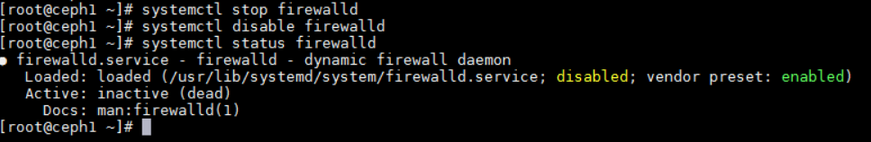
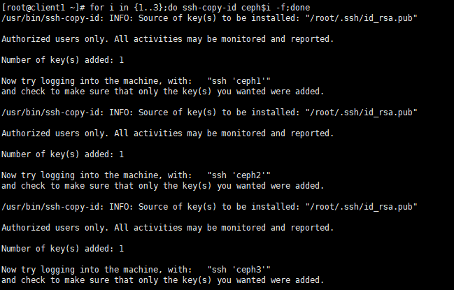
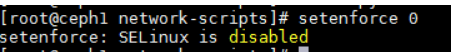
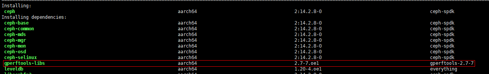
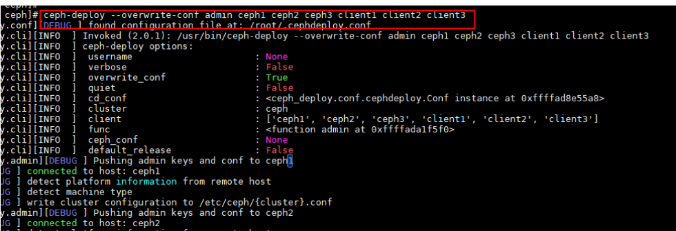
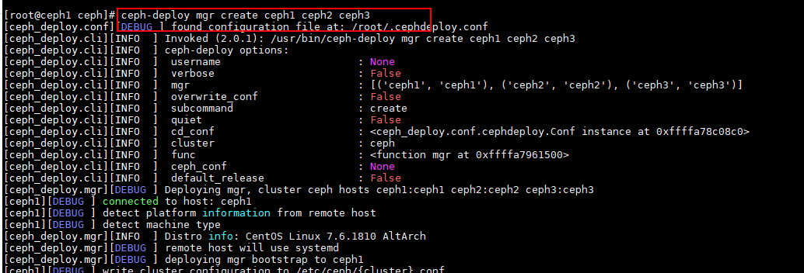
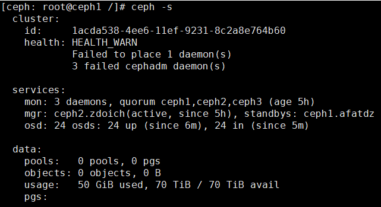
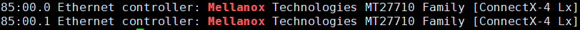
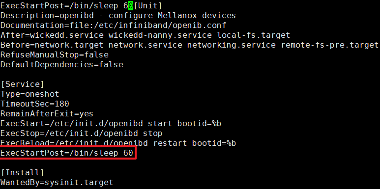
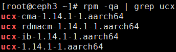

# RDMA网络加速特性指南

## 特性描述<a name="ZH-CN_TOPIC_0000002520751404"></a>

### 简介<a name="ZH-CN_TOPIC_0000002551871375"></a>

UCX（Unified Communication X）是一个通用通信框架，位于应用层和驱动层之间，为应用提供统一的通信接口，支持TCP/IP网络和RDMA（Remote Direct Memory Access）网络。UCX最初应用于HPC（High Performance Compact）场景，使能RDMA以满足高吞吐和低时延的性能诉求。本文主要介绍如何在openEuler 20.03操作系统的鲲鹏服务器上部署Ceph并配置UCX的方法。

随着分布式存储的发展，对时延和CPU占用率的要求越来越高，使能RDMA成为必然选择。鲲鹏BoostKit分布式存储RDMA网络加速特性主要为使用UCX网络框架使能RDMA网络，并主要应用于Ceph集群前后端网络。UCX可同时使能RDMA和TCP/IP，当前已同时应用于前端网络和集群网络。

### 其他信息<a name="ZH-CN_TOPIC_0000002551871381"></a>

在配置特性前，请先了解License支持信息、使用约束与限制和原理。

**可获得性<a name="section9679018303"></a>**

- 版本：支持Ceph 14.2.8、UCX 1.14.1。

**约束与限制<a name="section6558111125513"></a>**

RDMA网络加速特性为UCX+Ceph 14.2.8形式，暂不支持UCX+其他分布式存储形式。

**原理描述<a name="section123713125487"></a>**

Ceph分布式存储开源版本中存在以下三种通信框架：

- Simple：即为简单的CS模型处理，为每个连接创建两个线程用于收发，模型相对简单，但是随着连接数增加，线程数也会随之急剧增加。
- Async：即为异步通信框架，收发消息均通过异步消息框架处理，再将处理结果异步发送给应用线程，此种方式随着连接数增加，处理线程不会增加，但是会使收发性能因为异步等待而下降，此异步框架现在被主流使用。
- XIO：为Ceph新开发的通信框架，目前尚未商用。

RDMA网络加速特性主要使用UCX适配Ceph分布式存储开源版本主流使用的Async异步框架，使能端到端RDMA。

在配置特性前，请先了解License支持信息、使用约束与限制和原理。

## 环境要求<a name="ZH-CN_TOPIC_0000002520911386"></a>

本文基于鲲鹏服务器和openEuler操作系统提供指导，在正式操作前请确保软硬件均满足要求。

**环境组网<a name="section207531556152516"></a>**

环境组网使用分布式存储Ceph系统，3\*client + 3\*server。


**硬件要求<a name="section116628440251"></a>**

**表 1** 硬件要求<a id="硬件要求"></a>

| 项目  | 规格                                                                    |
|-----|-----------------------------------------------------------------------|
| 服务器 | TaiShan 200鲲鹏服务器                                                      |
| CPU | 鲲鹏920处理器                                                              |
| 网卡  | Client节点：一张2\*25GE网卡，总计50GE<br>Ceph节点：一张4\*25GE网卡或两张2\*25GE网卡，总计100GE |

**操作系统和软件要求<a name="section1240364411598"></a>**

**表 2** 操作系统和软件要求<a id="操作系统和软件要求"></a>

| 项目      | 版本                      | 获取地址                                                                                                                           |
|---------|-------------------------|--------------------------------------------------------------------------------------------------------------------------------|
| 物理机操作系统 | openEuler 20.03 LTS SP4 | [获取链接](https://mirrors.tools.huawei.com/openeuler/openEuler-20.03-LTS-SP4/ISO/aarch64/openEuler-20.03-LTS-SP4-aarch64-dvd.iso) |
| Ceph    | 14.2.8                  | [获取链接](https://download.ceph.com/tarballs/ceph-14.2.8.tar.gz)                                                                  |
| UCX     | 1.14.1                  | [获取链接](https://github.com/openucx/ucx/releases/download/v1.14.1/ucx-1.14.1-1.el7.src.rpm)                                      |

## 获取软件包<a name="ZH-CN_TOPIC_0000002551791389"></a>

在编译和部署UCX之前，需要准备以下软件包和文件。

| 软件包                   | 说明             | 获取路径                                                                                     |
|-----------------------|----------------|------------------------------------------------------------------------------------------|
| ceph-14.2.8-ucx.patch | Ceph适配UCX的补丁文件 | [获取链接](https://gitcode.com/boostkit/ceph/releases/download/v1.0.1/ceph-14.2.8-ucx.patch) |

在编译和部署UCX之前，需要准备以下软件包和文件。

## 编译安装UCX和Ceph软件包<a name="ZH-CN_TOPIC_0000002520911394"></a>

### 编译和安装UCX包<a id="编译和安装UCX包"></a>

编译和部署UCX开源软件包，主要包括编译并构建出用于编译Ceph时需要依赖的UCX RPM包。

1. 获取UCX开源软件包。

    ```sh
    wget https://github.com/openucx/ucx/releases/download/v1.14.1/ucx-1.14.1-1.el7.src.rpm --no-check-certificate
    ```

    获取路径请参见[**表 2** 操作系统和软件要求](#操作系统和软件要求)。

2. 定义RPM包编译路径。
    1. 打开`/root/.rpmmacros`文件。

        ```sh
        vi /root/.rpmmacros
        ```

    2. 按`i`进入编辑模式，将`%_topdir`路径设置为编译RPM包的路径（本例中以新建路径`/root/rpmbuild`为例），并将其他行的内容全部注释掉。

        ```sh
        %_topdir /root/rpmbuild
        ```

    3. 按`Esc`键退出编辑模式，输入`:wq!`，按`Enter`键保存并退出文件。
    4. 创建rpmbuild下的构建目录。

        ```sh
        yum install rpmdevtools
        rpmdev-setuptree
        ```

3. 安装UCX RPM包。

    ```sh
    rpm -ivh ucx-1.14.1-1.el7.src.rpm
    ```

4. 安装编译依赖。

    ```sh
    yum install libibverbs-devel librdmacm-devel libtool numactl-devel
    ```

5. 编译并构建RPM包。在RPM编译路径下，编译并构建ucx.spec文件，生成RPM包。

    ```sh
    cd /root/rpmbuild/SPECS
    rpmbuild -bb ucx.spec
    ```

    编译完成后在`/root/rpmbuild/RPMS/aarch64`目录下会生成如下图所示的8个RPM包。

    

6. 安装RPM包。

    ```sh
    cd /root/rpmbuild/RPMS/aarch64
    ```

    ```sh
    rpm -ivh ucx-1.14.1-1.aarch64.rpm
    rpm -ivh ucx-cma-1.14.1-1.aarch64.rpm
    rpm -ivh ucx-debuginfo-1.14.1-1.aarch64.rpm
    rpm -ivh ucx-debugsource-1.14.1-1.aarch64.rpm
    rpm -ivh ucx-devel-1.14.1-1.aarch64.rpm
    rpm -ivh ucx-ib-1.14.1-1.aarch64.rpm
    rpm -ivh ucx-rdmacm-1.14.1-1.aarch64.rpm
    rpm -ivh ucx-static-1.14.1-1.aarch64.rpm
    ```

### 编译Ceph软件包<a name="ZH-CN_TOPIC_0000002551871379"></a>

#### 安装依赖包<a name="ZH-CN_TOPIC_0000002551871377"></a>

1. 安装通用组件。

    ```sh
    yum install CUnit-devel boost-random checkpolicy cmake cryptsetup-devel expat-devel fmt-devel fuse-devel gperf java-devel junit keyutils-libs-devel libaio-devel libbabeltrace-devel libblkid-devel libcap-ng-devel libcurl-devel numactl-devel libicu-devel libnl3-devel liboath-devel librabbitmq-devel librdkafka-devel librdmacm-devel libtool libxml2-devel lttng-ust-devel lua-devel lz4-devel make nasm ncurses-devel ninja-build nss-devel openldap-devel openssl-devel libudev-devel python3-Cython python3-devel python3-prettytable python3-pyyaml python3-setuptools python3-sphinx re2-devel selinux-policy-devel sharutils snappy-devel sqlite-devel sudo thrift-devel valgrind-devel xfsprogs-devel xmlstarlet doxygen python2-Cython createrepo gperftools leveldb-devel yasm -y
    ```

2. 安装RDMA相关依赖。

    ```sh
    yum install libibverbs-devel rdma-core-devel numactl-devel -y
    ```

#### 编译Ceph<a id="编译Ceph"></a>

1. 下载ceph-14.2.8源码。

    ```sh
    wget https://download.ceph.com/tarballs/ceph-14.2.8.tar.gz --no-check-certificate
    ```

2. 合入UCX patch（将`ceph-14.2.8-ucx.patch`放到当前目录下）。

    ```sh
    tar -zxvf ceph-14.2.8.tar.gz
    cd ceph-14.2.8
    patch -p1 < ceph-14.2.8-ucx.patch
    ```

3. 编译Ceph。

    ```sh
    cd ..
    tar -zcvf ceph-14.2.8.tar.bz2 ceph-14.2.8
    cp ceph-14.2.8/ceph.spec /root/rpmbuild/SPECS/
    cp ceph-14.2.8.tar.bz2 /root/rpmbuild/SOURCES/
    rpmbuild -bb /root/rpmbuild/SPECS/ceph.spec
    ```

## 部署Ceph<a name="ZH-CN_TOPIC_0000002551791391"></a>

### 配置部署环境<a name="ZH-CN_TOPIC_0000002520911390"></a>

1. 关闭防火墙。

    关闭本节点防火墙，需在所有服务端节点和客户端节点依次执行如下命令。

    ```sh
    systemctl stop firewalld
    systemctl disable firewalld
    systemctl status firewalld
    ```

    

2. 配置主机名。

    配置永久静态主机名，服务端节点配置为ceph1\~ceph3，客户端节点配置为client1\~client3。

    1. 配置节点名称。
        1. ceph1节点：

            ```sh
            hostnamectl --static set-hostname ceph1
            ```

        2. client1节点：

            ```sh
            hostnamectl --static set-hostname client1 
            ```

            其余节点的主机名配置可参照上述示例。

    2. 修改域名解析文件。

        ```sh
        vi /etc/hosts
        ```

        在所有服务端节点和客户端节点的`/etc/hosts`中添加如下内容。

        ```sh
        192.168.3.166   ceph1 
        192.168.3.167   ceph2
        192.168.3.168   ceph3
        192.168.3.160   client1 
        192.168.3.161   client2 
        192.168.3.162   client3
        ```

        >  **说明：** 
        > 
        > - 以上的IP地址仅为示例，需根据实际情况进行替换。可通过`ip a`命令查询实际IP地址。
        > - 服务端节点主机名建议配置为ceph1\~ceph3。
        > - 客户端节点主机名建议配置为client1\~client3。
        > - 上述示例以3节点服务端和3节点客户端为例，根据实际节点数量调整。

3. 配置NTP。

    由于Ceph会自动校验存储节点之间的时间，若时差较大将触发告警，因此需要配置时钟同步。

    1. 安装NTP服务。
        1. 在所有服务端节点和客户端节点安装NTP。

            ```sh
            yum -y install ntp ntpdate
            ```

        2. 在所有服务端节点和客户端节点备份旧配置。

            ```sh
            cd /etc && mv ntp.conf ntp.conf.bak
            ```

        3. 以ceph1为NTP服务端节点，在ceph1新建NTP文件。

            ```sh
            vi /etc/ntp.conf
            ```

            并新增如下内容作为NTP服务端。

            ```txt
            restrict 127.0.0.1 
            restrict ::1 
            restrict 192.168.3.0 mask 255.255.255.0
            server 127.127.1.0 
            fudge 127.127.1.0 
            stratum 8
            restrict default kod nomodify notrap nopeer noquery
            interface ignore wildcard
            interface listen x.x.x.x(此处为服务器的IP地址)
            ```

            > **说明：** 
            > 
            >其中，`restrict 192.168.3.0 mask 255.255.255.0`是ceph1所在的IP网段与掩码。

        4. 在ceph2、ceph3及所有客户端节点新建NTP文件。

            ```sh
            vi /etc/ntp.conf
            ```

            并新增如下内容，其中IP地址为ceph1的地址。

            ```txt
            server 192.168.3.166 
            ```

    2. 启动NTP服务。
        1. 在ceph1节点启动NTP服务，并检查状态。

            ```sh
            systemctl start ntpd 
            systemctl enable ntpd 
            systemctl status ntpd 
            ```

            

        2. 在除ceph1的所有节点强制同步server（ceph1）时间。

            ```sh
            ntpdate ceph1 
            ```

        3. 在除ceph1的所有节点写入硬件时钟，避免重启后失效。

            ```sh
            hwclock -w 
            ```

        4. 在除ceph1的所有节点安装并启动crontab工具。

            ```sh
            yum install -y crontabs
            systemctl enable crond.service
            systemctl start crond 
            crontab -e 
            ```

        5. 添加以下内容，每隔10分钟自动与ceph1同步时间。

            ```txt
            */10 * * * * /usr/sbin/ntpdate 192.168.3.166
            ```

4. 配置免密登录。

    在ceph1节点生成公钥，并发放到各个服务端/客户端节点。

    - 对于ceph1、ceph2、ceph3、client1、client2、client3的三节点网络。

        ```sh
        ssh-keygen -t rsa 
        for i in {1..3};do ssh-copy-id ceph$i;done
        for i in {1..3};do ssh-copy-id client$i;done
        ```

    - 对于ceph1、client1的单节点网络。

        ```sh
        ssh-keygen -t rsa
        ssh-copy-id ceph1
        ssh-copy-id client1
        ```

    >  **说明：** 
    > 
    > 输入第一条命令`ssh-keygen -t rsa`之后，按回车使用默认配置。
    >
    > 
    >
    > 

5. 设置permissive模式。

    设置permissive模式，需在所有服务端节点和客户端节点执行。

    - 临时关闭，重启操作系统后失效，与下一条互补。

        ```sh
        setenforce permissive
        ```

        

    - 永久设置，下次重启自动生效。

        ```sh
        vi /etc/selinux/config
        ```

        修改`SELINUX=permissive`。

        

### 安装Ceph<a name="ZH-CN_TOPIC_0000002520911384"></a>

请在所有server节点和client节点安装Ceph。

1. 设置所有服务端节点和客户端节点Yum证书的验证状态为不验证。
    1. 打开文件。

        ```sh
        vi /etc/yum.conf
        ```

    2. 按`i`进入编辑模式，在文件最后添加如下内容。

        ```sh
        sslverify=false
        deltarpm=0
        ```

    3. 按`Esc`键退出编辑模式，输入`:wq!`，按`Enter`键保存并退出文件。

2. （可选）在所有服务端和客户端节点配置gperftools工具的本地源。
    1. 下载`gperftools-devel-2.7.7`和`gperftools-libs-2.7.7`的RPM包。

        ```sh
        mkdir -p /home/gperftools-2.7-7 && cd /home/gperftools-2.7-7
        wget --no-check-certificate  https://repo.openeuler.org/openEuler-20.03-LTS/OS/aarch64/Packages/gperftools-devel-2.7-7.oe1.aarch64.rpm
        wget --no-check-certificate  https://repo.openeuler.org/openEuler-20.03-LTS/OS/aarch64/Packages/gperftools-libs-2.7-7.oe1.aarch64.rpm
        createrepo .
        ```

    2. 打开`/etc/yum.repos.d/openEuler.repo`文件。

        ```sh
        vi /etc/yum.repos.d/openEuler.repo
        ```

    3. 按`i`进入编辑模式，在文件最后新增以下内容：

        ```ini
        [gperftools-2.7-7]
        name=gperftools-2.7-7
        baseurl=file:///home/gperftools-2.7-7
        enabled=1
        gpgcheck=0
        priority=1
        ```

    4. 按`Esc`键退出编辑模式，输入`:wq!`，按`Enter`键保存并退出文件。

3. 在所有服务端节点和客户端节点安装rdma依赖包。

    ```sh
    yum install libibverbs-devel rdma-core-devel numactl-devel -y
    ```

4. 在所有服务端节点和客户端节点安装ucx rpm包（将[4.1](#编译和安装UCX包)生成的rpm包放到各个节点上）。

    ```sh
    rpm -ivh ucx-1.14.1-1.aarch64.rpm
    rpm -ivh ucx-cma-1.14.1-1.aarch64.rpm
    rpm -ivh ucx-debuginfo-1.14.1-1.aarch64.rpm
    rpm -ivh ucx-debugsource-1.14.1-1.aarch64.rpm
    rpm -ivh ucx-devel-1.14.1-1.aarch64.rpm
    rpm -ivh ucx-ib-1.14.1-1.aarch64.rpm
    rpm -ivh ucx-rdmacm-1.14.1-1.aarch64.rpm
    rpm -ivh ucx-static-1.14.1-1.aarch64.rpm
    ```

5. 将已经编好的并已完成使能ucx后的ceph rpm包（[编译Ceph](#编译Ceph)章节中生成的）放入`/home/ceph-ucx`，并配成本地源。

    ```sh
    vi /etc/yum.repos.d/local.repo
    ```

    在文件末尾添加如下内容后保存并退出。

    ```ini
    [ceph-ucx]
    name=ceph-ucx
    baseurl=file:///home/ceph-ucx
    enabled=1
    gpgcheck=0
    priority=1
    ```

6. 刷新yum源。

    ```sh
    cd /home/ceph-ucx
    createrepo .
    ```

7. 在所有服务端节点和客户端节点安装Ceph。

    ```sh
    dnf -y install librados2-14.2.8 ceph-14.2.8
    pip install prettytable werkzeug
    ```

    若安装Ceph失败，需配置网络代理。

    >  **注意：** 
    > 
    > 安装Ceph过程中，注意校验gperftool的版本为2.7-7版本。
    >
    > 

8. 在ceph1节点安装ceph-deploy。

    ```sh
    pip install ceph-deploy
    ```

9. 适配openEuler系统。
    1. 打开ceph1节点上的`/lib/python2.7/site-packages/ceph_deploy/hosts/__init__.py`文件。

        ```sh
        vi /lib/python2.7/site-packages/ceph_deploy/hosts/__init__.py
        ```

    2. 按`i`进入编辑模式，在文件的`_get_distro`函数中增加如下代码。

        ```sh
        'openeuler':fedora,
        ```

        

    3. 按`Esc`键退出编辑模式，输入`:wq!`，按`Enter`键保存并退出文件。

10. 在各节点查看Ceph版本。

    ```sh
    ceph -v
    ```

    查询结果如下所示，表示安装Ceph成功。

    ```sh
    ceph version 14.2.8 (2d095e947a02261ce61424021bb43bd3022d35cb) nautilus (stable)
    ```

请在所有server节点和client节点安装Ceph。

### 部署Ceph<a name="ZH-CN_TOPIC_0000002551791387"></a>

#### 部署MON<a name="ZH-CN_TOPIC_0000002520751406"></a>

MON（Monitor）负责监控整个Ceph集群的状态。部署MON操作步骤仅需要在主节点ceph1执行。

1. 创建Ceph集群（以ceph1 ceph2 ceph3三个节点配置为例）。

    ```sh
    cd /etc/ceph
    ceph-deploy new ceph1 ceph2 ceph3
    ```

    

2. 配置Ceph集群的全局参数和MON参数。

    >  **须知：** 
    > 
    > 配置节点命令以及使用ceph-deploy配置OSD时，需在`/etc/ceph`目录下执行，否则会报错。

    1. 打开`/etc/ceph`目录下自动生成的ceph.conf文件。

        ```sh
        vi /etc/ceph/ceph.conf
        ```

    2. 按`i`进入编辑模式，将ceph.conf中的内容修改为如下信息（使用最新生成的fsid）。

        ```ini
        [global]
        fsid = f5a4f55c-d25b-4339-a1ab-0fceb4a2996f
        mon_initial_members = ceph1, ceph2, ceph3
        mon_host = 192.168.3.166,192.168.3.167,192.168.3.168
        auth_cluster_required = cephx
        auth_service_required = cephx
        auth_client_required = cephx
        
        public_network = 192.168.65.0/24
        cluster_network = 192.168.66.0/24
        
        [mon]
        mon_allow_pool_delete = true
        ```

        对于单节点环境，还需要在`[global]`下添加如下内容：

        ```ini
        osd_pool_default_size = 1
        osd_pool_default_min_size = 1
        ```

    3. 按`Esc`键退出编辑模式，输入`:wq!`，按`Enter`键保存并退出文件。

    >  **说明：**
    > 
    > Ceph 14.2.8版本在使用bluestore引擎的时候默认会打开bluefs的buffer开关，可能导致系统下内存全部被buff/cache占用，从而导致性能下降。可以采用以下两种方案解决：
    >
    > - 在集群压力不大的场景下可以将`bluefs_buffered_io`开关设置成false。
    > - 可以通过定时执行如下命令来强制回收buffer/cache中的内存：
    >
    >    ```sh
    >    echo 3 > /proc/sys/vm/drop_caches
    >    ```

3. <a id="zh-cn_topic_0000001210295277_li165307499543"></a>初始化监视器并收集密钥。

    ```sh
    ceph-deploy mon create-initial
    ```

    

4. 将[步骤3](#zh-cn_topic_0000001210295277_li165307499543)执行成功后生成的`ceph.client.admin.keyring`拷贝到各个节点上。

    ```sh
    ceph-deploy --overwrite-conf admin ceph1 ceph2 ceph3 client1 client2 client3
    ```

    

5. 检查Ceph集群的状态，确认是否配置MON成功。

    ```sh
    ceph -s
    ```

    配置MON成功的预期结果：

    ```txt
    cluster:
    id:     f6b3c38c-7241-44b3-b433-52e276dd53c6
    health: HEALTH_OK
    services:
    mon: 3 daemons, quorum ceph1,ceph2,ceph3 (age 25h)
    ```

    >  **说明：**
    > 
    > 若出现MON生成失败问题，可能是权限配置问题，需要配置Ceph组和用户：
    >
    > ```sh
    > /usr/sbin/groupadd ceph -g 167 -o -r 2>/dev/null || :/usr/sbin/useradd ceph -u 167 -o -r -g ceph -s /sbin/nologin -c "Ceph daemons" -d /var/lib/ceph 2>/dev/null || :
    > ```

#### 部署MGR<a name="ZH-CN_TOPIC_0000002551871385"></a>

MGR（Manager）是Ceph集群管理的关键组件，它主要负责收集Ceph集群的状态和运行指标。仅需要在主节点ceph1上部署MGR，可以在ceph2和ceph3同步部署。

1. 部署MGR节点。

    ```sh
    ceph-deploy mgr create ceph1 ceph2 ceph3
    ```

    

2. 检查Ceph集群的状态，确认MGR是否部署成功。

    ```sh
    ceph -s
    ```

    结果如下所示。

    ```txt
    cluster:
    id:     f6b3c38c-7241-44b3-b433-52e276dd53c6
    health: HEALTH_OK
    
    services:
    mon: 3 daemons, quorum ceph1,ceph2,ceph3 (age 25h)
    mgr: ceph1(active, since 2d), standbys: ceph2, ceph3
    ```

#### 添加OSD<a name="ZH-CN_TOPIC_0000002520751410"></a>

NVMe盘划分为12个60GB分区、12个180GB分区，分别对应WAL分区、DB分区。

1. 创建一个partition.sh脚本（若不分区忽略此步）。

    ```sh
    vi partition.sh
    ```

2. 添加如下内容（以单个NVMe SSD盘分12个区为例，若不分区忽略此步）。

    ```sh
    #!/bin/bash
    
    parted /dev/nvme0n1 mklabel gpt
    
    for j in `seq 1 12`
    do
    ((b = $(( $j * 8 ))))
    ((a = $(( $b - 8 ))))
    ((c = $(( $b - 6 ))))
    str="%"
    echo $a
    echo $b
    echo $c
    parted /dev/nvme0n1 mkpart primary ${a}${str} ${c}${str}
    parted /dev/nvme0n1 mkpart primary ${c}${str} ${b}${str}
    done
    ```

3. 创建完脚本后执行脚本（若不分区忽略此步）。

    ```sh
    bash partition.sh
    ```

4. 在ceph1上创建脚本create\_osd.sh，在每台服务器上的12块硬盘分区部署OSD。

    ```sh
    vi /etc/ceph/create_osd.sh
    ```

5. 添加以下内容。

    ```sh
    #!/bin/bash
    
    for node in ceph1 ceph2 ceph3
    do
    for i in {0..7}
    do
    ceph-deploy osd create ${node} --data /dev/nvme${i}n1
    done
    done
    ```

6. 在ceph1上运行脚本。

    ```sh
    bash create_osd.sh
    ```

7. 创建成功后，查看是否正常。

    ```sh
    ceph -s
    ```

    

NVMe盘划分为12个60GB分区、12个180GB分区，分别对应WAL分区、DB分区。

### 卸载Ceph<a name="ZH-CN_TOPIC_0000002551871389"></a>

卸载Ceph即删除节点中的所有Ceph组件。

1. 停止所有Ceph服务进程。

    ```sh
    systemctl stop ceph.target
    ```

2. 卸载Ceph。

    ```sh
    yum rm ceph-14.2.8 librados2-14.2.8
    ```

3. 卸载Ceph相关目录。

    ```sh
    rm -rf /var/lib/ceph/*
    rm -rf /etc/ceph/*
    rm -rf /var/run/ceph/*
    ```

卸载Ceph即删除节点中的所有Ceph组件。

## 集群切换UCX组网<a name="ZH-CN_TOPIC_0000002520751408"></a>

在使能UCX之前，需要在Ceph配置文件中新增一些UCX相关的配置和配置UCX环境变量。为了使能UCX多轨功能，还需要配置`UCX_MAX_RNDV_RAILS`和`UCX_MAX_EAGER_RAILS`两个选项。

1. 查看硬件和驱动是否支持RoCE。以Mellanox网卡为例。

    ```sh
    lspci | grep Mellanox
    ```

    如果支持RoCE，将返回如下信息：

    

2. 在所有服务端节点停止Ceph服务。

    ```sh
    systemctl stop ceph.target
    ```

3. 在所有服务端节点和客户端节点，修改Ceph配置文件。在`/etc/ceph/ceph.conf`的global字段下新增如下信息。

    ```ini
    ms_type = async+ucx
    ms_public_type = async+ucx
    ms_cluster_type = async+ucx
    ms_async_ucx_device=mlx5_0:1,mlx5_1:1
    ms_async_ucx_tls=rc_verbs,self
    ms_async_ucx_max_recv=14
    ```

    >  **须知：** 
    >
    > - `ms_async_ucx_device`中的设备名称可以通过show\_gids查询，可填写多个网络设备。`show_gids`命令异常时参考[更新网卡固件和驱动](#更新网卡固件和驱动)。
    > - 若需要在前端网络使能ucx，需要将`ms_public_type=async+ucx`，若仅使能后端网络需将`ms_type`和`ms_public_type`均设置为async+posix。
    > - `cluster_network`和`public_network`的IP地址应与UCX设备（RoCE网口）的IP地址一致。

4. 在所有服务端节点和客户端节点，配置UCX环境变量。修改`/etc/sysconfig/ceph`文件，在文件中的空白处新增如下信息。

    ```ini
    UCX_MODULE_DIR=/lib64/ucx
    UCX_RNDV_THRESH=32k
    UCX_MEM_MMAP_HOOK_MODE=none
    UCX_MAX_RNDV_RAILS=4
    UCX_MAX_EAGER_RAILS=4
    UCX_PROTO_ENABLE=y
    ```

    >  **须知：** 
    > 
    > - 若需要UCX日志可以配置如下。
    >
    >    ```ini
    >    UCX_LOG_FILE=/var/log/ceph/ucx_%p.log
    >    UCX_LOG_LEVEL=DEBUG
    >    ```
    >
    > - `UCX_MEM_MMAP_HOOK_MODE`有`reloc`/`bistro`/`none`可选，使能tcmalloc大页时需要配置为`reloc`。
    > - 若需要同时使用两个网口，需要使能UCX多轨功能，配置`UCX_MAX_RNDV_RAILS`和`UCX_MAX_EAGER_RAILS`两个选项（1\~4），将两个选项的值均配置成2或2以上。UCX多轨配置比bond组合方式流量分配更均衡，可以达到更大的网络带宽。

5. 在所有服务端节点和客户端节点，修改内存限制。修改`/etc/security/limits.conf`文件，在文件中的空白处新增如下信息。

    ```sh
    root soft memlock unlimited
    root hard memlock unlimited
    ceph soft memlock unlimited
    ceph hard memlock unlimited
    ```

6. 修改systemd下的Ceph配置文件。修改`/lib/systemd/system/`文件中的`ceph-mds@.service`、`ceph-mgr@.service`、`ceph-mon@.service`和`ceph-osd@.service`，在service字段下新增如下信息。

    ```ini
    LimitMEMLOCK=infinity
    LimitCORE=infinity
    PrivateDevices=no
    ```

7. 修改`/lib/systemd/system/`文件中的`ceph-mds@.service`、`ceph-mgr@.service`、`ceph-mon@.service`和`ceph-osd@.service`，在After和Wants字段下新增如下信息。

    

8. 配置openibd启动后等待60s。

    ```sh
    vim /usr/lib/systemd/system/openibd.service
    ```

    设置以下配置项。

    ```ini
    ExecStartPost=/bin/sleep 60
    ```

    

9. 在所有服务端节点和客户端节点设置如下。

    ```sh
    ulimit -l unlimited
    ulimit -n 1048576
    ```

10. 启动前检验UCX安装包是否已经安装齐全。

    >  **须知：**
    > 
    > 请确保4个安装包均已安装，否则可能会导致OSD服务停止运行。

    ```sh
    rpm -qa | grep ucx
    ```

    4个安装包均已安装的预期结果示例。

    

11. 更新配置并启动Ceph。

    ```sh
    systemctl daemon-reload
    systemctl start ceph.target
    ```

    >  **说明：** 
    > 
    > 大压力场景下，仅支持256 images的规格。

## 配置流控和查看流量（RoCE网络下配置）<a name="ZH-CN_TOPIC_0000002520911398"></a>

### 配置交换机<a name="ZH-CN_TOPIC_0000002551871387"></a>

为了配置无损网络，需要配置交换机。本文以HUAWEI CE6863-48S6CQ的交换机为例，执行流控策略。

1. <a id="li1100413134"></a>登录交换机，设置PFC（Priority-based Flow Control）译文优先级。

    ```sh
    system-view
    dcb pfc
    priority 0
    commit
    quit
    ```

2. 查看PFC优先级使能。

    ```sh
    display dcb pfc-profile
    ```

    命令返回0表示[步骤1](#li1100413134)配置成功。

    

3. <a id="li1586514481310"></a>配置ECN（Explicit Congestion Notification）。

    ```sh
    system-view
    drop-profile ecn
    color green buffer-size low-limit 247520 high-limit 18000000 discard-percentage 100
    commit
    quit
    ```

4. 查看ECN。

    ```sh
    display drop-profile ecn
    ```

    命令返回如下信息，表示[步骤3](#li1586514481310)配置成功。

    

5. <a id="li202741334141411"></a>为每个流量端口配置流控。此处以25GE 1/0/5端口为例。

    ```sh
    interface 25GE 1/0/5
    qos queue 0 wred ecn
    qos queue 0 ecn
    dcb pfc enable mode manual
    dcb pfc buffer 0 xoff static 1500 cells
    commit
    quit
    ```

6. 查看端口流控配置是否成功。

    ```sh
    interface 25GE 1/0/5
    display this
    ```

    命令返回[步骤5](#li202741334141411)中的配置信息，则表示端口流控配置成功。

为了配置无损网络，需要配置交换机。本文以HUAWEI CE6863-48S6CQ的交换机为例，执行流控策略。

### 查看端口流量<a name="ZH-CN_TOPIC_0000002551791393"></a>

可以通过查看端口是否有流量来验证交换机的配置在业务侧是否生效。

1. 在所有节点上的RoCE网卡配置优先级队列。

    >  **须知：** 
    > 
    > 即使您已将两个端口组绑定（mode 0/2/4），仍需要分别配置每个端口的优先级队列，以获得最佳的网络性能。

    ```sh
    mlnx_qos -i enp133s0f0 -f 1,0,0,0,0,0,0,0
    mlnx_qos -i enp133s0f1 -f 1,0,0,0,0,0,0,0
    ```

2. 查看网卡上是否有流量。

    ```sh
    watch -n 1 "ethtool -S enp133s0f0 | grep prio"
    watch -n 1 "ethtool -S enp133s0f1 | grep prio"
    ```

    **如果返回的网口流量会变化，表示网卡有流量。**

    

    **图 1** 网口enp133s0f0返回示例<a name="fig22151324163920"></a><a id="网口enp133s0f0返回示例"></a>
    
    

    **图 2** 网口enp133s0f1返回示例<a name="fig97302564393"></a><a id="网口enp133s0f1返回示例"></a>

可以通过查看端口是否有流量来验证交换机的配置在业务侧是否生效。

## 常见问题<a name="ZH-CN_TOPIC_0000002520911396"></a>

### 更新网卡固件和驱动<a name="ZH-CN_TOPIC_0000002520911400"></a>

1. [下载固件包](https://support.huawei.com/enterprise/zh/software/262409138-ESW2001281573)并解压（以CX-5网卡为例）。
2. 升级固件。

    ```sh
    cd NIC-SP382-CX5-FW-16.32.1010-ARM
    ./install.sh upgrade
    ```

3. 安装驱动软件依赖包。

    ```sh
    yum install createrepo perl pciutils gcc-gfortran tcsh expat glib2 tcl libstdc++ bc tk gtk2 atk cairo numactl pkgconfig ethtool lsof rpm-build libxml2-python python autoconf automake libtool
    ```

4. 单击[下载驱动](https://support.huawei.com/enterprise/zh/management-software/computing-component-idriver-pid-259488843/software/262409128?idAbsPath=fixnode01%7C23710424%7C251364417%7C251364851%7C254884035%7C259488843)下载网卡驱动。
5. 安装驱动。
    1. 解压下载的iso文件。

        ```sh
        mkdir /mnt/iso
        mount -o loop ***.iso /mnt/iso
        cd /mnt/iso
        ```

        >  **说明：**
        > 
        > - `***.iso`为网卡驱动对应的实际iso文件，例如：`onboard_driver_openEuler20.03.iso`。
        > - 下文`***.tgz`为实际iso中的驱动压缩包，真实名称以实际情况为准。

    2. 安装驱动（两种方式）。
        - 方式一：通过解压安装包安装驱动。

            ```sh
            cp ***.tgz /home
            cd /home
            tar xf ***.tgz
            cd ***
            ./mlnxofedinstall --force --without-depcheck --without-fw-update --add-kernel-support  --skip-distro-check
            ```

        - 方式二：通过脚本自动安装。

            ```sh
            ./install.sh  #（参考同目录下的readme_zh.txt）
            ```

6. 重新加载驱动。

    ```sh
    dracut -f
    /etc/init.d/openibd restart
    ```

    >  **说明：** 
    > 
    >如果遇到有相关驱动正在使用中，请停止相关业务以便驱动能正常重载。

7. 重启节点。

    ```sh
    reboot
    ```

> **说明：** 
> 
> 目前推荐使用版本如下：
>
> 1. 固件版本：16.32.1010 \(HUA0000000024\)。
> 2. 驱动版本：
>    - openEuler 20.03 ARM推荐版本：24.01-0.3.3。
>    - openEuler 20.03 x86推荐版本：5.8-1.1.2。

### 解决业务执行时驱动报错<a name="ZH-CN_TOPIC_0000002551791401"></a>

**问题现象描述<a name="section2294102135420"></a>**

在执行业务相关操作时，报错如[**图 1** 报错信息](#报错信息)所示。


**图 1** 报错信息<a name="fig12478132704215"></a><a id="报错信息"></a>

**解决方法<a name="section5188164015718"></a>**

若dmesg出现上述报错，需要在节点配置以下参数。

```sh
mst start
mlxconfig -d 85:00.0 -y s PF_LOG_BAR_SIZE=8
reboot
```

>  **说明：** 
> 
> 85:00.0为网卡PCIe号。

### SP670网卡需要更新驱动才能支持UCX<a name="ZH-CN_TOPIC_0000002520751412"></a>

1. 参见[获取链接](https://support.huawei.com/enterprise/zh/huawei-computing-components/in220-pid-253287505/software/266018371?idAbsPath=fixnode01)下载最新的固件和驱动安装包并解压（NIC-FW-17.12.1.2.tar.gz、SDK\_LINUX-17.12.1.2-openEuler22.03SP4-aarch64.tar.gz）。
2. 升级固件。

    ```sh
    tar -zvxf NIC-FW-17.12.1.2.tar.gz
    cd NIC-FW-17.12.1.2
    rpm -ivh tool/aarch64/hinicadm3-17.12.1.2-1.aarch64.rpm
    hinicadm3 updatefw -i hinic0 -f ./SP670/Hinic3_flash.bin -or
    ```

    

3. 安装驱动。需要安装其OS内核对应的驱动版本，这里以openEuler 22.03 LTS SP4为例进行说明。

    ```sh
    tar -zvxf SDK_LINUX-17.12.1.2-openEuler22.03SP4-aarch64.tar.gz
    cd SDK_LINUX-17.12.1.2-openEuler22.03SP4-aarch64
    rpm -ivh nic/hisdk3-17.12.1.2_5.10.0_216.0.0.115.oe2203sp4.aarch64-1.aarch64.rpm
    rpm -ivh nic/hinic3-17.12.1.2_5.10.0_216.0.0.115.oe2203sp4.aarch64-1.aarch64.rpm
    rpm -ivh roce/hiroce3-17.12.1.2_5.10.0_216.0.0.115.oe2203sp4.aarch64-1.aarch64.rpm
    ```

4. 执行`reboot`重启服务器。

### UCX使用SP670网卡报错<a name="ZH-CN_TOPIC_0000002551791397"></a>

**问题现象描述<a name="section488342804215"></a>**

`ucx_info -d`扫描设备时，出现如下报错。


**问题原因<a name="section17231118112312"></a>**

报错是因为UCX默认Rx队列深度为4096，而SP670最大深度支持为4095，因此需要调整UCX Rx队列的默认深度值。

**解决方法<a name="section5188164015718"></a>**

1. 为了解决该问题，需要修改一行代码。参考下方的代码完成修改。

    ```sh
    cd /root/rpmbuild/SOURCES/
    tar -zxvf ucx-1.14.1.tar.gz
    vim ucx-1.14.1/src/uct/ib/base/ib_iface.c
    ```

    修改`RX_QUEUE_LEN`默认值，从4096修改为4095。

    

    对该文件进行打包。

    ```sh
    rm -rf ucx-1.14.1.tar.gz
    tar zcvf ucx-1.14.1.tar.gz ucx-1.14.1
    ```

2. 编译并构建RPM包。在RPM编译路径下，编译并构建ucx.spec文件，生成RPM包。

    ```sh
    cd /root/rpmbuild/SPECS
    rpmbuild -bb ucx.spec
    ```

    编译完成后在`/root/rpmbuild/RPMS/aarch64`目录会生成如下图所示的8个RPM包。

    

3. 安装RPM包。

    ```sh
    cd /root/rpmbuild/RPMS/aarch64
    ```

    ```sh
    rpm -ivh ucx-1.14.1-1.aarch64.rpm --force
    rpm -ivh ucx-cma-1.14.1-1.aarch64.rpm --force
    rpm -ivh ucx-debuginfo-1.14.1-1.aarch64.rpm --force
    rpm -ivh ucx-debugsource-1.14.1-1.aarch64.rpm --force
    rpm -ivh ucx-devel-1.14.1-1.aarch64.rpm --force
    rpm -ivh ucx-ib-1.14.1-1.aarch64.rpm --force
    rpm -ivh ucx-rdmacm-1.14.1-1.aarch64.rpm --force
    rpm -ivh ucx-static-1.14.1-1.aarch64.rpm --force
    ```

## 安全管理<a name="ZH-CN_TOPIC_0000002520751400"></a>

**防病毒软件例行检查<a name="section11752161613273"></a>**

定期开展对集群的防病毒扫描，防病毒例行检查会帮助集群免受病毒、恶意代码、间谍软件以及程序侵害，降低系统瘫痪、信息泄露等风险。可以使用业界主流防病毒软件进行防病毒检查。

**漏洞修复<a name="section208601325152718"></a>**

为保证生产环境的安全，降低被攻击的风险，请定期修复以下漏洞：

- 操作系统漏洞。
- OpenSSL漏洞。
- 其他相关组件漏洞。

## 缩略语<a name="ZH-CN_TOPIC_0000002520751402"></a>

| 缩略语       | 英文全称                                | 中文全称           |
|-----------|-------------------------------------|----------------|
| **A - E** |
| ECN       | Explicit Congestion Notification    | 明确拥塞通告         |
| **F - J** |
| HPC       | High Performance Compact            | 高性能紧凑型         |
| **K - O** |
| NUMA      | Non-uniform Memory Access           | 非一致性内存访问       |
| OSD       | Object Storage Daemon               | 对象存储守护进程       |
| **P - T** |
| PFC       | Priority - based Flow Control       | 基于优先级的流控       |
| RDMA      | Remote Direct Memory Access         | 远程直接存储器访问      |
| RoCE      | RDMA over Converged Ethernet        | 通过以太网实现的RDMA技术 |
| SPDK      | Storage Performance Development Kit | 存储性能开发工具包      |
| TCP       | Transmission Control Protocol       | 传输控制协议         |
| **U - Z** |
| UCX       | Unified Communication X             | 统一抽象通信接口       |
