# SPDK IO加速特性指南

## 特性描述<a name="ZH-CN_TOPIC_0000002551432413"></a>

### 简介<a name="ZH-CN_TOPIC_0000002551432415"></a>

本文主要介绍如何在openEuler 20.03操作系统的鲲鹏服务器上容器化部署Ceph集群，并配置和优化SPDK、UCX、KSAL的集成，以实现存储与网络性能的最大化，满足现代分布式存储对高吞吐量、低延迟的需求。

随着分布式存储系统对低时延、高性能需求的不断增加，Ceph集群的性能提升成为了一个重要议题。Ceph分布式存储的I/O时延主要集中在网络传输阶段、数据处理与分发阶段、数据落盘阶段以及元数据落盘阶段。我们在网络传输阶段，通过UCX（Unified Communication X）借助RDMA网络优化网络传输时延，同时借助KSAL加速库中的memcpy优化算法，减小数据拷贝的时延。在数据落盘阶段以及元数据落盘阶段，借助SPDK的高性能存储接口，降低数据写盘时的I/O时延。

集成SPDK、UCX和KSAL之后，Ceph集群能够更高效地进行SSD存储访问和网络通信，降低系统的延迟，提高存储I/O性能。对于需要处理大量并发请求的环境，尤其是低时延要求的应用场景，开启这些技术将带来性能提升。

### 其他信息<a name="ZH-CN_TOPIC_0000002551552427"></a>

在配置特性前，请先了解License支持信息、使用约束与限制和原理。

**可获得性<a name="section9679018303"></a>**

- 版本：支持Ceph 17.2.7，SPDK 21.01，UCX 1.14.1。

**约束与限制<a name="section6558111125513"></a>**

- SPDK IO加速特性为SPDK+Ceph 17.2.7形式，暂不支持SPDK+其他分布式存储形式。
- SPDK模式下不支持`bluefs_buffered_io`特性，因此在删pool时，时间会比非SPDK模式下开启`bluefs_buffered_io`特性时间更长，与非SPDK模式下不开启`bluefs_buffered_io`特性时相同。用户如果在删pool之后，立即重新创建pool，那么在创建images时，命令执行时间较长。
- Ceph使能SPDK，通过用户态NVME驱动进行磁盘I/O读写，该操作需要使用大页，普通用户访问`/dev/hugepages`需要`CAP_DAS_OVERRIDE`权限，访问`/proc/self/pagemap`进行VA到PA的转换需要`CAP_SYS_ADMIN`权限，对系统安全性要求较高的环境不建议使能。

- Ceph 17使用cephadm部署集群时，MON、OSD等Ceph服务容器官方默认以`--privileged`模式启动。

    

**原理描述<a name="section123713125487"></a>**

Ceph分布式存储开源版本中支持以下两种NVMe协议的SSD驱动：

- NVMe：内核态驱动。
- SPDK：用户态驱动。

SPDK IO加速特性通过切换使用用户态驱动，降低I/O时延，提升Ceph读写性能，具体操作可参见[前提条件](#li11112652145119)。

在配置特性前，请先了解License支持信息、使用约束与限制和原理。

## 环境要求<a name="ZH-CN_TOPIC_0000002520032418"></a>

本文基于TaiShan鲲鹏服务器和openEuler操作系统提供指导，在正式操作前请确保软硬件均满足要求。

**环境组网<a name="section207531556152516"></a>**

环境组网使用分布式存储Ceph系统，包含3个客户端节点client1\~client3和3个服务端节点ceph1\~ceph3。

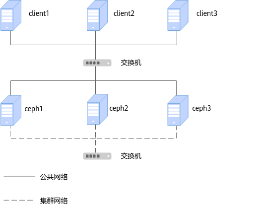

Ceph集群部署时各服务端IP地址举例如[**表 1** 服务端部署IP地址](#服务端部署IP地址)所示。

**表 1** 服务端部署IP地址<a id="服务端部署IP地址"></a>

| 集群    | 管理IP地址        | 公共网络IP地址      | 集群网络IP地址      |
|-------|---------------|---------------|---------------|
| ceph1 | 192.168.2.166 | 192.168.3.166 | 192.168.4.166 |
| ceph2 | 192.168.2.167 | 192.168.3.167 | 192.168.4.167 |
| ceph3 | 192.168.2.168 | 192.168.3.168 | 192.168.4.168 |

Ceph集群部署各客户端IP地址举例如[**表 2** 客户端部署IP地址](#客户端部署IP地址)所示。

**表 2** 客户端部署IP地址<a id="客户端部署IP地址"></a>

| 客户端     | 管理IP地址        | 公共网络IP地址      |
|---------|---------------|---------------|
| client1 | 192.168.2.160 | 192.168.3.160 |
| client2 | 192.168.2.161 | 192.168.3.161 |
| client3 | 192.168.2.162 | 192.168.3.162 |

> **说明：** 
>
>- 管理IP地址：用于远程SSH机器管理配置使用的IP地址。
>- 集群网络IP地址（Cluster Network）：用于集群内部节点之间同步数据的IP地址，选取任意一个25GE网口配置即可。
>- 公共网络IP地址（Public Network）：存储节点供其他节点访问的IP地址，选取任意一个25GE网口配置即可。
>- 客户端作为压力机，需保证客户端业务口IP地址与集群的外部访问IP地址在同一个网段，建议选用25GE网口进行配置。

**硬件要求<a name="section116628440251"></a>**

硬件要求如[**表 3** 硬件要求](#硬件要求)所示。

**表 3** 硬件要求<a id="硬件要求"></a>

| 项目  | 规格       |
|-----|----------|
| 服务器 | 鲲鹏服务器    |
| CPU | 鲲鹏920处理器 |
| 网卡  | 2*25GE*2 |

**操作系统和软件要求<a name="section1240364411598"></a>**

操作系统和软件要求如[**表 4** 操作系统和软件要求](#操作系统和软件要求)所示。

**表 4** 操作系统和软件要求<a id="操作系统和软件要求"></a>

| 项目      | 版本                                | 获取地址                                                                                                                                                                              |
|---------|-----------------------------------|-----------------------------------------------------------------------------------------------------------------------------------------------------------------------------------|
| 物理机操作系统 | openEuler 20.03 LTS SP4           | [获取链接](https://repo.huaweicloud.com/openeuler/openEuler-20.03-LTS-SP4/ISO/aarch64/openEuler-20.03-LTS-SP4-everything-aarch64-dvd.iso)                                         |
| 欧拉镜像    | openEuler 22.03 LTS SP4           | [获取链接](https://repo.huaweicloud.com/openeuler/openEuler-22.03-LTS-SP4/docker_img/aarch64/openEuler-docker.aarch64.tar.xz)                                                         |
| Ceph    | 17.2.7                            | [获取链接](https://download.ceph.com/tarballs/ceph-17.2.7.tar.gz)                                                                                                                     |
| UCX     | 1.14.1                            | [获取链接1](https://github.com/openucx/ucx/releases/download/v1.14.1/ucx-1.14.1-1.el7.src.rpm)<br>[获取链接2](https://github.com/openucx/ucx/releases/download/v1.14.1/ucx-1.14.1.tar.gz) |
| SPDK    | 21.01.1 (openEuler 22.03 LTS SP4) | `git clone -b openEuler-22.03-LTS-SP4 https://gitee.com/src-openeuler/spdk.git`                                                                                                   |
| DPDK    | 21.11 (openEuler 22.03 LTS SP4)   | `git clone -b openEuler-22.03-LTS-SP4 https://gitee.com/src-openeuler/dpdk.git`                                                                                                   |
| isa-l   | 2.30.0 (openEuler 22.03 LTS SP4)  | `git clone -b openEuler-22.03-LTS-SP4 https://gitee.com/src-openeuler/isa-l.git`                                                                                                  |

> **说明：** 
>
>- 本文档以Ceph 17.2.7版本进行说明，其他版本安装也可参考本文档。
>
>- 由于编译容器默认使用根目录，故在安装OS时建议确保系统根目录空间为500GB以上。

本文基于TaiShan鲲鹏服务器和openEuler操作系统提供指导，在正式操作前请确保软硬件均满足要求。

## 获取软件包<a id="获取软件包"></a>

在编译和部署UCX之前，需要准备以下软件包和文件。

| 软件包                      | 说明                                     | 获取路径                                                                                                                                  |
|--------------------------|----------------------------------------|---------------------------------------------------------------------------------------------------------------------------------------|
| ceph-17.2.x-spdk.patch   | Ceph适配SPDK的补丁文件                        | [获取链接](https://gitcode.com/boostkit/ceph_BK/blob/master/ceph-17.2.x-spdk.patch)                                             |
| ceph-17.2.x-ucx.patch    | Ceph适配UCX的补丁文件                         | [获取链接](https://gitcode.com/boostkit/ceph_BK/blob/master/ceph-17.2.x-ucx.patch)                                              |
| BoostKit-KSAL_1.10.0.zip | 存储算法加速库（KSAL闭源算法包），可提高Ceph内部相关算法的运算效率。 | [获取链接](https://kunpeng-repo.obs.cn-north-4.myhuaweicloud.com/Kunpeng%20BoostKit/Kunpeng%20BoostKit%2024.0.0/BoostKit-KSAL_1.10.0.zip) |

在编译和部署UCX之前，需要准备以下软件包和文件。

## 准备编译环境<a name="ZH-CN_TOPIC_0000002551552409"></a>

### 所有节点上安装Podman<a name="ZH-CN_TOPIC_0000002551552413"></a>

为确保应用程序的统一管理和部署，提高部署的一致性和可靠性，需要在所有ceph1\~ceph3和client1\~client3节点上安装Podman。

> **说明：** 
>
> - Podman为Ceph容器化部署依赖工具，不同Podman版本与Ceph版本之间存在兼容问题。具体配套关系参见下表。
> 
>    | Ceph      | Podman 1.9 | Podman 2.0 | Podman 2.1 | Podman 2.2 | Podman 3.0 | Podman >3.0 |
>    |-----------|------------|------------|------------|------------|------------|-------------|
>    | <= 15.2.5 | True       | False      | False      | False      | False      | False       |
>    | >= 15.2.6 | True       | True       | True       | False      | False      | False       |
>    | >= 16.2.1 | False      | True       | True       | False      | True       | True        |
>    | >= 17.2.0 | False      | True       | True       | False      | True       | True        |
>    True代表兼容，False代表不兼容。
> 
> - Ceph 17.2.7需要使用Podman 2.0及以上版本，openEuler 20.03 LTS SP4社区源里Podman版本为0.10.1，需要手动更新Podman为更高版本，本文以Podman 3.4.4为例进行说明。
> - 手动打造最小依赖的容器镜像时，需要额外的编译节点，该节点也需要安装Podman。

1. 下载依赖工具。

    ```sh
    yum install rpmdevtools python3-pyyaml git
    ```

2. 构建Podman 3.4.4的RPM包。

    ```sh
    cd /home
    wget https://repo.openeuler.org/openEuler-22.03-LTS-SP2/source/Packages/podman-3.4.4-1.oe2203sp2.src.rpm --no-check-certificate
    rpmdev-setuptree
    rpm -ivUh podman-3.4.4-1.oe2203sp2.src.rpm
    yum-builddep -y /root/rpmbuild/SPECS/podman.spec
    rpmbuild -bb /root/rpmbuild/SPECS/podman.spec
    ```

3. 构建crun 1.4.5的RPM包。

    ```sh
    cd /home
    wget https://repo.openeuler.org/openEuler-22.03-LTS-SP2/source/Packages/crun-1.4.5-1.oe2203sp2.src.rpm --no-check-certificate
    rpm -ivUh crun-1.4.5-1.oe2203sp2.src.rpm
    yum-builddep -y /root/rpmbuild/SPECS/crun.spec
    rpmbuild -bb /root/rpmbuild/SPECS/crun.spec
    ```

4. 构建conmon 2.1.0的RPM包。

    ```sh
    cd /home
    wget https://repo.openeuler.org/openEuler-22.03-LTS-SP2/source/Packages/conmon-2.1.0-1.oe2203sp2.src.rpm --no-check-certificate
    rpm -ivUh conmon-2.1.0-1.oe2203sp2.src.rpm
    yum-builddep -y /root/rpmbuild/SPECS/conmon.spec 
    rpmbuild -bb /root/rpmbuild/SPECS/conmon.spec
    ```

5. 安装所有的RPM包。

    ```sh
    cd /root/
    yum install -y rpmbuild/RPMS/noarch/podman-docker-3.4.4-1.noarch.rpm rpmbuild/RPMS/aarch64/podman-remote-3.4.4-1.aarch64.rpm rpmbuild/RPMS/aarch64/podman-3.4.4-1.aarch64.rpm rpmbuild/RPMS/aarch64/crun-help-1.4.5-1.aarch64.rpm rpmbuild/RPMS/aarch64/crun-1.4.5-1.aarch64.rpm rpmbuild/RPMS/aarch64/conmon-2.1.0-1.aarch64.rpm rpmbuild/RPMS/aarch64/podman-help-3.4.4-1.aarch64.rpm rpmbuild/RPMS/aarch64/podman-gvproxy-3.4.4-1.aarch64.rpm rpmbuild/RPMS/aarch64/podman-plugins-3.4.4-1.aarch64.rpm
    ```

6. 安装catatonit。

    ```sh
    git clone https://github.com/openSUSE/catatonit.git
    cd catatonit
    ./autogen.sh
    ./configure
    make
    make install
    cp catatonit /usr/libexec/podman/catatonit
    ```

7. 启动Podman。

    ```sh
    systemctl daemon-reload
    systemctl enable podman
    systemctl start podman
    systemctl status podman
    ```

为确保应用程序的统一管理和部署，提高部署的一致性和可靠性，需要在所有ceph1\~ceph3和client1\~client3节点上安装Podman。

### 在编译节点构建编译容器和部署容器<a id="在编译节点构建编译容器和部署容器"></a>

为了避免在真实集群中安装额外的软件，建议使用一台全新的集群外服务器进行制作容器镜像，该服务器应使用与集群同样的硬件配置和操作系统，本章节中称该服务器为编译节点。为更高效地管理与执行软件的部署构建流程，需要在编译节点构建编译容器和部署容器。

1. 下载openEuler 22.03 LTS SP4基础镜像。

    ```sh
    wget http://repo.huaweicloud.com/openeuler/openEuler-22.03-LTS-SP4/docker_img/aarch64/openEuler-docker.aarch64.tar.xz
    ```

2. 导入下载的基础镜像。

    ```sh
    podman load -i openEuler-docker.aarch64.tar.xz
    ```

3. <a id="li13655102819130"></a>根据镜像创建容器，启动前需要重置（`unset`命令）物理机上的代理环境变量。

    ``` sh
    unset http_proxy
    unset https_proxy
    podman run -dit --name openeuler2203sp4_base --hostname openeuler2203sp4_base -p 10000:22 --privileged --ipc=host docker.io/library/openeuler-22.03-lts-sp4:latest
    ```

4. 进入容器。

    ```sh
    podman exec -it openeuler2203sp4_base /bin/bash
    ```

5. 在容器中配置代理等环境变量，不建议配置到bashrc中。

    ``` sh
    export TMOUT=0
    export http_proxy=http://xxx
    export https_proxy=http://xxx
    ```

6. 在容器中安装基础软件包。

    ```sh
    yum install openssh-server openssh-clients passwd vim perf sysstat dos2unix htop sshpass jq numactl hostname python3 python3-devel python3-pip tar createrepo ipmitool iproute git systemd psmisc udev wget rpmdevtools gtk-doc pam-devel xmlsec1-devel libtool libtool-ltdl-devel cmake gcc-c++ libstdc++-static java-1.8.0-openjdk java-1.8.0-openjdk-devel fio iputils make -y
    ```

7. 在容器中安装RDMA依赖软件包。

    ```sh
    yum install libibverbs-devel librdmacm-devel numactl-devel -y
    ```

8. 退出容器，制作镜像。

    ```sh
    exit
    podman commit openeuler2203sp4_base openeuler2203sp4_base:v2203sp4
    ```

9. 启动编译容器。

    ```sh
    podman run --name openeuler2203sp4_build --hostname openeuler2203sp4_base -p 10001:22 --privileged --ipc=host -dti localhost/openeuler2203sp4_base:v2203sp4 /usr/sbin/init
    ```

10. 制作部署容器。

    ```sh
    podman run --name openeuler2203sp4_release --hostname openeuler2203sp4_base -p 10003:22 --privileged --ipc=host -dti localhost/openeuler2203sp4_base:v2203sp4 /usr/sbin/init
    ```

11. 检查容器环境变量，确保环境变量中不能有代理配置，如果有，需要重置物理机上的代理环境变量，然后从[步骤3](#li13655102819130)开始重新执行。

    ```sh
    podman inspect openeuler2203sp4_release | grep Env -A 10
    ```

    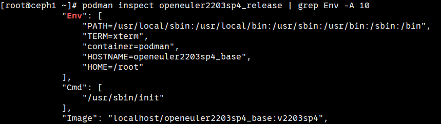

    >  **说明：** 
    > 
    > - 删除容器命令，`[CONTAINER_ID]`是容器ID，通过`podman ps`查看。
    >
    >    ``` sh
    >    podman stop [CONTAINER_ID]
    >    podman rm [CONTAINER_ID]
    >    ```
    >
    > - 删除镜像命令，`[IMAGE_ID]`是镜像ID，通过`podman images`查看。删除镜像需要删除所有基于该镜像创建的容器。
    >
    >    ``` sh
    >    podman rmi [IMAGE_ID]
    >    ```

为了避免在真实集群中安装额外的软件，建议使用一台全新的集群外服务器进行制作容器镜像，该服务器应使用与集群同样的硬件配置和操作系统，本章节中称该服务器为编译节点。为更高效地管理与执行软件的部署构建流程，需要在编译节点构建编译容器和部署容器。

## 在编译容器中编译软件包<a name="ZH-CN_TOPIC_0000002551432429"></a>

### 编译和安装UCX<a name="ZH-CN_TOPIC_0000002520352446" id="编译和安装UCX"></a>

编译和部署UCX开源软件包，主要包括编译并构建出用于编译Ceph时需要依赖的UCX RPM包。

1. 进入编译容器，在容器中配置代理等环境变量，不建议配置到bashrc中。

    ```sh
    podman exec -it openeuler2203sp4_build /bin/bash
    export TMOUT=0
    export http_proxy=http://xxx
    export https_proxy=http://xxx
    ```

2. 获取UCX开源软件包，获取路径请参见[操作系统和软件要求](#操作系统和软件要求)。

    ```sh
    cd /home
    wget https://github.com/openucx/ucx/releases/download/v1.14.1/ucx-1.14.1-1.el7.src.rpm --no-check-certificate
    wget https://github.com/openucx/ucx/releases/download/v1.14.1/ucx-1.14.1.tar.gz --no-check-certificate
    ```

3. 安装通用组件。

    ```sh
    yum install CUnit-devel boost-random checkpolicy cmake cryptsetup-devel expat-devel fmt-devel fuse-devel gperf java-devel junit keyutils-libs-devel libaio-devel libbabeltrace-devel libblkid-devel libcap-ng-devel libcurl-devel numactl-devel libicu-devel libnl3-devel liboath-devel librabbitmq-devel librdkafka-devel librdmacm-devel libtool libxml2-devel lttng-ust-devel lua-devel luarocks lz4-devel make nasm ncurses-devel ninja-build nss-devel openldap-devel openssl-devel libudev-devel python3-Cython python3-devel python3-prettytable python3-pyyaml python3-setuptools python3-sphinx re2-devel selinux-policy-devel sharutils snappy-devel sqlite-devel sudo thrift-devel valgrind-devel xfsprogs-devel xmlstarlet doxygen meson python3-pyelftools -y
    ```

4. 定义RPM包编译路径。
    1. 打开`/root/.rpmmacros`文件。

        ```sh
        vi /root/.rpmmacros
        ```

    2. 按`i`进入编辑模式，将`%_topdir`路径设置为编译RPM包的路径（本文档中以新建路径`/root/rpmbuild`为例），并将其他行的内容全部注释掉（首次定义RPM包编译路径时，该文件不存在，内容为空，直接新增以下内容保存即可）。

        ```sh
        %_topdir /root/rpmbuild
        ```

    3. 按`Esc`键退出编辑模式，输入`:wq!`，按`Enter`键保存并退出文件。

    4. 创建rpmbuild下的构建目录。

        ```sh
        rpmdev-setuptree
        ```

5. 下载UCX包，并将其上传至服务器。下载地址见[操作系统和软件要求](#操作系统和软件要求)。

6. 安装UCX软件包。

    ```sh
    rpm -ivh ucx-1.14.1-1.el7.src.rpm
    ```

7. 为了解决UCX在容器中部署存在的报错问题并进一步提升UCX性能，需要修改几行代码。参考下方的代码完成修改。
    1. 切换到`/root/rpmbuild/SOURCES/`路径下。

        ```sh
        cd /root/rpmbuild/SOURCES/
        ```

    2. 解压缩`ucx-1.14.1.tar.gz`文件。

        ```sh
        tar -zxvf ucx-1.14.1.tar.gz
        ```

    3. 打开`ucx-1.14.1/src/ucs/sys/sys.c`文件，将光标定位到该文件的第1560行。

        ```sh
        vim ucx-1.14.1/src/ucs/sys/sys.c +1560
        ```

    4. 按`i`进入编辑模式。在1560行新增如下内容。

        ```c
        pid = getpid();
        ```

        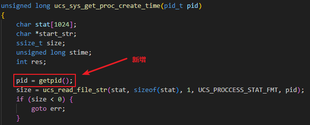

    5. 按`Esc`键退出编辑模式，输入`:wq!`，按`Enter`键保存并退出文件。

    6. 打开`ucx-1.14.1/src/ucp/core/ucp_context.c`文件，并将光标定位到2156行。

        ```sh
        vim ucx-1.14.1/src/ucp/core/ucp_context.c +2156
        ```

    7. 按`i`进入编辑模式，在2156行新增`#if 0`，在函数最后新增`#endif`。

        

    8. 按`Esc`键退出编辑模式，输入`:wq!`，按`Enter`键保存并退出文件。

    9. 打开`ucx-1.14.1/src/ucs/config/parser.c`文件，并将光标定位到1989行。

        ```sh
        vim ucx-1.14.1/src/ucs/config/parser.c +1989
        ```

    10. 按“i“进入编辑模式，在1989行新增`#if 0`，在打印后面新增`#endif` 。

        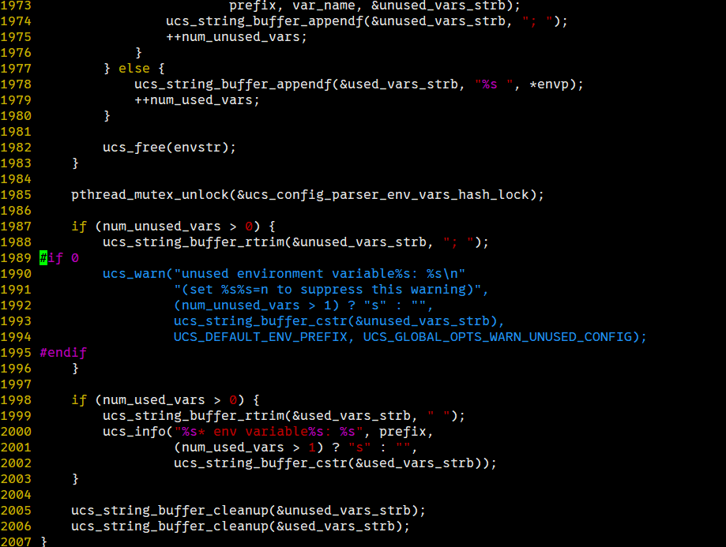

    11. 按`Esc`键退出编辑模式，输入`:wq!`，按`Enter`键保存并退出文件。
      
    12. 打开`ucx-1.14.1/src/uct/ib/base/ib_iface.c`文件，并将光标定位到735行。

        ```sh
        vim ucx-1.14.1/src/uct/ib/base/ib_iface.c +735
        ```

    13. 按`i`进入编辑模式，注释735行，并添加一行以下代码。

        ```c
        ah_attr->grh.flow_label = 0;
        ```

        

    14. 按`Esc`键退出编辑模式，输入`:wq!`，按`Enter`键保存并退出文件。

    15. 对该文件进行打包。

        ```sh
        rm -rf ucx-1.14.1.tar.gz
        tar zcvf ucx-1.14.1.tar.gz ucx-1.14.1
        ```

8. 在RPM编译路径下，编译并构建`ucx.spec`文件，生成RPM包。

    ```sh
    cd /root/rpmbuild/SPECS
    rpmbuild -bb ucx.spec
    ```

    编译完成后在`/root/rpmbuild/RPMS/aarch64`目录会生成如下图所示的8个RPM包。

    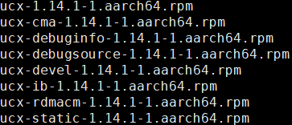

9. 把编译生成后的RPM包拷贝到`/home/local_rpm/`目录下，然后进行安装。

    ```sh
    mkdir -p /home/local_rpm/
    cp /root/rpmbuild/RPMS/aarch64/ucx* /home/local_rpm/
    cd /home/local_rpm/
    ```

    ```sh
    rpm -ivh ucx-1.14.1-1.aarch64.rpm
    rpm -ivh ucx-cma-1.14.1-1.aarch64.rpm
    rpm -ivh ucx-debuginfo-1.14.1-1.aarch64.rpm
    rpm -ivh ucx-debugsource-1.14.1-1.aarch64.rpm
    rpm -ivh ucx-devel-1.14.1-1.aarch64.rpm
    rpm -ivh ucx-ib-1.14.1-1.aarch64.rpm
    rpm -ivh ucx-rdmacm-1.14.1-1.aarch64.rpm
    rpm -ivh ucx-static-1.14.1-1.aarch64.rpm
    ```

编译和部署UCX开源软件包，主要包括编译并构建出用于编译Ceph时需要依赖的UCX RPM包。

### 编译Ceph软件包<a name="ZH-CN_TOPIC_0000002551432417"></a>

#### 安装依赖包<a name="ZH-CN_TOPIC_0000002520352444"></a>

在编译容器中安装编译Ceph所需要的依赖包。

1. 进入编译容器。

    ```sh
    podman exec -it openeuler2203sp4_build /bin/bash
    ```

2. 在容器中配置代理等环境变量，不建议配置到bashrc中。

    ```sh
    export TMOUT=0
    export http_proxy=http://xxx
    export https_proxy=http://xxx
    ```

3. 安装通用组件。

    ```sh
    yum install CUnit-devel boost-random checkpolicy cmake cryptsetup-devel expat-devel fmt-devel fuse-devel gperf java-devel junit keyutils-libs-devel libaio-devel libbabeltrace-devel libblkid-devel libcap-ng-devel libcurl-devel numactl-devel libicu-devel libnl3-devel liboath-devel librabbitmq-devel librdkafka-devel librdmacm-devel libtool libxml2-devel lttng-ust-devel lua-devel luarocks lz4-devel make nasm ncurses-devel ninja-build nss-devel openldap-devel openssl-devel libudev-devel python3-Cython python3-devel python3-prettytable python3-pyyaml python3-setuptools python3-sphinx re2-devel selinux-policy-devel sharutils snappy-devel sqlite-devel sudo thrift-devel valgrind-devel xfsprogs-devel xmlstarlet doxygen meson python3-pyelftools libatomic gperftools-devel -y
    ```

4. 定义RPM包编译路径。
    1. 打开`/root/.rpmmacros`文件。

        ```sh
        vi /root/.rpmmacros
        ```

    2. 按`i`进入编辑模式，将`%_topdir`路径设置为编译RPM包的路径（本例中以新建路径`/root/rpmbuild`为例），并将其他行的内容全部注释掉。

        ```sh
        %_topdir /root/rpmbuild
        ```

    3. 按`Esc`键退出编辑模式，输入`:wq!`，按`Enter`键保存并退出文件。
    4. 创建rpmbuild下的构建目录。

        ```sh
        rpmdev-setuptree
        ```

5. 编译ceph-mgr-cephadm依赖包。
    1. git配置。

        ```sh
        git config --global http.proxy http://*****
        git config --global http.sslVerify "false"
        git config --global https.proxy http://*****
        git config --global https.sslVerify "false"
        git config --global http.postBuffer 1048576000 #将Git缓冲区大小增加到repo的最大单个文件大小：1G
        ```

    2. 编译python-asyncssh依赖（推荐使用python-asyncssh 2.7）。

        ```sh
        git clone https://gitee.com/src-oepkgs/python-asyncssh.git
        cp python-asyncssh/* /root/rpmbuild/SOURCES/
        cp python-asyncssh/* /root/rpmbuild/SPECS/
        rpmbuild -bb /root/rpmbuild/SPECS/python-asyncssh.spec
        ```

    3. 编译python-natsort依赖。

        ```sh
        git clone https://gitee.com/src-openeuler/python-natsort.git
        yum install python3-coverage python3-hypothesis python3-pytest python3-pytest-cov python3-pytest-mock -y
        cp python-natsort/* /root/rpmbuild/SOURCES/
        cp python-natsort/* /root/rpmbuild/SPECS/
        rpmbuild -bb /root/rpmbuild/SPECS/python-natsort.spec
        ```

    4. 安装RPM包。

        ```sh
        mkdir -p /home/local_rpm/
        mv /root/rpmbuild/RPMS/noarch/* /home/local_rpm/
        cd /home/local_rpm/
        yum install python-asyncssh-help-2.7.0-2.noarch.rpm python3-asyncssh-2.7.0-2.noarch.rpm python3-natsort-8.4.0-3.noarch.rpm -y
        ```

在编译容器中安装编译Ceph所需要的依赖包。

#### 编译Ceph<a name="ZH-CN_TOPIC_0000002551552417"></a>

##### 使能SPDK<a name="ZH-CN_TOPIC_0000002520032424"></a>

在编译容器中编译SPDK模块替换掉Ceph中默认的SPDK模块以加速OSD性能。

1. 进入编译容器。

    ```sh
    podman exec -it openeuler2203sp4_build /bin/bash
    ```

2. 在`/home`目录下载ceph-17.2.7源码。

    ```sh
    cd /home
    wget https://download.ceph.com/tarballs/ceph-17.2.7.tar.gz
    ```

3. 在`/home`目录下载openEuler社区SPDK代码，并进行编译。

    ```sh
    cd /home/
    git clone -b openEuler-22.03-LTS-SP4 https://gitee.com/src-openeuler/spdk.git
    cd spdk/
    rpmbuild -bp -D "_sourcedir `pwd`" -D "_builddir `pwd`" spdk.spec
    ```

4. 在`/home`目录下载openEuler社区DPDK代码，并进行编译。

    ```sh
    cd /home/
    git clone -b openEuler-22.03-LTS-SP4 https://gitee.com/src-openeuler/dpdk.git
    cd dpdk/
    rpmbuild -bp -D "_sourcedir `pwd`" -D "_builddir `pwd`" dpdk.spec
    ```

5. 使用编译后的DPDK模块替换SPDK代码中的DPDK模块。

    ```sh
    cd /home
    rm -rf spdk/spdk-21.01.1/dpdk/
    cp -r dpdk/dpdk-21.11 spdk/spdk-21.01.1/dpdk
    ```

6. 在`/home`目录下载openEuler社区ISA-L代码。使用编译后的ISA-L模块替换SPDK代码中的ISA-L模块。

    ```sh
    cd /home
    git clone -b openEuler-22.03-LTS-SP4 https://gitee.com/src-openeuler/isa-l.git
    cd isa-l
    tar -zxvf v2.30.0.tar.gz
    
    cd /home
    rm -rf spdk/spdk-21.01.1/isa-l/
    cp -r isa-l/isa-l-2.30.0/ spdk/spdk-21.01.1/isa-l
    ```

7. 在`/home`目录下载selinux-policy代码。打包结果可以暂时放在`/root/rpmbuild/RPMS/noarch`中。

    >  **说明：** 
    > 
    > - selinux-policy的手动编译步骤仅需要在openEuler 22.03 LTS SP3系统和Ceph 17.2.8版本配合时需要执行。
    > - Ceph 17.2.8安装时依赖的selinux-policy版本需为35.5-22及以上版本，openEuler社区未在openEuler 22.03 LTS SP3版本发布该版本的RPM包，所以需要手动编译。
    > - 如果用户使用openEuler 22.03 LTS SP4系统，可跳过此步骤。
    > - 如果用户使用Ceph 17.2.7及以下版本，可跳过此步骤。

    ```sh
    cd /home
    git clone https://gitee.com/src-openeuler/selinux-policy.git
    git checkout -b 2203sp3 origin/openEuler-22.03-LTS-SP3
    cp -r selinux-policy/* /root/rpmbuild/SOURCES/
    cp selinux-policy/selinux-policy.spec /root/rpmbuild/SPECS/
    rpmbuild -bb /root/rpmbuild/SPECS/selinux-policy.spec
    ```

8. 在`/home`目录下面解压Ceph源码，并将openEuler SPDK代码移到`ceph-17.2.7/src`目录下。

    ```sh
    cd /home
    tar -zxvf ceph-17.2.7.tar.gz
    rm -rf ceph-17.2.7/src/spdk
    cp -r spdk/spdk-21.01.1 ceph-17.2.7/src/spdk
    ```

9. 将ceph-17.2.x-spdk.patch文件放入ceph-17.2.7目录下，然后合入SPDK patch。

    ```sh
    cd ceph-17.2.7
    patch -p1 < ceph-17.2.x-spdk.patch
    ```

    >  **说明：** 
    > 
    > 物理机中的文件拷贝到容器中，可使用`podman cp`命令。
    >
    > ```sh
    > podman cp ./ceph-17.2.x-spdk.patch openeuler2203sp4_build:/home/ceph-17.2.7
    > ```

10. 完成上述步骤后，需要进行编译Ceph，具体操作步骤请参见[编译Ceph](#编译ceph)。

在编译容器中编译SPDK模块替换掉Ceph中默认的SPDK模块以加速OSD性能。

##### 使能UCX<a name="ZH-CN_TOPIC_0000002551552419"></a>

在编译容器中添加UCX模块，以提升Ceph集群的网络通信性能。

1. 进入编译容器。

    ```sh
    podman exec -it openeuler2203sp4_build /bin/bash
    ```

2. <a id="合入patch"></a>在合入SPDK patch基础上，将`ceph-17.2.x-ucx.patch`下载到`/home/ceph-17.2.7`目录下，再合入UCX patch。

    ```sh
    cd /home/ceph-17.2.7
    patch -p1 < ceph-17.2.x-ucx.patch
    ```

3. 修改EventEpoll.h文件代码。
    1. 打开EventEpoll.h文件。

        ```sh
        vim src/msg/async/EventEpoll.h
        ```

    2. 按`i`进入编辑模式，将原文件中的34行代码替换为如下内容。

        ```c
        is_polling = cct->_conf->ms_async_op_threads_polling | cct->_conf->ms_async_ucx_event_polling;
        ```

        

    3. 按`Esc`键退出编辑模式，输入`:wq!`，按`Enter`键保存并退出文件。

4. 完成上述步骤后，需要进行编译Ceph，具体操作步骤请参见[编译Ceph](#编译ceph)。

在编译容器中添加UCX模块，以提升Ceph集群的网络通信性能。

##### 编译Ceph<a name="ZH-CN_TOPIC_0000002520032422" id="编译ceph"></a>

本章节主要描述在完成使能SPDK和UCX之后，可进行Ceph的编译。

1. 修改ceph.spec文件。

    ```sh
    sed -i 's/redhat-rpm-config/openEuler-rpm-config/g' ceph.spec
    sed -i 's#%if 0%{?fedora} || 0%{?rhel}#%if 0%{?fedora} || 0%{?rhel} || 0%{?openEuler}#' ceph.spec
    sed -i 's#%if 0%{?rhel} || 0%{?fedora}#%if 0%{?rhel} || 0%{?fedora} || 0%{?openEuler}#' ceph.spec
    sed -i 's#%if 0%{?fedora} || 0%{?suse_version} > 1500 || 0%{?rhel} == 9 || 0%{?openEuler}#%if 0%{?fedora} || 0%{?suse_version} > 1500 || 0%{?rhel} == 9#' ceph.spec
    sed -i '1a\%define _binaries_in_noarch_packages_terminate_build 0' ceph.spec
    sed -i '2a\%define _unpackaged_files_terminate_build 0' ceph.spec
    ```

    >  **说明：** 
    > 
    > 1. Ceph 17.2.8版本会有OSD偶尔不稳定重启的异常，详见[Ceph 17.2.8 持续运行时报错](#持续运行时报错)。
    > 2. 若Ceph源码`src/osd/SnapMapper.cc`与fmt包的版本不匹配时，会出现编译报错。报错时需要将`src/osd/SnapMapper.cc`文件中`fmt::format`相关代码行进行注释后重新编译。修改类似如下，共涉及4处修改。
    >    - 233行 - 234行
    >    - 272行 - 275行
    >    - 321行 - 324行
    >    - 327行 - 329行
    >
    >    ```c
    >        228 tl::expected<SnapMapper::object_snaps, Scrub::SnapMapReaderI::result_t>
    >        229 SnapMapper::get_snaps_common(const hobject_t &oid) const
    >        230 {
    >        231   ceph_assert(check(oid));
    >        232   set<string> keys{to_object_key(oid)};
    >        233 //  dout(20) << fmt::format("{}: key string: {} oid:{}", __func__, keys, oid)
    >        234 //         << dendl;
    >        235
    >        236   map<string, ceph::buffer::list> got;
    >    ...
    >        264 std::set<std::string> SnapMapper::to_raw_keys(
    >        265   const hobject_t &clone,
    >        266   const std::set<snapid_t> &snaps) const
    >        267 {
    >        268   std::set<std::string> keys;
    >        269   for (auto snap : snaps) {
    >        270     keys.insert(to_raw_key(snap, clone));
    >        271   }
    >        272 //  dout(20) << fmt::format(
    >        273 //              "{}: clone:{} snaps:{} -> keys: {}", __func__, clone, snaps,
    >        274 //              keys)
    >        275 //         << dendl;
    >        276   return keys;
    >        277 }
    >    ...
    >        305   std::set<snapid_t> snaps_from_mapping;
    >        306   for (auto &[k, v] : kvmap) {
    >        307     dout(20) << __func__ << " " << hoid << " " << k << dendl;
    >        308     // extract the object ID from the value fetched for an SNA mapping key
    >        309     auto [sn, obj] = SnapMapper::from_raw(v);
    >        310     if (obj != hoid) {
    >        311       dout(1) << fmt::format(
    >        312                    "{}: unexpected object ID {} for key{} (expected {})",
    >        313                    __func__, obj, k, hoid)
    >        314               << dendl;
    >        315       return tl::unexpected(result_t{code_t::inconsistent});
    >        316     }
    >        317     snaps_from_mapping.insert(sn);
    >        318   }
    >        319
    >        320   if (snaps_from_mapping != *obj_snaps) {
    >        321 //    dout(10) << fmt::format(
    >        322 //                "{}: hoid:{} -> mapper internal inconsistency ({} vs {})",
    >        323 //                __func__, hoid, *obj_snaps, snaps_from_mapping)
    >        324 //           << dendl;
    >        325     return tl::unexpected(result_t{code_t::inconsistent});
    >        326   }
    >        327  // dout(10) << fmt::format(
    >        328 //              "{}: snaps for {}: {}", __func__, hoid, snaps_from_mapping)
    >        329 //         << dendl;
    >        330   return obj_snaps;
    >        331 }
    >    ```
    >
    >    
    
2. 编译Ceph。

    ```sh
    cd ..
    tar cvf ceph-17.2.7.tar.bz2 ceph-17.2.7/
    cp ceph-17.2.7/ceph.spec /root/rpmbuild/SPECS/
    cp ceph-17.2.7.tar.bz2 /root/rpmbuild/SOURCES/
    rpmbuild -bb /root/rpmbuild/SPECS/ceph.spec
    ```

    >  **说明：** 
    > 
    > 编译Ceph过程中需要配置网络代理，编译容器需要能够访问互联网，具体可参见[准备编译环境](#在编译节点构建编译容器和部署容器)章节。

3. 将打好的Ceph包拷贝出来。

    ```sh
    mv /root/rpmbuild/RPMS/aarch64 /home/local_rpm/
    mv /root/rpmbuild/RPMS/noarch /home/local_rpm/
    ```

4. 在物理机上将编译好的RPM包导入到部署容器。

    ```sh
    podman cp openeuler2203sp4_build:/home/local_rpm openeuler2203sp4_release:/home/
    ```

    >  **说明：** 
    > 
    > 此处拷贝导入到部署容器的包是[编译Ceph](#编译ceph)章节的所有包，包括python-asyncssh、python3-natsort、编译UCX的包、编译Ceph的包。

本章节主要描述在完成使能SPDK和UCX之后，可进行Ceph的编译。

#### 制作部署镜像<a name="ZH-CN_TOPIC_0000002551432419" id="skip_001"></a>

在部署容器中安装各个RPM软件包，制作最小规格镜像。

1. 进入部署容器。

    ```sh
    podman exec -it openeuler2203sp4_release /bin/bash
    ```

2. 安装UCX包。

    ```sh
    cd /home/local_rpm
    yum install ucx-1.14.1-1.aarch64.rpm ucx-cma-1.14.1-1.aarch64.rpm ucx-debuginfo-1.14.1-1.aarch64.rpm ucx-debugsource-1.14.1-1.aarch64.rpm ucx-devel-1.14.1-1.aarch64.rpm ucx-ib-1.14.1-1.aarch64.rpm ucx-rdmacm-1.14.1-1.aarch64.rpm ucx-static-1.14.1-1.aarch64.rpm -y
    ```

    >  **说明：** 
    > 
    > 只使能SPDK则跳过此步骤。

3. 安装Ceph依赖包。

    ```sh
    yum install python-asyncssh-help-2.7.0-2.noarch.rpm python3-asyncssh-2.7.0-2.noarch.rpm python3-natsort-8.4.0-3.noarch.rpm -y
    pip3 install kubernetes==18.20.0
    pip install pycryptodome==3.19.1
    ```

    >  **说明：** 
    > 
    > - 为了避免Python三方库pycryptodome版本太低导致部署失败，建议升级如下依赖包。
    >
    >    ```sh
    >    pip install pycryptodome==3.19.1
    >    ```
    >
    > - 为了避免部署MGR报错`No module named 'kubernetes.client.models.v1_event`，需安装如下版本依赖包。
    >
    >    ```sh
    >    pip3 install kubernetes==18.20.0
    >    ```

4. Ceph 17.2.8+openEuler 22.03 LTS SP3场景下安装Ceph前需先安装依赖包selinux-policy。

    >  **说明：** 
    > 
    > - 依赖包获取参见[使能spdk](#使能spdk)。
    > - 部署Ceph17.2.7版本时，仅openEuler 22.03 LTS SP3及以下的操作系统版本需要安装selinux-policy包。openEuler 22.03 LTS SP4可跳过本步骤。

    ```sh
    yum install noarch/selinux-policy-35.5-23.noarch.rpm noarch/selinux-policy-devel-35.5-23.noarch.rpm noarch/selinux-policy-help-35.5-23.noarch.rpm noarch/selinux-policy-minimum-35.5-23.noarch.rpm noarch/selinux-policy-mls-35.5-23.noarch.rpm noarch/selinux-policy-sandbox-35.5-23.noarch.rpm noarch/selinux-policy-targeted-35.5-23.noarch.rpm -y
    ```

5. 安装Ceph。

    ```sh
    yum install aarch64/ceph-17.2.7-0.aarch64.rpm aarch64/ceph-base-17.2.7-0.aarch64.rpm aarch64/ceph-common-17.2.7-0.aarch64.rpm aarch64/ceph-debugsource-17.2.7-0.aarch64.rpm aarch64/ceph-exporter-17.2.7-0.aarch64.rpm aarch64/ceph-fuse-17.2.7-0.aarch64.rpm aarch64/ceph-immutable-object-cache-17.2.7-0.aarch64.rpm aarch64/ceph-mds-17.2.7-0.aarch64.rpm aarch64/ceph-mgr-17.2.7-0.aarch64.rpm aarch64/ceph-mon-17.2.7-0.aarch64.rpm aarch64/ceph-osd-17.2.7-0.aarch64.rpm aarch64/ceph-radosgw-17.2.7-0.aarch64.rpm aarch64/ceph-selinux-17.2.7-0.aarch64.rpm aarch64/ceph-test-17.2.7-0.aarch64.rpm aarch64/cephfs-java-17.2.7-0.aarch64.rpm aarch64/cephfs-mirror-17.2.7-0.aarch64.rpm aarch64/libcephfs-devel-17.2.7-0.aarch64.rpm aarch64/libcephfs2-17.2.7-0.aarch64.rpm aarch64/libcephfs_jni-devel-17.2.7-0.aarch64.rpm aarch64/libcephfs_jni1-17.2.7-0.aarch64.rpm aarch64/libcephsqlite-17.2.7-0.aarch64.rpm aarch64/libcephsqlite-devel-17.2.7-0.aarch64.rpm aarch64/librados-devel-17.2.7-0.aarch64.rpm aarch64/librados2-17.2.7-0.aarch64.rpm aarch64/libradospp-devel-17.2.7-0.aarch64.rpm aarch64/libradosstriper-devel-17.2.7-0.aarch64.rpm aarch64/libradosstriper1-17.2.7-0.aarch64.rpm aarch64/librbd-devel-17.2.7-0.aarch64.rpm aarch64/librbd1-17.2.7-0.aarch64.rpm aarch64/librgw-devel-17.2.7-0.aarch64.rpm aarch64/librgw2-17.2.7-0.aarch64.rpm aarch64/python3-ceph-argparse-17.2.7-0.aarch64.rpm aarch64/python3-ceph-common-17.2.7-0.aarch64.rpm aarch64/python3-cephfs-17.2.7-0.aarch64.rpm aarch64/python3-rados-17.2.7-0.aarch64.rpm aarch64/python3-rbd-17.2.7-0.aarch64.rpm aarch64/python3-rgw-17.2.7-0.aarch64.rpm aarch64/rados-objclass-devel-17.2.7-0.aarch64.rpm aarch64/rbd-fuse-17.2.7-0.aarch64.rpm aarch64/rbd-mirror-17.2.7-0.aarch64.rpm aarch64/rbd-nbd-17.2.7-0.aarch64.rpm noarch/ceph-grafana-dashboards-17.2.7-0.noarch.rpm noarch/ceph-mgr-cephadm-17.2.7-0.noarch.rpm noarch/ceph-mgr-dashboard-17.2.7-0.noarch.rpm noarch/ceph-mgr-diskprediction-local-17.2.7-0.noarch.rpm noarch/ceph-mgr-k8sevents-17.2.7-0.noarch.rpm noarch/ceph-mgr-modules-core-17.2.7-0.noarch.rpm noarch/ceph-mgr-rook-17.2.7-0.noarch.rpm noarch/ceph-prometheus-alerts-17.2.7-0.noarch.rpm noarch/ceph-resource-agents-17.2.7-0.noarch.rpm noarch/ceph-volume-17.2.7-0.noarch.rpm noarch/cephadm-17.2.7-0.noarch.rpm noarch/cephfs-top-17.2.7-0.noarch.rpm -y
    
    yum install chrony haproxy keepalived -y
    ```

6. 安装KSAL闭源算法包。

    ```sh
    cd /home
    unzip BoostKit-KSAL_1.10.0.zip
    rpm -ivh libksal-release-1.10.0.oe1.aarch64.rpm
    ```

    >  **说明：** 
    > 
    > KSAL软件包获取请参见[获取软件包](#获取软件包)章节，建议上传到`/home`目录下。

7. SPDK需要使用用户态大页内存，因此需要给ceph-osd提权。

    ```sh
    setcap 'CAP_DAC_OVERRIDE+eip CAP_SYS_ADMIN+eip' /usr/bin/ceph-osd
    ```

8. 修改Ceph用户登录配置。
    1. 打开`/etc/passwd`文件。

        ```sh
        vim /etc/passwd
        ```

    2. 按`i`进入编辑模式，将Ceph的登录shell修改为`/bin/bash`。

        

    3. 按`Esc`退出编辑模式，输入`:wq!`，按`Enter`键保存并退出文件。

9. 配置用户资源限制（使能UCX需要）。
    1. 打开`limits.conf`文件。

        ```sh
        vim /etc/security/limits.conf
        ```

    2. 按`i`进入编辑模式，在文件尾部新增如下内容。

        ```conf
        * soft nofile 1048576
        * hard nofile 1048576
        * soft nproc unlimited
        * hard nproc unlimited
        * soft memlock unlimited
        * hard memlock unlimited
        ```

    3. 按`Esc`键退出编辑模式，输入`:wq!`，按`Enter`键保存并退出文件。

10. <a id="li634218914416"></a>在物理机上将容器提交成镜像。

    ```sh
    podman commit 688247c8b260 [IP]:5000/ceph/ceph_release:v17.2.7
    ```

    >  **说明：** 
    > 
    > - `688247c8b260`为`openeuler2203sp4_release`容器对应的容器ID（通过`podman ps`查看）。
    > - `[IP]`为实际本机IP地址。
    > - 执行`commit`动作前，可以将`/home`目录下已安装的RPM包删除，以精简镜像大小。

11. 将部署镜像导出。

    ```sh
    podman save -o ceph_release.tar a6e8aff2def8
    ```

    >  **说明：** 
    > 
    > `a6e8aff2def8`为[步骤10](#li634218914416)中提交的镜像对应的ID，通过`podman images`查看。

在部署容器中安装各个RPM软件包，制作最小规格镜像。

## 在物理机上部署Ceph<a name="ZH-CN_TOPIC_0000002520352438"></a>

### 配置本地仓库和镜像<a name="ZH-CN_TOPIC_0000002551432423"></a>

Ceph集群启动时，需要动态地从远程仓库拉取镜像。为了方便局域网内集群的正常启动，需要在内网配置镜像仓库，导入之前制作的部署镜像。本节操作均在ceph1节点的物理机上执行。

1. <a id="zh-cn_topic_0000001204870207_li1754643514419"></a>拉取registry:2到本地仓。

    ```sh
    podman pull docker.io/library/registry:2
    ```

    > **说明：** 
    > 
    > - 若不能访问外网，可使用如下方法或手动下载包导入到节点。
    >
    >    ```sh
    >    git config --global http.sslVerify false
    >    git config --global https.sslVerify false
    >    git clone https://github.com/NotGlop/docker-drag.git
    >    ```
    >
    > - 启动本地镜像仓库：
    >
    >    ```sh
    >    podman load -i registry_2.tar
    >    ```
    >
    > - 如代理上网时不能正常拉取镜像，需检查代理设置方式。Podman依赖环境变量`HTTP_PROXY`和`HTTPS_PROXY`进行代理上网。

2. 修改容器配置文件`/etc/containers/registries.conf`。

    ```ini
    unqualified-search-registries = ["[IP]:5000", "quay.io"]
    short-name-mode="enforcing"
    [[registry]]
    location = "[IP]:5000"
    insecure = true
    ```

    >  **说明：** 
    > 
    > `[IP]`需要替换为当前节点的实际公共网络IP地址。

3. 修改本地仓库设置。

    ```sh
    mkdir -p /home/registry-data
    podman run -d -p 5000:5000 -v /home/registry-data:/var/lib/registry --restart always --name registry docker.io/library/registry:2
    ```

    >  **说明：** 
    > 
    > `docker.io/library/registry`为[步骤1](#zh-cn_topic_0000001204870207_li1754643514419)配置的镜像仓库实际使用的镜像名称。通过`podman images`查看。

4. 导入[制作部署镜像](#skip_001)中生成的Ceph部署镜像。

    ```sh
    podman load -i ceph_release.tar
    ```

5. 镜像重命名并上传到本地仓。

    ```sh
    podman tag 8bbba7d5cc80 [IP]:5000/ceph/ceph_release:v17.2.7
    podman push [IP]:5000/ceph/ceph_release:v17.2.7 [IP]:5000/ceph/ceph_release:v17.2.7
    podman rmi 8bbba7d5cc80
    ```

    >  **说明：** 
    > 
    > - `8bbba7d5cc80`为`ceph_release.tar`对应的镜像ID，`[IP]`为本地IP地址，请根据实际情况替换。
    > - 若push存在`Gateway Time-out`的报错，需要检查代理是否在配置，如果已配置代理，则需要执行以下命令关闭代理配置。
    >
    >    ```sh
    >    unset http_proxy
    >    unset https_proxy
    >    ```
    >
    > - push到本地仓之后，可能会与本地仓中的包存在tag冲突，因此需要删除本地的Ceph镜像。

6. 修改cephadm文件中的`DEFAULT_IMAGE`。
    1. 打开`/usr/sbin/cephadm`文件。

        ```sh
        vim /usr/sbin/cephadm
        ```

    2. 按`i`进入编辑模式，将`DEFAULT_IMAGE`按照如下所示进行修改。

        ```sh
        DEFAULT_IMAGE = "[IP]:5000/ceph/ceph_release:v17.2.7"
        ```

        > **说明：** 
        >`[IP]`需要替换为当前镜像仓库的IP地址。

    3. 按`Esc`键退出编辑模式，输入`:wq!`，按`Enter`键保存并退出文件。

7. 修改cephadm中创建容器权限。

    ```sh
    if self.privileged 修改为 if self.privileged or not self.privileged
    ```

    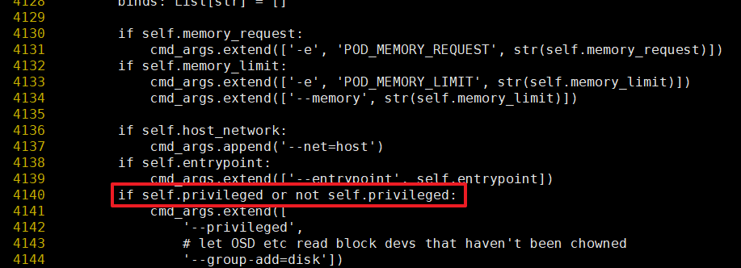

    >  **说明：** 
    > 
    > - `/usr/sbin/cephadm`必须拷贝源码中已经合入SPDK patch的cephadm。
    > - 该修改行位于`run_cmd`函数中。
    > - 如已执行过[合入ceph-17.2.x-ucx.patch](#合入patch)，可跳过本步骤。

8. 将编译节点的编译容器中打过SPDK patch的`ceph-17.2.7/src/cephadm/cephadm`拷贝到集群ceph1\~ceph3，client1\~client3节点的所有物理机`/usr/sbin/`目录下。

Ceph集群启动时，需要动态地从远程仓库拉取镜像。为了方便局域网内集群的正常启动，需要在内网配置镜像仓库，导入之前制作的部署镜像。本节操作均在ceph1节点的物理机上执行。

### 部署Ceph<a name="ZH-CN_TOPIC_0000002551552411"></a>

#### 环境配置<a name="ZH-CN_TOPIC_0000002520032416"></a>

本节以3个Server和3个Client为例说明环境配置步骤。

1. 在各节点上分别配置节点名称。

    ```sh
    hostnamectl set-hostname ceph1
    hostnamectl set-hostname ceph2
    hostnamectl set-hostname ceph3
    hostnamectl set-hostname client1
    hostnamectl set-hostname client2
    hostnamectl set-hostname client3
    ```

2. 在ceph1\~ceph3节点上配置机器名称解析。
    1. 执行以下命令打开文件。

        ```sh
        vim /etc/hosts
        ```

    2. 按`i`键进入编辑模式，在文件中加入以下内容。

        ```sh
        192.168.3.166 ceph1
        192.168.3.167 ceph2
        192.168.3.168 ceph3
        192.168.3.160 client1
        192.168.3.161 client2
        192.168.3.162 client3
        ```

        >  **说明：** 
        > 
        > - 命令中的IP地址为[环境组网](#环境要求)中所规划的IP地址，仅为示例，请根据实际情况进行修改。可通过**ip a**命令查询实际IP地址。
        > - 本文规划集群为三台服务端节点和三台客户端节点，请根据实际节点数量对文件内容进行调整。

    3. 按`Esc`键退出编辑模式，输入`:wq!`，按`Enter`键保存并退出文件。

3. 配置免密登录，在ceph1/ceph2/ceph3三个节点上分别执行如下命令。

    ```sh
    ssh-keygen -t rsa 
    for i in {1..3};do ssh-copy-id ceph$i;done
    ```

4. 关闭防火墙。

    ```sh
    systemctl stop firewalld
    systemctl disable firewalld
    systemctl status firewalld
    ```

    >  **说明：** 
    > 
    > - 仅在可信内网或离线测试环境中关闭防火墙。
    > - 生产环境必须启用防火墙，并精确放行所需的端口，如MON的端口为6789，OSD的端口为6800-7300等。

5. 关闭SELinux。

    ```sh
    setenforce 0
    sed -i 's/=permissive/=disabled/g' /etc/selinux/config
    ```

    >  **说明：**
    > 
    > - 禁用SELinux将导致系统强制访问控制（MAC）机制失效，建议仅在测试环境中禁用SELinux。
    > - 生产环境应保持enforcing模式，并通过audit2allow工具生成适配业务的自定义策略。

6. 在ceph1/ceph2/ceph3节点上配置时钟同步。
    1. 安装Chrony服务。

        ```sh
        dnf install -y chrony
        ```

    2. 备份配置文件。

        ```sh
        mv /etc/chrony.conf /etc/chrony.conf.bak
        ```

    3. 修改配置文件。

        ```sh
        cat > /etc/chrony.conf <<EOF
        server [IP1] iburst
        allow [IP/MASK]
        local stratum 10
        EOF
        ```

        >  **说明：** 
        > 
        > - \[IP1\]为提供时钟服务的服务器在网络中的IP地址或域名，如：192.168.3.166。
        > - \[IP/MASK\] 是本地网络的IP地址范围，如：192.168.1.0/24，表示只有这个子网的机器才能与服务器进行时钟同步。

    4. 重启chronyd。

        ```sh
        systemctl restart chronyd
        systemctl enable chronyd
        ```

    5. 查看时间同步状态。

        ```sh
        chronyc -a makestep   #强制同步系统时间
        chronyc sourcestats   #显示当前时间源的同步统计信息
        chronyc sources -v    #显示当前时间源的同步信息
        ```

本节以三个Server和三个Client为例说明环境配置步骤。

#### 在ceph1上引导新集群<a name="ZH-CN_TOPIC_0000002551552415"></a>

请在ceph1上创建集群配置，引导生成Ceph容器集群，该集群将管理所有节点。

1. 创建默认配置`ceph.conf`。
    1. 返回`home`目录，打开ceph.conf文件。

        ```sh
        cd /home
        vim ceph.conf
        ```

    2. 按`i`进入编辑模式，在文件中添加以下内容。

        ```ini
        [global]
        mon_allow_pool_delete = true
        osd_pool_default_size = 3
        osd_pool_default_min_size = 2
        
        osd_pg_object_context_cache_count = 256
        
        bluestore_kv_sync_thread_polling = true
        bluestore_kv_finalize_thread_polling = true
        
        osd_min_pg_log_entries = 10
        osd_max_pg_log_entries = 10
        osd_pool_default_pg_autoscale_mode = off
        
        bluestore_cache_size_ssd = 18G
        
        osd_memory_target = 20G # 限制osd内存的参数
        
        bluestore_block_db_path = ""
        bluestore_block_db_size = 0
        bluestore_block_wal_path = ""
        bluestore_block_wal_size = 0
        
        bluestore_rocksdb_options = use_direct_reads=true,use_direct_io_for_flush_and_compaction=true,compression=kNoCompression,max_write_buffer_number=128,min_write_buffer_number_to_merge=32,recycle_log_file_num=64,compaction_style=kCompactionStyleLevel,write_buffer_size=4M,target_file_size_base=4M,max_background_compactions=2,level0_file_num_compaction_trigger=64,level0_slowdown_writes_trigger=128,level0_stop_writes_trigger=256,max_bytes_for_level_base=6GB,compaction_threads=2,max_bytes_for_level_multiplier=8,flusher_threads=2
        ```

        >  **说明：** 
        > 
        > 更多Ceph调优配置以及配置说明，请参见[Ceph对象存储 调优指南](https://www.hikunpeng.com/document/detail/zh/kunpengsdss/ecosystemEnable/Ceph/kunpengcephobject_05_0012.html)中的“Ceph调优”章节。

    3. 按`Esc`键退出编辑模式，输入`:wq!`，按`Enter`键保存并退出文件。

2. 引导Ceph集群。

    ```sh
    cephadm bootstrap -c ceph.conf --mon-ip 192.168.3.166 --cluster-network 192.168.4.0/24 --skip-monitoring-stack
    ```

    >  **说明：** 
    >  
    > - --mon-ip：对应前端公共网络的IP地址。
    > - --cluster-network：对应后端集群网络的IP地址。
    > - -c ceph.conf：可选，需要修改Ceph默认配置可以使用。

    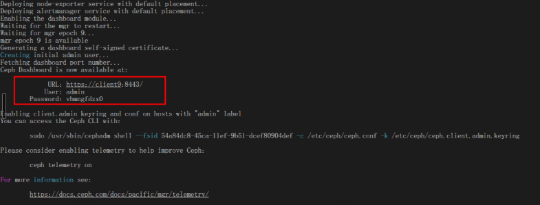

3. 拷贝公钥到其他节点进行使用。

    ```sh
    ssh-copy-id -f -i /etc/ceph/ceph.pub root@ceph2
    ssh-copy-id -f -i /etc/ceph/ceph.pub root@ceph3
    ```

4. 本地仓库配置同步到其他节点。

    ```sh
    scp /etc/containers/registries.conf ceph2:/etc/containers/
    scp /etc/containers/registries.conf ceph3:/etc/containers/
    ```

5. 进入Ceph集群容器。

    ```sh
    cephadm shell
    ```

6. 添加除ceph1外的其他两个主机节点到集群中。

    ```sh
    ceph orch host add ceph2 --labels _admin
    ceph orch host add ceph3 --labels _admin
    ```

    >  **说明：**
    > 
    > 命令执行完后ceph2和ceph3节点上的Ceph集群正常启动需3\~5min，请耐心等待。

7. 查看是否添加成功。

    ```sh
    ceph orch host ls
    ```

    

8. 查看集群状态，确认其他两个节点加入集群。

    ```sh
    ceph -s
    ```

    

请在ceph1上创建集群配置，引导生成Ceph容器集群，该集群将管理所有节点。

#### 集群切换UCX组网<a name="ZH-CN_TOPIC_0000002551432425"></a>

在使能UCX之前，需要配置UCX参数以及所有节点的配置文件，只使能SPDK则跳过此章节。

1. 进入Ceph集群容器。

    ```sh
    cephadm shell
    ```

2. 配置UCX参数。

    ```sh
    ceph config set global ms_type async+ucx
    ceph config set global ms_public_type async+ucx
    ceph config set global ms_cluster_type async+ucx
    ceph config set global ms_async_ucx_device mlx5_bond_0:1,mlx5_bond_1:1
    ceph config set global ms_async_ucx_tls rc_verbs
    ceph config set global ms_async_ucx_event_polling true
    ```

3. 退出容器，在所有服务端节点（ceph1/ceph2/ceph3）物理机中mon的配置文件中增加如下配置。

    ```sh
    vim /var/lib/ceph/[fsid]/mon*/config
    ```

    ```ini
    ms_type = async+ucx
    ms_public_type = async+ucx
    ms_cluster_type = async+ucx
    ms_async_ucx_device = mlx5_bond_0:1,mlx5_bond_1:1
    ms_async_ucx_tls = rc_verbs
    ms_async_ucx_event_polling = true
    ```

    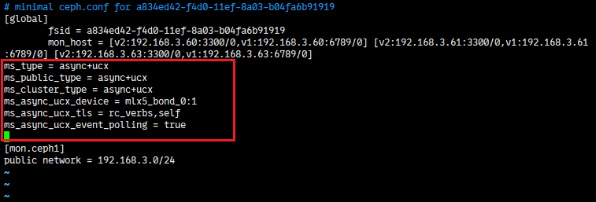

    >  **说明：** 
    > 
    > - `ms_async_ucx_device`中的设备名称可通过`show_gids`查看，可配置多个网络设备。该字段选中的设备（一个或多个）需要同时包含该节点配置的公共网络IP地址和集群网络IP地址。如不支持该命令，需更新网卡固件和驱动，参见[更新网卡固件和驱动](#更新网卡固件和驱动)。
    > - `[fsid]`为实际Ceph集群的fsid，可通过`cephadm ls`命令查看。
    > - 需要保证服务端节点的RDMA网络设备名一致，否则OSD节点无法正常拉起，不一致时可以使用`/usr/lib/udev/rdma_rename`等工具修改，客户端节点无需保持一致。
    > - `cluster_network`和`public_network`的IP地址应与UCX设备（RoCE/IB网口）的IP地址一致。
    > - `ms_async_ucx_event_polling`设置为true，代表开启事件轮询，可以减少延迟，同时提高Ceph集群吞吐量并优化并发性能，但是会带来CPU占用的增加，部分没有事件的场景会带来资源的浪费，增加系统调试复杂性。用户需根据实际情况需要选择开启与否。

4. 在所有节点中将MON的修改同步到MGR和OSD。

    ```sh
    ls /var/lib/ceph/*/*/config|grep 'osd\|mgr\|crash'|xargs -I {} cp -r /var/lib/ceph/*/mon.*/config {}
    ```

5. 在所有节点中修改service文件。

    ```sh
    sed -i 's/on-failure/always/g' /etc/systemd/system/ceph-*\@.service
    sed -i 's/30min/1min/g' /etc/systemd/system/ceph-*\@.service
    sed -i '/StartLimitBurst=/c\StartLimitBurst=20' /etc/systemd/system/ceph-*\@.service
    ```

6. 在所有节点重启Ceph集群。

    ```sh
    systemctl daemon-reload
    systemctl restart ceph.target
    ```

7. 待所有容器启动完成后，需重新进入Ceph集群容器查看集群状态。

    ```sh
    cephadm shell
    ceph -s
    ```

在使能UCX之前，需要配置UCX参数以及所有节点的配置文件，只使能SPDK则跳过此章节。

#### 添加OSD<a name="ZH-CN_TOPIC_0000002520352432"></a>

OSD是Ceph集群数据管理服务。添加OSD的磁盘需满足以下所有条件。

> **前提条件<a name="section20395642181910"></a>**
>
>- 部署Ceph需要使用root用户。
>- 使能SPDK需要关闭IOMMU特性（Arm下为SMMU）。
>    1. 重启服务器，进入BIOS界面，具体可参见[《TaiShan 服务器 BIOS 参数参考（鲲鹏920处理器）》](https://support.huawei.com/enterprise/zh/doc/EDOC1100088653/a77cbc34)中的`进入BIOS界面`相关内容。
>    2. 在BIOS界面中依次单击`Advanced`\>`MISC Config`\>`Support Smmu`  进入SMMU配置页。
>
>        
>
>    3. 将`Support Smmu`设置为`Disabled`，按`F10`保存退出（永久有效）。
>        
>        
>
> - 当前部署需要在所有服务端物理节点执行。
>- 该磁盘设备必须没有分区。
> - 该磁盘设备不得具有任何LVM状态。
>- 该磁盘设备不得包含文件系统。
>- 该磁盘设备不得包含Ceph BlueStore OSD。
>- 该磁盘设备必须大于5GB。

1. 修改大页类型。

    >  **说明：** 
    > 
    > 部署SPDK需要操作系统支持大页，若大页类型不为2M，按照下方步骤修改即可。

    1. 打开`/boot/efi/EFI/openEuler/grub.cfg`文件。

        ```sh
        vim /boot/efi/EFI/openEuler/grub.cfg
        ```

    2. 按`i`进入编辑模式，找到内核启动参数，补充`default_hugepagesz=2M hugepagesz=2M hugepages=1024`。

    3. 按`Esc`键退出编辑模式，输入`:wq!`，按`Enter`键保存退出文件。

2. <a id="li27684565510"></a>配置大页内存数量。

    ```sh
    echo 20480 > /sys/devices/system/node/node0/hugepages/hugepages-2048kB/nr_hugepages
    ```

3. <a id="li11112652145119"></a>NVMe SSD切换到用户态驱动。

    ```sh
    cephadm shell -v /lib/modules:/lib/modules -e DRIVER_OVERRIDE=uio_pci_generic sh /var/lib/ceph/spdk_lib/scripts/setup.sh
    ```

4. 将[步骤2](#li27684565510)、[步骤3](#li11112652145119)中的命令写入`/etc/rc.d/rc.local`持久化保存，开机自启动。

    ```sh
    vim /etc/rc.d/rc.local
    chmod +x /etc/rc.d/rc.local
    ```

    

5. <a id="zh-cn_topic_0000001173276984_zh-cn_topic_0266583442_zh-cn_topic_0266851355_li10464154919390"></a>查看系统可用磁盘设备。

    ```sh
    cephadm shell sh /var/lib/ceph/spdk_lib/scripts/setup.sh status
    ```

    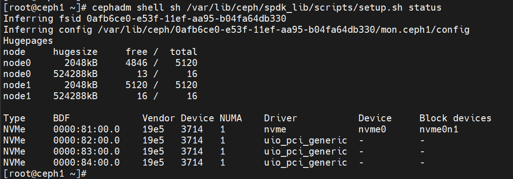

6. 关闭OSD内存自动调节。

    ```sh
    cephadm shell ceph config set osd osd_memory_target_autotune false
    ```

7. 添加OSD（各节点仅支持启动自身的OSD）。
    - 方式1：仅指定bdfs号添加OSD。

        ```sh
        # 创建OSD
        cephadm spdkosd --bstr 0000:82:00.0;0000:83:00.0;0000:84:00.0 init
        
        # 启动守护进程
        cephadm spdkosd deploy
        ```

    - 方式2：一键式使用配置文件添加OSD。

        >  **说明：** 
        > 
        > 通过.yaml配置文件，启动一个部署OSD的服务，通过此方式部署OSD服务有以下优势：
        > - 可以指定设备。
        > - 可以指定OSD的ID。

        1. 编写`osd.yaml`文件，在文件中添加如下内容，指定可用设备。
            1. 打开`osd.yaml`文件。

                ```sh
                vi osd.yaml
                ```

            2. 按`i`进入编辑模式，添加如下内容。

                ```yaml
                - osd_id: 0 # osd_id
                  bdfs: "0000:82:00.0" 
                - osd_id: 1
                  bdfs: "0000:83:00.0"
                - osd_id: 2
                  bdfs: "0000:84:00.0"
                ```

                > **说明：** 
                >- osd\_id：OSD服务ID，字段必须保持集群唯一性，不能与集群中已有的OSD服务ID重复。
                >- bdfs字段选择的设备必须由uio驱动接管。参考[5](#zh-cn_topic_0000001173276984_zh-cn_topic_0266583442_zh-cn_topic_0266851355_li10464154919390)中的命令，查看NVMe设备的Driver驱动是否是uio\_pci\_generic。如果不是，则说明当前设备还未由uio驱动接管，需要执行[3](#li11112652145119)中的命令，切换驱动。

            3. 按`Esc`键退出编辑模式，输入`:wq!`，按`Enter`键保存并退出文件。

        2. 启动OSD服务。

            ```sh
            cephadm spdkosd --b osd.yaml create
            
            # 其他启动方式说明：
            cephadm spdkosd create  # 将自动选择可用的设备和osd编号，使用默认配置创建启动OSD服务
            cephadm spdkosd --b osd.yaml --c osd.conf create # 指定设备和配置创建启动OSD服务
            
            # 其他启动参数说明
            -vv ：用于podman 启动守护进程时，配置是否保存更多详细的OSD守护进程的日志到文件中，默认False。
            参考示例，开启保存更多日志：cephadm spdkosd -vv create
            ```

            >  **说明：** 
            > 
            > - 内部使用了`/mnt/osd_xx`目录来挂载大页使能SPDK，需要确保物理机上的`/mnt`目录具有写入权限，注意检查`/mnt`目录是否挂载了镜像变成只读权限。
            > - 该命令需要在ceph1\~ceph3节点依次执行启动。

8. 调整ceph 1、ceph2、ceph3节点OSD内存上限为20GB。

    ```sh
    cephadm shell ceph config set osd/host:ceph1 osd_memory_target 20G
    cephadm shell ceph config set osd/host:ceph2 osd_memory_target 20G
    cephadm shell ceph config set osd/host:ceph3 osd_memory_target 20G
    ```

9. 查看集群状态。

    ```sh
    cephadm shell
    ceph -s
    ```

    

    ```sh
    ceph orch ps
    ```

    

OSD是Ceph集群数据管理服务。添加OSD的磁盘需满足以下所有条件。

#### 部署客户端<a name="ZH-CN_TOPIC_0000002520032434"></a>

部署Ceph客户端是为了实现客户端与Ceph集群之间的存储访问，使得用户或应用程序能够从Ceph存储集群中读写数据。本小节介绍了如何容器化部署客户端。

1. 在客户端节点上启动容器。

    ```sh
    podman load -i ceph_release.tar
    podman tag [IMAGE_ID] localhost/ceph_release:v17.2.7
    podman run --name client1 --hostname client1 --privileged --net=host --ipc=host -dti localhost/ceph_release:v17.2.7 /usr/sbin/init
    ```

    > **说明：** 
    >`[IMAGE_ID]`需要替换为真实的镜像ID，可通过`podman images`命令查看。

2. 从服务端同步配置文件至客户端。

    ```sh
    mkdir -p /etc/ceph
    scp -r ceph1:/etc/ceph/ceph.conf /etc/ceph/
    scp -r ceph1:/etc/ceph/ceph.client.admin.keyring /etc/ceph/
    ```

3. 客户端根据本机show\_gids中的设备修改`/etc/ceph/ceph.conf`中的`ms_async_ucx_device`。

    ```sh
    ms_async_ucx_device = mlx5_xxx:1      # mlx5_xxx 为show_gids中的设备
    ```

    >  **说明：** 
    > 
    > `ms_async_ucx_device`中的设备名称可填写多个网络设备。该字段选中的设备（一个或多个）需要同时配置该客户端节点的管理IP地址和公共网络IP地址。

    在`/etc/ceph/ceph.conf`中添加以下配置。

    ```sh
    ms_async_ucx_event_polling = false
    ms_async_op_threads = 5
    librados_thread_count = 3
    ```

    

4. 将文件拷贝到客户端容器。

    ```sh
    podman exec client1 mkdir -p /etc/ceph
    podman cp /etc/ceph/ceph.conf client1:/etc/ceph/
    podman cp /etc/ceph/ceph.client.admin.keyring client1:/etc/ceph/
    ```

5. 进入客户端容器查看集群状态。

    > **说明：**
    > 
    > Ceph 17默认会根据OSD数量自动调整PG数量，而手动控制PG数量能帮助Ceph管理员精确调优系统，避免不可预期的短期性能波动，如需关闭此配置，可使用如下命令。
    >
    > ```sh
    > ceph osd pool set ${pool_name} pg_autoscale_mode off
    > ```

    ```sh
    podman exec -it client1 /bin/bash
    ceph -s
    ```

    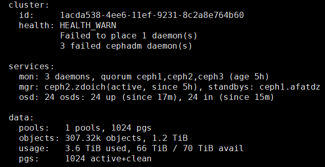

### 卸载Ceph<a name="ZH-CN_TOPIC_0000002551432421"></a>

卸载Ceph即删除节点中的所有Ceph相关的容器。

1. 在ceph1中登录Ceph集群，删除ceph2和ceph3。

    ```sh
    ceph orch host drain ceph2
    ceph orch host drain ceph3
    ```

2. 删除Ceph集群。

    ```sh
    cephadm rm-cluster --fsid XXXXXX --force
    ```

    `XXXXXX`为集群fsid，需要在所有服务端分别执行一次删除集群命令。

卸载Ceph即删除节点中的所有Ceph相关的容器。

## 配置流控和查看流量（RoCE网络下配置）<a name="ZH-CN_TOPIC_0000002520352440"></a>

### 配置交换机<a name="ZH-CN_TOPIC_0000002520352434"></a>

流控策略（Flow Control）是为了避免数据包的丢失和网络拥堵而进行的一种机制，尤其是在高带宽、低延迟的环境中。配置流控策略可以提高网络的可靠性和稳定性，特别是对于一些关键应用和无损网络环境。为了配置无损网络，需要配置交换机。本文以HUAWEI CE6863-48S6CQ的交换机为例，执行流控策略。

1. <a id="li1100413134"></a>登录交换机，设置PFC（Priority-based Flow Control）优先级。

    ```sh
    system-view
    dcb pfc
    priority 0
    commit
    quit
    ```

2. 查看PFC优先级使能状态。

    ```sh
    display dcb pfc-profile
    ```

    命令返回0表示[步骤1](#li1100413134)配置成功。

    

3. <a id="li1586514481310"></a>配置ECN（Explicit Congestion Notification）。

    ```sh
    drop-profile ecn
    color green buffer-size low-limit 247520 high-limit 18000000 discard-percentage 100
    commit
    quit
    ```

4. 查看ECN。

    ```sh
    display drop-profile ecn
    ```

    命令返回如下信息，表示[步骤3](#li1586514481310)配置成功。

    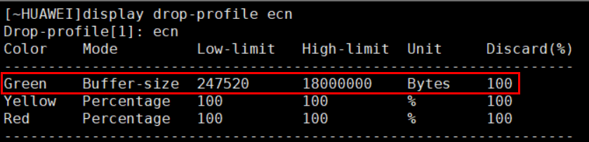

5. <a id="li202741334141411"></a>为每个流量端口配置流控，此处以`25GE 1/0/5`端口为例进行配置。

    ```sh
    interface 25GE 1/0/5
    qos queue 0 wred ecn
    qos queue 0 ecn
    dcb pfc enable mode manual
    dcb pfc buffer 0 xoff static 1500 cells
    commit
    quit
    ```

6. 查看端口流控配置是否成功。

    ```sh
    interface 25GE 1/0/5
    display this
    ```

    命令返回[步骤5](#li202741334141411)中的配置信息，则表示端口流控配置成功。

### 查看端口流量<a name="ZH-CN_TOPIC_0000002551552421"></a>

您可以通过查看端口是否有流量来验证交换机的配置在业务侧是否生效。

1. 在所有节点上的RoCE网卡配置优先级队列。

    >  **说明：** 
    > 
    > 即使您已将两个端口组绑定（mode 0/2/4），仍需要分别配置每个端口的优先级队列，以获得更优的网络性能。

    ```sh
    mlnx_qos -i enp133s0f0 -f 1,0,0,0,0,0,0,0
    mlnx_qos -i enp133s0f1 -f 1,0,0,0,0,0,0,0
    ```

2. 查询是否配置成功。

    ```sh
    mlnx_qos -i enp133s0f0
    mlnx_qos -i enp133s0f1
    ```

    

3. 若有出现lldpad告警，则需要关闭lldpad服务，并重新配置以上配置。

    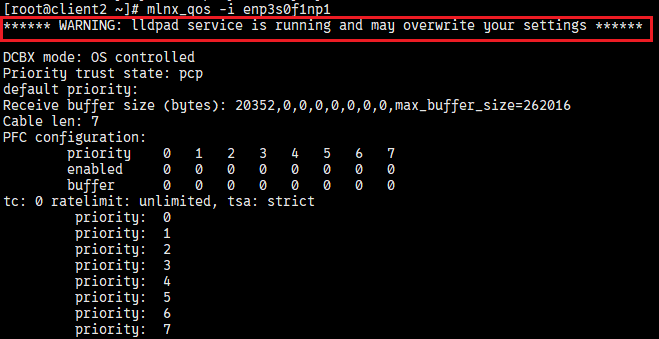

    ```sh
    systemctl stop lldpad
    systemctl disable lldpad
    ```

4. 查看网卡上是否有流量。如果命令返回的网口流量会变化，表示网卡有流量。

    ```sh
    watch -n 1 "ethtool -S enp133s0f0 | grep prio"
    watch -n 1 "ethtool -S enp133s0f1 | grep prio"
    ```

    网口enp133s0f0返回如下图所示：

    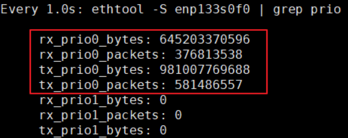
    
    网口enp133s0f1返回如下图所示：

    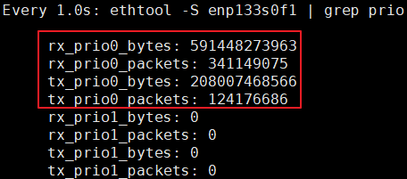
    

## 常见问题<a name="ZH-CN_TOPIC_0000002520032432"></a>

### Ceph 17.2.8 持续运行时报错<a id="持续运行时报错"></a>

**问题现象描述<a name="section6838184010412"></a>**

Ceph 17.2.8集群持续运行Ceph时，可能会出现OSD意外宕机又恢复的不稳定情况。并观察到如下类似报错：

```json
ceph crash info 2025-02-03T09:19:08.749233Z_9e2800fb-77f6-46cb-8087-203ea15a2039
{
   "assert_condition": "log.t.seq == log.seq_live",
   "assert_file": "/home/jenkins-build/build/workspace/ceph-build/ARCH/x86_64/AVAILABLE_ARCH/x86_64/AVAILABLE_DIST/centos9/DIST/centos9/MACHINE_SIZE/gigantic/release/17.2.8/rpm/el9/BUILD/ceph-17.2.8/src/os/bluestore/BlueFS.cc",
   "assert_func": "uint64_t BlueFS::_log_advance_seq()",
   "assert_line": 3029,
   "assert_msg": "/home/jenkins-build/build/workspace/ceph-build/ARCH/x86_64/AVAILABLE_ARCH/x86_64/AVAILABLE_DIST/centos9/DIST/centos9/MACHINE_SIZE/gigantic/release/17.2.8/rpm/el9/BUILD/ce
ph-17.2.8/src/os/bluestore/BlueFS.cc: In function 'uint64_t BlueFS::_log_advance_seq()' thread 7ff983564640 time 2025-02-03T09:19:08.738781+0000\n/home/jenkins-build/build/workspace/ceph-bu
ild/ARCH/x86_64/AVAILABLE_ARCH/x86_64/AVAILABLE_DIST/centos9/DIST/centos9/MACHINE_SIZE/gigantic/release/17.2.8/rpm/el9/BUILD/ceph-17.2.8/src/os/bluestore/BlueFS.cc: 3029: FAILED ceph_assert
(log.t.seq == log.seq_live)\n",
   "assert_thread_name": "bstore_kv_sync",
   "backtrace": [
       "/lib64/libc.so.6(+0x3e730) [0x7ff9930f5730]",
       "/lib64/libc.so.6(+0x8bbdc) [0x7ff993142bdc]",
       "raise()",
       "abort()",
       "(ceph::__ceph_assert_fail(char const*, char const*, int, char const*)+0x179) [0x55882dfb7fdd]",
       "/usr/bin/ceph-osd(+0x36b13e) [0x55882dfb813e]",
       "/usr/bin/ceph-osd(+0x9cff3b) [0x55882e61cf3b]",
       "(BlueFS::_flush_and_sync_log_jump_D(unsigned long)+0x4e) [0x55882e6291ee]",
       "(BlueFS::_compact_log_async_LD_LNF_D()+0x59b) [0x55882e62e8fb]",
       "/usr/bin/ceph-osd(+0x9f2b15) [0x55882e63fb15]",
       "(BlueFS::fsync(BlueFS::FileWriter*)+0x1b9) [0x55882e631989]",
       "/usr/bin/ceph-osd(+0x9f4889) [0x55882e641889]",
       "/usr/bin/ceph-osd(+0xd74cd5) [0x55882e9c1cd5]",
       "(rocksdb::WritableFileWriter::SyncInternal(bool)+0x483) [0x55882eade393]",
       "(rocksdb::WritableFileWriter::Sync(bool)+0x120) [0x55882eae0b60]",
       "(rocksdb::DBImpl::WriteToWAL(rocksdb::WriteThread::WriteGroup const&, rocksdb::log::Writer*, unsigned long*, bool, bool, unsigned long)+0x337) [0x55882ea00ab7]",
       "(rocksdb::DBImpl::WriteImpl(rocksdb::WriteOptions const&, rocksdb::WriteBatch*, rocksdb::WriteCallback*, unsigned long*, unsigned long, bool, unsigned long*, unsigned long, rocksdb
::PreReleaseCallback*)+0x1935) [0x55882ea07675]",
       "(rocksdb::DBImpl::Write(rocksdb::WriteOptions const&, rocksdb::WriteBatch*)+0x35) [0x55882ea077c5]",
       "(RocksDBStore::submit_common(rocksdb::WriteOptions&, std::shared_ptr<KeyValueDB::TransactionImpl>)+0x83) [0x55882e992593]",
       "(RocksDBStore::submit_transaction_sync(std::shared_ptr<KeyValueDB::TransactionImpl>)+0x99) [0x55882e992ee9]",
       "(BlueStore::_kv_sync_thread()+0xf64) [0x55882e578e24]",
       "/usr/bin/ceph-osd(+0x8afb81) [0x55882e4fcb81]",
       "/lib64/libc.so.6(+0x89e92) [0x7ff993140e92]",
       "/lib64/libc.so.6(+0x10ef20) [0x7ff9931c5f20]"
   ],
   "ceph_version": "17.2.8",
   "crash_id": "2025-02-03T09:19:08.749233Z_9e2800fb-77f6-46cb-8087-203ea15a2039",
   "entity_name": "osd.211",
   "os_id": "centos",
   "os_name": "CentOS Stream",
   "os_version": "9",
   "os_version_id": "9",
   "process_name": "ceph-osd",
   "stack_sig": "ba90de24e2beba9c6a75249a4cce7c533987ca5127cfba5b835a3456174d6080",
   "timestamp": "2025-02-03T09:19:08.749233Z",
   "utsname_hostname": "afra-osd18",
   "utsname_machine": "x86_64",
   "utsname_release": "5.15.0-119-generic",
   "utsname_sysname": "Linux",
   "utsname_version": "#129-Ubuntu SMP Fri Aug 2 19:25:20 UTC 2024"
}

```

**问题原因<a name="section341017332430"></a>**

Ceph 17.2.8存在已知问题，详见[Ceph社区PR](https://github.com/ceph/ceph/pull/61653)。

**解决办法<a name="section5594134712437"></a>**

1. 手动修改源码`src/os/bluestore/BlueFS.cc`中的3120行到3132行为如下所示。

    ```cc
      _pad_bl(bl, super.block_size);
      log.writer->append(bl);
      ceph_assert(allocated_before_extension >= log.writer->get_effective_write_pos());
    
      // before sync_core we advance the seq
      {
        std::unique_lock<ceph::mutex> l(dirty.lock);
        dirty.seq_live++;
        log.seq_live++;
        log.t.seq++;
      }
    }
    ```

    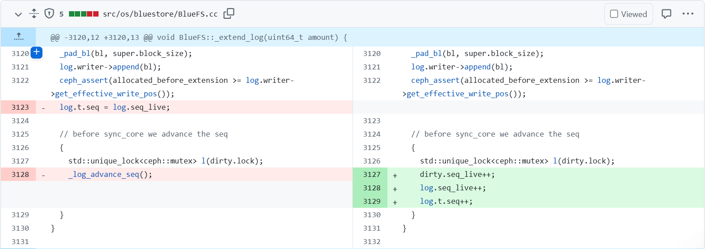

2. 重新编译部署Ceph。

### 业务执行时驱动报错<a name="ZH-CN_TOPIC_0000002520032428"></a>

**问题现象描述<a name="section6838184010412"></a>**

在执行业务相关操作时，报错如下图所示。


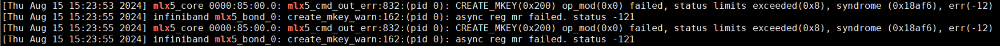

**原因分析<a name="section10617103715593"></a>**

UCX业务注册RCache内存过大，超出了硬件缓冲区大小限制，解决方案中步骤一的配置可以增大硬件缓冲区大小，步骤二使用多个网口的资源，也可以增大硬件缓冲区大小。

**解决方法<a name="section152612051134212"></a>**

1. 需要在节点配置如下信息。

    ```sh
    mst start
    mlxconfig -d 85:00.0 -y s PF_LOG_BAR_SIZE=8
    reboot
    ```

    >  **说明：** 
    > 
    > 85:00.0为网卡PCIe号，可通过`lspci | grep Mellanox`查询。

2. 网口需要组bond。
    1. 创建bond设备。

        ```sh
        nmcli con add type bond ifname bond_01 mode 4
        ```

    2. 配置bond\_01的IP地址。

        ```sh
        nmcli connection modify bond-bond_01 ipv4.addresses 10.5.5.131/24
        nmcli connection modify bond-bond_01 ipv4.method manual
        ```

    3. 增加slave网口，本例slave网口为“ens7f1”和“ens8f1”，请根据实际情况修改。

        ```sh
        nmcli con add type bond-slave ifname ens7f1 master bond-bond_01
        nmcli con add type bond-slave ifname ens8f1 master bond-bond_01
        ```

    4. 修改`BONDING_OPTS`配置。
        1. 打开`/etc/sysconfig/network-scripts/ifcfg-bond-bond_01`文件。

            ```sh
            vim /etc/sysconfig/network-scripts/ifcfg-bond-bond_01
            ```

        2. 按`i`进入编辑模式，修改`BONDING_OPTS`配置。

            ```sh
            BONDING_OPTS="mode=4 miimon=100 xmit_hash_policy=layer3+4"
            MTU=4200
            ```

            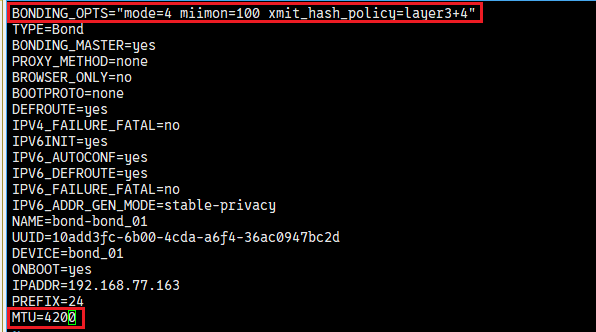

        3. 按`Esc`键退出编辑模式，输入`:wq!`，按`Enter`键保存并退出文件。

    5. 启用网络设备。

        ```sh
        ifdown  bond-bond_01
        ifup bond-bond_01
        systemctl restart NetworkManager
        ```

    6. 在交换机将网口对应的端口组trunk。具体交换机型号以及操作命令可联系对应网络IT负责人，可参考如下命令。
        - 配置交换机的接口为Trunk模式：

            ```sh
            Switch(config)# interface GigabitEthernet1/0/1
            Switch(config-if)# switchport mode trunk
            Switch(config-if)# switchport trunk allowed vlan 10,20
            ```

            该命令将端口GigabitEthernet1/0/1配置为Trunk模式，并允许VLAN 10和VLAN 20的流量通过。

        - 如果交换机间连接的是多个VLAN：

            ```sh
            Switch(config)# interface GigabitEthernet1/0/2
            Switch(config-if)# switchport mode trunk
            Switch(config-if)# switchport trunk allowed vlan 10-30
            ```

            该命令将端口GigabitEthernet1/0/2 配置为Trunk模式，并允许VLAN 10到VLAN 30的流量通过。

### 部署SPDK OSD时报错<a name="ZH-CN_TOPIC_0000002551432427"></a>

**问题现象描述<a name="section6838184010412"></a>**

在执行业务相关操作时，报错下图所示。


**原因分析<a name="section10617103715593"></a>**

日志提示Current mode is "VA"，可能是由于没有关闭SMMU（IOMMU）导致的。

**解决方法<a name="section15834282575"></a>**

1. 参见《[TaiShan 服务器 BIOS 参数参考（鲲鹏920处理器）](https://support.huawei.com/enterprise/zh/doc/EDOC1100088653/a77cbc34)》中`进入BIOS界面`的相关内容，进入BIOS界面。
2. 依次进入`Advanced` \> `MISC Config` \> `Support Smmu`。

    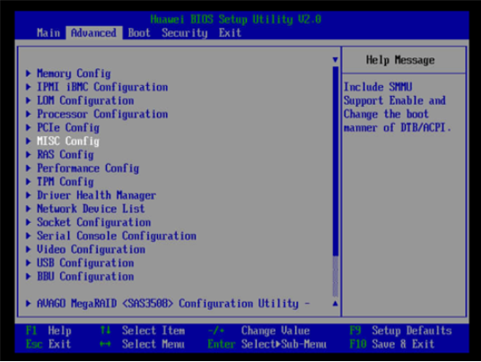

3. 将`Support Smmu`设置为`Disabled`，按`F10`键保存退出。

    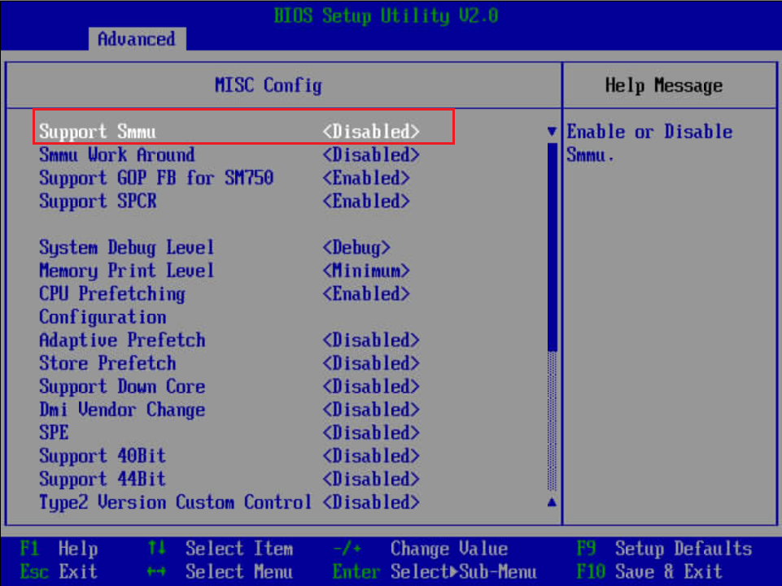

### 部署OSD后集群中OSD节点状态不能变为up状态<a name="ZH-CN_TOPIC_0000002551552423"></a>

**问题现象<a name="section7359519194815"></a>**

重启服务器节点后，部署OSD时，节点上所有的OSD状态均为in状态，部分OSD守护进程能正常启动，部分OSD守护进程无法启动。根据[5](#zh-cn_topic_0000001173276984_zh-cn_topic_0266583442_zh-cn_topic_0266851355_li10464154919390)查看机器大页内存有剩余。此时查看cephadm的日志时有类似错误信息如下。

```log
[2025-03-15 17:49:42.399173] --base-virtaddr=0x200000000000 [2025-03-15 17:49:42.399182] --match-allocations [2025-03-15 17:49:42.399191] --file-prefix=spdk_pid152 [2025-03-15 17:49:42.399200] ]
EAL: No free 2048 kB hugepages reported on node 1
EAL: No free 2048 kB hugepages reported on node 2
EAL: No free 2048 kB hugepages reported on node 3
EAL: No free 524288 kB hugepages reported on node 1
EAL: No free 524288 kB hugepages reported on node 2
EAL: No free 524288 kB hugepages reported on node 3
TELEMETRY: No legacy callbacks, legacy socket not created
[2025-03-15 17:50:12.491533] nvme_ctrlr.c:3238:nvme_ctrlr_process_init: *ERROR*: Initialization timed out in state 8
[2025-03-15 17:50:12.491716] nvme.c: 710:nvme_ctrlr_poll_internal: *ERROR*: Failed to initialize SSD: 0000:88:00.0
[2025-03-15 17:50:12.491743] nvme_pcie_common.c: 677:nvme_pcie_qpair_abort_trackers: *ERROR*: aborting outstanding command
[2025-03-15 17:50:12.491759] nvme_qpair.c: 248:nvme_admin_qpair_print_command: *NOTICE*: IDENTIFY (06) qid:0 cid:23 nsid:0 cdw10:00000001 cdw11:00000000 PRP1 0x2b5c991000 PRP2 0x0
[2025-03-15 17:50:12.491775] nvme_qpair.c: 452:spdk_nvme_print_completion: *NOTICE*: ABORTED - BY REQUEST (00/07) qid:0 cid:23 cdw0:0 sqhd:0000 p:0 m:0 dnr:0
[2025-03-15 17:50:12.491791] nvme_ctrlr.c:1520:nvme_ctrlr_identify_done: *ERROR*: nvme_identify_controller failed!
[2025-03-15 17:50:12.491801] nvme_ctrlr.c: 891:nvme_ctrlr_fail: *ERROR*: ctrlr 0000:88:00.0 in failed state.
2025-03-15T17:50:12.512+0800 fffbd1fb0040 -1 bdev() open failed to get nvme device with transport address 0000:88:00.0
2025-03-15T17:50:12.512+0800 fffbd1fb0040 -1 bluestore(/var/lib/ceph/osd/ceph-15/) mkfs failed, (1) Operation not permitted
2025-03-15T17:50:12.512+0800 fffbd1fb0040 -1 OSD::mkfs: ObjectStore::mkfs failed with error (1) Operation not permitted
2025-03-15T17:50:12.512+0800 fffbd1fb0040 -1  ** ERROR: error creating empty object store in /var/lib/ceph/osd/ceph-15/: (1) Operation not permitted
2025-03-15 17:50:12,690 fffdf1eb4dc0 DEBUG create osd.15 with 0000:88:00.0 done
2025-03-15 17:50:12,910 fffdf1eb4dc0 DEBUG systemctl: stderr Created symlink /etc/systemd/system/ceph-366437b4-0181-11f0-bcfe-f82e3f2347d5.target.wants/ceph-366437b4-0181-11f0-bcfe-f82e3f2347d5@osd.9.service → /etc/systemd/system/ceph-366437b4-0181-11f0-bcfe-f82e3f2347d5@.service.
2025-03-15 17:50:13,426 fffdf1eb4dc0 DEBUG systemctl: stderr Created symlink /etc/systemd/system/ceph-366437b4-0181-11f0-bcfe-f82e3f2347d5.target.wants/ceph-366437b4-0181-11f0-bcfe-f82e3f2347d5@osd.8.service → /etc/systemd/system/ceph-366437b4-0181-11f0-bcfe-f82e3f2347d5@.service.
```

**原因分析<a name="section202848387527"></a>**

日志显示当前节点无法创建对象，找不到剩余的可用大页内存。问题的根本原因是机器大页内存分配和使用异常，常见原因是未成功分配足够数量的大页内存或与系统大页默认挂载点配置冲突。

**解决方法<a name="section754415714523"></a>**

1. 卸载`/dev/hugepages`的挂载。

    ```sh
    umount /dev/hugepages
    ```

2. 重置OSD的环境配置。

    ```sh
    cephadm shell -v /lib/modules:/lib/modules -e DRIVER_OVERRIDE=uio_pci_generic sh /var/lib/ceph/spdk_lib/scripts/setup.sh reset
    ```

3. 重新执行[步骤2](#li27684565510)和[步骤3](#li11112652145119)  进行分配大页内存，将NVMe设备切换到用户态驱动。

    ```sh
    echo 20480 > /sys/devices/system/node/node0/hugepages/hugepages-2048kB/nr_hugepages
    cephadm shell -v /lib/modules:/lib/modules -e DRIVER_OVERRIDE=uio_pci_generic sh /var/lib/ceph/spdk_lib/scripts/setup.sh
    ```

4. 重启集群。

    ```sh
    systemctl daemon-reload
    systemctl restart ceph.target
    ```

    >  **说明：**
    > 
    > 如果部署OSD过程中就看到报错信息，重启集群后OSD仍然无法正常启动，则需要删除OSD后，重新部署OSD。
    > 从Ceph集群中将异常OSD移除的命令参考如下：
    > `[OSD_ID]` 为要删除的OSD标识，如osd.0；`[FSID]`为当前Ceph集群的fsid：
    >
    > ```sh
    > cephadm shell
    > ceph osd stop [OSD_ID]
    > ceph osd out [OSD_ID]
    > ceph osd crush remove [OSD_ID]
    > ceph osd rm [OSD_ID]
    > ceph orch daemon rm [OSD_ID] --force 
    > ceph auth rm [OSD_ID]
    > ```
    >
    > 删除物理机中对应OSD的配置文件:
    >
    > ```sh
    > exit
    > rm -rf /var/lib/ceph/[FSID]/[OSD_ID]/ 
    > ```

### 更新网卡固件和驱动<a id="更新网卡固件和驱动"></a>

1. [下载固件包](https://support.huawei.com/enterprise/zh/software/260855985-ESW2000807879)并解压（以CX-5网卡为例）。
2. 升级固件。

    ```sh
    cd NIC-SP382-CX5-FW-16.32.1010-ARM
    ./install.sh upgrade
    ```

3. 安装驱动软件依赖包。

    ```sh
    yum install createrepo perl pciutils gcc-gfortran tcsh expat glib2 tcl libstdc++ bc tk gtk2 atk cairo numactl pkgconfig ethtool lsof rpm-build python3-libxml2 python autoconf automake libtool
    ```

4. 单击[获取链接](https://support.huawei.com/enterprise/zh/management-software/computing-component-idriver-pid-259488843/software/262409128?idAbsPath=fixnode01%7C23710424%7C251364417%7C251364851%7C254884035%7C259488843)下载网卡驱动。

    >  **说明：** 
    > 
    > openEuler-20.03-LTS-SP4驱动官方未提供，可使用openEuler-20.03-LTS-SP3版本驱动。

5. 安装驱动。
    1. 解压下载的iso文件。

        ```sh
        mkdir /mnt/iso
        mount -o loop ***.iso /mnt/iso
        cd /mnt/iso
        ```

    2. 安装驱动。
        - 方式一：通过解压包安装驱动。

            ```sh
            tar xf MLX-*.tgz
            cd MLNX*
            ./mlnxofedinstall --force --without-depcheck --without-fw-update --add-kernel-support  --skip-distro-check
            ```

        - 方式二：通过脚本自动安装。

            ```sh
            ./install.sh  （参考同目录下的readme_zh.txt）
            ```

6. 重新加载驱动。

    ```sh
    dracut -f
    /etc/init.d/openibd restart
    ```

7. 重启节点。

    ```sh
    reboot
    ```

>  **说明：** 
> 
> 目前推荐使用版本如下：
>
> 1.固件版本：16.32.1010 \(HUA0000000024\)。
>
> 2.驱动版本：
>
> - openEuler 20.03 ARM推荐版本：24.01-0.3.3。
> 
> - openEuler 20.03 x86推荐版本：5.8-1.1.2。

### 解决容器中SP670网卡设备缺失问题<a name="ZH-CN_TOPIC_0000002520352428"></a>

**问题现象描述<a name="section2294102135420"></a>**

在cephadm shell启动的容器中，执行`ibv_devices`时，在容器中未显示SP670的RDMA设备。

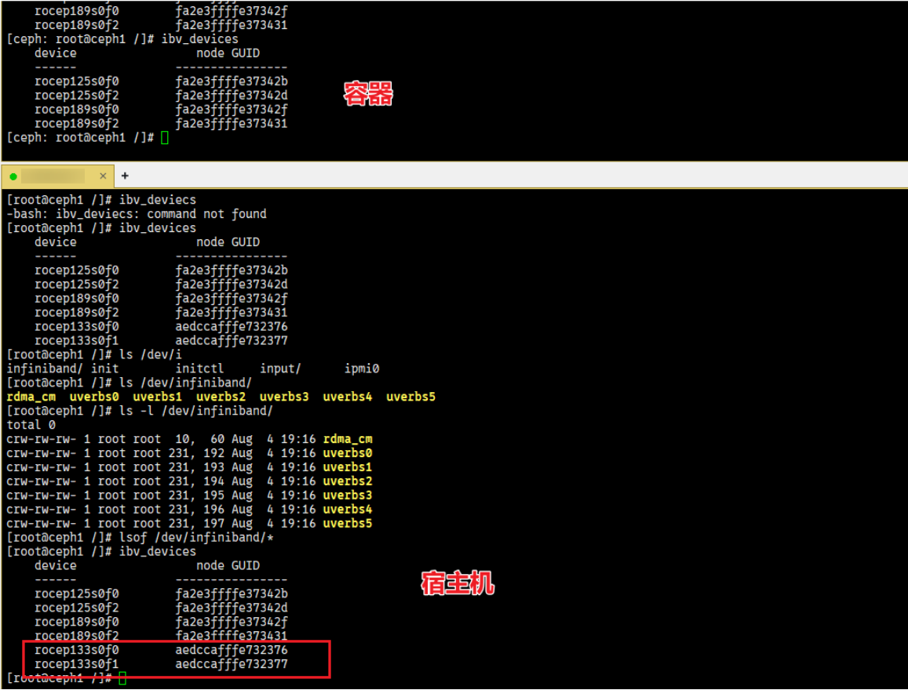

**问题原因<a name="section833701191218"></a>**

容器中未识别到的原因是没有正确安装SP670的RDMA驱动。

**解决方法<a name="section17451976234"></a>**

1. [下载最新的固件和驱动安装包并解压。](https://support.huawei.com/enterprise/zh/huawei-computing-components/in220-pid-253287505/software/266018371?idAbsPath=fixnode01)\(下载NIC-FW-17.12.1.2.tar.gz、SDK\_LINUX-17.12.1.2-openEuler22.03SP4-aarch64.tar.gz）

2. 升级固件。

    ```sh
    tar -zvxf NIC-FW-17.12.1.2.tar.gz
    cd NIC-FW-17.12.1.2
    rpm -ivh tool/aarch64/hinicadm3-17.12.1.2-1.aarch64.rpm
    hinicadm3 updatefw -i hinic0 -f ./SP670/Hinic3_flash.bin -or
    ```

    

3. 安装驱动。容器和物理机都需要安装它们各自的OS内核对应的驱动版本，此处以openEuler22.03SP4为例进行举例说明。

    ```sh
    tar -zvxf SDK_LINUX-17.12.1.2-openEuler22.03SP4-aarch64.tar.gz
    cd SDK_LINUX-17.12.1.2-openEuler22.03SP4-aarch64
    rpm -ivh nic/hisdk3-17.12.1.2_5.10.0_216.0.0.115.oe2203sp4.aarch64-1.aarch64.rpm
    rpm -ivh nic/hinic3-17.12.1.2_5.10.0_216.0.0.115.oe2203sp4.aarch64-1.aarch64.rpm
    rpm -ivh roce/hiroce3-17.12.1.2_5.10.0_216.0.0.115.oe2203sp4.aarch64-1.aarch64.rpm
    ```

4. **reboot**重启服务器。

    >  **说明：**
    > 
    > 可以使用`ethtool -i [设备名]`检查固件和驱动版本，需要重新制作Ceph部署容器，参考[5.2.3](#skip_001)，并在制作过程中完成驱动安装。

### 解决UCX使用SP670网卡报错<a name="ZH-CN_TOPIC_0000002551552425"></a>

**问题现象描述<a name="section488342804215"></a>**

在cephadm shell启动的容器中，执行`ucx_info -d`扫描设备时，出现如下报错。


**问题原因<a name="section18208111291513"></a>**

报错是因为UCX默认Rx队列深度为4096，而SP670最大深度支持为4095，因此需要调整UCX Rx队列的默认深度值。

**解决方法<a name="section5188164015718"></a>**

1. 为了解决该问题，需要在[章节5.1](#编译和安装UCX)基础上，再修改一行代码。参考下方的代码完成修改。

    ```sh
    cd /root/rpmbuild/SOURCES/
    tar -zxvf ucx-1.14.1.tar.gz
    vim ucx-1.14.1/src/uct/ib/base/ib_iface.c
    ```

    修改`RX_QUEUE_LEN`默认值，从4096修改为4095。

    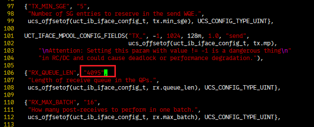

    对该文件进行打包。

    ```sh
    rm -rf ucx-1.14.1.tar.gz
    tar zcvf ucx-1.14.1.tar.gz ucx-1.14.1
    ```

2. <a id="li02284812446"></a>编译并构建RPM包。在RPM编译路径下，编译并构建ucx.spec文件，生成RPM包。

    ```sh
    cd /root/rpmbuild/SPECS
    rpmbuild -bb ucx.spec
    ```

    编译完成后在`/root/rpmbuild/RPMS/aarch64`目录会生成如下图所示的8个RPM包。

    

3. 使用本地镜像启动一个临时容器。

    ```sh
    podman run --name server1 --hostname ceph_server1 --privileged --net=host --ipc=host -dti [IP]:5000/ceph/ceph_release:v17.2.7 /usr/sbin/init
    ```

4. 将[步骤2](#li02284812446)生成的RPM包从编译容器中拷贝到新启动的容器中。

    ```sh
    podman cp openeuler2203sp3_build:/root/rpmbuild/RPMS/aarch64 ./
    podman cp aarch64 server1:/home
    ```

5. 进入新启动的容器中重新安装UCX。

    ```sh
    podman exec -it server1 bash
    cd /home
    rpm -ivh aarch64/ucx-* --force
    ```

6. 退出容器，将容器制作成新的Ceph部署容器。

    ```sh
    exit
    podman commit server1
    podman tag [IMAGE ID] [IP]:5000/ceph/ceph_release:v17.2.7
    podman push [IP]:5000/ceph/ceph_release:v17.2.7 [IP]:5000/ceph/ceph_release:v17.2.7
    ```

    >  **说明：** 
    >  
    > \[IMAGE ID\]为commit生成的镜像ID，\[IP\]为本地IP地址，请根据实际情况替换本地IP地址。

## 安全管理<a name="ZH-CN_TOPIC_0000002520032426"></a>

**防病毒软件例行检查<a name="section11752161613273"></a>**

定期开展对集群的防病毒扫描，防病毒例行检查会帮助集群免受病毒、恶意代码、间谍软件以及程序侵害，降低系统瘫痪、信息泄露等风险。可以使用业界主流防病毒软件进行防病毒检查。

**漏洞修复<a name="section208601325152718"></a>**

为保证生产环境的安全，降低被攻击的风险，请定期修复以下漏洞：

- 操作系统漏洞。
- OpenSSL漏洞。
- 其他相关组件漏洞。

## 缩略语<a name="ZH-CN_TOPIC_0000002520352436"></a>

| 缩略语       | 英文全称                                | 中文全称           |
|-----------|-------------------------------------|----------------|
| **A - E** |
| ECN       | Explicit Congestion Notification    | 明确拥塞通告         |
| **F - J** |
| HPC       | High Performance Compact            | 高性能紧凑型         |
| **K - O** |
| NUMA      | Non-Uniform Memory Access           | 非一致性内存访问       |
| OSD       | Object Storage Daemon               | 对象存储守护进程       |
| **P - T** |
| PFC       | Priority-based Flow Control         | 基于优先级的流控       |
| RDMA      | Remote Direct Memory Access         | 远程直接存储器访问      |
| RoCE      | RDMA over Converged Ethernet        | 通过以太网实现的RDMA技术 |
| SPDK      | Storage Performance Development Kit | 存储性能开发工具包      |
| TCP       | Transmission Control Protocol       | 传输控制协议         |
| **U - Z** |
| UCX       | Unified Communication X             | 统一抽象通信接口       |

## 修订记录
| 发布日期  | 修改说明       |
|-------|----------|
| 2025-03-30 | 第一次正式发布。 |